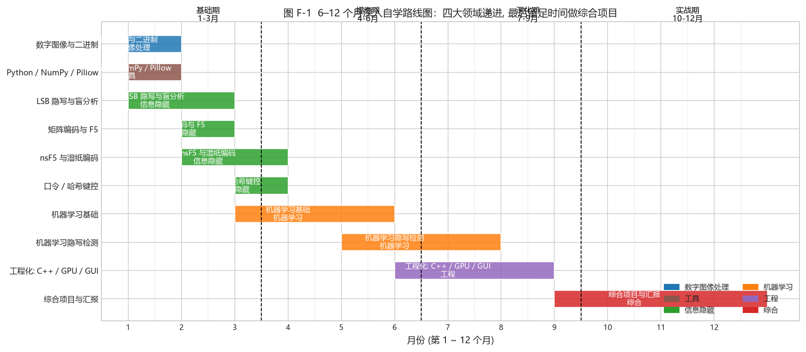

# Appendix F - A 6-12 Month In-Depth Self-Study Roadmap

<!-- lang-switch -->
> [🌐 中文版](https://yukinoshita-lin.github.io/nsf5-steganography/zh/content/appF.html)

> **Try it |** Section 0.3 in the intro is the **12-week "get started"** compressed route; this section is the **6-12 month "understand and produce results"** deep route. It is for people who want to truly absorb digital image processing, information hiding, and machine learning, and do research/engineering. **Both routes use the same content; only the time allocation differs.**

*Fig. F-1 (6-12 month Gantt: x-axis = month, y-axis = topic, color = field; dashed lines split it into Foundation (1-3) / Intermediate (4-6) / Advanced (7-9) / Project (10-12))*

## F.1 Four Phases: Goals and Deliverables of Each

| Phase | Months | Goal | Main content | What you can do at the end |
| --- | --- | --- | --- | --- |
| Foundation | 1-3 | Solidify the "groundwork" of all three fields | ch01 digital images & binary, ch02 Python toolchain, ch03 LSB hiding & blind analysis, ch04 matrix embedding & F5, ch05 nsF5 wet paper, ch06 hash keying | Independently "hide a sentence -> catch it with chi-square/RS"; hand-compute a p=3 Hamming embedding; explain wet-paper decoding |
| Intermediate | 4-6 | Enter machine learning; build the "features->model->evaluation" frame | ch07 ML foundations, ch08 ML steganalysis (11-D -> 143-D -> dual models) | Explain overfitting/data leakage/GroupKFold/AUC; read and reproduce the v1 11-D training pipeline |
| Advanced | 7-9 | Absorb the engineering and the "why designed this way" | ch08.8 SRM and 143d/53d strategy, ch09 engineering (C++ / GPU / GUI / multi-source data) | Read SRM filtering and 143-D features; understand same-source vs cross-source differences; run GPU batch features and self-checks |
| Project | 10-12 | Do one complete work of "your own" | ch10 capstone, ch11 report; plus one research or engineering track | Complete a reproducible improvement experiment with an **honest** result analysis; present without notes |

> **Tip |** "Foundation" is almost identical to the 12-week route, just spending more time thinking through every **why** (especially Chapter 3's statistical detection and Chapter 5's wet paper). The real difference is in "Advanced" and "Project".

## F.2 Four Tracks: Taking "Broad, Complete, Practical" through

To produce results, do not spread evenly. Go deep on one track; keep the rest at "understands it" level:

| Track | Focus | Deep-dive references |
| --- | --- | --- |
| Algorithm | nsF5/F5, matrix embedding, wet paper, syndrome | ch04-05, project `ns5_core.py`; extend to JPEG domain & DCT coefficients |
| Detection / ML | feature engineering, SRM, 143d/53d, OOD | ch08, `featurize_v2.py`, `train_model.py`; extend to modern high-dim features & deep steganalysis |
| Engineering | C++ DLL, GPU batch, GUI, multi-source datasets, CI | ch09, `cppembed.py`, `gpu/*`, `.github/workflows`; extend to deployment & robustness |
| Research | reproduce papers -> find a gap -> improve -> honest evaluation | papers (appE) and `thesis/`; emphasize the split/calibration/test discipline (ch07) |

## F.3 Optional "Go Further" Topics (pick 1-2 by track)

- **JPEG-domain hiding**: move ch04-05 to quantized DCT coefficients (the project's `yccstego` extension is this direction); feel "spatial vs transform domain" difference;
- **Deep steganalysis**: under small-sample constraints, use explainable features first to verify the signal, then cautiously introduce deep models (the ch08.1 lesson);
- **Domain adaptation / cross-source robustness**: SRM gains on same-source but loses on cross-source (ch08.8.1); study how adaptation makes features stable across cameras/compression;
- **Adversarial robustness and false-positive control**: study "loose vs strict" thresholds and Youden / low-FP trade-offs (ch07), and the physical ceiling of undetectable embedding;
- **Explainability**: 143d robust vs 53d interpretable (ch08.8.4); study which features truly contribute the gain and how to explain per-dimension.

> **Back to the code |** Land any of the above on code: first reproduce the baseline, then make a small change, and use `GroupKFold` for an honest comparison. **"Changed A, result got better" is not enough; prove it truly got better using the train/calibration/test three-layer structure + grouped split.** (ch07, ch08 stress this repeatedly.)

## F.4 Relation to the 12-Week Route (0.3)

- **Want to get started quickly**: follow 0.3; in 12 weeks, tick off Appendix C;
- **Want to go deep and produce results**: follow this section; over 6-12 months, **slow down, deepen, and connect** the 0.3 weekly tasks, and add the parts of the 0.5 project map that are only truly needed for research (SRM, multi-source, GPU, dual models, OOD validation) in the "Advanced/Project" phases.
- **Common bottom line for both**: never skip the "hands-on experiments", and never skip "honest evaluation". The most important thing this handbook wants to teach is not a single algorithm but **"how to tell whether an experimental conclusion is trustworthy"**.

> **Think about it |** Which track do you plan to take? How long is your cycle? (12 weeks vs 6-12 months means you spend time on "width" or "depth".) Write it down as your personal goal for this book.
