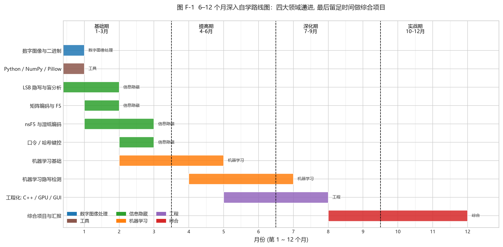

# Appendix F - A 6-12 Month In-Depth Self-Study Roadmap

<!-- lang-switch -->
> [🌐 中文版](https://yukinoshita-lin.github.io/nsf5-steganography/zh/content/appF.html)

> **Try it |** What Introduction 0.3 gives you is the compressed **12-week "get started"** route; this appendix gives the **6-12 month "truly understand it and produce results"** route. It is for readers who want to genuinely master the three pillars - digital image processing, information hiding, and machine learning - and go on to do real research or engineering work. **Both routes use exactly the same content; only the time allocation differs.**

Figure F-1 (the 6-12 month Gantt chart: x-axis = month, y-axis = topic, color = field; dashed lines split the journey into four stages - Foundations (months 1-3) / Advancing (4-6) / Deepening (7-9) / Capstone (10-12))

## F.1 The four stages: goals and deliverables

| Stage | Months | Goal | Main content | What you can do when the stage ends |
| --- | --- | --- | --- | --- |
| Foundations | 1-3 | Solidify the foundations of all three fields | ch01 digital images and binary, ch02 the Python toolchain, ch03 LSB steganography and blind analysis, ch04 matrix embedding and F5, ch05 nsF5 wet-paper codes, ch06 hash keying | Hide a sentence independently and catch it with chi-square/RS; work out a p=3 Hamming embedding by hand; explain wet-paper decoding clearly |
| Advancing | 4-6 | Enter machine learning; build the feature→model→evaluation framework | ch07 machine learning foundations, ch08 ML steganalysis (11-d → 143-d → dual versions) | Explain overfitting / data leakage / GroupKFold / AUC clearly; read and reproduce the v1 11-d training pipeline |
| Deepening | 7-9 | Master the engineering and the "why behind every design choice" | ch08.8 SRM and the 143d/53d strategy, ch09 engineering (C++ / GPU / GUI / multi-source data) | Read SRM filtering and the 143-d features; understand why same-source and cross-source gains differ; run GPU batch featurization with self-checks |
| Capstone | 10-12 | Produce a complete piece of work that is genuinely "your own" | ch10 capstone project, ch11 reporting; then pick one research or engineering thread to go deep on | Complete a reproducible improvement experiment with an **honest** analysis of the results; defend it without slides |

> **Tip |** The "Foundations" stage is nearly identical to the 12-week route - you just spend more time each week thinking through every **why** (especially the statistical detection in ch03 and wet-paper codes in ch05). The real gap opens up in "Deepening" and "Capstone".

## F.2 Four main threads: how to cover breadth, completeness, and practice

To produce results, do not spread your effort evenly. Pick one thread to dig into; for the others, "able to follow along" is enough:

| Thread | Focus | Where to go deeper |
| --- | --- | --- |
| Algorithm thread | nsF5/F5, matrix embedding, wet-paper codes, syndromes | ch04-05 and `ns5_core.py` in the project; outward to JPEG-domain and DCT-coefficient steganography |
| Detection / ML thread | Feature engineering, SRM, 143d/53d, OOD | ch08, `featurize_v2.py`, `train_model.py`; outward to modern high-dimensional features and deep-learning steganalysis |
| Engineering thread | C++ DLL, GPU batching, GUI, multi-source datasets, CI | ch09, `cppembed.py`, `gpu/*`, `.github/workflows`; outward to deployment and robustness |
| Research thread | Reproduce a paper → find a gap → improve → evaluate honestly | The literature (Appendix E) and `docs/RESULTS.md`; emphasize split/calibration/test rigor (ch07) |

## F.3 Optional stretch topics (pick 1-2 per thread)

- **JPEG-domain steganography**: port the ch04-05 ideas to quantized DCT coefficients (the sister project `yccstego` (https://github.com/Yukinoshita-lin/yccstego) is exactly this direction) and feel the difference between "spatial domain vs transform domain";

- **Deep-learning steganalysis**: under small-sample constraints, how to validate a signal with interpretable features first and only then carefully introduce deep models (the lesson of ch08.1);

- **Domain adaptation / cross-source robustness**: with the v1 protocol, SRM preprocessing helped within the same source but hurt across sources (ch08.8.1; that result was not reproduced in the current version) - study how domain adaptation can make features robust across cameras/compression sources;

- **Adversarial robustness and false-positive control**: study the trade-off between "loose vs strict" thresholds and Youden / low-FP operating points (ch07), plus the physical ceiling of undetectable embedding;

- **Interpretability**: 143d is robust while 53d is interpretable (ch08.8.4) - study which features truly contribute the gain and how to explain them dimension by dimension.

> **Read the code |** Land any of the topics above in code: reproduce the baseline first, make a small change, and use `GroupKFold` to produce an honest comparison. **"I changed A and the number went up" convinces nobody - a train/calibration/test three-layer structure with grouped splits is what proves it really went up.** (ch07 and ch08 keep hammering this point.)

## F.4 How this relates to Introduction 0.3 (the 12-week route)

- **Want to get started fast**: follow 0.3, run the 12 weeks once, and work through the checklist in Appendix C;

- **Want to go deep and produce results**: follow this appendix, 6-12 months, taking 0.3's weekly tasks **slower, deeper, and better connected**, and during "Deepening/Capstone" add the parts of the 0.5 project map that only matter for research (SRM, multi-source data, GPU, dual model versions, OOD validation);

- The **shared bottom line** of both routes: never skip the hands-on experiments, and never skip honest evaluation. What this handbook most wants to teach you is not an algorithm but **"how to judge whether an experimental conclusion can be trusted"**.

> **Think about it |** Which thread will you pick, and over what time frame? (12 weeks vs 6-12 months means spending your time on "breadth" or "depth".) Write it down - it is the personal goal for your journey through this book.
