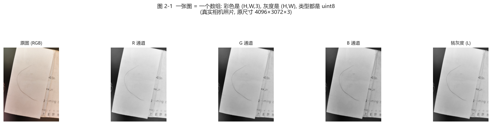
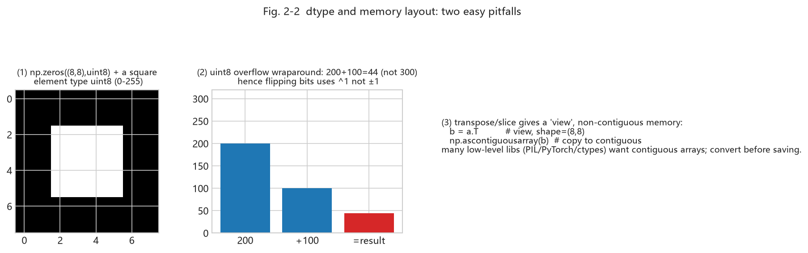

# Chapter 2 - Tooling: Python, NumPy, and Image I/O (Week 2)

<!-- lang-switch -->
> [🌐 中文版](https://yukinoshita-lin.github.io/nsf5-steganography/zh/content/ch02.html)


> **Try it |** Goals: install the environment, run the end-to-end script, and read/write image arrays with NumPy. From now on every experiment can be verified immediately in the project. First we use a real photo to weld "image = array" into your head.

## 2.1 Installing the Environment

The project's dependencies are light: the core needs NumPy and Pillow, and the machine-learning part adds scikit-learn, joblib, etc. Use a fairly recent Python 3.9+ (readme example uses 3.14; older versions also work).

*Install in the project root and do the first self-check*

```python
cd F:\Steganography
pip install numpy pillow
python src\test_core.py      # core algorithm self-test
python src\test_steg.py      # steganalysis self-test
python src\run_e2e.py        # end-to-end: embed -> decode -> analyze -> plot
```

> **Watch out |** If the default `python` lacks tkinter, the GUI will not start. The README's fix is to use a tkinter-enabled interpreter (e.g. `C:\Python314\python.exe`); command-line scripts are unaffected. On `ModuleNotFoundError`, first confirm you installed into "the interpreter that runs it": `python -m pip install ...` is safer.

## 2.2 Thinking About Images with NumPy

NumPy arrays have four core concepts: **shape**, **dtype**, **slicing**, and **vectorized operations**. Steganographic algorithms essentially do: take an array -> rewrite the LSBs of some elements in some order -> store it back.

*First look at "image = array" with a real photo:*



*Fig. 2-1 (real camera photo: color is a (H,W,3) three-channel array, grayscale is a (H,W) single channel, both dtype uint8. The R/G/B channels are each a "how bright is this color" grayscale image; grayscale is a human-luminance-weighted result)*

**Reading the figure**:
- Color image: three 0-255 numbers stacked at each pixel, shape (H,W,3);
- Grayscale: one 0-255 per pixel, shape (H,W);
- Both are `uint8` (8-bit unsigned 0-255) - which is why "changing LSB" is bit ops rather than ±1.

*The four concepts in 10 lines*

```python
import numpy as np
a = np.arange(12).reshape(3, 4)     # 3 rows 4 cols
print(a.shape, a.dtype)             # (3,4) int64
b = a[:, 1]                          # take column 2
c = a[0:2, 0:3]                      # top-left 2x3 block
x = np.zeros((64, 64), dtype=np.uint8)
x[10:20, 5:15] = 255                 # draw a white square
print((x & 1).sum())                 # count LSB=1
```

Note `dtype=np.uint8`: image pixels are 8-bit unsigned integers 0-255. With add/subtract beware **overflow wraparound**: `np.uint8(200) + 100` gives 44, not 300. The project flips LSB with "XOR 1" rather than "±1" precisely to avoid 0 underflowing to negative or 255 overflowing.



*Fig. 2-2 (real computation: ① a uint8 array; ② uint8 wraparound - 200+100=44 not 300, so use ^1 to flip bits; ③ transpose/slice gives a "view" with non-contiguous memory; before saving to low-level libraries often need `np.ascontiguousarray`)*

> **Try it |** In an interactive shell type this and see for yourself that `np.uint8(200)+np.uint8(100)==44`, and the `flags` difference between `a.T` and `np.ascontiguousarray(a.T)`. Week 2's "can read code" starts with these small gotchas.

## 2.3 Image I/O: Meet image_io.py

*The core interface of project/src/image_io.py*

```python
from PIL import Image
import numpy as np
 
def load_as_gray(path):
    im = Image.open(path).convert("L")   # force grayscale
    return np.asarray(im, dtype=np.uint8)
 
def save_image(image, path):
    im = Image.fromarray(np.ascontiguousarray(image))
    im.save(path)
```

> **Back to the code |** Open `src/image_io.py` in full yourself; note the difference between `load_image()` and `load_as_gray()`, and the `SUPPORTED` extensions. Then run this to read the project's carrier image:

*Hands-on: read an image, see shape, save a grayscale copy*

```python
import sys; sys.path.insert(0, "src")
import image_io as IO
img = IO.load_as_gray("img/cover.png")
print(img.shape, img.dtype)          # (256,256) uint8
print(img.min(), img.max(), img.mean())
IO.save_image(img, "output/my_copy.png")
```

Note `load_as_gray`'s `.convert("L")`: it forces any input to grayscale; while `save_image`'s `np.ascontiguousarray` guarantees contiguous memory. This "read as grayscale, write as contiguous" wrapper is the unified input interface for all downstream algorithms (embed/analyze/ML) - ensuring everyone works on the same-spec array.

## 2.4 First End-to-End Run: run_e2e.py

Run `python src/run_e2e.py`; the script does five things: generate a cover -> embed an English message with nsF5 p=3 (empty and keyed password) -> decode and compare -> blind-steganalysis both clean and stego images -> plot the code family/efficiency figures.

> **Try it |** Read the terminal output and note three numbers: embedded bit count, changed-pixel count, and the clean vs stego analysis probabilities. Chapter 3 explains why they differ.

You do not need to understand embedding internals yet - Week 2's goal is only "get the code running on your machine" and build the "array LSB change" intuition. When you return to `train_model.py` after Chapter 8, you will see every "array operation" here serves a "feature vector" - that is the "learn by following the code" thread of this handbook.

## 2.5 Common Errors Cheat Sheet

| **Error / symptom** | **Cause** | **Fix** |
| --- | --- | --- |
| ModuleNotFoundError | installed into another interpreter | use the running interpreter's python -m pip install |
| image too small for header+body | fewer pixels than payload | use a larger image, or reduce p / shorten message |
| UnicodeDecodeError / garbled | ASCII-only by default | keep embedded text ASCII; see Chapter 10 for Chinese ideas |
| GUI exits / TclError | interpreter without tkinter | use a tkinter-enabled Python to run src/gui.py |

> **Think about it |** Why does `image_io` convert to "contiguous array" (`np.ascontiguousarray`) when saving? Hint: slicing and transpose can produce non-contiguous memory views that many low-level libraries dislike. One layer deeper: since grayscale is a single (H,W) channel, why can Chapter 8's "features" reach 143 dimensions? (Hint: those are statistics, not pixels.)
