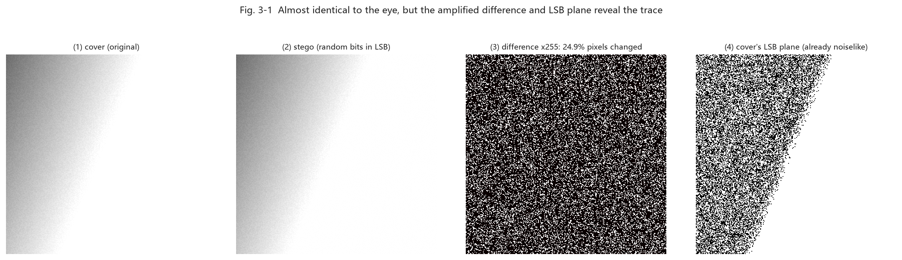
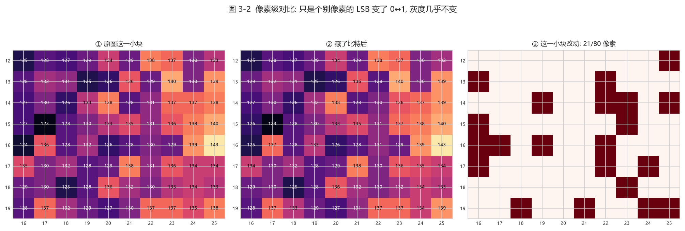
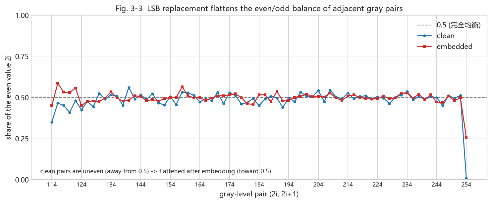
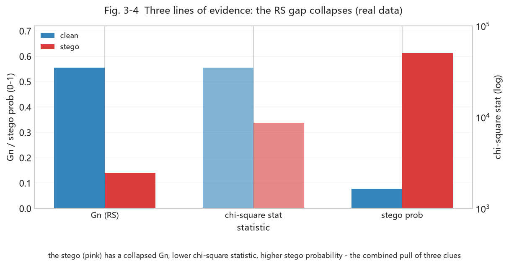

# Chapter 3 - LSB Steganography and Its Statistical Fingerprint (Weeks 3-4)

<!-- lang-switch -->
> [🌐 中文版](https://yukinoshita-lin.github.io/nsf5-steganography/zh/content/ch03.html)


> **Try it |** Goals: complete the smallest possible "hide then detect" loop; understand what chi-square and RS analysis each measure; read the verdict logic in steganalysis.py. First we visually see how "subtle" an LSB change is on a real carrier (img/cover.png), then see how statistics expose it.

## 3.1 Encryption vs Steganography: The First Question

| **Aspect** | **Encryption** | **Steganography** |
| --- | --- | --- |
| Protects | Message content: unreadable without a key | Communication: nobody sees there is a secret |
| Visibility | Ciphertext clearly "not normal data" | Carrier looks completely normal |
| Typical use | Passwords, certificates, encrypted files | Covert channels, watermarking, forensics |
| Relation | Can encrypt then hide (recommended) | Steganography hides the "existence" of a secret |

> **Tip |** A one-line rule: **encryption protects "content", steganography protects "existence".** Professional systems usually use both: encrypt the message first, then hide the ciphertext. Encrypted ciphertext looks near-random, which is less likely to reveal itself statistically.

## 3.2 Minimal Runable LSB Steganography

The simplest steganography is **LSB replacement**: write the secret bit string into the LSBs of pixels one by one. A grayscale image with M×N pixels can hide M×N bits.

*Textbook minimal LSB (for understanding only; the project actually uses matrix coding from Chapters 4-5)*

```python
import numpy as np
 
def text_to_bits(s):
    raw = s.encode("ascii")
    # 16-bit length header + 8 bits per character
    head = [(len(raw) >> i) & 1 for i in range(16)]
    body = np.unpackbits(np.frombuffer(raw, np.uint8))
    return np.concatenate([head, body]).astype(np.uint8)
 
def lsb_embed(cover, bits):
    flat = cover.ravel().copy()
    k = min(len(bits), flat.size)
    flat[:k] = (flat[:k] & 0xFE) | bits[:k]   # clear LSB then write
    return flat.reshape(cover.shape)
 
def lsb_extract(stego, nbytes):
    flat = stego.ravel() & 1
    return bytes(np.packbits(flat[16:16 + nbytes*8]))
```

> **Watch out |** **Lossy formats are LSB's enemy.** PNG/BMP losslessly preserve bit planes; JPEG compression destroys LSBs. So the project saves PNG by default, and JPEG-domain hiding needs a separate route (the yccstego extension goes the quantized-DCT-coefficient route).

Why put a 16-bit length header first? Because the decoder must know "how many bytes to read" to recover the message. The project's `encode_string()` in `src/ns5_core.py` writes a 16-bit little-endian length first, then the ASCII body bits - you have replicated that structure in the 3.2 example.

### 3.2.1 First, See It: How "Subtle" Is an LSB Change?

On the project's demo carrier `img/cover.png`, do one real LSB replacement (hide random bits) - about 25% of pixels have their LSB rewritten. See what the image becomes:



*Fig. 3-1 (real data: ① carrier `img/cover.png`; ② stego after hiding random bits via naive LSB; ③ amplify |cover − stego| ×255 to finally see the changes scattered across the image; ④ the carrier's own LSB plane - already near-noise)*

**Reading the figure**:
- **① vs ② look identical to the eye** - that is LSB's "concealment";
- **③ amplified ×255** reveals the noise scattered over the image - the "positions of changed pixels";
- **④ cover's LSB plane** is already fine noise - so adding random bits there is hard to notice visually or by histogram.

### 3.2.2 Pixel Level: How Many Changed, and How?

Zoom into a small real block of pixel values and see each pixel's change before/after:



*Fig. 3-2 (real data: ①/② the same small region's gray values before/after embedding; ③ marks the 21/80 pixels changed. Note every change differs by only 1 - because only the LSB flips 0↔1)*

**Reading the figure**:
- Each changed pixel's value moves by only ±1 (e.g. 127→128, 135→134), because only the **lowest bit** changes;
- The eye is completely insensitive to a 1-level gray change - that is "visual redundancy";
- But exactly this "pair-flattening" change leaves a measurable fingerprint for statistical detection (3.3 chi-square, 3.4 RS).

> **Tip |** Remember two words: **visual redundancy** (the eye cannot see) and **statistical redundancy** (a detector can see). LSB hiding uses the former but breaks the latter - that becomes the breakthrough for all statistical detection.

## 3.3 Why It Is Exposed: The Chi-Square Test

In natural images the adjacent gray values 2i and 2i+1 (e.g. 100 and 101) usually appear with **unequal** counts. LSB replacement forces the even/odd pair to "flatten": when a pixel changes from 2i to 2i+1 or back, the two gray counts tend to equalize. Westfeld's chi-square test does exactly this:

1. Count the 256-level grayscale histogram and pair adjacent values (0,1),(2,3),…,(254,255);
2. Assuming "embedded", the two counts in each pair should be nearly equal; the expected value is half the pair sum;
3. Compute Σ(observed−expected)²/expected (only over pairs with positive count);
4. Convert to a p-value: high p means "consistent with the uniform assumption" → suspect LSB randomization;
5. The project also cuts the image into 20 prefix segments, computes a p per segment, and takes the median for a steadier verdict.

Note the p-value meaning is easy to get backwards: here a larger p is more suspicious, because it says "if the LSB were fully randomized, seeing this distribution is likely" - a clean smooth image usually is not so uniform.



This compares, for each adjacent gray pair (2i, 2i+1), the proportion of pixels that take the even value for a clean image and after LSB embedding: the clean image (blue) clearly deviates from 0.5 (uneven even/odd counts); after embedding (pink) it is "flattened" toward 0.5. That is exactly the signal chi-square catches - the more balanced, the higher the p, the more suspicious.

> **Watch out |** **A naturally noisy image can fool chi-square.** Digital photos already have near-random LSBs, so the chi-square p is naturally high. So the project adds a "content randomness" correction: first estimate how random the image inherently is via the grayscale difference entropy, then decide whether to treat a high p as evidence of embedding. This is a key engineering detail that makes the heuristic usable.

## 3.4 RS Analysis: The "Structural Collapse" of the LSB

Fridrich et al.'s RS analysis takes a different angle: instead of comparing gray-pair counts, it looks at the **spatial structure** of the LSB plane. It cuts the pixel stream into groups of 4, defines a smoothness discriminant f (sum of absolute adjacent differences within the group), then uses a "positive mask" and "negative mask" to flip some LSBs in the group, counting groups where f increases (Regular R) or decreases (Singular S) after flipping.

A clean natural image has a clear "regular tendency" under the negative mask, quantified by Gn = (Rn−Sn)/N which is clearly positive (the project's clean smooth images often 0.3-0.7). LSB replacement randomizes the plane, collapsing this structure - Gn drops markedly. The project also reports Gr, estimated embedding rate, etc., together forming the "RS evidence".

*The core RS logic in the project's steganalysis.py (pseudocode, only illustrating the grouping/statistical idea)*

```python
groups = flat[:m].reshape(-1, 4)        # group of 4 pixels
fg = np.abs(np.diff(groups, axis=1)).sum(axis=1)   # original smoothness f
pos = (groups ^ np.array([0,1,1,0])) & 0xFF        # +M flip
neg = (groups ^ np.array([1,0,0,1])) & 0xFF        # -M flip
Rm = (f(pos) > fg).sum();  Sm = (f(pos) < fg).sum()
Rn = (f(neg) > fg).sum();  Sn = (f(neg) < fg).sum()
Gn = (Rn - Sn) / n          # clearly positive for clean, ~0 after randomization
```



This uses the project's real statistics to compare clean (blue) vs stego (pink): the RS gap Gn collapses from clearly positive (structure), the chi-square statistic drops (even/odd gets flattened), and the ML stego probability rises. LSB embedding destroys the LSB plane's "order" - this bar chart is a direct comparison of the three lines of evidence (RS / chi-square / ML).

## 3.5 The Project's Combined Verdict: analyze()

`src/steganalysis.py`'s `analyze(image, sensitivity=...)` does not look at one statistic, but combines four signals:

- median chi-square p (are gray pairs flattened?);
- RS collapse amplitude (how far Gn drops relative to a content-adaptive baseline);
- grayscale difference entropy and LSB difference entropy (is the randomness native to the image?);
- the prefix p sequence (is the randomization local or global?).

Three sensitivity levels (strict / balanced / loose) tune the "possible / highly possible" thresholds and the probability-pull coefficient, essentially choosing an operating point between **false positives** and **misses**.

> **Look ahead to Chapter 7 |** Chapter 7 upgrades this heuristic into "features + a supervised classifier" and draws fuller ROC / AUC (Fig. 7-6) and feature distributions (Fig. 8-1/8-2).

## 3.6 Hands-On: Hide a Sentence, Then Catch It

*Using the real project API: embed -> save -> analyze (run cell by cell in Jupyter)*

```python
import sys; sys.path.insert(0, "src")
import numpy as np
import image_io as IO
from ns5_core import embed_string, extract_string
import steganalysis as SA
 
clean = IO.load_as_gray("img/cover.png")
stego, report, nbits = embed_string(
    clean, "Hello nsF5!", method="nsF5", p=3, password="")
IO.save_image(stego, "output/lab3_stego.png")
print("changed pixels:", report["cover_changed"])
print("decoded:", extract_string(stego, method="nsF5", p=3))
for name, im in (("clean", clean), ("stego", stego)):
    r = SA.analyze(im)
    print(name, "Gn=%.3f" % r["RS_Gn"],
          "chi2p=%.3f" % r["chi2_pvalue"],
          "prob=%.2f" % r["stego_probability"], r["verdict"])
```

> **Try it |** Change the message to 5000 characters and run again (see `src/test_steg.py`); watch the changed-pixel ratio, Gn drop, and stego probability change. Then swap in a noisier photo and see whether chi-square and RS can still distinguish.

## 3.7 Summary and Self-Check

- LSB embedding uses **visual redundancy** (Fig. 3-2: each change differs by 1), invisible to the eye (Fig. 3-1);
- LSB replacement flattens adjacent gray-pair counts (chi-square) and destroys LSB-plane structure (RS);
- A high p is not "safe"; first judge whether the image is naturally random;
- False positives vs misses are a trade-off; the sensitivity setting picks an operating point;
- The project's analyze() is an engineering combination of "statistical signals + content baseline".

> **Think about it |** Plain LSB replacement hides 1 bit/pixel with an average 50% change rate. If you hide only a small message and change less than 1% of pixels, can chi-square still catch it? RS? Take this question into Chapter 4. One layer deeper: Fig. 3-1 shows the LSB plane is already near-noise - so why does chi-square still catch it? (Hint: the key is "a clean image's even/odd counts are initially uneven", not "the LSB looks random".)
