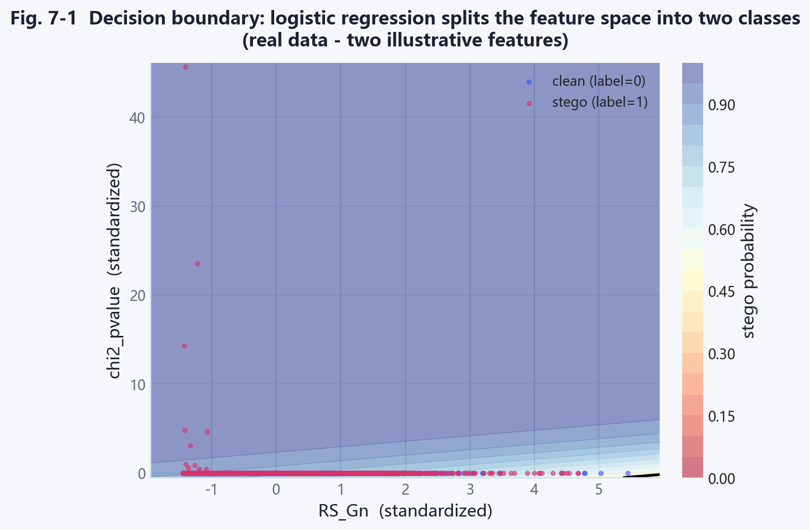
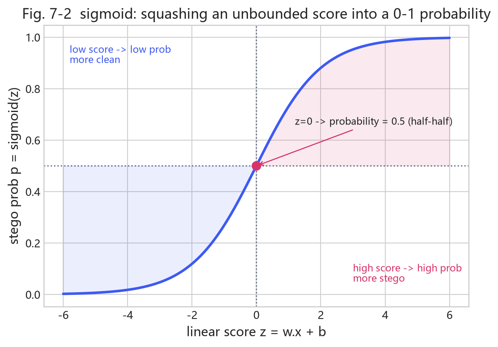
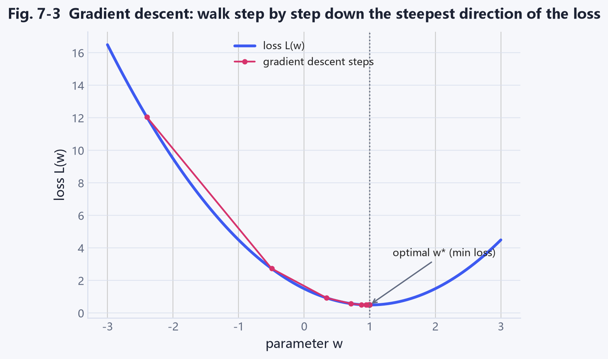
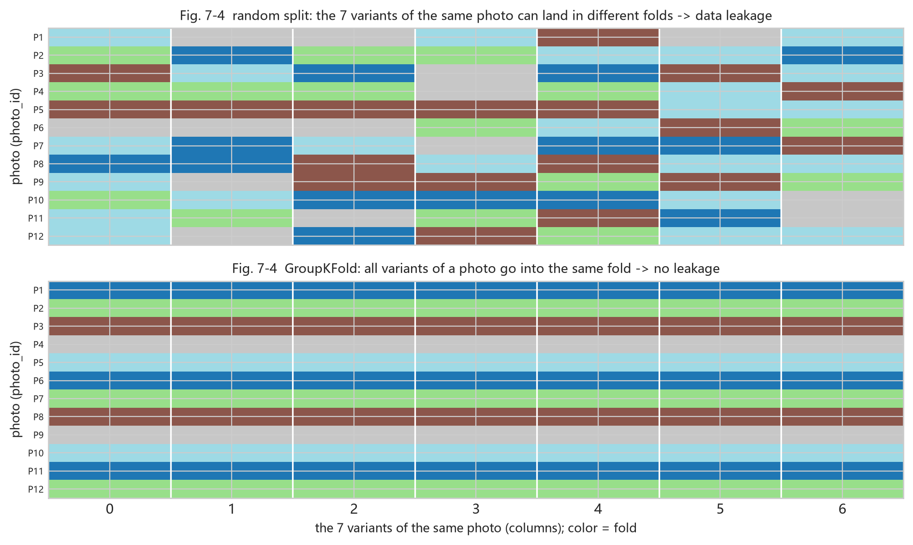
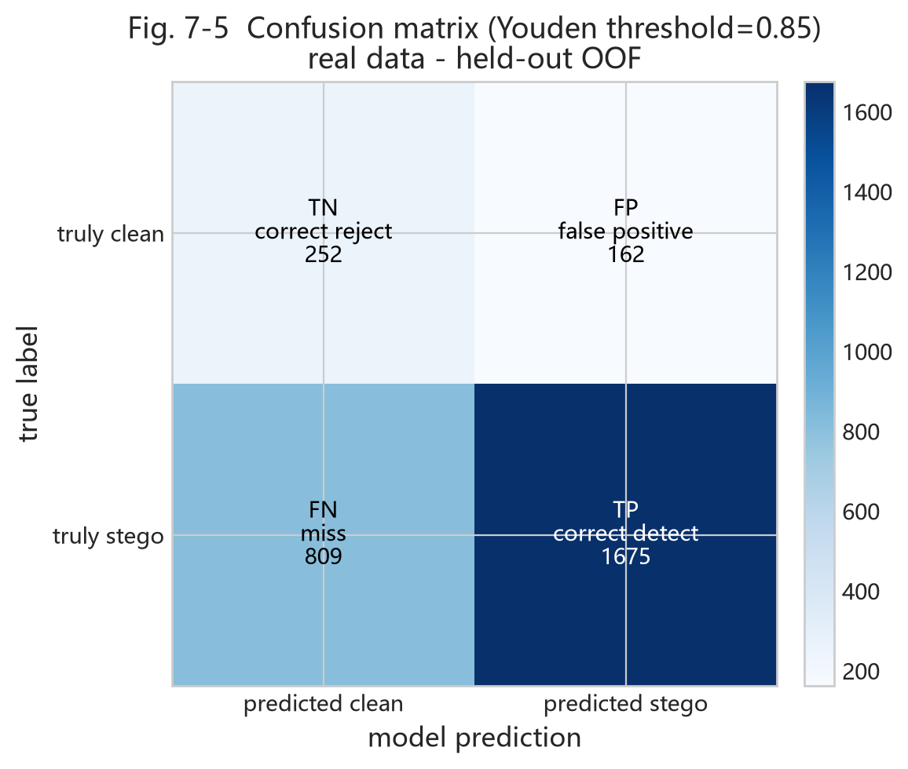
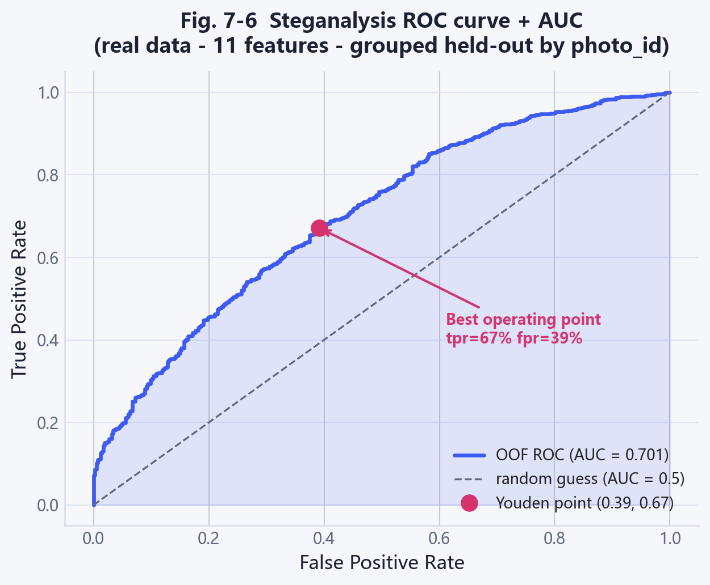
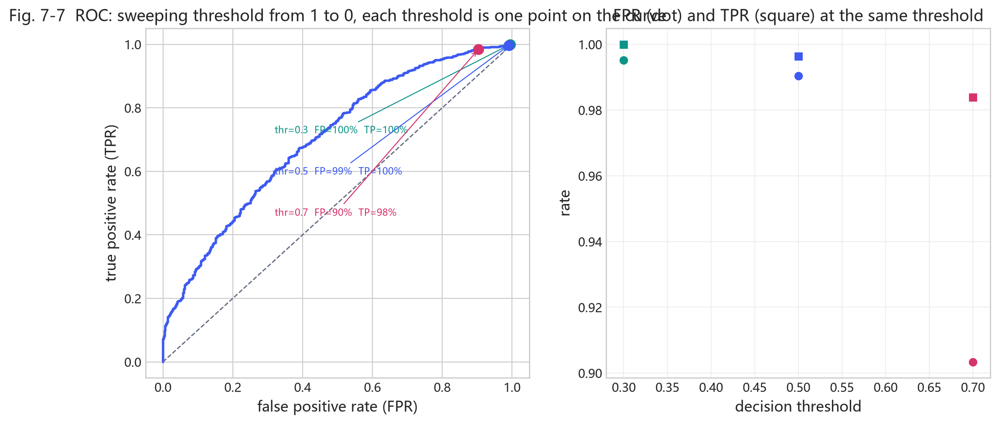
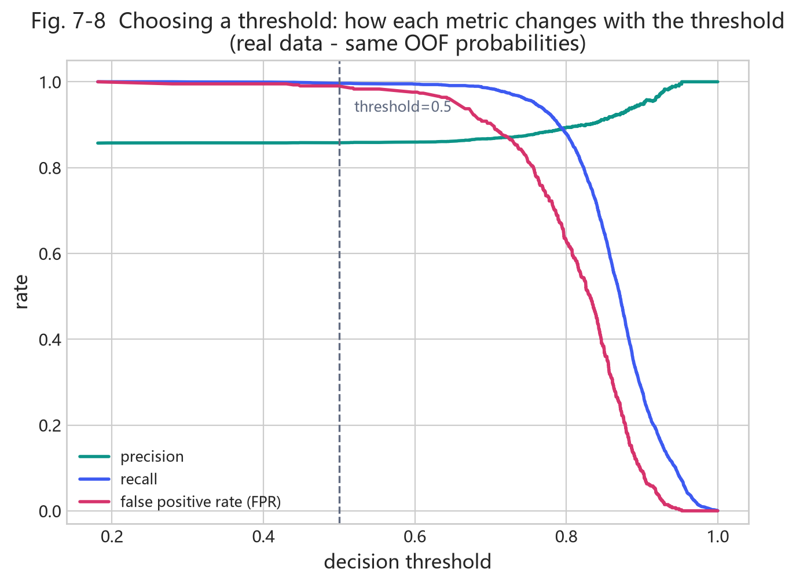

# Chapter 7 - Machine Learning Foundations (First Time Learners, Weeks 7-12)

<!-- lang-switch -->
> [🌐 中文版](https://yukinoshita-lin.github.io/nsf5-steganography/zh/content/ch07.html)


> **Try it |** Goals: fully and solidly learn four things - **how an image becomes numbers (features) -> how a model learns to judge -> how to prevent cheating -> how to tell if a model is good.** We start from a point of view that someone who has never touched machine learning can follow, with real-data figures, progressing step by step without rushing.

## 7.0 Chapter Roadmap: How to Study (about 3-6 weeks)

If you have a 6-12 month cycle, treat this chapter as a **real first course in machine learning**, not a crash course to "understand the project code." Suggested path:

1. **Step 1 (~1 week)**: read only 7.1-7.2, build the "data -> features -> labels" picture, and be able to name everyday examples of "describing an image with numbers".
2. **Step 2 (~1 week)**: read 7.3-7.5 with Fig. 7-1/7-2/7-3, understand "draw a line + turn the line into probability + make the probability right". **No formula derivation required**, just be able to retell the idea by looking at the figures.
3. **Step 3 (~1 week)**: read 7.6-7.8, focus on **data leakage** and **how to evaluate**. This is where real projects most often stumble, and it deserves extra time.
4. **Step 4 (~1 week)**: run every code excerpt on your own machine (`python src\train_model.py`) and confirm where each output number comes from.

> **How to study |** Every section ends with a "Think about it". Write the answer down rather than just thinking in your head - writing is where real learning happens.

---

## 7.1 Steganalysis Is Just "Is This Image Hiding Something?"

Change perspective: a photo is either clean (marked 0) or had a message hidden in it (marked 1). Machine learning just learns a judgment: give it an image and try to guess 0 or 1.

This is like a teacher giving students many problems with answers, and then students solve unseen problems on a test - machine learning does not "memorize", it learns **the rule**. Supervised learning has four pieces: **data, features, model, evaluation**. We go through each, mapping every one to project code.

> **Mini-glossary |** You will see these four words throughout. First remember their "plain" version:
> - **Data**: a pile of "examples with answers".
> - **Feature**: the short list of numbers an image is compressed into (like "measuring the image with rulers").
> - **Model**: a "features-to-answer" judgment rule.
> - **Evaluation**: judging whether that rule is reliable.

## 7.2 How an Image Becomes Numbers: Features and Labels

A computer does not "see" images, only numbers. So step one is to **compress an image into a short list of numbers**. The project's v1 compresses each image into **11 numbers**, and v1.4 extends this to 143 (Chapter 8). Those 11 numbers are the **feature vector** - like "measuring the image with 11 rulers."

- **Feature**: the 11 numbers (e.g., "how chaotic the pixel differences are", "is the brightness distribution off").
- **Label**: whether the image hid something; 0 = clean, 1 = hidden.
- **Sample**: one row = one image, 11 feature numbers + 1 label.

*What the dataset looks like (first columns are features, `label` is the answer, ignore `photo_id` for now)*

```python
Rm,Sm,Rn,Sn,RS_Gr,RS_Gn,chi2_pvalue,diff_entropy,lsb_diff_entropy,median_prefix_p,chi2_stat,label,photo_id,...
41316,4574,36608,5057,0.56,0.48,0.56,1.99,0.986,2.7e-166,1719.3,0,0,...
40488,4907,35701,5342,0.54,0.46,0.61,2.02,0.989,2.2e-155,1675.9,1,0,...
```

data/dataset.csv (real first two rows, numbers truncated for display)

> **Tip |** Do not panic at names like `chi2_pvalue` or `RS_Gn`. They are just "the number from ruler number N." Chapter 8 explains what each ruler measures.

Write the table as notation - every formula below uses it (do not fear; it is just "row i, column j"):

- **Sample**: one row is one sample, $N$ in total, indexed $i=1,\dots,N$;
- **Features**: the 11 numbers of sample $i$ are a vector $\mathbf{x}_i$; all rows form a matrix $X$ ($N$ rows x 11 columns);
- **Label**: $y_i\in\{0,1\}$, stacked into a vector $\mathbf{y}$.

## 7.3 Classification = Draw a Line to Separate Two Groups

Once we have a pile of "numbers with answers" (features + labels), what does the model learn? It learns **to draw a line in number-space: one side clean, one side hiding.** Imagine: horizontal axis = "how chaotic", vertical axis = "is brightness balanced". Clean images cluster in one corner, hiding images in the other. The model learns that dividing line.



*Fig. 7-1 (real data: decision boundary learned by logistic regression on the RS_Gn and chi2_pvalue features; blue = clean, red = hiding, shading = model's estimated hiding probability)*

Understanding this figure is the key to the whole chapter. Notice:

1. **The two classes are not perfectly separable**: near the boundary blue and red points mix. The two features are not enough to fully separate, but already "roughly" separate.
2. **The shading is "probability"**: the redder, the more the model thinks hiding; the bluer, the more clean. The black line in the middle is the "probability = 0.5" boundary.
3. **More dimensions work the same**: the real model uses 11 (or 143) features - it draws a "hyperplane" in 11 (or 143) dimensions. You cannot draw that, but the idea is identical to this 2-D figure.

In math this line is called a **linear discriminant function** - basically a scoring formula:

$$
z = w_1x_1+w_2x_2+\cdots+w_{11}x_{11}+b .
$$

**Do not let the symbols scare you.** It is a weighted sum:

- $x_1,\dots,x_{11}$ are the 11 feature numbers;
- $w_1,\dots,w_{11}$ are **weights** - they decide "which feature matters and which way the line tilts." If a feature is especially useful, its $w$ is big;
- $b$ is the **bias** - it shifts the whole line up or down to set the position.

Judging is simple: $z \ge 0$ means "hiding", $z < 0$ means "clean". **The single line `LogisticRegression` is the code that automatically finds the best $w$ and $b$.**

> **Think about it |** In Fig. 7-1, which of "RS_Gn" and "chi2_pvalue" seems more important for the judgment? If you could keep only one feature, which would you pick? - Your intuition is verified later in the "feature importance" figure in 7.7.

## 7.4 From Score to Probability: Why a sigmoid?

$z$ above is a signed, unbounded "score." But the user wants a probability between 0 and 1: "how likely is this image hiding something?" So we add a **sigmoid** that squashes the score to 0-1:

$$
\hat p = \frac{1}{1+e^{-z}} .
$$

- Very large $z$ (high score) -> $\hat p$ near 1 (probably hiding);
- Very small $z$ -> $\hat p$ near 0 (probably clean);
- $z=0$ -> exactly 0.5 (fifty-fifty).



*Fig. 7-2 (sigmoid compresses the unbounded, signed "score z" into a 0-1 "probability". Left blue region = more like clean, right red region = more like hiding)*

> **Tip |** Think of sigmoid as a "percentage converter": it turns a boundary-less score into an easy 0%-100%. **Despite the name "logistic regression", it is still "draw a line + output a probability."**

### 7.4.1 Why Not Just Output 0/1, but a Probability?

Good question. Because the real world is not black-and-white. In Fig. 7-1, the points near the boundary are genuinely uncertain. Rather than forcing the model to say "0" or "1", it is honest to say "I am 73% confident it is hiding." Then:

- The user can choose the **threshold** themselves (7.7);
- You can evaluate **how confident** the model really is (calibration);
- You can draw threshold-independent metrics like ROC / AUC (7.7.1).

> **Mini-glossary |** A classifier that outputs probabilities is **soft classification**; one that directly outputs 0/1 is **hard classification**. Logistic regression is soft - that is why it can compute **AUC** (area under the ROC curve, a measure of how well the model ranks hiding above clean; the higher the better; see 7.7.1).

*Against the project code - `src/train_model.py`.*

```python
def lr(seed=0):  return make_pipeline(StandardScaler(), LogisticRegression(max_iter=2000, C=0.1, random_state=seed))
```

| Code | Plain explanation |
| --- | --- |
| `StandardScaler()` | First make every feature "about the same size", so a huge number does not skew the line (see 7.4.2) |
| `LogisticRegression` | The "draw a line + sigmoid output probability" above; finds $w$, $b$ automatically |
| `max_iter=2000` | Adjust at most 2000 times, so it does not stop early |
| `C=0.1` | A dial that says "do not memorise the answers too hard" (regularization, 7.5.2) |

> **If you want to go deeper |** Why standardize? Because the chi-square statistic might be in the thousands while Gn is only 0-1. If the weights treat both equally, the gradient spends all its effort pleasing the big number and the line gets skewed. Standardization is `x'=(x-μ)/σ`, turning every feature into "mean 0, standard deviation 1", so everyone is fair. Note: μ, σ must be computed on the training set only; never sneak the test set in.

## 7.5 How a Model "Learns": Loss and Training

What does "learning" actually do? It **keeps adjusting $w$ and $b$ so the output probability gets closer to the correct answer.** How to measure "close"? Use a **loss** - think of it as "points deducted for being wrong." The classic is cross-entropy (log loss):

$$
\mathcal{L} = -\frac{1}{N}\sum_{i=1}^{N}\Big[ y_i\log \hat p_i + (1-y_i)\log(1-\hat p_i)\Big].
$$

**In plain words**: when the true answer is 1 (hidden), only $\hat p_i$ matters - the closer to 1, the fewer points lost; when the true answer is 0, only $1-\hat p_i$ matters - the closer to 0, the fewer points lost. **The more wrong, the more you lose.**

So how to lose fewer points? **Try a little bit at a time**: compute "which tiny adjustment lowers the loss fastest" and step that way. That is **gradient descent**:

$$
\theta \leftarrow \theta - \eta\,\frac{\partial \mathcal{L}}{\partial \theta}.
$$



*Fig. 7-3 (a simple "loss vs parameter" curve. The red staircase is gradient descent: start from the left and step down to the valley - the $w^*$ where loss is smallest. The blue curve is the loss function, and the valley is the optimal parameter)*

> **Tip |** You absolutely do not need to derive the derivative. Remember three sentences: **loss = how wrong the model is; training = find parameters that minimize loss; gradient descent = keep nudging in the direction that lowers loss fastest.** scikit-learn wraps all this up for you.

### 7.5.1 Why Go Step by Step Instead of One Shot?

In theory logistic regression's loss is convex and has a closed-form solution. But in real projects:

- With lots of data, inverting a big matrix is slow and unstable;
- We want a method that generalizes to many models (trees, neural networks);
- Gradient descent is the common engine for **any** model that minimizes a loss.

So understanding gradient descent means understanding how "training" works in linear, tree, and even neural models at once. That is its value.

### 7.5.2 An "anti-overfitting" dial: C and regularization

If features are highly correlated or samples are few, the model may inflate weights to memorize the training data - a sign of **overfitting**. One defense is to add a penalty encouraging small weights (L2):

$$
\mathcal{L}_{\text{reg}}(\mathbf w)=\mathcal{L}(\mathbf w)+\lambda\sum_{j}w_j^2 .
$$

scikit-learn uses the **inverse regularization $C=1/\lambda$**:

- `C=0.1` -> $\lambda=10$, strong regularization, weights sharply compressed, conservative;
- `C=1.0` -> $\lambda=1$, moderate; larger `C` means less regularization.

> **Back to the code |** `train_model.py` uses `LogisticRegression(C=0.1)` for base models (want them restrained, not memorizing), while the stacking meta-learner uses `C=1.0` (looser, freer to combine). Same class, two $C$ - the trade-off "base models steady, meta-learner flexible."

## 7.6 How Not to "Cheat": Cross-Validation and Grouping

Getting a high score on seen problems is easy; the real question is **unseen problems**. If a model memorizes the training samples, it collapses on new ones - **overfitting**.

The standard defense is **cross-validation**: cut the data into pieces and rotate which piece is the "mini-test". But there is a trap easy to step into.

> **Watch out |** One photo has 7 variants (1 clean + 6 hidden). They are **too similar**. If you split randomly, training could contain a "blood sibling" of some test photo - effectively telling the model the answer early. That is **data leakage**, and the score balloons unrealistically. The project's fix: **group by `photo_id`** - every variant of a photo is entirely in training or entirely in test, never split.



*Fig. 7-4 (schematic: each P is a photo, one row has 7 variants. Top "random split" tears the 7 variants of a photo into different folds - leaks. Bottom "GroupKFold" puts all 7 variants of a photo into the same fold - honest)*

*Against the code - the core of `src/train_model.py::cv_oof()`.*

```python
from sklearn.model_selection import GroupKFold
gkf = GroupKFold(n_splits=5)
for tr, va in gkf.split(X, y, groups):   # groups = photo_id, split by photo
    clf.fit(X[tr], y[tr])
    p = clf.predict_proba(X[va])[:, 1]   # score only on this "mini-test" fold
```

The key is the `groups` argument. It tells the splitter: "samples in the same group must not be torn apart." The ordinary `KFold` would split a photo's "blood siblings" across both sides, and the score would cheat.

> **Think about it |** Why do the 7 variants of one photo not count as independent samples? Try a minimal example: with only 10 photos, how likely is a random split to put some photo's "blood sibling" on both training and test sides? How much does such "leakage" inflate the score? (Hint: think about the 0.5 random line in 7.7.1)

## 7.7 Evaluation: Do Not Just Look at Accuracy

The model outputs a probability, so we pick a **threshold** to say 0 or 1. For evaluating, start with the **confusion matrix**:



*Fig. 7-5 (real data at the Youden threshold: TN = correct reject, FP = false positive, FN = miss, TP = correct detection. Numbers are real sample counts)*

From these four values (TN, FP, FN, TP), the common metrics:

$$
\text{accuracy}=\frac{TN+TP}{TN+FP+FN+TP},\quad
\text{precision}=\frac{TP}{TP+FP},\quad
\text{recall}=\frac{TP}{TP+FN},\quad
F_1=\frac{2\cdot precision\cdot recall}{precision+recall}.
$$

- **Accuracy**: fraction correct overall. **Trap**: if there are far more hiding than clean, a model labeling everything "hiding" still scores high accuracy - but falsely accuses every clean image.
- **Precision**: of those flagged hiding, how many really are.
- **Recall**: of the truly hiding images, how many were caught.
- **F1**: a compromise between precision and recall.

| Metric | Question it answers | Intuition |
| --- | --- | --- |
| Accuracy | How many right overall | Misleading when imbalanced |
| Precision | Of flagged hiding, how many really are | Low false-positives -> high |
| Recall | Of truly hiding, how many caught | Low misses -> high |
| F1 | When you want both | Compromise |
| ROC / AUC | Ranking strength, threshold-free | 0.5 = random |

## 7.7.1 ROC Curve and AUC: Can You Rank Hiding Above Clean?

**The key idea**: a good model should rank hiding images above clean ones. Sweep the threshold from high to low and you get an **ROC curve**, horizontal = "false-positive rate", vertical = "detection rate". The closer to the top-left corner, the better.



*Fig. 7-6 (real-data OOF ROC curve: AUC ~0.70. The red shaded area is the AUC - "draw one hiding and one clean image at random; the probability the model ranks the hiding image higher." The red dot is the Youden best operating point)*

**AUC** is the area under the curve: 0.5 is random (diagonal dashed line), 1.0 perfect ranking. **0.7 means "usually ranks hiding above clean, but not great"** - matching the reality that weak densities are hard to detect.

> **Key point |** AUC is threshold-independent! No matter whether you set the threshold to 0.5 or 0.7, AUC stays the same. Because AUC only cares about **ranking**, not "where exactly to cut." You can see this directly in Fig. 7-7.

### 7.7.2 Choosing a Threshold: The "Operating Point" on the ROC

Although AUC is threshold-independent, **in real deployment** you must choose one. Higher -> conservative (fewer false positives, more misses); lower -> aggressive (more detection, more false positives). Look at this figure:



*Fig. 7-7 (same test set. Left: thresholds 0.3/0.5/0.7 as three points on the ROC; Right: same thresholds' detection rate TPR(■) and false-positive rate FPR(●). The lower the threshold, the higher the detection but also the higher the false positives - an unavoidable pair)*

> **Back to the code |** `train_model.py` picks the threshold with the Youden rule - the point maximizing "detection minus false-positive" (farthest from the random line), and also computes a low-FP threshold (FP<=10%) for strict mode:

```python
from sklearn.metrics import roc_curve
fpr, tpr, th = roc_curve(y_true, proba)
j = tpr - fpr             # Youden J = detection - false-positive
best = float(th[np.argmax(j)])   # threshold with largest J, farthest from random line
```

### 7.7.3 Why "Accuracy" Misleads Here

Imagine 2,484 of 2,898 samples are hiding: a model labeling **everything hiding** reaches accuracy $2484/2898\approx85.7\%$, which looks great but **false-positives all 414 clean images**. So accuracy is meaningless under class imbalance; look at AUC, recall, and F1 instead.

I have drawn a figure showing exactly how each metric changes with the threshold:



*Fig. 7-8 (real data: as threshold falls from 1 to 0, precision (green), recall (blue), false-positive rate (red) change. Your chosen threshold is an "operating point" - a trade-off here)*

**Reading the figure**:
- Very low threshold: high recall (catch almost all), but low precision, high false-positive rate (over-flag clean images);
- Very high threshold: high precision (flagged ones mostly real), but low recall (miss many);
- Somewhere in between, you pick a "compromise point" that fits your need.

> **Try it |** Run `python src\train_model.py` once. You do not need to understand all output; first find three lines: CV-AUC, held-out test AUC, and low-FP detection rate. Chapter 8 explains them line by line.

## 7.8 Advanced: Two Bonus Bits in the Project (good to know roughly)

`train_model.py` does two more things. On first read, just get the gist:

- **Probability calibration**: logistic regression is often overly confident (says 0.95 when it should be 0.3). The project adds calibration so probabilities match real proportions, making thresholds meaningful.
- **Stacking**: it does not bet on one model. It takes the answers of 4 models (logistic regression, random forest, gradient boosting, XGBoost) and lets a small model (logistic regression) learn "whose advice to follow".

> **Tip |** Stacking is like a jury: each juror (base model) scores independently, then a chairperson (meta-learner) combines the verdict. It does not pick one best; it merges the strengths of several ideas. Fig. 8-4 in Chapter 8 compares the four models side by side - then you see why they can "complement" each other.

## 7.9 Summary and Self-Check

**One sentence**: machine learning = use "data -> features -> model -> evaluation" to turn "did this image hide something" into a judgeable, evaluable, explainable process.

- Supervised learning = use "samples with answers" to learn a features-to-answer judgment;
- Classification = separate two groups with a boundary; logistic regression = draw a line + sigmoid to probability (Fig. 7-1, 7-2);
- Loss = points lost for wrong guesses; training = minimize loss; gradient descent = step downhill a little at a time (Fig. 7-3);
- Do not randomly split same-source samples; `GroupKFold` grouping by `photo_id` is the honest way (Fig. 7-4);
- Accuracy distorts under imbalance; look at AUC / precision / recall; the threshold decides "strict or loose" (Fig. 7-5 ~ 7-8).

> **Think about it |** A paper says "steganalysis AUC = 0.95" but never says how the data were split. What do you suspect first? Write it down - that is the start of evaluating every ML experiment. Go deeper: did it do calibration? How was its threshold chosen? Do these details also quietly cherry-pick a nice result?

> **Try it |** After understanding Fig. 7-6 and 7-8, answer: if the boss demands "false positives must stay below 5%", should you raise or lower the threshold? What is the cost?
