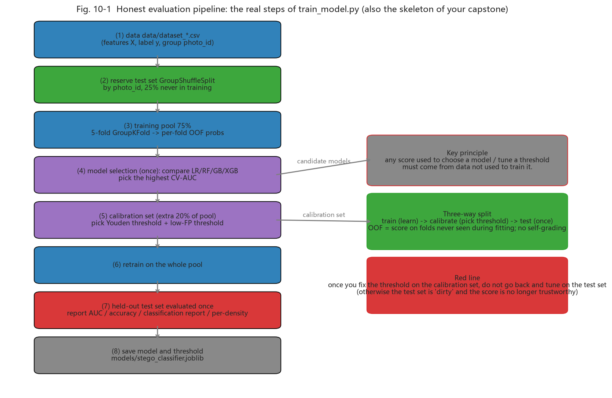

# Chapter 10 - Capstone: From Reading to Building (Weeks 11-12)

<!-- lang-switch -->
> [🌐 中文版](https://yukinoshita-lin.github.io/nsf5-steganography/zh/content/ch10.html)

> **Try it |** Goals: complete one demonstrable improvement experiment in two weeks. Three directions are given below, easy to hard; you may combine them. **But before starting, remember the skeleton of "how to make an experiment count" (Fig. 10-1).**

## 10.0 Experiment Methodology: First Learn "How to Count as Valid"

Whether an experimental conclusion is trustworthy does not depend on how hard you work, but on whether you keep **evaluation honesty**. This is the skeleton Chapters 7-8 stress, and for capstone it decides every conclusion you draw:

*Fig. 10-1 (`train_model.py`'s real steps - also the skeleton for your capstone: data -> reserve test set by photo_id -> 5-fold GroupKFold OOF on the training pool -> pick the model exactly once -> calibration set picks thresholds -> retrain on full -> held-out test evaluated once -> save)*

> **Reading the figure |**
> - **The test set is touched exactly once**: re-tuning the threshold on it dirties it; the score is no longer trustworthy;
> - **Calibration set**: carved from the training pool purely to pick thresholds (Youden / low-FP);
> - **OOF (out-of-fold)**: each sample is scored only by a fold that never saw it; used to pick the model - preventing "proving yourself with your own training".
>
> Whichever direction you choose below, **come back to this figure**: first reproduce the baseline (full Fig. 10-1 flow), then make a small change, and give an honest comparison with `GroupKFold`. Remember the line: **"changed A, result got better" is not enough; prove it truly got better using the train/calibration/test three-layer structure + grouped split.**

## 10.1 Direction A: Reproduce and Critically Verify (most stable)

Pick 1-2 conclusions from the paper/README, rerun them yourself and try to "refute" them:

- Reproduce the code-family figure: does theory α(p) match measurement? Where does deviation come from at large p?

- Reproduce a detection experiment: train on your own photos, compare the v1 11-D baseline (about 0.75-0.79) with the README v1.4 dual models, and observe how photo style affects AUC;

- Reproduce the tampering experiment: change 1 pixel, 1 row, 1 block - what are the decode failure rates?

> **Watch out |** Reproducing is not copying. Its value is **understanding where each number comes from**: is AUC OOF or held-out? Was `photo_id` grouping used? How was the threshold set? These (Chapter 7) decide whether you can "critically verify" rather than "blindly trust the paper".

| **Acceptance** | **Pass criterion** |
| --- | --- |
| Experiment log | record environment, commands, parameters, raw output |
| Figures | at least 2 self-drawn curves/comparisons with labeled axes and legends |
| Conclusion | distinguish "verified the paper" vs "inconsistent with the paper" and give reasons |
| Reproducible | one-click script or step-by-step commands that others can rerun |

## 10.2 Direction B: Feature Extension (most satisfying)

- **Support Chinese/UTF-8 messages**: change `encode_string()`'s ASCII encoding to UTF-8 (note the length header is now bytes not chars);

- **Color channel extension**: currently only the R channel is used; study how to allocate capacity/security across R/G/B;

- **New feature**: add one statistic you think separates clean/stego on top of the 11-D or 143-D set, and evaluate whether AUC truly rises with GroupKFold;

- **Compare a new algorithm**: implement naive LSB replacement and compare Gn collapse and detection rate against nsF5 at equal payload.

> **Watch out |** After every extension, run `test_core.py` and `test_steg.py` to keep the "embed -> decode" roundtrip valid. When you change the encoding, the decoder must change in lockstep - the most common beginner mistake.

> **Tip |** "New feature" extensions are the easiest to feel good about yourself: add a feature, AUC ticked up, done. Please go back to Fig. 10-1 - do the A/B on the **same test-photo groups and 5-fold GroupKFold OOF**, or your "+0.01" might just be random noise (the practical lesson of 7.8 leakage/generalization).

## 10.3 Direction C: Teaching-Demo Repackaging

Turn the GUI's matrix-coding demo into a set of explainable textbook pages/animation scripts, e.g.:

- Step-by-step animation: random block -> show H -> compute s -> give m -> get d -> highlight -> verify;

- Quiz mode: random questions asking you to hand-compute "which bit to flip", auto-graded;

- Compare mode: the same message embedded with LSB, matrix p3, nsF5 p3, showing changed count and Gn side by side.

## 10.4 Paper-to-Code Reading Table

| **Paper section** | **Corresponding code** | **Master before reading** |
| --- | --- | --- |
| Ch. 2 Foundations | ns5_core.py / steganalysis.py | LSB, Hamming, wet paper, chi-square/RS |
| Ch. 3 Requirements | README overview | the stego-detection game view |
| Ch. 4 Design | arch figure + ns5_core.py | layered architecture, hash keying flow |
| Ch. 4.5 Acceleration | cppembed.py / fsfeatures.py | ctypes and consistency self-check |
| Ch. 4.6 GPU | gpu/*.py | tensorization, batching, throughput limits |
| Ch. 5 Experiments | run_e2e / make_dataset / train_model | GroupKFold, AUC, Youden |

*Tip: the paper draft has been updated to thesis/thesis1.pdf (v1.4.0 experiments, incl. SRM/143d/53d and multi-source data); the table above uses the early paper's sections as an example - cross-reference the new paper's table of contents.*

## 10.5 Common Presentation/Defense Questions & Answers

| **Frequent question** | **Answer points** |
| --- | --- |
| Why can LSB hiding be found? | Adjacent gray pairs flattened (chi-square) + LSB structure collapse (RS); intuition first, statistics second |
| Why does matrix coding "change less"? | n=2ᵖ−1 positions carry p bits; distinct H columns -> any syndrome difference maps to one position |
| What is better about nsF5 vs F5? | Wet-paper pre-marks wet points; solve only on dry points; no shrinkage, no re-embed |
| How does wet paper solve it? | GF(2) linear equation H_dry·y=d; try single/double column, then Gaussian fallback |
| Why not a raw CNN? | small samples, weak signal, no generalizable features; features + simple model more stable (AUC evidence) |
| What does AUC 0.756 mean? | ranking okay but weak density hard; AUC vs "detection at a specific threshold" are different things |
| What does hash keying prevent? | predictable/copyable positions; senses ordinary tampering, but is not a keyed MAC |
| Risk of C++/GPU speedup? | yes: must do cross-language consistency checks, else embed/decode becomes irreversible |
| How do you prove "your model is better"? | back to Fig. 10-1: same test photos, 5-fold GroupKFold OOF, train/cal/test separation; single-image probability != dataset AUC |

## 10.6 Delivery Checklist (final week)

- Improved code diff (be able to explain every change);

- Experiment script + raw output (unprocessed, not cherry-picked);

- 2-3 figures (efficiency / ROC / density detection / tampering, any);

- 3-5 page report: problem -> method -> result -> limitation -> next step;

- 5-minute demo: a one-run flow from embedding to analysis;

- Answer any three questions from 10.5 without notes.

> **Think about it |** For your improvement experiment, which "honesty guarantee" of Fig. 10-1 will you use to make "the result is credible"? If someone challenges "did you tune the test set repeatedly to get this?", how do you respond? (Hint: state the "test set used once" red line and show the OOF/calibration results.)
