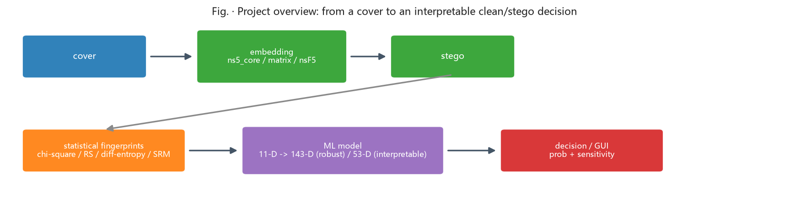

# Chapter 11 - Boundaries, Ethics, and What Comes Next (Read Along the Way)

<!-- lang-switch -->
> [🌐 中文版](https://yukinoshita-lin.github.io/nsf5-steganography/zh/content/ch11.html)

## 11.1 Legal and Ethical Boundaries

Steganography is double-edged: it supports watermarking, media provenance, and covert authentication, but it can also be abused for malicious covert communication. The right posture for learning and research is:

- Experiment only on your own data, public datasets, or authorized material;

- Use the tooling for detection and forensics rather than concealment;

- Report limitations and false-positive risk honestly; never overstate detection power;

- Do not use other people's private photos as practice carriers; de-identify and authorize data.

> **Watch out |** The steganalysis half of this project (chi-square/RS/ML) is the shield: monitoring and forensics need it to find covert channels. Think about your data and purpose before studying attack surfaces.

## 11.2 Known Limitations (Understanding Boundaries Is Understanding the Project)

- Messages support UTF-8 by default (Chinese works out of the box); the real limit is text-only payloads (no files);

- Color images use only the R channel, underutilizing capacity;

- Keying is not a keyed MAC, so a strong attacker who re-embeds can update the header hash;

- The v1 dataset still starts from a limited set of independent photos (414 campus, later expanded with BOSSbase); weak-density and cross-source detection remain hard;

- The v2/143-D model was over-aggressive on out-of-distribution real JPEG clean images; the fix requires JPEG clean samples in training - always run OOD tests before deployment;

- The 90 SRM residual statistics are the single largest gain contributor (52.6%) once the feature scale is consistent, but they are also the least interpretable block - that is the trade-off the 53-D model removes;

- The dual models trade accuracy for interpretability (143-D: 8-split mean AUC 0.8980, weak-band detection 50.0%, OOD false-positive 9.58%; 53-D: 0.8461 / 41.4% / 28.86%, but every dimension is explainable); GUI switching is planned, use the API today;

- Heuristic analysis outputs a "stego tendency probability," not a strict statistical probability;

- Pixel-domain nsF5 is incompatible with lossy formats; JPEG-domain work needs the [yccstego](https://github.com/Yukinoshita-lin/yccstego)-style DCT coefficient design (companion project, separate repository and PyPI package).

## 11.3 A Map of Modern Information Hiding and Steganalysis

| **Direction** | **Representative ideas / methods** | **Distance from an undergrad** |
| --- | --- | --- |
| Content-adaptive embedding | HUGO / WOW / UNIWARD: hide where texture is complex | Requires optimization background |
| Deep-learning steganography | Encoder-decoder models trained end-to-end | Reproducible entry projects exist |
| Deep-learning steganalysis | SRNet / large-scale CNNs | Needs big data and compute |
| JPEG-domain hiding | [yccstego](https://github.com/Yukinoshita-lin/yccstego): nsF5 on quantized DCT coefficients of Y | Companion project (separate repo and PyPI package, bridged into this project's mainline since v1.9.0) |
| Robust/reversible watermarking | Trade invisibility, robustness, capacity | Engineering-heavy; industry-relevant |

If your interest is sparked, the next steps are concrete: read the original wet-paper paper (Fridrich et al.), study the companion project [yccstego](https://github.com/Yukinoshita-lin/yccstego)'s quantized-DCT pipeline, then pick one modern algorithm for a literature review - Appendix E gives entry points.

## 11.4 Related Tools and This Project's Positioning

The field is not short of practical tools - they are scattered and hard to get started with. An honest, non-exhaustive list (links only for long-stable projects; search the rest by name):

| Tool | Language | Focus |
| --- | --- | --- |
| [Aletheia](https://github.com/danielerch/aletheia) | Python | Image steganalysis toolbox: classic statistical attacks + features + ML detection |
| CONSEAL | C++ | Research-oriented steganography/steganalysis library with high-performance feature extraction |
| DDE Lab tools | Java | University-lab research tool collection for steganography/steganalysis |
| [steghide](https://steghide.sourceforge.net/) / outguess | C/C++ | Classic general-purpose stego tools, a different family from nsF5 |

This project does **not** aim to replace them: those toolkits serve researchers running detection and attack experiments. This project focuses on **interactive learning, visualization and reproducible experiments** - a full end-to-end nsF5 implementation from pixels to DCT coefficients with teaching materials (bilingual handbook, per-chapter notebooks, interactive website, GUI algorithm animations), where every experiment can be exported as a record and re-run with `nsf5stego repro`. Use this project to see what the algorithm is doing; use Aletheia / CONSEAL and friends for research-grade detection comparisons.

## 11.5 Closing Words

Twelve weeks ago steganography may have sounded like "hiding words in images." Now you can explain why it depends on carrier redundancy, why direct LSB changes leave statistical fingerprints, how Hamming codes carry the most information per modification, how wet paper coding removes shrinkage, and how machine learning states its confidence honestly. Those ideas connect one project in F:\Steganography to a way of thinking shared by information security, probability, and machine learning.

*Fig: tie together everything you built this term - cover -> embedding -> stego -> statistical fingerprints -> ML model -> decision / GUI. Each step maps to code and experiments in the corresponding handbook chapter.*

> **Try it |** Final exercise: without notes, write 500 words explaining to a classmate why nsF5 is better than naive LSB. Then open the README and compare. If you can write it, you have finished.
