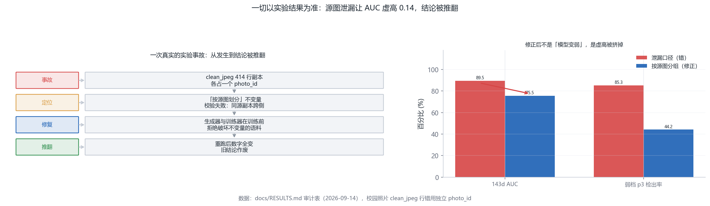
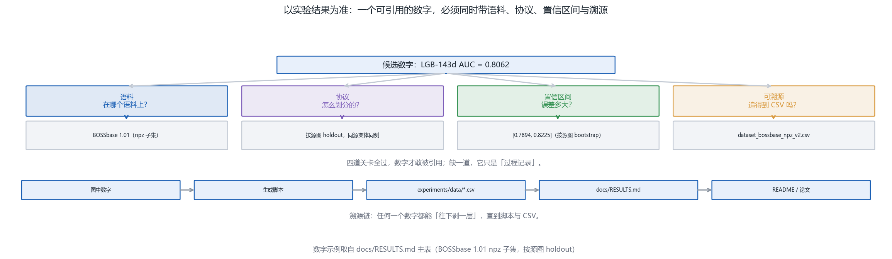
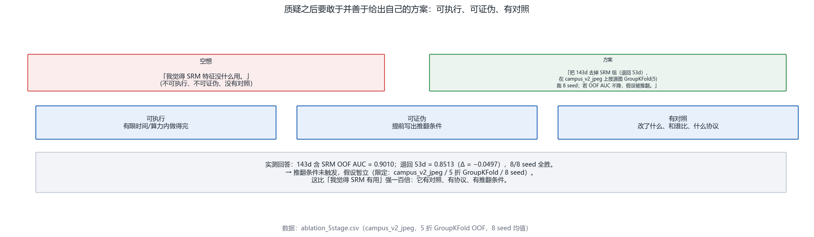
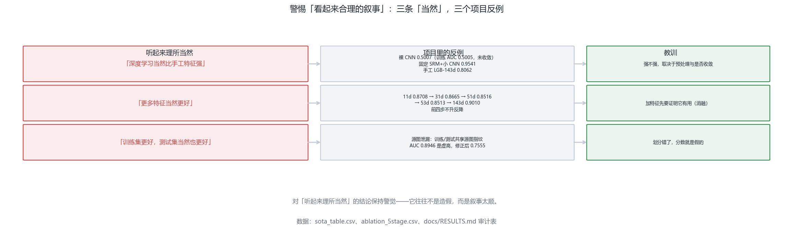
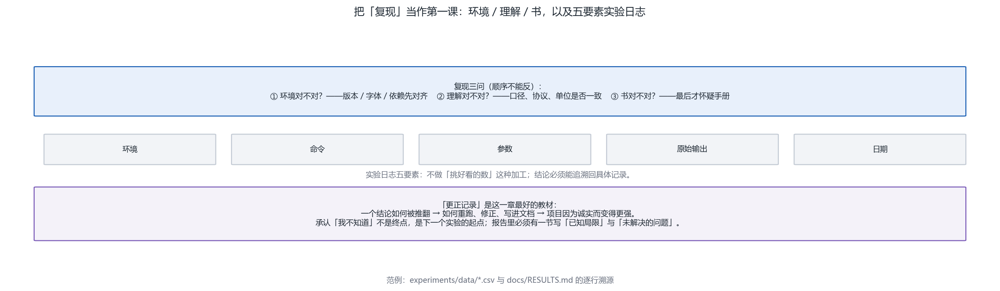

# Chapter 12 - Critical Thinking (A Post-Mortem Guide)

<!-- lang-switch -->
> [🌐 中文版](https://yukinoshita-lin.github.io/nsf5-steganography/zh/content/ch12.html)


> **Tip |** Read the questions first, then the text. **Core question: once the project is done, how do you make sure the experiments and the narrative have not fooled you?**
> 
> By the end of this chapter you can:
> 
> - Retell the full story of the source-image leakage incident (incident -> localization -> fix -> conclusion overturned), and say what "trust the experiments" actually means;
> 
> - Audit a conclusion with the five-question checklist, each item closing the "question -> verify -> conclude" loop;
> 
> - Turn a piece of wishful thinking into a plan that passes: **executable, falsifiable, with a control**;
> 
> - Read "conclusions" and "evidence" separately, knowing that a single counterexample suffices to overturn a conclusion;
> 
> - Write "known limitations" and "open problems" into a report, and recite the five elements of an experiment log.
> 
> *This chapter teaches no new algorithms. What it teaches is how to make what you have already built survive someone else re-running it.*

**Opening question: what makes a conclusion safe to say out loud?** Over the previous eleven chapters you learned "how to hide things" and "how to find them", and in Chapter 10 you built a capstone project with your own hands. But done is not the same as done right - **the person an experiment fools most easily is the one who ran it**. This chapter is a post-mortem guide with eight takeaways, all taught through incidents that actually happened in this project: a source-image leakage that inflated AUC by 0.14, a "deep learning of course is stronger" narrative refuted by a single 0.5007, and an "I feel it helps" rewritten as an ablation with a control and a falsification condition. After this chapter, you should be able to upgrade "I understood it" into "I dare let someone else re-run it".

| **Section** | **Question it answers** | **Your output** |
| --- | --- | --- |
| 12.1 Trust the experiments | How do experiments fool you? | You can retell the full source-image leakage incident |
| 12.2 Question the design | What should you ask when handed a conclusion? | You can use the five-question checklist |
| 12.3 Propose a plan | How do you turn questioning into a plan? | You can write executable / falsifiable / controlled plans |
| 12.4 Conclusions vs. evidence | How do you keep conclusion and evidence apart? | You know one counterexample can overturn a conclusion |
| 12.5 Admit you don't know | Why is "I don't know" a skill? | You can write "known limitations" and "open problems" |
| 12.6 Beware the narrative | Which "of course"s are traps? | You can cite three counterexamples from the project |
| 12.7 Reproduction first | When reproduction fails, whom do you suspect first? | You remember the environment -> understanding -> book order |
| 12.8 Experiment logs | What makes a conclusion traceable? | You can write the five log elements |

## 12.1 The Experimental Results Are the Final Word: How Experiments Fool You

The point of this section is not "experiments matter" but "**how experiments fool you**". Start with a numeric conflict that really happened: the same 143-D model scores **AUC 0.8062** on the BOSSbase corpus but **0.8939** on the self-built campus corpus. The two numbers are far apart, yet this is no contradiction - **the corpora have different properties**. BOSSbase is the domain-standard benchmark and hard; the campus corpus is self-built, contains real JPEG clean images, and is easier than BOSSbase. Put the two corpora's numbers side by side and what you have compared is not "the model got stronger" but "you changed the exam".

A more serious class of deception happens in **the experimental design itself**. One incident really occurred in this project: the `clean_jpeg` rows of the campus corpus wrongly used independent photo_ids - 414 duplicate rows each got their own id, and the "split by source image" discipline was silently broken: the clean and stego versions of the same source image landed on opposite sides of the train/test split. As soon as the model recognized "which source image this is", it could infer the label too. The result: **143d AUC was lifted from 0.7555 to 0.8946**, and weak-band detection inflated from **44.2% to 85.3%**. The model did not get stronger - **the experimental design was wrong**.

| **Stage** | **What happened** | **Key action** |
| --- | --- | --- |
| Incident | 414 duplicate clean_jpeg rows each held a photo_id | Same-source copies straddled the train/test sides |
| Localization | The "split by source image" invariant check failed | Re-split by source image, recompute confidence intervals |
| Fix | Generator and trainer both reject invariant-breaking corpora before training | Turn the invariant into an executable check |
| Overturn | 143d AUC 0.8946 -> 0.7555; weak-band detection 85.3% -> 44.2% | Old conclusion voided; documents rewritten after the re-run |



Figure 12-1 The source-image leakage incident and the overturned conclusion. This figure answers: how one experimental-design error inflated AUC by 0.14 and ultimately overturned the old conclusion. Left: the four stages incident -> localization -> fix -> overturn; right: the old numbers and the corrected ones side by side

> **Try it |** Open StegoLab's `tools/run_ch12.py` and run it. It uses a **synthetic corpus** to demonstrate the leakage mechanism live: the label is decided only by "source-image identity", and the features carry source-image fingerprints. With a random per-image split the AUC is about **0.74**; grouped by source image it falls back to about **0.52** - inflated by about **+0.22**. In your own terminal you will watch "the way you split" conjure 0.2 of score out of thin air. The model did not get stronger; the design was wrong.

So **every conclusion must carry qualifiers**: corpus, protocol, confidence interval, traceability. Numbers without these qualifiers cannot be cited as conclusions. The project turned this discipline into an executable check: the authoritative results table `docs/RESULTS.md` is generated by the script `experiments/build_results_table.py`, and every number must be traceable to "script + CSV"; anything untraceable goes into Section 7 with the reason annotated.



Figure 12-2 The four gates a citable number must pass. This figure answers: which numbers you may dare to cite - corpus, protocol, confidence interval, and traceability, all indispensable. Top: the four gates and the question each one asks; bottom: the provenance chain from a number in a figure all the way down to scripts and CSVs

> **Watch out |** The greatest danger is not "no numbers" but "**beautiful numbers without qualifiers**". The sentence "AUC 0.89" means nothing on its own - it does not say which corpus, which split, how large the error is, or whether it is traceable. If, at the defense, someone presses you with "under which protocol was that 0.89 measured?" and you cannot answer, every bit of work before it loses credit.

## 12.2 Dare to Question the Design, but Ground It in Thinking

Questioning is not nitpicking. Nitpicking stops at "I feel this is wrong"; questioning must come back down to "**I actually verified it, and the result is ...**". The project offers plenty of ready targets for questioning, and the checklist below pairs each one with a real verification action and its measured result - what you see is not opinion but the complete loop of "question -> verify -> conclude".


Figure 12-3 The question checklist and the verification loop. This figure answers: which five questions to ask when handed a conclusion, and the verification action and measured result for each. The five items: data provenance, fairness of the control group, correlation or causation, simpler explanations, and whether the metric answers the question you meant to ask

| **Question** | **Verification action** | **Measured result in the project** |
| --- | --- | --- |
| On what data was this conclusion obtained? Does it still hold on another batch? | Re-run the same model on a different corpus | BOSSbase 0.8062 vs campus 0.8939 - different corpora, the numbers are not comparable |
| Is the control group set up fairly? | Check whether both sides share the same source-image split | The CNN and LGB baselines share the split - that is what makes them comparable |
| Has "correlation" been passed off as "causation"? | Check whether an ablation was run | SRM ablation Δ = +0.0497 - causal evidence, not mere correlation |
| Has a simpler explanation been ignored? | First check whether training converged | Bare CNN training-set AUC 0.5005 (not converged) - not "CNNs are weak" |
| Can this metric answer the question I actually have? | Look at weak-band detection, not just AUC | High AUC ≠ usable at weak densities (weak-band detection drops noticeably) |

> **Think about it |** "The bare CNN scores only 0.5007 on BOSSbase" is often cited as evidence that "deep learning is worse than hand-crafted features". But first ask the simpler question: **did this model's training converge?** One check settles it - its training-set AUC is only 0.5005, indistinguishable from random guessing. When an unconverged model loses the contest, what it shows is "this training run failed", not "this road is a dead end". The gap between "correlation" and "causation" is often just this one question.

## 12.3 After Questioning, Dare to Propose Your Own Plan - and Propose It Well

Those who can only question stay where they stand; those who can do research take one step further - **they propose their own plan**. Here you must tell "wishful thinking" apart from a "plan":

Wishful thinking says: "I feel this algorithm is no good." A plan says: "If we replace X with Y, then on data Z we should see change W, because ...; I designed the following experiment to verify it." The difference lies not in tone but in three hard criteria: **executable, falsifiable, with a control**.

| **What "well" means** | **Concrete requirement** | **Counterexample (fails)** |
| --- | --- | --- |
| Executable | Can be finished within limited time and compute | "Retrain a billion-parameter model" |
| Falsifiable | You can write down in advance "what result would overturn my hypothesis" | "If it doesn't work well, I'll tune it some more" |
| Controlled | State clearly what changed, compared against what, and under which protocol | "I changed something and it feels better" |

The project contains a complete example of walking from "question" to "plan": the starting point is one question - "do the SRM features actually help?" The endpoint is not a feeling but an **ablation experiment**: remove the SRM group from the 143 dimensions (falling back to 53) and run 8 seeds on the campus corpus with source-image GroupKFold(5). The result: **OOF AUC drops from 0.9010 to 0.8513** (Δ = −0.0497), and 8/8 seeds agree. That is a hundred times stronger than "I feel SRM helps": it has a control, a protocol, and a falsification condition.



Figure 12-4 From wishful thinking to a plan. This figure answers: how to rewrite an "I feel" into an executable, falsifiable, controlled plan, with the SRM ablation as the real example. Top: wishful thinking and plan side by side + the three hard criteria; bottom: the ablation's measured answer and its falsification condition

> **Try it |** Write a "plan card" for your own topic, and fill all four fields: **hypothesis** (one sentence), **control** (compared against what, under which protocol), **falsification condition** (what result would make you concede), and **cost** (how long it runs, whether a GPU is needed). If any field stays empty, it is still wishful thinking. Here is how the project filled the SRM ablation card: hypothesis "the SRM group improves OOF AUC"; control "143d vs 53d with SRM removed, the same 5-fold GroupKFold"; falsification condition "if removing SRM does not lower AUC (Δ≤0), the hypothesis is overturned"; cost "8 seeds × 5 folds, minutes-scale".

## 12.4 Distinguish "Conclusions" from "Evidence"

When reading papers and writing reports, the two things most easily conflated are the **conclusion** and the **evidence that supports it**. The conclusion is one sentence: "SRM features help." The evidence is another sentence: "under a fixed protocol, adding SRM raises OOF AUC by +0.0497, and 8/8 seeds agree." A conclusion can rest on many pieces of evidence, and it can also **be overturned by a single counterexample**. This section's task is to teach you to keep the two apart, always.


Figure 12-5 Separating conclusion from evidence. This figure answers: which pieces of evidence hang under one conclusion, and why a single counterexample suffices to overturn it. Top: the conclusion "SRM features help" and its four pieces of evidence; bottom: how a counterexample forces the conclusion to take on qualifiers

For example: if one day BOSSbase shows that "SRM helps same-source but is **harmful cross-source**", then "SRM features help" must gain a qualifier - "helps under the campus corpus's split-by-source protocol". That is not an embarrassment; that is science: **a conclusion's scope of validity is decided by the boundary of its evidence**. So when you read any paper, find the evidence first (what data, which protocol, how many seeds) and only then decide whether to believe the conclusion.

> **Tip |** A practical exercise: whenever you meet a conclusion sentence, list right there beside it "which pieces of evidence it needs at minimum to hold". If you cannot list them, you have not really understood it; if you list them and find the evidence insufficient, the author overclaimed. Every table in Appendix K does exactly this - **conclusions in the main text, evidence in the appendix, a one-to-one match between them**.

## 12.5 Admitting "I Don't Know" Is a Skill

One of the most valuable parts of this project is its **correction record**. It shows that admitting you were wrong, admitting a number cannot be trusted, and admitting some problems remain open is nothing to be ashamed of - it makes the whole project more credible. The source-image leakage incident of Section 12.1 was not "deleted and rewritten" out of the documents; it was kept as-is in the audit records - because **one honestly recorded failure is worth more than ten vague successes**.

"I don't know" is not an endpoint; it is the starting point of the next experiment. For writing, this becomes two hard requirements: an experiment report **must contain a section on "known limitations" and "open problems"**, and in a defense, **admitting limitations earns more trust than pretending perfection**. The three known limitations listed in the project's Chapter 11 (color images use only the R channel, keying is a hash rather than a MAC, pixel-domain work does not survive JPEG) each state "why it was acceptable at the time" and "the right way to upgrade" - that is the standard way to write it.

> **Watch out |** "Known limitations" is not a self-criticism list; it is a **specification of boundaries**. Stating clearly "under which conditions I do not guarantee it works" is precisely an endorsement of "under which conditions I guarantee it works". Conversely, a tool that claims "works everywhere" is the most suspicious of all - either it never tested its boundaries, or it never dared write them down.

## 12.6 Beware "Plausible-Sounding Narratives"

Many wrong conclusions come not from faked data but from **narratives that flow too smoothly**. "Deep learning of course beats hand-crafted features", "more features of course help", "better on the training set, so of course better on the test set" - all three sound self-evident, yet in this project each has a ready-made counterexample. Part of critical thinking is staying alert to whatever "sounds self-evident".



Figure 12-6 Plausible-sounding narratives and their counterexamples. This figure answers: which project counterexample breaks each of the three "self-evident" narratives. Top: the narrative; middle: the project counterexample; right: the lesson - strength depends on preprocessing and convergence, adding features requires proving they help first, and a wrong split makes the score fake

| **Sounds self-evident** | **Counterexample in the project** | **Lesson** |
| --- | --- | --- |
| "Deep learning of course beats hand-crafted features" | Bare CNN 0.5007 (training AUC 0.5005, not converged); fixed SRM + small CNN 0.9541; hand-crafted LGB-143d 0.8062 | Strength depends on preprocessing and convergence |
| "More features of course help" | 11d 0.8708 -> 31d 0.8665 -> 51d 0.8516 -> 53d 0.8513 -> 143d 0.9010 (the first four steps go down, not up) | Adding features requires proving they help first (ablation) |
| "Better on the training set, so of course better on the test set" | Source-image leakage: train/test shared source-image fingerprints; AUC 0.8946 was inflated, 0.7555 after the fix | With a wrong split, the score is fake |

> **Think about it |** The curve in the second row deserves a long look: from 11 dimensions up to 53, AUC does not rise but **falls** (0.8708 -> 0.8513), and jumps to 0.9010 only when the SRM group is added. Had you followed the "more features are better" intuition, you would have walked from bad to worse through the first four steps without noticing. **Intuition proposes hypotheses; experiments adjudicate** - keeping those two jobs apart is the entire point of this chapter.

## 12.7 Make "Reproduction" the First Lesson of Critical Thinking

Reproduction is not just "getting the code to run"; it means **re-verifying with your own data and your own protocol**. The companion StegoLab exists for exactly this: every key number in the handbook has a corresponding reproduction path - figures are registered in `figure_manifest.json` with source and SHA-256, experiments land on disk in `figures/chXX_results.csv`.

If you cannot reproduce a result, troubleshoot in strictly this order: **suspect the environment first, your understanding second, and the book last**. Environment (versions, fonts, dependencies, random seeds) -> understanding (are the criteria, protocol, and units consistent) -> book (is the handbook itself wrong). This order is not politeness; it is probability: the overwhelming majority of "cannot reproduce" cases are exhausted by the first two causes. A person who can honestly say "I cannot reproduce it; the cause might be ..." is far more reliable than one who only says "I understood it".



Figure 12-7 Reproduction and experiment logs. This figure answers: in what order to suspect causes when reproduction fails, and which five elements a sound experiment log records. Top: the three reproduction questions (environment -> understanding -> book); middle: five log elements; bottom: why the correction record is the best teaching material

## 12.8 The Experiment Log Is the Vehicle of Critical Thinking

Critical thinking is not an attitude; it is a **record-keeping habit that can be inspected**. For every experiment, write down five things: **environment, command, parameters, raw output, date**. No processing of the "pick the pretty numbers" kind; conclusions must trace back to the concrete experiment records. The project already does this solidly: the CSVs under `experiments/data/` are the raw disk output, `docs/RESULTS.md` provides line-by-line provenance, and Appendix K matches the numbers cited in the handbook against them one by one - **any sentence can be peeled one layer further, down to scripts and CSVs**.

```text
v = 200
# Skeleton of a sound experiment record (the project's actual practice)
Environment:  python 3.10 / numpy 1.26 / matplotlib 3.8 / font Microsoft YaHei
Command:  python tools/run_ch12.py --out figures/ch12_results.csv
Parameters:  seed=20261005, n_src=120, k=5, d=32, ridge_lam=0.1
Output:  figures/ch12_results.csv (per-row case/detail/value/ok/note)
Date:  2026-10-05
# Conclusions may cite only numbers from "Output", and must carry the four qualifiers corpus/protocol/CI/provenance.
```

> **Read the code |** The runnable experiment for this chapter lives in `F:\StegoLab\chapters\ch12_critical.py` (figures + health-check logic), entry point `tools/run_ch12.py`. It does five things live: (1) a qualifier health check (row by row, does every entry of the authoritative results table carry all four qualifiers); (2) a leakage recomputation (the AUC gap between random splitting and grouping by source image on the synthetic corpus); (3) an ablation recheck (0.9010 vs 0.8513, 8/8 wins); (4) narrative counterexample checks (bare CNN 0.5007 and fixed SRM 0.9541); (5) a falsifiability check. Results land in `figures/ch12_results.csv`, and every number in this chapter can be reconciled against it item by item.

## 12.9 End-of-Chapter Exercise: Give a Conclusion a Health Check

This chapter's exercise is not "compute a number" but "**audit a sentence**". For each of the three conclusions below, write a health-check report of at most 200 words, pointing out which qualifiers it is missing, how it could be misread, and what additional experiment you would run to support or overturn it.

| **Conclusion (to be audited)** | **Hint: what to ask yourself first** |
| --- | --- |
| "Our model reaches AUC 0.89 - great performance." | Corpus? Protocol? Confidence interval? Traceable? - 0.8939 is the campus corpus, source-image holdout result; does it still hold on another corpus? |
| "Adding SRM features improves performance." | What is the control? What protocol? How large is the gain? How many seeds? Is there a falsification condition? |
| "The detector is 95% accurate on the test set - deploy it." | How was the test set split? Any source-image leakage? What is the false-positive rate on real clean photos (OOD)? |

> **Try it |** Rewrite each of the three conclusions above into its "version with qualifiers", then check it against the real numbers in Appendix K. The rewrite is finished when: **whenever any sentence is pressed with "on what data, under what protocol?", you can answer at once and point to which row of which CSV it sits in.** Achieve that, and you have finished Chapter 12.

**Chapter summary.** Critical thinking does not ask you to doubt everything; it asks you to **know the scope of validity of every sentence**. Trust the experiments, because experiments can fool you; dare to question, but come back down to verification; after questioning, propose a plan - executable, falsifiable, with a control; keep conclusions and evidence apart; admit "I don't know"; beware what "sounds self-evident"; make reproduction the first lesson; and pin everything to paper with experiment logs. - Read this chapter after finishing the project, and you will find it is not an extra burden but the foundation that lets the eleven weeks of work before it **truly hold up**.
