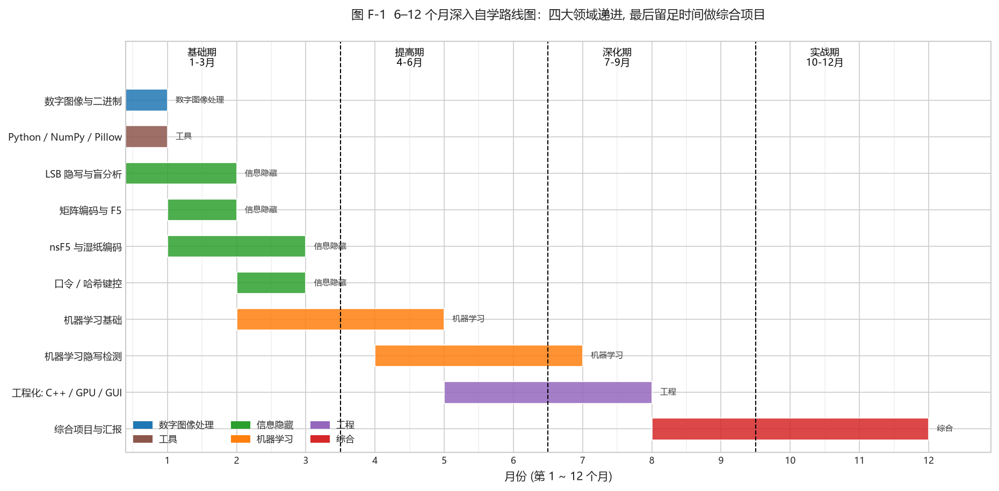

# 附录 F · 6–12 个月深入自学路线图

<!-- lang-switch -->
> [🌐 English version](https://yukinoshita-lin.github.io/nsf5-steganography/en/content/appF.html)

> **动手做｜** 导读 0.3 给的是 **12 周“能入门”** 的压缩路线；这一节给的是 **6–12 个月“能搞懂并做出成果”** 的深入路线。适合想真正吃透数字图像处理、信息隐藏与机器学习三大块、并动手做研究/工程的人。**两条路线用的是同一批内容，只是时长的分配不同。**

*图 F-1（6–12 个月甘特图：横轴=月份，纵轴=主题，颜色=领域；虚线把全程分成 基础期(1–3) / 提高期(4–6) / 深化期(7–9) / 实战期(10–12) 四段）*

## F.1 四段式：每一段的目标与产出

| 阶段 | 月份 | 目标 | 主攻内容 | 结束时你能做什么 |
| --- | --- | --- | --- | --- |
| 基础期 | 1–3 | 把三大领域的“地基”打实 | ch01 数字图像与二进制、ch02 Python 工具链、ch03 LSB 隐写与盲分析、ch04 矩阵编码与 F5、ch05 nsF5 湿纸、ch06 哈希键控 | 能独立“藏一句话→用卡方/RS 抓到它”；手算一个 p=3 汉明嵌入；讲清湿纸解码 |
| 提高期 | 4–6 | 进入机器学习，建立“特征→模型→评估”框架 | ch07 机器学习基础、ch08 机器学习隐写检测（11 维→143 维→双版本） | 能讲清过拟合/数据泄漏/GroupKFold/AUC；看懂并复现 v1 11 维训练管线 |
| 深化期 | 7–9 | 吃透工程与“为什么这么设计” | ch08.8 SRM 与 143d/53d 策略、ch09 工程化（C++ / GPU / GUI / 多源数据） | 读懂 SRM 滤波与 143 维特征；理解同源/跨源收益差异；跑通 GPU 批量特征与自校验 |
| 实战期 | 10–12 | 做一件“自己的”完整工作 | ch10 综合项目、ch11 汇报；并选择一条研究或工程主线深入 | 完成一个可复现的改进实验并给出**诚实**结果分析；能脱稿答辩 |

> **新手提示｜** “基础期”几乎与 12 周路线一样，只是每周多花时间把每个**为什么**想透（尤其第 3 章的统计检测与第 5 章的湿纸）。真正的差距在“深化期”与“实战期”。

## F.2 四条主线：贯穿“广、全、实”

想做出成果，别平均用力。选一条主线深挖，其余保持“看得懂”即可：

| 主线 | 聚焦 | 深度学习参考 |
| --- | --- | --- |
| 算法主线 | nsF5/F5、矩阵嵌入、湿纸、伴随式 | ch04–05、项目 `ns5_core.py`；往外可延伸 JPEG 域与 DCT 系数隐写 |
| 检测 / ML 主线 | 特征工程、SRM、143d/53d、OOD | ch08、`featurize_v2.py`、`train_model.py`；往外可延伸现代高维特征与深度学习隐写分析 |
| 工程主线 | C++ DLL、GPU 批量、GUI、多源数据集、CI | ch09、`cppembed.py`、`gpu/*`、`.github/workflows`；往外可延伸部署与鲁棒性 |
| 研究主线 | 复现论文→找 gap→做改进→诚实评估 | 论文（appE）与 `thesis/`；强调“切分/校准/测试”严谨性（ch07） |

## F.3 可选的“往外走”课题（按主线挑 1–2 个）

- **JPEG 域隐写**：把 ch04–05 的思路搬到量化 DCT 系数（项目 `yccstego` 扩展即此方向），体会“空间域 vs 变换域”的差异；
- **深度学习隐写分析**：在小样本约束下，如何用可解释特征先验证信号，再谨慎引入深度模型（ch08.1 的教训）；
- **域适应 / 跨源鲁棒性**：SRM 同源有收益、跨源反而亏（ch08.8.1），可研究如何用域适应让特征跨相机/压缩源更稳；
- **对抗鲁棒性与误报控制**：研究“宽松 vs 严格”阈值与 Youden/低误报点的取舍（ch07），以及不可检测嵌入的物理上限；
- **可解释性**：143d 稳健 vs 53d 可解释（ch08.8.4），可研究哪些特征真正贡献了增益、如何做逐维解释。

> **回到项目看代码｜** 把上述任一课题落到代码上：先跑通基线，再做小改动，用 `GroupKFold` 给出诚实对照。**“改了 A、结果变好”不足以服人，要用训练/校准/测试三层结构 + 分组切分证明它真的变好。**（ch07、ch08 反复强调这一点。）

## F.4 与导读 0.3（12 周路线）的关系

- **想快速入门**：按 0.3，12 周跑一遍，做到附录 C 的打卡表；
- **想深入并出成果**：按本节，6–12 个月，把 0.3 的每周任务**放慢、加深、关联**，并在“深化期/实战期”加入 0.5 项目地图里那些只在研究时才真正需要的部分（SRM、多源、GPU、双版本、OOD 验证）。
- 两者的**共同底线**：不要略过“动手实验”，也不要略过“诚实评估”。这本手册最想教你的不是某个算法，而是**“怎么判断一个实验结论靠不靠谱”**。

> **想一想｜** 你打算选哪条主线？打算用多长的周期？（12 周 vs 6–12 月，意味着你把时间花在“宽度”还是“深度”上。）把它写下来，作为你学习这本书的“个人目标”。
