# 第 1 章 · 数字图像与二进制（第 1 周）

<!-- lang-switch -->
> [🌐 English version](https://yukinoshita-lin.github.io/nsf5-steganography/en/content/ch01.html)


> **本章导航** ·　先看问题，再读正文
> 
> **核心问题　一张 256×256 的图片，在计算机的硬盘上到底是什么？**
> 
> **读完你能回答**
> 
> - 口述灰度图与彩色图在内存里的数据布局（行优先存储、通道顺序）；
> 
> - 做十进制 ↔ 二进制换算，并说清四种位运算（v&1 / v|1 / v&0xFE / v^1）各自在隐写里的用途；
> 
> - 区分**视觉冗余**与**统计冗余**，解释“凭什么能藏东西而不被发现”；
> 
> - 预测 LSB 位平面的外观，并准确使用 cover / stego 两个项目术语。
> 
> *本章没有一行隐写代码——这是刻意的：先把“图像是数字”变成可以动手操作的确定知识。*

**开场问题：一张 256×256 的图片，在计算机的硬盘上到底是什么？**是一张“图”吗？如果你回答“是一堆数字”，恭喜你已经站在这一章的终点；如果你不确定“一堆数字”和“你看到的画面”之间隔着几层约定，这一章就是为你写的。CSAPP 讲计算机系统时的核心手法是“剥洋葱”：任何让你觉得神奇的东西，往下剥一层，通常是一个朴素的约定。数字图像就是这样一个约定：所谓“图片”，不过是一张写满整数的表格，外加一句“请按亮度解释这些数”的说明书。

本章没有一行隐写代码——这是刻意的。隐写的一切技巧都建立在“图像是数字”这个事实上，这个事实在大多数人脑中是模糊的直觉，而我们要把它变成可以动手操作的确定知识。读完本章，你应当能不看任何资料，回答出下面这张地图里的问题：

| **小节** | **回答的问题** | **你的产出** |
| --- | --- | --- |
| 1.1 图像即矩阵 | 一张图在内存里长什么样？ | 能口述灰度图/彩色图的数据布局 |
| 1.2 二进制与位 | LSB 到底是哪个位？ | 会做十进制↔二进制换算与位运算 |
| 1.3 冗余 | 凭什么能藏东西不被发现？ | 能区分视觉冗余与统计冗余 |
| 1.4 位平面 | 一张图拆成 8 层各是什么样？ | 能预测 LSB 平面的外观 |
| 1.5 项目术语 | cover / stego 是什么？ | 能跑通第一个端到端脚本 |

**本章配了一件“零代码的实物”。** CSAPP 的第一条纪律是“先摸实物、再讲原理”，本章的实物就是“图像 = 数字矩阵”这件事本身。但原文给出的摸法都要写 Python——那是第 2 章才教的本事。为了让零基础的你在写下第一行代码之前就能亲手验证，本章配套了一个独立小工具 **ImageMatrix**（同作者的姊妹项目，与手册代码库 F:\Steganography 没有任何依赖关系，本身也不含隐写功能）：它能把任意图片直接导出成 R/G/B/灰度 的数字矩阵文本，也能把改过的文本导回成图片。本章每一节末尾的“动手做”都会用到它，完整说明见**附录 L**。

> **动手做｜
本章目标：把“图像 = 数字矩阵”的直觉焊死；会手算二进制与字节；能说出为什么人眼和统计都能容忍一点“像素级扰动”。**

## 1.1 一张数字图像，其实就是一堆数字

把“表格”这个说法再精确一点：一张 W×H 的 8bit 灰度图，在内存里就是 W×H 个**连续排列的字节**，按行优先存储——先存完第 0 行的所有像素，再存第 1 行。所以“第 r 行第 c 列的像素”在一维编号里是 r×W + c。这个一维视角在隐写里极其重要：**第 5 章的湿纸编码和第 6 章的置乱，都会把二维图像当作一维长条来编号**。现在先记住：二维的“图”和一维的“比特串”是同一份数据的两种看法，切换只在一念之间。

> **避坑提醒｜** 彩色图的通道顺序是初学者第一大坑。Pillow 读出的数组是 (H, W, 3)，通道顺序是 R、G、B；但如果你日后用 OpenCV（cv2），它读出的顺序是 **B、G、R**——同样一张橙色图，一个库里是 (255,128,0)，另一个库里是 (0,128,255)。用错库的顺序做隐写分析，直方图特征会整体错位，结论全错且很难察觉。本项目统一用 Pillow，暂时不必担心；写下这一条是因为你迟早会遇到 cv2。

还有一个值得养成的习惯：看到“图像”两个字，脑中同时浮现两张表——**亮度的表**（你看到的画面）和**数字的表**（计算机存的东西）。本章剩下的全部工作，就是在两张表之间来回切换，并确认它们说的确实是同一件事。

把一张8bit 灰度图放大到像素级，你会看到它是一张由 0～255 整数组成的二维表格。0 代表全黑，255 代表全白，中间是不同深浅的灰。计算机只保存这张表格的“尺寸”和“数字”，不保存你肉眼看到的画面。

彩色图则是三张这样的表格叠在一起：R（红）、G（绿）、B（蓝）三个通道。常见的 RGB 图每个像素有 3 个 0～255 的值。比如一个橙色像素可以写成 R=255、G=128、B=0。

在代码里，灰度图就是一个二维数组，彩色图就是一个三维数组。项目的 src/image_io.py 把这件事封装成了两个函数：load_as_gray() 负责把任意 支持的图片读成灰度数组，save_image() 负责把数组保存成 PNG。

> **新手提示｜
数学里我们用“行、列”描述矩阵，图像处理里则常说“高、宽”：一张 512×512 图就是 512 行、512 列。数组形状 (512, 512) 的写法 正是“行数在前”。**

> **动手做｜** 第一次“摸到”图像矩阵（零代码，约 5 分钟）
> 
> ① 安装并打开 ImageMatrix（安装包见附录 L；也可直接运行 build\imagematrix.exe）；
> 
> ② 点“生成测试图案”，得到一张自带彩条 / 灰阶 / 渐变的测试图，不必自己找素材；
> 
> ③ 把“矩阵格式”选成 GRAY，点“查看矩阵文本”——你现在看到的，就是本节说的那张“整数表格”；
> 
> ④ 点“导出为 TXT…”，把这张图变成一份纯文本，用记事本打开它。
> 
> 做完再回头看本节第一段：所谓“图片”，真的只是这些数字，外加一句“请按亮度解释”。

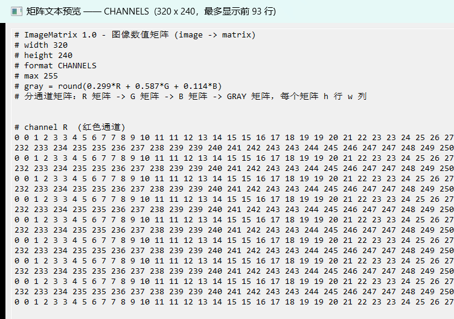

图 1-1 ImageMatrix 的“矩阵文本预览”。文件头用 # 注释声明 width / height / format / max 与灰度公式，下面就是逐行的数值矩阵——这正是本节所说的“图像即数字表格”。（截图来自 ImageMatrix 仓库）

| **矩阵格式** | **导出内容** | **对应本手册的哪个概念** |
| --- | --- | --- |
| GRAY | 一张 W×H 的灰度矩阵 | 1.1 灰度图 = 二维整数表 |
| CHANNELS | R、G、B、灰度 四张矩阵 | 1.1 彩色图 = 三张表叠起来 |
| RGB / RGBA | 每个像素一行 R,G,B(,A) | 1.1 的“橙色像素 = 255,128,0” |
| HEX | 每个像素一行 RRGGBB | 1.2 的十六进制记法 |

这张表请留着：第 2 章你用 NumPy 读出的数组、第 3 章你逐位改动的像素，形状与这里看到的完全一致。ImageMatrix 只是把“代码里的数组”提前变成了“屏幕上看得见的数字”。

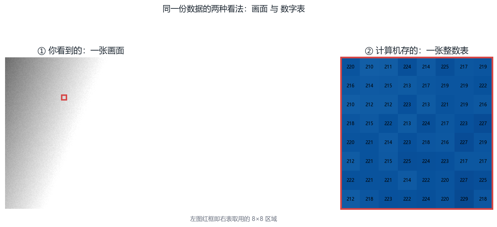

图 1-2 画面与数字表的对应。这张图回答的是：一张图在计算机里到底是画面，还是一张数字表？左侧画面中被框出的 8×8 区域，右侧即其数值表——这就是“图像即数字”最直白的证据

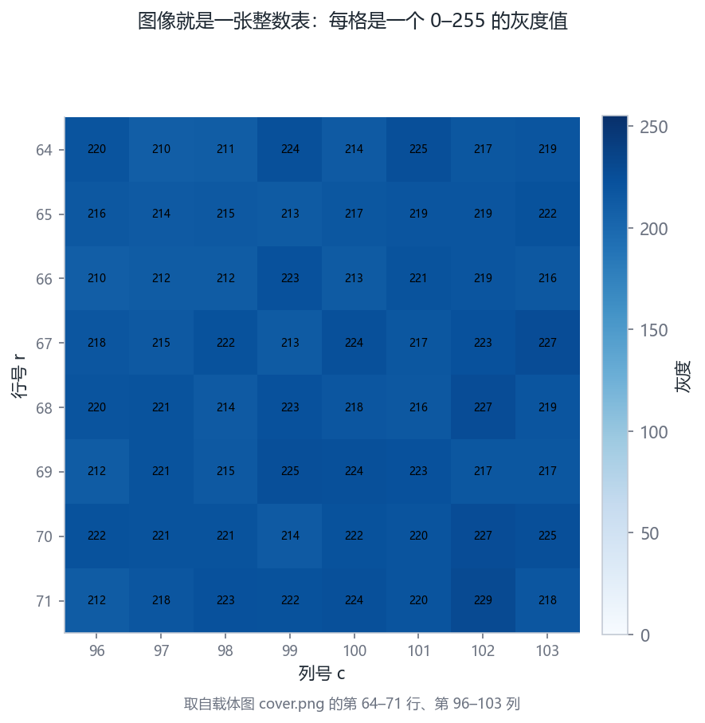

图 1-3 图像即整数表（8×8 像素块）。这张图回答的是：一个像素块在内存里究竟长什么样？8×8 像素块的热力图，格中数字即该像素的灰度值

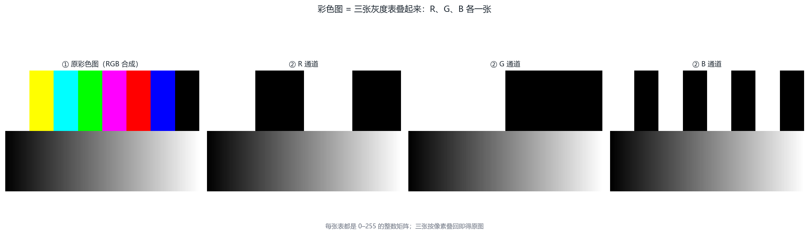

图 1-4 RGB 三通道分解。这张图回答的是：彩色图为什么等于三张灰度表叠起来？一张彩色图拆成 R / G / B 三张灰度矩阵，彩色图 = 三张表叠起来

## 1.2 二进制、字节与位

十进制与二进制只是同一数量的两种记法，但位运算给“按位操作”提供了四种瑞士军刀，隐写代码里天天见面，值得在这里一次配齐。设 v 是一个像素值：

| **运算** | **写法** | **作用** | **隐写里的用途** |
| --- | --- | --- | --- |
| 取最低位 | v & 1 | 得到 LSB（0 或 1） | 提取：读出藏在像素里的比特 |
| 置最低位 | v \| 1 | 把 LSB 强行变成 1 | 嵌入比特 1 |
| 清最低位 | v & 0xFE | 把 LSB 强行变成 0 | 嵌入比特 0 的第一步 |
| 翻转最低位 | v ^ 1 | LSB 在 0/1 之间翻转 | F5/nsF5 的“改一位”——原来是什么不重要，翻一下就行 |

注意最后一行的妙处：翻转（XOR 1）不关心原值是 0 还是 1，翻一下必然变成另一个值，而且**数值只变化 ±1**。这就是为什么第 4 章之后所有“改一个系数”的操作，底层都是异或——它把“改成想要的值”这个问题，简化成了“要不要翻”。

> **想一想｜** 200 的二进制是 11001000。不写代码，口算回答：它的最高有效位（MSB）是几？把它从 200 改成 201，二进制里变的是哪一位？把 200 改成 72（=01001000），变的是哪一位？两种改法对画面亮度的影响，差别有多大？——想清楚这三问，你就明白为什么隐写偏爱与 LSB 而不是 MSB 打交道。

计算机底层只认识 0 和 1。一个 0 或 1 叫 1 bit（位），8 个 bit 组成 1 byte（字节）。8 个 bit 一共能表示 2⁸=256 种组合，正好对应灰度值 0～255。

例如十进制 200 = 128+64+8，写成 8 位二进制是 11001000；它的最低有效位（LSB）就是最右边的那个 0。把 200 的 LSB 改成 1，得到 201——在人眼里，灰度 200 和 201 几乎无法区分。

“最低有效位”是整本手册最重要的概念之一：LSB 隐写，就是偷偷修改像素的 LSB，把秘密比特藏进去。

> **动手做｜
打开一个 Python 交互环境（或写个小脚本），验证下面这段：**

体验：十进制、二进制与 LSB

```python
v = 200
print(bin(v))            # 0b11001000
print(v & 1)             # 最低位 = 0
print(v ^ 1)             # 翻转最低位 = 201
print(v & 0b11111110)    # 把最低位清零 = 200
print(v & 0b11111110 | 1)# 先清零再置1 = 201
```

把 1.2 节的“200 = 11001000”写成数学上的**按权展开式**——每一位的权重是 2 的幂，从右往左依次是 2⁰, 2¹, …, 2⁷：

最右一项的权重是 2⁰ = 1——所谓**最低有效位（LSB）**，字面意思就是“2 的零次方那一位”。翻转它对数值的贡献恰好 ±1，这为第 3 章的一切埋下伏笔。

> **动手做｜** 零代码翻转一个 LSB——隐写的最小动作
> 
> ① 用 ImageMatrix 打开一张图，格式选 GRAY，导出为 TXT；
> 
> ② 用记事本在矩阵里找任意一个偶数值（比如 200），把它改成 201——这就是把它的 LSB 由 0 翻成 1；
> 
> ③ 回到 ImageMatrix，点“导入 TXT…”，选刚才改过的文件；
> 
> ④ 点“另存为图片…”存成 PNG，再与原图并排比较。
> 
> 你几乎不可能看出差别——可这一次改动，已经往图里写进了 1 bit。把同样的动作做 240 次（第 3 章教你用代码批量完成），就是一次完整的 LSB 隐写。

想看得更“二进制”一点，把格式换成 HEX 再导出一遍：同一个像素会写成 `C8` 这样的十六进制，而 `C8` 就是本节 200 的二进制 `11001000` 的另一种写法。ImageMatrix 底部的状态栏还会在鼠标划过像素时实时显示它的 R/G/B/灰度 与 `#RRGGBB`，你可以逐点核对“数值 ↔ 二进制 ↔ 颜色”是否对得上。

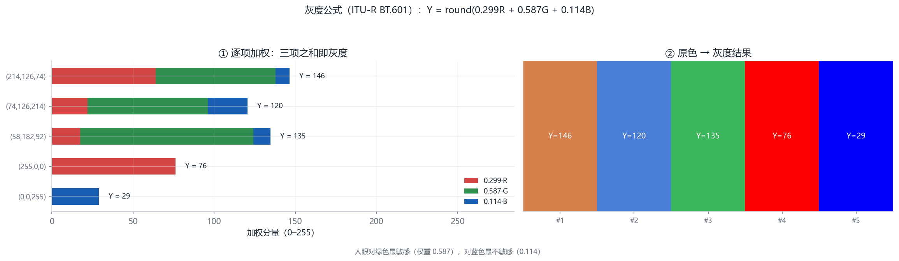

图 1-5 灰度公式逐项对照。这张图回答的是：灰度值 Y 到底是怎么从 R / G / B 算出来的？每个颜色的 R / G / B 加权分量与所得灰度，验证 Y = round(0.299R + 0.587G + 0.114B)

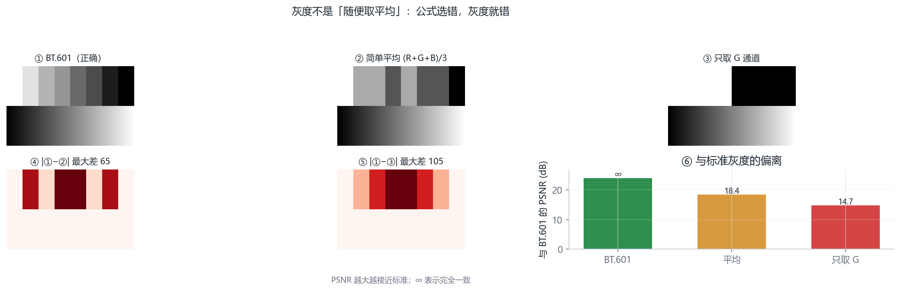

图 1-6 三种灰度公式对照。这张图回答的是：换一种灰度公式，结果会差在哪里？标准公式与两种常见错误做法的灰度结果及偏离程度——错在哪里一眼可见

## 1.3 为什么图像里“有空地”可以藏东西

“视觉冗余”可以再量化一点：人眼对亮度差的分辨能力（术语叫 JND，Just Noticeable Difference）在中等亮度区域大约是 1%～2% 的相对变化。8bit 灰度里相邻两级（比如 128 与 129）的相对差只有 0.78%，远低于 JND——这就是“改 LSB 肉眼看不见”的生理学根据。注意它的边界：在接近纯黑或纯白的区域，人眼的分辨能力反而更强，同样的 ±1 更容易被察觉——所以专业隐写会把“改哪里”与“像素亮度”挂钩，第 8 章的嵌入率（payload）分档就是这件事的工程化。

“统计冗余”则有一组可以亲手验证的数字：拿任何一张自然照片计算相邻像素的相关系数，水平方向通常在 0.90～0.97 之间。这意味着相邻像素的值高度“可预测”——一张图第 r 行第 c 列的值，用它左边的邻居就能猜个八九不离十。**可预测，就是统计检测的弹药**：第 3 章的 RS 分析，本质就是度量“把像素按规则重排后，可预测性塌了多少”。

> **新手提示｜** “自然图像”这个词会反复出现。它的意思是：用真实相机拍出来的、未经人工合成的照片。天空渐变、皮肤纹理、草地噪声，这些真实世界的复杂性让像素的统计分布呈现出稳定规律；而计算机生成的纯色图、截图、二值图不在这个规律里。本项目数据集一栏反复强调“真实照片”，原因就在这里——第 8 章你会看到，在“非自然”图像上训练的检测器，换到真实照片上会水土不服。

图像里藏着大量冗余，这要从两个层面理解：

视觉冗余：人眼对微小亮度差、高频细节不敏感。把某个像素从 128 改成 129，几乎没人看得出来；

统计冗余：自然图像相邻像素高度相关，大部分信息集中在低频。JPEG 等压缩格式就是靠去掉这些冗余才把文件变小；

LSB 平面近似随机：自然照片的最低几位看起来“像噪声”，这恰好提供了天然的“掩护环境”。

于是出现了两类使用冗余的方式：压缩想把冗余去掉让文件变小，隐写想在冗余里塞秘密而尽量不破坏视觉与统计特征。二者争夺的是同一片“可修改空间”，这也是为什么很多隐写算法要针对特定压缩格式设计。

> **避坑提醒｜
不要以为“看不见 = 安全”。肉眼看不见只是最弱的要求；真正专业的检测者用统计工具，LSB 直接替换会留下非常明显的统计痕迹，这正是第 3 章卡方检验与 RS 分析能抓住它的原因。**

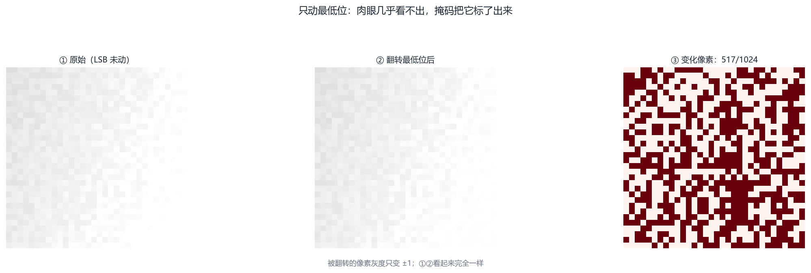

图 1-7 最低位翻转前后对比。这张图回答的是：改一个像素的最低位，肉眼看得出来吗？翻转最低位前后的图像与变化掩码：改动真实发生，肉眼却完全无差别

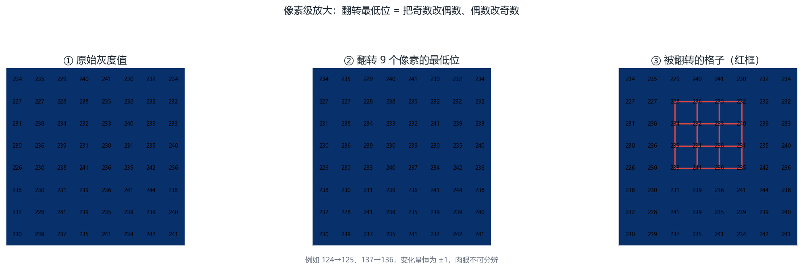

图 1-8 最低位翻转的像素级放大。这张图回答的是：藏进去的 1 bit，在数值上究竟改了什么？8×8 灰度值在翻转最低位前后的逐格对照——一格之差，就是那 1 bit

## 1.4 位平面：把一张图拆成 8 层

8 个位平面从 MSB 到 LSB，携带的“画面信息”逐层递减，这点可以用一个数字感受：把一张图的 MSB 平面单独拿出来看，你能认出照片的内容；看第 5 位平面，像蒙了一层细沙；看 LSB 平面，与电视雪花无异。信息量递减的另一面是**随机度递增**：自然图像的 LSB 平面相邻像素几乎不相关，与抛硬币无异。

这给了 LSB 隐写一层“天然的掩护”，也埋下它的“致命的破绽”。掩护是：往一片本来就随机的区域里再混入秘密比特，视觉上无从分辨；破绽是：**嵌入使得“值对”的分布变得均匀**——自然图像里 128 和 129 这对相邻值的出现次数原本并不相等（奇偶不平衡），均匀嵌入后它们被迫趋近相等。第 3 章的卡方检验，抓的正是这个趋近。

> **想一想｜** 如果把一张图的 LSB 平面**整体**替换成伪随机比特（而不是只塞一点消息），直方图会怎么变？提示：每个像素的值都在“相邻两级”之间被随机重排。想不清就先记下这个问题，第 3 章的卡方一节会给出答案。

把灰度值写成 8 位二进制后，可以按“第几位”把图像拆成 8 张二值图，称为 位平面。最高位（MSB）平面决定画面大轮廓；最低位（LSB）平面几乎全是 细碎的噪声点。

这带来一个直觉：LSB 平面原本就接近随机，往里面再塞一点伪随机秘密比特，肉眼和简单直方图都很难察觉。 但也正是这种“随机化”，改变了图像内在的 结构，可以被更聪明的统计方法测出来。

数一数像素与 LSB 的取值（项目里到处是这样的 numpy 操作）

```python
import numpy as np
img = np.asarray([[200, 201], [128, 129]], dtype=np.uint8)
print(img.shape, img.dtype)   # (2, 2) uint8
print(img & 1)                # LSB 位平面 [[0,1],[0,1]]
print(np.unpackbits(np.array([200], dtype=np.uint8)))
# [1 1 0 0 1 0 0 0]  ← 最高位在前
```

位平面在 ImageMatrix 里没有现成的按钮，但原料唾手可得：把一张真实照片按 GRAY 导出 TXT，随便挑一列像素，把它们各自写成 8 位二进制（1.2 节的方法），再只看每一位那一列——最高位那一列几乎全是相同的 1 或 0（大轮廓），最低位那一列却像随机抛硬币。这正是本节 numpy 片段在做的事，只不过这次你先用眼睛看了一遍。

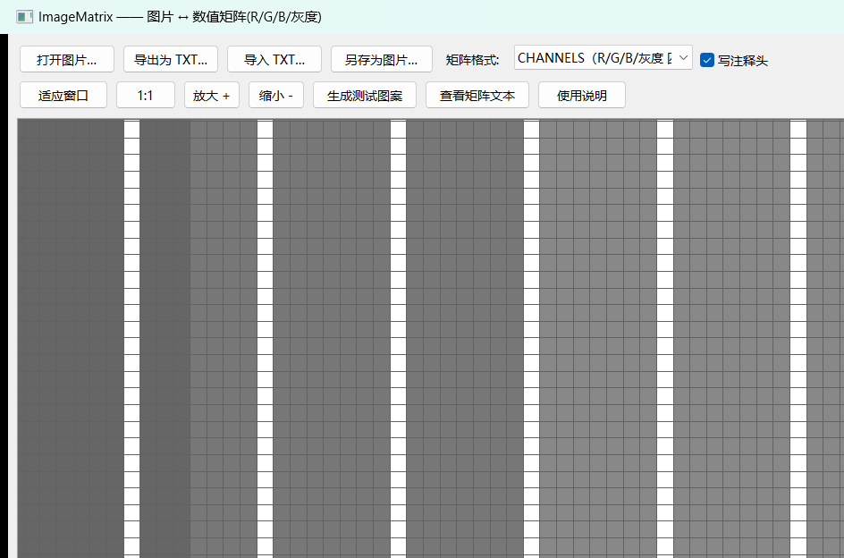

图 1-9 在 ImageMatrix 里把图片放大到 8 倍以上，会显示像素网格——你看到的每一个小格，就是矩阵里的一个数。所谓“位平面”，就是把这些数各自摊成 8 个二进制位后，按位重新叠出来的 8 张图。（截图来自 ImageMatrix 仓库）

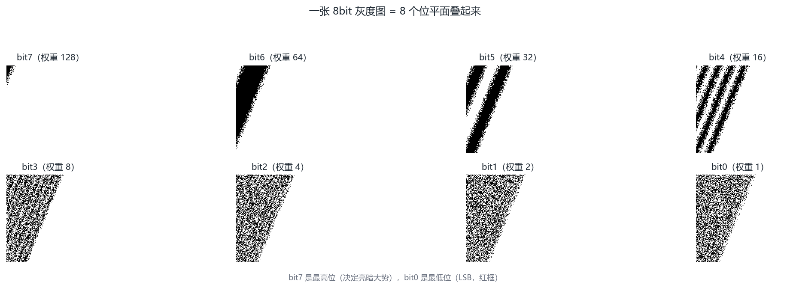

图 1-10 8 个位平面分解。这张图回答的是：把一张图拆成 8 层位平面，最低那一层为什么像噪声？载体图的 bit7…bit0 八个位平面；最低位平面已接近随机——这正是可藏之处

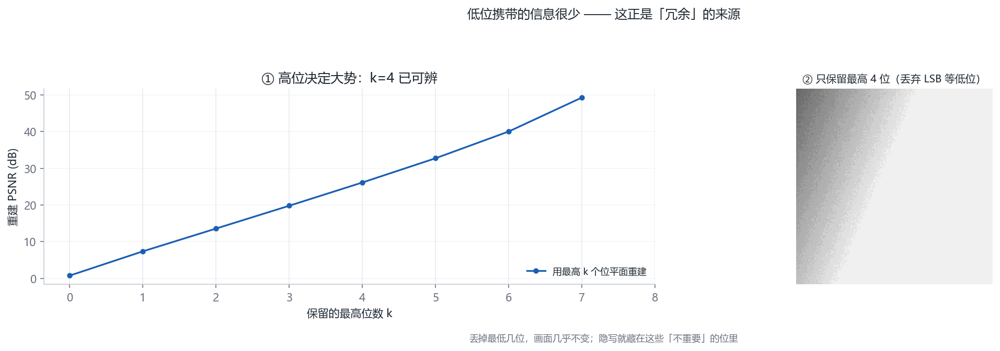

图 1-11 位平面权重与重建。这张图回答的是：丢掉低位平面，图像会损失什么？保留最高 k 位重建原图的质量曲线与示例：高位管轮廓、低位管细节

## 1.5 回到项目：先认识 cover 与 stego

| **术语** | **英文** | **一句话解释** | **在项目里** |
| --- | --- | --- | --- |
| 载体 | cover | 没有秘密的原始图像 | img/cover.png（256×256 演示图） |
| 含密图 | stego | 藏入秘密后的图像 | output/cover_stego.png / .jpg |
| 嵌入 | embed | 把比特写进载体的过程 | nsf5stego embed / GUI「嵌入并保存」 |
| 提取 | extract | 从含密图还原比特的过程 | nsf5stego extract / GUI「解码提取」 |
| 隐写分析 | steganalysis | 判断一张图里有没有秘密 | nsf5stego analyze / GUI「分析」 |

这张术语卡片值得背下来——它同时是本手册的“变量命名表”。读代码时遇到 cover_img、stego、embed、extract，直接对号入座，不再当生词查。

隐写领域里有两个固定称呼：没有秘密的原始载体叫 cover（载体），藏入秘密后的图像叫 stego（含密图）。项目里这两个词随处可见： img/cover.png 是演示用载体，output/stego_*.png 是嵌入后的含密图。

> **回到项目看代码｜
打开 src/run_e2e.py 第 1 步：它用 numpy 生成一张 256×256 的平滑“封面图”并保存到 img/cover.png。仔细看生成方式—— np.linspace 制造渐变背景，再加一点小噪声。理解这段代码，你就理解了一张自然感图像是如何从数字“长”出来的。**

> **动手做｜** 用记事本造出你的第一对 cover / stego
> 
> ① 把一张图按 GRAY 格式导出 TXT——这份图就是 cover（载体）；
> 
> ② 在 TXT 里，按事先约定的位置（例如“从第 1 个数起，每隔 3 个取一个”），把选中的数改成你想要的奇偶（要藏 1 就改成奇数、要藏 0 就改成偶数）；
> 
> ③ 导入改过的 TXT，另存为 PNG——这份图就是 stego（含密图）；
> 
> ④ 把 cover 与 stego 并排：肉眼分不出谁是谁。
> 
> 你刚刚用记事本走完了第 3 章才正式讲的 LSB 隐写的全部动作；项目所做的，只是用代码、口令与矩阵编码把它做得更快、更隐蔽、且能被正确提取。

**关于这个工具的边界（重要）。** ImageMatrix 是独立的姊妹项目，与本手册学习的 F:\Steganography 代码库没有任何依赖或调用关系；它只负责“把图看成数字、再把数字看回图”，本身不含任何隐写功能。把 cover 改成 stego 的那一步，是**你**在记事本里完成的——这正是本节想让你体会的：隐写的门槛不在工具，而在“知道该动哪一位”。

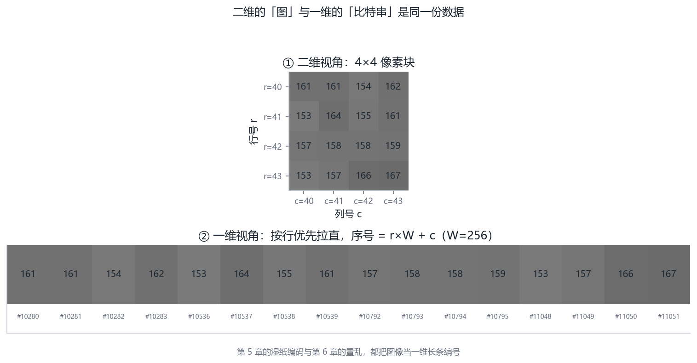

图 1-12 行优先编号：二维 → 一维。这张图回答的是：项目里说的“第 N 个载体”，是按什么顺序数的？4×4 像素块及其按行优先拉直后的一维编号——项目里“第 N 个载体”就是按这个顺序数的

## 1.6 小结与自我检查

灰度图 = 0～255 整数矩阵；彩色图 = 三个通道矩阵；

LSB 是像素值二进制的最低位，翻转它对视觉影响极小；

压缩消除冗余，隐写利用冗余，二者针锋相对；

cover = 原始载体，stego = 含密图。

> **想一想｜
一张纯黑色（全 0）的图适不适合做 LSB 隐写的载体？一张纯随机噪声图呢？把想法写下来，学完第 3 章再回来对照。**

**本章小结。**三句话概括：图像是数字的表格（二维的看法），也是连续的字节串（一维的看法）；LSB 是数值变化最小、随机度最高的一位，是隐写的主战场；冗余是隐写的生存空间，视觉冗余（JND）保护你逃过人眼，统计冗余（相关性）是检测者的武器库。

> **动手做｜** 章末练习（提示与答案见附录 J）
> 
> P1.1（手算）把 156 写成 8 位二进制；它的 LSB 是几？分别用“清零后置位”和“异或 1”两种方法把它的 LSB 变成相反值，写出新的十进制数。
> 
> P1.2（手算）像素行 [132, 133, 130, 129, 134, 131, 128, 135] 依次嵌入比特 1,0,1,1,0,0,1,1。写出嵌入后的 8 个像素值与每个像素的变化量。完成后与 3.2 节开头的表对照。
> 
> P1.3（思考）一张纯黑图（全 0）做 LSB 隐写，为什么“视觉上”依然没问题，但“统计上”立刻暴露？请用“值对分布”的语言回答。
> 
> P1.4（上机）运行 1.4 节的 numpy 片段，然后改动它：把 img 换成随机 1000×1000 数组，分别统计每个位平面中 1 的占比。哪个平面最接近 50%？
