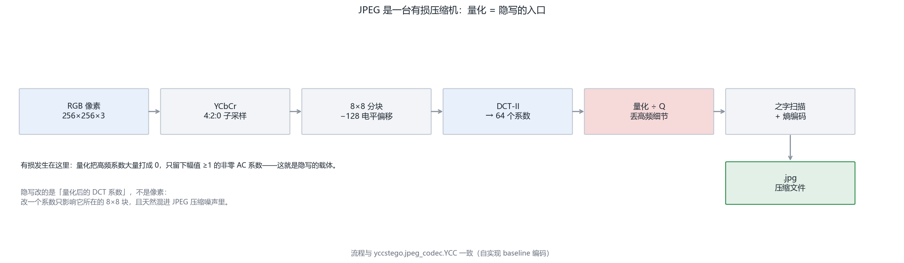
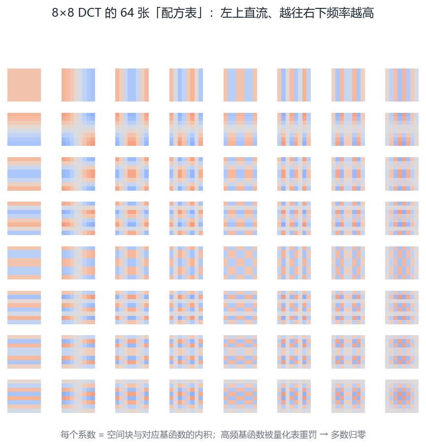
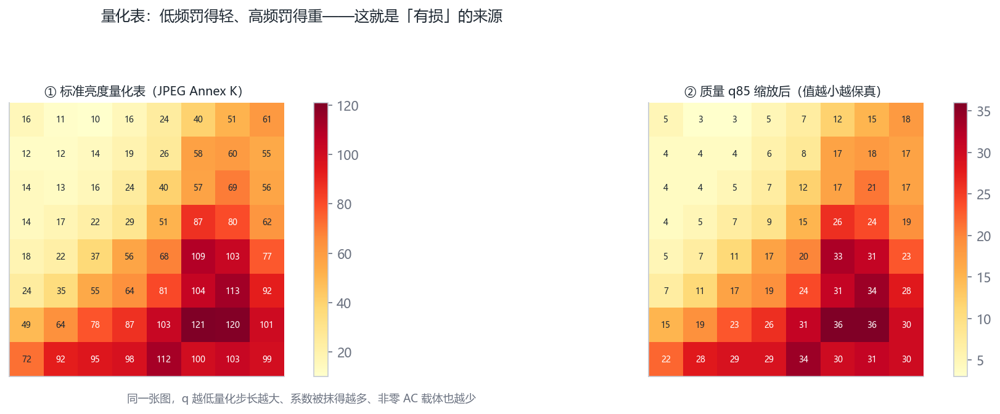
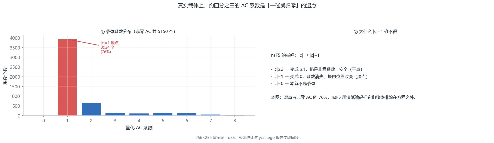
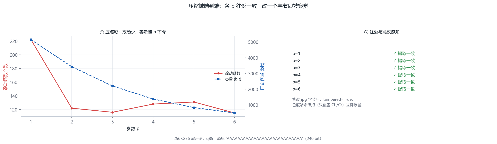
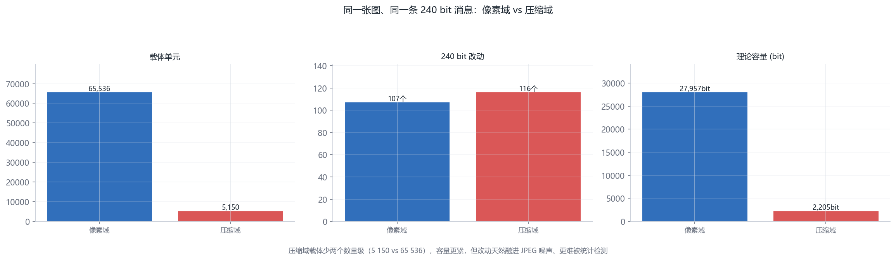

# 第 1½ 章 · JPEG 是什么，DCT 系数是什么？（压缩域隐写的战场）

<!-- lang-switch -->
> [🌐 English version](https://yukinoshita-lin.github.io/nsf5-steganography/en/content/ch01b.html)


> **本章导航** ·　先看问题，再读正文
> 
> **核心问题　为什么全世界的隐写教科书，讲 nsF5 时都在讲 JPEG 系数，而不是像素？**
> 
> **读完你能回答**
> 
> - 画出 JPEG 压缩的七步流水线，并标出**哪一步可逆、哪一步是损毁核心**；
> 
> - 手算一个常数块的 DC 值，解释高频系数为什么会被量化归零；
> 
> - 口述系数上“载体 / 湿点 / 减幅”的含义，说清 +3→+2 与 +3→0 的区别；
> 
> - 跑通 `--jpeg` 并读懂 `--json` 的关键字段（carriers_changed、capacity_bits 等）。
> 
> *本章是第 1 章与第 5 章之间的桥：知道 LSB 的“死敌”是谁，也知道 nsF5 的“家”在哪里。*

**开场问题：为什么全世界的隐写教科书，讲 nsF5 时都在讲 JPEG 系数，而不是像素？**第 1 章你已经知道像素 LSB 能藏东西。但真实世界里，图片在社交网络上传播的第一站就是重新压缩成 JPEG——像素域藏进去的秘密会在这次压缩里灰飞烟灭。要让秘密**活过压缩**，就必须住进压缩产物本身：量化后的 DCT 系数。这就是“压缩域隐写”名字的由来，也是 1990 年代末 F5 系列论文全部的故事。

这一章是 v1.9.0 新增的“编外章”，编号带个 ½，因为它在课程里是第 1 章和第 5 章之间的桥：先建立 JPEG/DCT 的直觉，第 3 章讲 LSB 时你会知道它的“死敌”是谁，第 5 章讲 nsF5 时你会知道它的“家”在哪里。读完本章，你不需要会推导 DCT 公式，但必须能不假思索地回答这张地图里的问题：

| **小节** | **回答的问题** | **你的产出** |
| --- | --- | --- |
| 1.5.1 JPEG 流水线 | 秘密为什么藏不过重压缩？ | 能画出压缩七步并标出哪步可逆 |
| 1.5.2 DCT 系数 | DC/AC、量化、非零系数是什么？ | 能手算常数块的 DC 并解释归零 |
| 1.5.3 系数上的 nsF5 | 载体/湿点/减幅在系数上长什么样？ | 能口述 +3→+2 与 +3→0 的区别 |
| 1.5.4 真图实战 | CLI/GUI 怎么跑 JPEG 域？ | 跑通 --jpeg 并读懂 --json 关键字段 |

> **新手提示｜
这一章写于 v1.9.0（2026-10），是应"学习路径应该先讲清楚 JPEG 和 DCT，再进入 LSB/隐写"的反馈补进来的。它编号是"1½"而不是把后面各章整体重排：手册已有大量"见第 N 章"的交叉引用、10 个按章 Notebook 和事实校验脚本，重编号的收益远小于风险。你只需要在读完第 1 章之后、进入第 3 章之前，把这一章读完。**

第 1 章把图像拆成了像素与位平面，接下来按理就该讲 LSB 隐写了。但本项目的主线算法 nsF5 有两个"家"：主仓库 ns5_core.py 里的像素域实现（改灰度像素），以及 v1.9.0 起接入主线的 JPEG 压缩域实现（改量化 DCT 系数，来自姊妹项目 yccstego）。教科书里的 F5/nsF5 讲的是后者。不先弄懂 JPEG 和 DCT 系数，第 4、5 章里的"+3→+2"就永远只是口号。

## 1.5.1 JPEG 是什么：一台"有损压缩机"

把三步流水线展开成完整的七步，每一步标注“可逆吗”——这张表在后面无数地方会救你：

| **步骤** | **做了什么** | **可逆？** | **与隐写的关系** |
| --- | --- | --- | --- |
| 1 色彩空间 | RGB → YCbCr（亮度/色度分离） | 可逆（有舍入） | 隐写只动 Y 通道（见下） |
| 2 下采样 | Cb/Cr 尺寸减半（4:2:0） | 不可逆（丢分辨率） | 色度载体也因此减半 |
| 3 分块 | 切成 8×8 的块 | 可逆 | 隐写以“块”为单位收集系数 |
| 4 DCT | 像素 → 64 个频率权重 | 可逆（数学变换） | 权重即“系数” |
| 5 量化 | 权重 ÷ 量化表，四舍五入 | **不可逆（有损核心）** | 秘密就藏在这一步的产物里 |
| 6 之字扫描 | 二维系数 → 一维序列 | 可逆 | 决定“提取顺序” |
| 7 熵编码 | 哈夫曼等无损压缩 | 可逆 | nsF5 之后重写这一步，输出 .jpg |

只动 Y 通道有两层理由。**容量理由**：自然图像的能量集中在亮度（Y）通道，量化后 Y 的非零 AC 系数远多于 Cb/Cr（色度量化步长大，大量系数直接归零）——载体多，才藏得下消息。**教科书理由**：Provos 与 Honeyman 在 2001 年提出的 F5 就是在 Y 通道上定义的，yccstego 沿用这一口径，论文对得上、复现得准。至于“改亮度会不会更容易被发现”——会，这正是第 8 章检测特征盯着 Y 通道直方图看的原因；隐写与检测永远在同一张地图上对弈。

JPEG 不是一种文件格式那么简单，它是一条有损压缩流水线，对每个 8×8 像素块依次做三件事：

1. DCT 变换：把 8×8 的像素值改写成 64 个"花纹权重"（下一节细讲）；

2. 量化：每个权重除以量化表里对应位置的一个步长，再四舍五入取整——有损就发生在这一步：右下角（高频）的步长大，除完取整后大量直接变成 0；

3. 熵编码：把剩下的非零系数按之字顺序串起来做压缩编码，写成 .jpg 文件。

第 3 步是可逆的（能一字不差地解回来），第 2 步不可逆（取整丢掉的信息回不来）。JPEG 压缩域隐写的全部艺术，就是让秘密住进第 2 步的产物——量化之后的系数——里。

> **避坑提醒｜
这也解释了第 3 章 FAQ 的那句话"JPEG 会破坏像素 LSB"：一张藏了像素 LSB 的 PNG 被另存为 JPEG 时，整条流水线重新跑一遍，量化取整会把 LSB 结构搅乱。反过来，JPEG 域隐写写的是量化系数本身，编码器会带着这些系数原样做完熵编码——所以它的含密图必须是 JPEG 自己，而且不能再被任何工具重新另存（重存等于重新量化，载荷即毁）。GUI 对 JPEG 域含密图按原始字节保存，就是这个原因。**



图 1½-1 JPEG 压缩流水线。这张图回答的是：JPEG 把图像压小的七步里，秘密要住进哪一步？RGB → YCbCr → DCT → 量化 → 熵编码 的压缩链路与隐写入口：秘密要住进量化后的系数

## 1.5.2 DCT 系数是什么：8×8 块的"配方表"

把 8×8 块看成一幅微型画像。DCT（离散余弦变换）准备了 64 种固定的"花纹"：左上角的花纹是整块的均匀明暗（最低频），往右下走花纹越来越细密（高频）。DCT 变换做的事，就是回答一个问题：这一块像素，按每种花纹各用多少比例调配出来？得到的 64 个配比就是 DCT 系数。

- 左上角第一个系数叫 DC（直流），表示整块的平均亮度，不参与隐写；

- 其余 63 个叫 AC（交流）系数；

- 自然图像的能量集中在左上（低频），所以量化后右下角大批系数归 0——归零的系数不是载体，活下来的非零 AC 系数才是。

> **动手做｜
下面的片段用项目压缩域实现里同一套 DCT 矩阵与量化表（yccstego/dct.py），对同一个 8×8 块分别按质量 60、85、95 量化，数一数非零 AC 载体和 |c|=1 的"湿点"各有多少。跑之前请确认已安装压缩域依赖：pip install yccstego。**

```python
import numpy as np
from yccstego import dct as jdct
 
# 造一个 8x8 块: 平滑渐变(低频为主) + 轻噪声(高频细节)
rng = np.random.default_rng(3)
block = np.linspace(90, 200, 8)[None, :] + np.linspace(0, 60, 8)[:, None]
block = np.clip(block + rng.integers(-8, 9, (8, 8)), 0, 255).astype(float)
 
counts = {}
for q in (60, 85, 95):
    T = jdct.scale_qtable(jdct.LUM_QT, q)      # libjpeg 风格的质量缩放
    F = jdct.dct_blocks(block - 128)           # 中心化后做 DCT (JPEG 的做法)
    Q = np.round(F / T).astype(int)            # 量化: 有损就发生在这一步
    ac = Q.reshape(-1)[1:]                     # 去掉 DC, 剩 63 个 AC
    nz = int(np.sum(ac != 0))
    wet = int(np.sum(np.abs(ac) == 1))
    counts[q] = nz
    print(f"质量 {q}: 非零 AC 载体 {nz} 个, |c|=1 湿点 {wet} 个")
assert counts[95] > counts[60], "质量越高, 活下来的载体应越多"
print(f"质量 95 的非零 AC 载体多于质量 60: {counts[95]} > {counts[60]}")
```

> **新手提示｜观察｜
你会看到两个规律：质量从 60 提到 95，非零 AC 载体明显变多（量化步长变小，更多系数"活了下来"）；同时 |c|=1 的系数不少——它们马上就要给你惹麻烦了。**

DCT 不必会推导，但有一个数字应当手算一遍——它是所有 JPEG 隐写分析的锚点。实现里的标准做法是先把像素减 128（电平偏移）再变换：对 DCT-II（正交归一化），**一块完全相同的像素，变换后只有 DC 一个非零系数，DC = 8 × (平均亮度 − 128)**。拿全 100 的块验证：DC = 8 × (100 − 128) = −224，其余 63 个 AC 严格为 0。若把电平偏移补回去（加回 8×128 = 1024），数值上等于 8 × 平均亮度 = 800——两种口径在文献里都常见，本书统一按“实现口径”（先减 128）讲述。用项目的压缩域实现复算：

```python
from yccstego import dct as jdct
import numpy as np
blk = np.full((1, 8, 8), 100.0)
F = jdct.dct_blocks(blk - 128.0)[0]   # 电平偏移 -128 后变换
print(F[0, 0])                        # -224.0 = 8 x (100-128)
print(np.abs(F[1:, :]).max())         # 0.0 —— AC 全零
print(jdct.scale_qtable(jdct.LUM_QT, 85)[0, 0])   # 5 (q85 亮度量化步长)
```

第三行打印的 5 是 q85 亮度量化表的左上角元素（标准表首项 16 经质量因子缩放得到）。于是这块的量化 DC = round(−224 ÷ 5) = −45——一个整数，抗住了取整。对比一个高频系数：量化步长动辄 60～100，除完直接归零。**载体 = 活下来的非零 AC**，这块一个都没有——纯色块藏不进东西，这就是最直观的解释。

> **想一想｜** 把块从“全 100”换成“左半 100、右半 140”的水平渐变，DC 还是 800 吗？会有哪些 AC 活下来？（提示：水平方向的“亮暗差异”对应某一列低频 AC；块越平滑，活下来的越少。）拿 1.5.2 节的代码把块改成渐变跑一遍，对照你的预测。

把“DC = 8 × (平均亮度 − 128)”从 DCT 的定义推出来。正交归一化 DCT-II 的第 (0,0) 个系数定义为（两个一维基的零频分量相乘，权重各为 1/√8）：

推导只有两步：常数块满足 f(x,y) ≡ mean − 128，双重求和共 64 项相加，得 64 × (mean − 128)；再乘系数 1/8，即 8 × (mean − 128)。代入手算例子：

量化表本身也不是天上掉下来的——libjpeg 用质量因子 q（1..100）对标准表 T 做线性缩放：

其中下标 ij 遍历 8×8 的 64 个位置。代 T 的首项 16 进去：floor((16 × 30 + 50)/100) = floor(5.3) = 5，正是代码打印的那个 5。顺带读懂这个公式的两个边界：q < 50 时 S > 100（步长放大、质量更低），q = 100 时 S = 0、缩放结果被 clip 钳在 1（全 1 表 = 不损失）。



图 1½-2 DCT 基函数（8×8）。这张图回答的是：为什么任何 8×8 块都能写成 64 个基函数的加权和？64 个 DCT-II 基函数：低频在左上、高频在右下，任何 8×8 块都是它们的加权和



图 1½-3 量化表与质量缩放。这张图回答的是：量化步长决定了哪些系数会被抹掉？标准亮度量化表与 q85 缩放后的步长——量化步长决定哪些系数会被取整归零

## 1.5.3 在系数上做 nsF5：载体、湿点与减幅

JPEG 域 nsF5 的载体系数是量化 Y 块（亮度）的非零 AC 系数，每个系数贡献一个比特：x = c & 1（奇偶）。往一个比特里写 1，不是把系数翻转，而是 F5 的"减幅"：幅值减 1、保符号。

| **原系数** | **修改后** | **说明** |
| --- | --- | --- |
| +3 | +2 | 幅值减 1，奇偶从 1 变 0 |
| −5 | −4 | 保符号，同样翻 LSB |
| +1 | 湿点，不碰 | 再减就归 0（收缩），系数会从载体集合里消失 |
| −1 | 湿点，不碰 | 同上 |

为什么"收缩"是灾难：提取端要按同样的顺序收集载体系数，一个系数从 +1 缩成 0 就从集合里消失，后面所有比特错位。这正是 F5 的老毛病，也是 nsF5 用湿纸编码（把 |c|=1 的系数划为"湿点"、只在干点上解方程）修掉的问题——第 5 章展开。

> **动手做｜
三行代码看懂"减幅"与"湿点"的边界：**

```python
for c in (3, -5, 1, -1):
    action = c - (1 if c > 0 else -1) if abs(c) > 1 else "湿点, 不碰"
    print(c, "->", action)
```

> **想一想｜
1. +3 和 +2 的二进制 LSB 都是 1，减幅之后 LSB 怎么会变？——提示：想想 +1、-1 与奇偶的关系，再想 |c|=1 时为什么不能减。
2. 与"翻转 LSB"（+3 与 +4 之间跳）相比，减幅让系数的幅值直方图在 |c|=1 处堆积。这种堆积是伪装的破绽还是伪装的代价？第 8 章的"magnitude-1 指纹"会反过来用它抓隐写。**

> **避坑提醒｜
JPEG 域的口令键控与像素域同理：隐藏路径由"色度系数哈希 + 口令"派生，解码端 p / 口令 / 质量（若重嵌）任一不一致都提取不出来。重跑契约两域一致：yccstego 0.2.0 起湿纸求解种子由输入派生，相同输入逐字节复现；档案记录建档时的 yccstego 版本，重跑同版本走字节级校验，跨版本自动退回"提取一致"（旧档兼容），这写在了 src/experiment.py 的文档里。**

像素域与压缩域的容量对比，用项目演示图的真实数字最有感觉（256×256 演示图，p=3，质量 85，实测 2026-10-04）：

| **维度** | **像素域 (PNG)** | **JPEG 域 (质量 85)** |
| --- | --- | --- |
| 候选载体 | 65 536 个像素（每个 1 位） | 5 150 个非零 AC 系数（实测） |
| 本次嵌入 | 240 bit → 改 108 像素 (0.2%) | 240 bit → 改 117 个系数 |
| 理论容量 | ≈ 8 KB 文本 | 2 205 bit ≈ 275 字节文本 |
| 抗重压缩 | 差（重存即毁） | 强（系数随位流存活） |

注意容量从 8 KB 缩到 275 字节——**压缩域隐写用容量换鲁棒性**。这张表还解释了 GUI 里的一个现象：同样一句话，像素域轻松嵌入，JPEG 域却显示“改动系数 117 / 载体 5150”——不是 JPEG 域低效，而是它的载体总数本来就少两个数量级，2.3% 的相对改动率与像素域的 0.2% 属于同一档克制。

> **避坑提醒｜** JPEG 域的“湿点”是 |c| == 1 的系数。它们一旦被减幅就变成 0，提取端收集载体时整条序列错位。0.2.0 版的 yccstego 曾有一个连作者都踩过的坑：编解码器的块划分与 DCT 定义有错，导致“消息能提取、但画面是品红条纹”。如果你在自己的实验里遇到“提取成功但图像坏掉”，先怀疑编解码器的对称性（编码端怎么分块、解码端就要怎么收集），再怀疑算法。该案例的完整排查过程记录在 yccstego 仓库 issue #1，是极好的调试教学材料。



图 1½-4 DCT 系数分布与湿点。这张图回答的是：为什么 |c|=1 的系数“碰不得”？量化 AC 系数的幅值分布与 |c|=1 湿点占比：湿点碰不得，是容量与保真的共同约束

## 1.5.4 在真 JPEG 上跑一遍

前面两段是在"单块"上看原理。真正的嵌入由 yccstego 完成：整图分块、逐块量化、在全部载体上做伴随式编码、再熵编码回标准 .jpg。下面用桥接层把它跑通（GUI 的"JPEG 域"和 CLI 的 --jpeg 走的就是这同一份代码）：

```python
import sys
sys.path.insert(0, "src")        # 源码运行时需要; pip 安装后可删掉这行
import numpy as np
import jpegstego
 
rng = np.random.default_rng(7)
y = np.linspace(0, 220, 128)[None, :]
x = np.linspace(0, 90, 128)[:, None]
gray = np.clip(110 + y + x + rng.integers(-6, 7, (128, 128)), 0, 255).astype(np.uint8)
rgb = np.stack([gray, gray, gray], axis=-1)      # JPEG 域吃 RGB
 
jpg, rep = jpegstego.embed_jpeg(rgb, "你好, DCT 域!", p=3, quality=85)
print("改动系数:", rep["carriers_changed"], "容量(bit):", rep["capacity_bits"])
 
msg, _, tampered, head_match = jpegstego.extract_jpeg(jpg, p=3)
assert msg == "你好, DCT 域!" and not tampered and head_match
print("往返一致:", msg)
```

命令行等价形式（安装后可用）：

```bash
nsf5stego embed cover.png --jpeg -m "秘密" --quality 85
nsf5stego extract cover_stego.jpg --jpeg
```

跑完 1.5.4 的代码，终端会吐出一段 JSON。它就是第 6 章要讲的“实验档案”，现在只需要认识五个字段：

| **JSON 字段** | **含义** | **演示图实测值** |
| --- | --- | --- |
| carriers_changed | 被修改的系数个数 | 117 |
| capacity_bits | 当前参数下的理论容量 | 2 205 bit |
| cover_hash | 封面色度哈希（篡改感知锚点） | de2f2560… |
| truncated | 消息是否因容量不足被截断 | false |
| yccstego_version | 执行嵌入的引擎版本 | 0.2.1 |

其中 carriers_changed 与 capacity_bits 的比值（117/5150 ≈ 2.3%）就是嵌入率的直观体现；它远低于像素域上限——这不是缺陷，而是伴随式编码在“少改动”上换来的奖励，第 4 章专讲这笔账怎么算。



图 1½-5 压缩域往返与篡改感知。这张图回答的是：在真 JPEG 上嵌入再提取，一个 bit 都不会错吗？压缩域各 p 的改动系数、容量与提取一致性——往返全绿，篡改必失败



图 1½-6 像素域 vs 压缩域。这张图回答的是：同一个秘密，在像素域和压缩域里各要付什么代价？两种域下载体单元、改动数与容量的对比：同一张图，两个战场

## 1.5.5 回到项目看代码

| **概念** | **文件** | **优先阅读内容** |
| --- | --- | --- |
| 桥接层（统一入口/降级提示） | src/jpegstego.py | embed_jpeg / extract_jpeg |
| 块级 nsF5（减幅 + 湿纸） | yccstego/yccstego/nsf5.py | _embed_block / solve_wet_paper |
| DCT 与量化表 | yccstego/yccstego/dct.py | _dct_matrix / scale_qtable / LUM_QT |
| JPEG 域分析（\|c\|=1 指纹） | yccstego/yccstego/steganalysis.py | analyze_y |
| 重跑契约（两域差异） | src/experiment.py | verify() 与模块文档 |
| GUI 域切换 | src/gui.py | _on_domain_change / _do_embed_jpeg |

> **想一想｜
把同一张 128×128 的图分别用像素域（第 5 章的 nsF5Pixel）和本章的 JPEG 域嵌入，统计"可写位置"的数量：像素域约有 16000 个像素位，JPEG 域只有几千个系数——是什么决定了两者的差距？质量 60 时再算一次呢？这个容量直觉会在第 10 章的综合实验里派上用场。**

**本章小结。**JPEG 是一条以“量化”为损毁核心的流水线，秘密要活过重压缩就必须藏进量化后的系数；载体 = 非零 AC 系数（DC 不碰），湿点 = |c|=1（碰了就错位），修改方式 = 减幅（|c| 减 1、保符号）；容量比像素域小两个数量级，换来的是抗重压缩的鲁棒性。

> **动手做｜** 章末练习（提示与答案见附录 J）
> 
> P1½.1（手算）全 100 的 8×8 块，减 128 后 DC = −224。若 DC 量化步长是 5，量化后的 DC 是多少？反量化并还原电平后，块的平均亮度是多少？（答案应 ≈100，量化误差 0.125。）
> 
> P1½.2（思考）系数 +3 改成 +2，LSB 从 1 变 0，视觉无感；为什么不能改成 +4（4 的 LSB 是 0）？从“幅值变化量”与“频率域影响”两个角度回答。
> 
> P1½.3（上机）跑 1.5.2 节代码，把质量从 60 改到 95（步长 5），记录非零 AC 系数个数随质量的变化；再回答：质量越高，JPEG 域容量越大还是越小？为什么？
> 
> P1½.4（上机·选做）把同一消息分别用像素域与 JPEG 域嵌入同一张演示图，比较两个 JSON 里的 carriers_changed 与容量字段。
