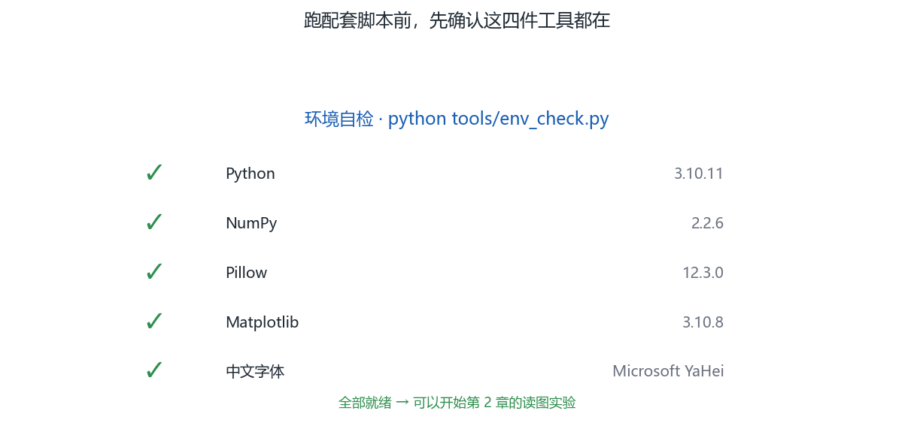
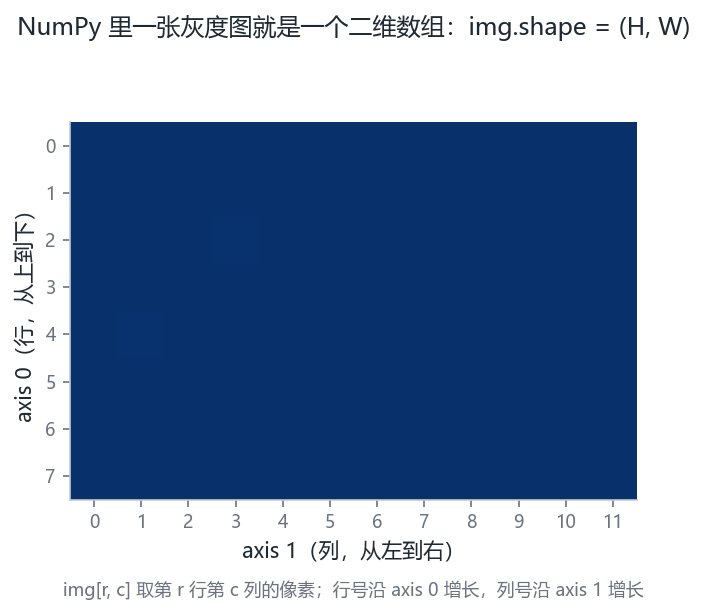
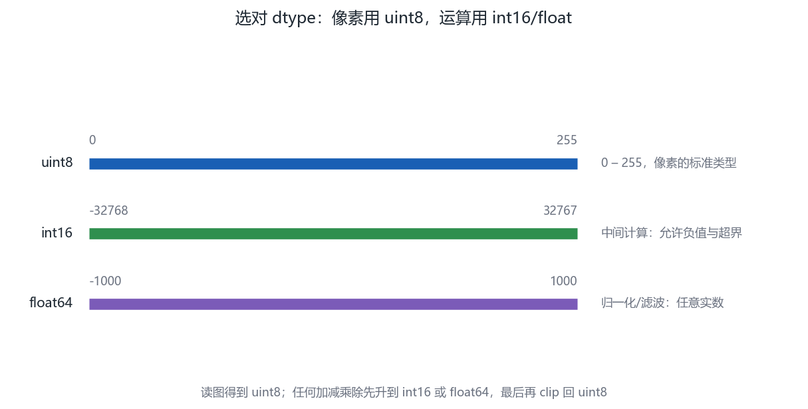
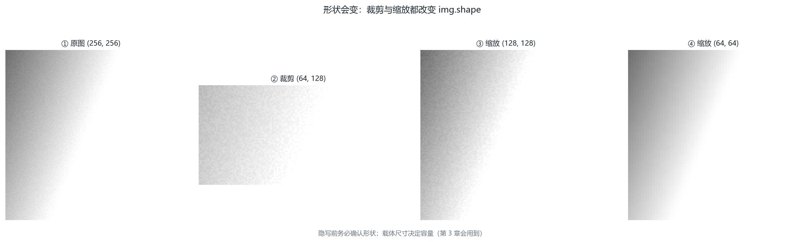
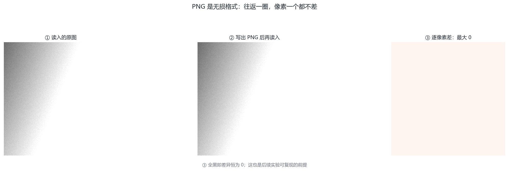
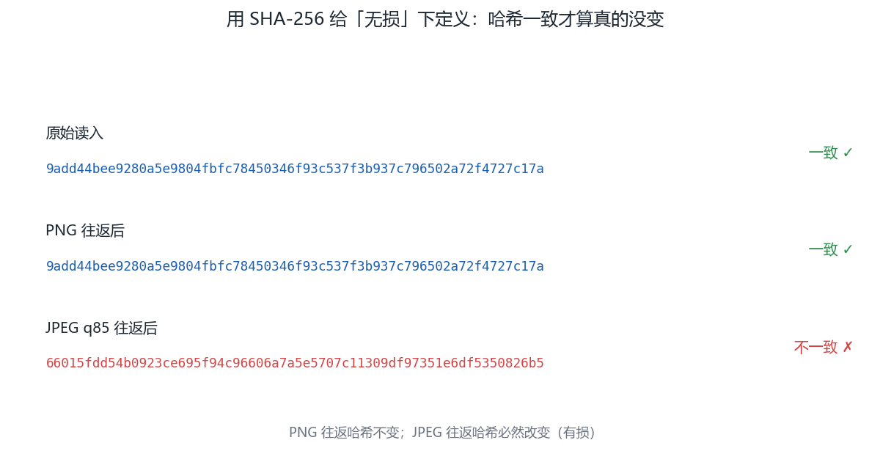
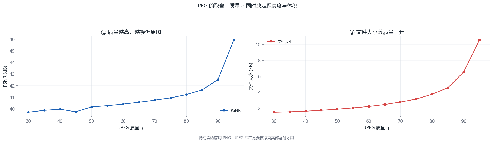
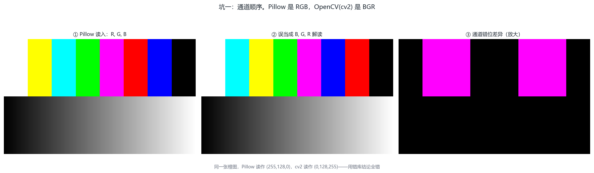
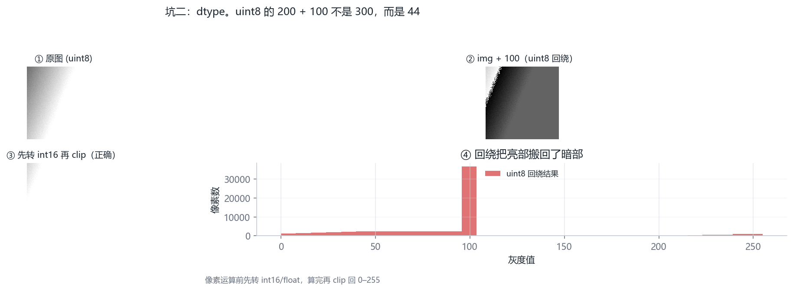
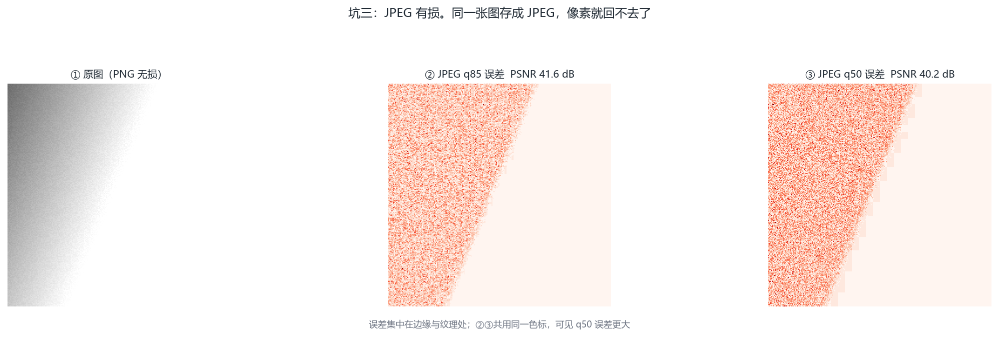

# 第 2 章 · 准备工具：Python、NumPy 与图像读写（第 2 周）

<!-- lang-switch -->
> [🌐 English version](https://yukinoshita-lin.github.io/nsf5-steganography/en/content/ch02.html)


> **本章导航** ·　先看问题，再读正文
> 
> **核心问题　为什么这本手册不让你先学完 Python 再碰项目？**
> 
> **读完你能回答**
> 
> - 让项目代码在你的机器上跑起来，`test_core.py` 全绿；
> 
> - 解释 NumPy 数组的四个要素，并识别三个高频坑（uint8 回绕 / 视图不是拷贝 / 隐式升类型）；
> 
> - 读图、改像素、存回，并解释 **PNG 往返无损**与 **JPEG 往返有损**的分水岭；
> 
> - 读懂 `run_e2e.py` 输出里的嵌入比特数与改动数。
> 
> *你的产出不是“学会了 NumPy”，而是“项目代码跑起来了，且每一行数组操作都看得懂”。*

**开场问题：为什么这本手册不让你先学完 Python 再碰项目？**因为隐写代码用到的 Python 子集小得惊人：数组切片、位运算、函数调用，仅此而已。CSAPP 的做法是“需要什么学什么，用到的那一周学透那一块”。本章把隐写代码 90% 会用到的 NumPy 概念压进一节，剩下的边用边查。读完本章，你的产出不是“学会了 NumPy”，而是**项目代码在你机器上跑起来，且你能读懂它的每一行数组操作**。

| **小节** | **回答的问题** | **你的产出** |
| --- | --- | --- |
| 2.1 安装环境 | 怎么让项目跑起来？ | test_core.py 全绿 |
| 2.2 NumPy 思维 | 数组四要素是什么？ | 能解释 uint8 回绕与视图陷阱 |
| 2.3 图像读写 | image_io.py 封装了什么？ | 能读图改像素存回 |
| 2.4 端到端 | run_e2e.py 的输出怎么读？ | 能找到嵌入比特数与改动数 |
| 2.5 报错速查 | 常见错怎么自救？ | 收藏这张表，报错先查它 |

> **动手做｜
本章目标：装好环境、跑通端到端脚本，会用 NumPy 读写图像数组。从此以后，你做的每个实验都能立刻在项目里验证。**

## 2.1 安装环境

项目依赖很轻：核心只需要 NumPy 与 Pillow，机器学习部分再用 scikit-learn、joblib 等。建议用较新的 Python 3.9+（README 示例使用 3.14，低版本同样可用）。

在项目根目录安装并做第一次自检

```bash
cd F:\Steganography
pip install numpy pillow
python src\test_core.py      # 核心算法自测
python src\test_steg.py      # 隐写分析自测
python src\run_e2e.py        # 端到端：嵌入→解码→分析→绘图
```

> **避坑提醒｜
如果系统默认 python 没有 tkinter，GUI 无法启动。README 给出的办法是使用带 tkinter 的解释器（例如 C:\Python314\python.exe）；只跑命令行脚本则不受影响。遇到 ModuleNotFoundError 时先确认你安装到了“运行它的那个解释器”里：python -m pip install ... 更稳妥。**



图 2-1 环境自检面板。这张图回答的是：动手之前，怎么确认自己的环境是可复现的？Python、NumPy、Pillow、Matplotlib 版本与中文字体探测结果——第一件事就是让环境可复现

## 2.2 用 NumPy 思考图像

NumPy 数组的核心概念只有四个：形状（shape）、类型（dtype）、切片（slice） 与向量化运算。隐写算法本质上都在做：取出数组 → 按某种顺序改写部分元素的 LSB → 存回数组。

四个核心概念的 10 行速览

```python
import numpy as np
a = np.arange(12).reshape(3, 4)     # 3 行 4 列
print(a.shape, a.dtype)             # (3,4) int64
b = a[:, 1]                          # 取第 2 列
c = a[0:2, 0:3]                      # 左上角 2×3 块
x = np.zeros((64, 64), dtype=np.uint8)
x[10:20, 5:15] = 255                 # 画一个白色方块
print((x & 1).sum())                 # 统计 LSB=1 的数量
```

注意 dtype=np.uint8：图像像素是 0～255 的 8 位无符号整数。做加减时要小心溢出回绕：np.uint8(200) + 100 会得到 44 而不是 300。项目在翻转 LSB 时用“异或 1”而不是“±1”，正是为了避免把 0 减成负数或把 255 加溢出。

原文提到了 uint8 回绕。这里把隐写代码里**最容易踩的三个 NumPy 坑**一次配齐，每个坑配一行可复现代码：

| **坑** | **复现代码** | **现象** | **解释** |
| --- | --- | --- | --- |
| 加法回绕 | np.uint8(200) + np.uint8(100) | 得到 44，不是 300 | uint8 只存 0～255，300 回绕到 44；位运算不受影响，算术运算要当心 |
| 视图不是拷贝 | b = a[:]; b[0] = 1 | a[0] 也变成 1 | 切片返回视图（共享内存）；要独立副本必须 a.copy() |
| 隐式升类型 | a = np.array([200], np.uint8); a + 1 | 结果 dtype 变成 int64 | 与 Python 整数运算会提升类型，存回图像前要 astype(np.uint8) |

为什么隐写代码特别容易踩这三坑？因为它全程在做“取出数组 → 改 LSB → 存回”，三步分别踩第三、第二、第一坑。项目源码的防御姿势值得抄：位运算用 ^1（不触发算术回绕），跨函数传递一律显式 dtype，写文件前统一 clip 与 astype（见 image_io.py）。

> **想一想｜** a = np.zeros((2,2), np.uint8); b = a[0]; b[0] = 200 之后，a 是多少？如果想要 b 是独立副本，正确的写法是什么？——这个坑在第 5 章的湿纸求解里真实存在过：解出的修正位写回载体数组时若用了视图，会连湿点一起改掉。视图问题从来不是“Python 语法问题”，是数据归属问题。



图 2-2 数组形状与索引。这张图回答的是：axis 0 和 axis 1 分别指向哪一行哪一列？二维数组的 axis 0（行）与 axis 1（列）方向示意——搞错轴是新手最贵的错



图 2-3 dtype 取值域对照。这张图回答的是：uint8 越界之后到底会发生什么？uint8 / int16 / float64 的取值域与典型用途：越界即回绕，隐写里是事故高发区



图 2-4 缩放与裁剪的形状变化。这张图回答的是：改尺寸，究竟改了矩阵的什么？原图、裁剪与两种缩放的数组形状对比——改尺寸就是改矩阵的行列

## 2.3 图像读写：认识 image_io.py

project/src/image_io.py 的核心接口

```python
from PIL import Image
import numpy as np
 
def load_as_gray(path):
    im = Image.open(path).convert("L")   # 强制转灰度
    return np.asarray(im, dtype=np.uint8)
 
def save_image(image, path):
    im = Image.fromarray(np.ascontiguousarray(image))
    im.save(path)
```

> **回到项目看代码｜
自己打开 src/image_io.py 全文，注意 load_image() 与 load_as_gray() 的差异，以及 SUPPORTED 支持的扩展名。然后运行下面这段，读入项目自带的封面图：**

动手：读图、看形状、存灰度版

```python
import sys; sys.path.insert(0, "src")
import image_io as IO
img = IO.load_as_gray("img/cover.png")
print(img.shape, img.dtype)          # (256,256) uint8
print(img.min(), img.max(), img.mean())
IO.save_image(img, "output/my_copy.png")
```



图 2-5 PNG 往返无损验证。这张图回答的是：存成 PNG 再读回来，像素会变吗？原图、PNG 往返结果与逐像素差异：全零差异，证明 PNG 往返无损



图 2-6 往返一致性（SHA-256）。这张图回答的是：怎么用一个哈希值判断“无损还是有损”？原图、PNG 往返、JPEG 往返三者的 SHA-256 是否一致——无损与有损的分水岭

## 2.4 第一次端到端运行：run_e2e.py

以 2026-10-04 在本机的一次真实运行为例，把输出里的关键数字钉在墙上，你跑出来的数应当与它完全一致（演示图与参数是确定性的——这正是第 6 章“可复现”的第一次亮相）：

| **输出行** | **数字** | **怎么读** |
| --- | --- | --- |
| 嵌入 504 比特 | 504 | 消息 63 字节 ×8 = 504；比特数只跟消息长度有关 |
| 改动 188 / 183 像素 | 0.29% | 空口令与有口令两次嵌入的改动数不同——口令改变了嵌入位置 |
| 分析 封面 prob=0.08 | Gn=0.56 | 干净图被判“不太可能含密”（第 3 章解释 prob 的来历） |
| 效率表 p=3 行 | α=3.38 | 平均每改 1 个像素塞进 3.38 比特；理论值 24/7≈3.43，见第 4 章 |

这张表里的“效率表”值得多看一眼：p 从 1 扫到 6，改动数从 32502 一路降到 1035，而嵌入比特数不变。**矩阵编码用冗余度换改动数**——这笔交易的定价公式就是第 4 章的主角。把 6 行数字抄进实验日志，第 4 章回来对账。

运行 python src/run_e2e.py，脚本会依次完成五件事：生成封面图 → 以 nsF5 p=3 嵌入一段英文消息（分别用空口令与口令）→ 解码比对 → 对干净图与含密图做盲隐写分析 → 绘制码族/效率图。

> **动手做｜
仔细阅读终端输出，找到三组数字并抄下来：嵌入比特数、改动像素数、干净图与含密图的分析概率。下一章你就能解释它们为什么不同。**

你现在还看不懂嵌入内部不要紧——第 2 周的目标只是“让代码在你机器上跑起来”，以及建立“数组改 LSB”的直觉。



图 2-7 JPEG 质量-保真-体积曲线。这张图回答的是：JPEG 质量、体积、保真三者怎么互相拉扯？JPEG 质量与 PSNR、文件大小的关系曲线——质量、体积、保真三者互相拉扯

## 2.5 常见报错速查

| **报错 / 现象** | **原因** | **处理** |
| --- | --- | --- |
| ModuleNotFoundError | 包装到了别的解释器 | 用运行脚本的解释器执行 python -m pip install |
| 图像太小, 无法容纳头部+正文 | 像素数少于消息容量 | 换更大的图，或调小 p / 缩短消息 |
| UnicodeDecodeError / 乱码 | 旧版解码端按 ASCII 解码（v1.8 之前）；或提取端与嵌入端编码不一致 | 升级到 v1.8+：encode_string() 已按 UTF-8 编解码，中文可直接嵌入；旧档案请用建档时的版本提取 |
| GUI 秒退 / TclError | 解释器无 tkinter | 换带 tkinter 的 Python 运行 src/gui.py |
| 想一想｜
为什么 image_io 保存时要把数组转成“连续数组”（np.ascontiguousarray）？提示：切片与转置可能产生非连续内存视图，很多底层库不喜欢它们。 | 想一想｜
为什么 image_io 保存时要把数组转成“连续数组”（np.ascontiguousarray）？提示：切片与转置可能产生非连续内存视图，很多底层库不喜欢它们。 | 想一想｜
为什么 image_io 保存时要把数组转成“连续数组”（np.ascontiguousarray）？提示：切片与转置可能产生非连续内存视图，很多底层库不喜欢它们。 |



图 2-8 常见坑一：通道顺序。这张图回答的是：为什么同一张图在不同库里颜色会反？RGB 与 BGR 解读下的颜色错位对比——读图库的默认通道顺序并不统一



图 2-9 常见坑二：dtype 溢出。这张图回答的是：250 + 10 为什么会变成 4？uint8 加法回绕与正确裁剪的结果对比及直方图



图 2-10 常见坑三：JPEG 有损。这张图回答的是：为什么像素域藏的秘密过不了 JPEG 这一关？JPEG 压缩引入的逐像素误差与 PSNR——像素域的秘密过不了这一关

**本章小结。**环境三件套（NumPy/Pillow/项目源码）装好即可，不必精通；NumPy 四要素里对隐写最要命的是 dtype 与视图；run_e2e.py 是全项目的“总开关”，以后每学一个新概念都回到它找对应数字。

> **动手做｜** 章末练习（提示与答案见附录 J）
> 
> P2.1（手算）np.uint8(250) + np.uint8(10) 等于多少？np.uint8(3) - np.uint8(5) 呢？先笔算再上机验证。
> 
> P2.2（上机）按 2.2 节“视图陷阱”的复现代码敲一遍，再写出获得独立副本的两种写法，并用 a.base is None 验证。
> 
> P2.3（上机）把 run_e2e.py 的消息改成 126 字节（比如把英文句子复制一份），重跑并记录嵌入比特数与改动像素数。比特数为什么正好翻倍？改动数为什么不是？
> 
> P2.4（上机·选做）把 2.3 节读入的演示图做 img[:, ::2] 水平抽样后保存，用肉眼看与原图的差异——这就是“视图操作”最直观的教具。
