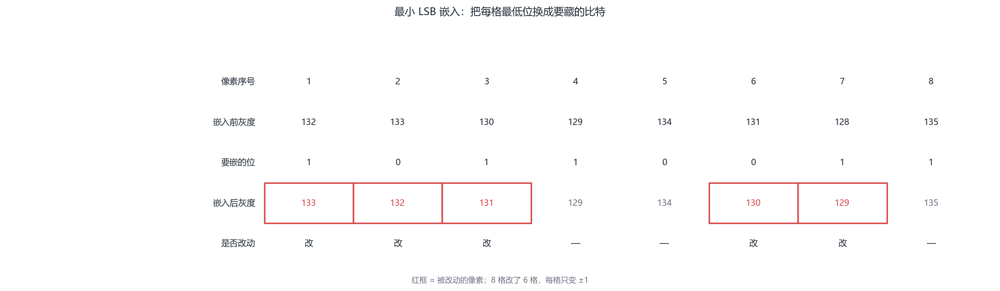
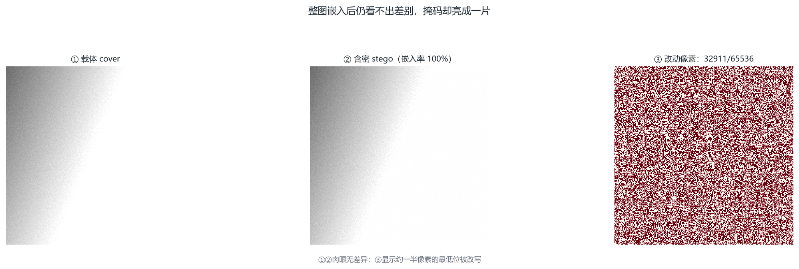
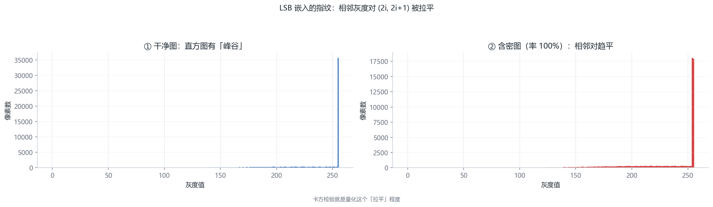
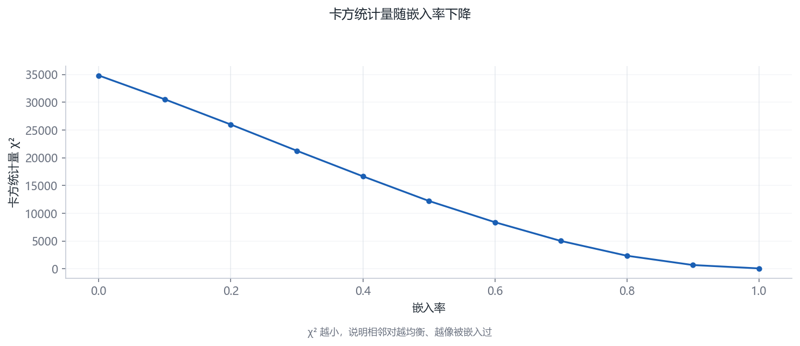
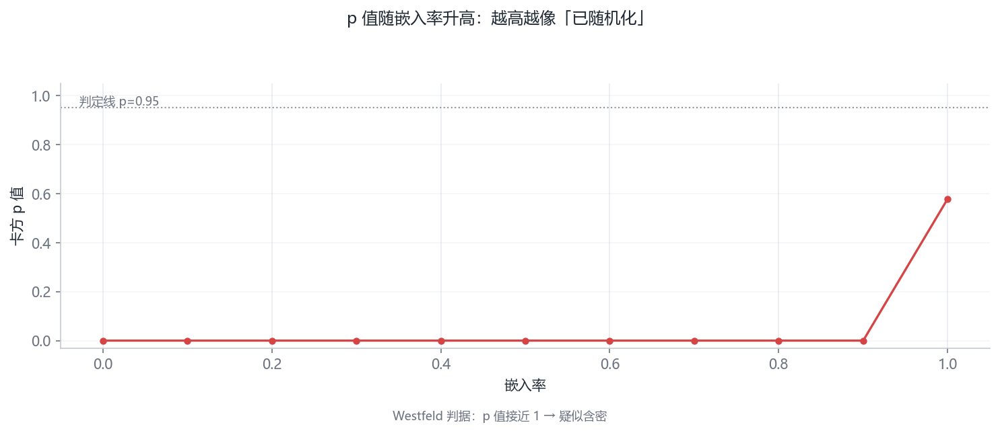
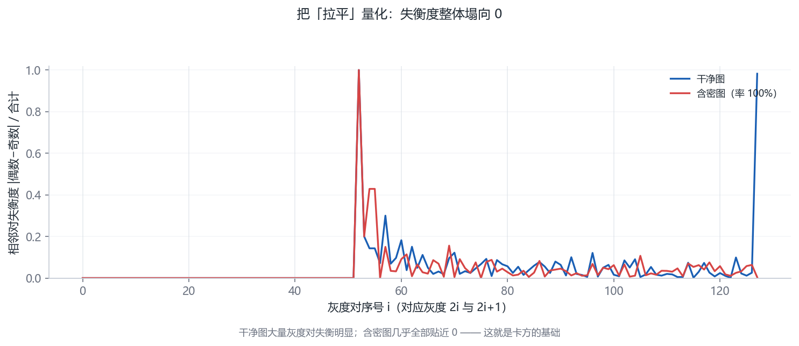
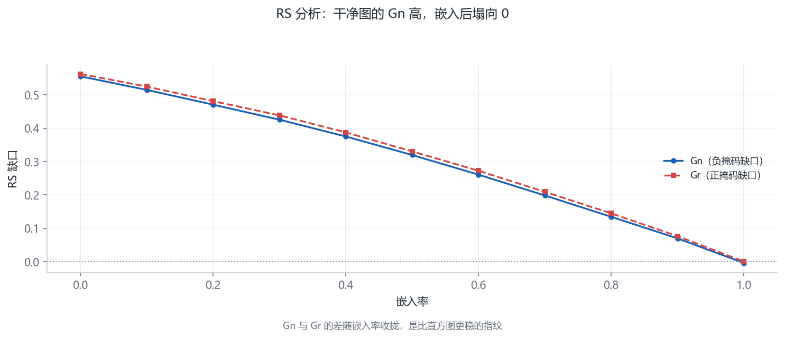
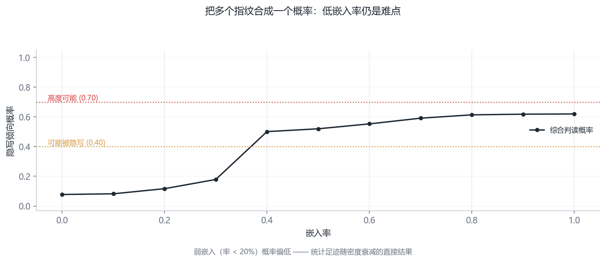
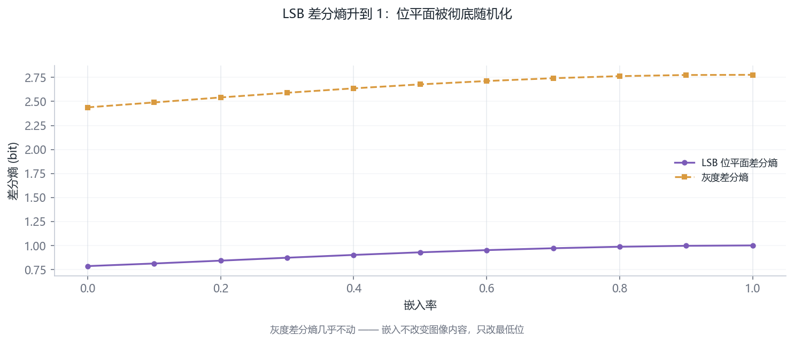
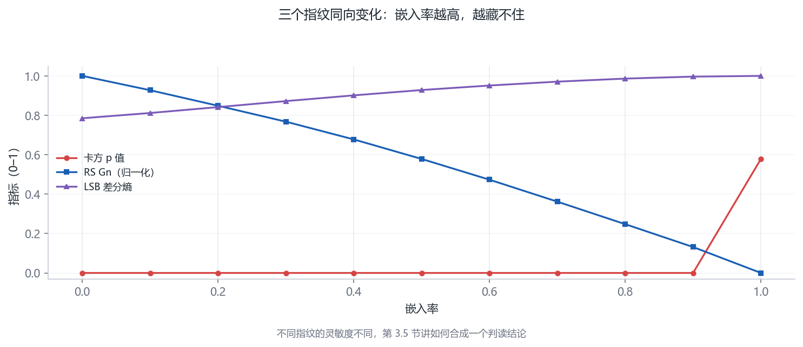

# 第 3 章 · LSB 隐写与它的统计“指纹”（第 3–4 周）

<!-- lang-switch -->
> [🌐 English version](https://yukinoshita-lin.github.io/nsf5-steganography/en/content/ch03.html)


> **本章导航** ·　先看问题，再读正文
> 
> **核心问题　把秘密藏进 LSB，凭什么说自己“看不见”？又凭什么会被人抓出来？**
> 
> **读完你能回答**
> 
> - 写出最小 LSB 嵌入与提取的完整流程（逐位替换、逐位读出）；
> 
> - 解释卡方检验抓的是什么——**偶奇配对被人为拉平**；
> 
> - 解释 RS 分析的“结构塌缩”，并读懂 Gn / Gr 缺口随嵌入率的变化；
> 
> - 用 `analyze()` 的综合概率给一张图下判定。
> 
> *藏与查是同一枚硬币的两面：本章每讲一个藏法，就配一个抓它的统计量。*

**开场问题：下面两行各 16 个字节，其中一行藏了消息——你能看出来是哪一行吗？**第一行来自一张干净照片的字节流，第二行是同一张照片做了 LSB 嵌入后的字节流。盯着看一分钟。看不出来是正常的：嵌入把 114 改成 115、把 119 改成 118，每一个字节都只挪了 1，视觉上与照片的天然噪声无法区分。但统计学家会告诉你：第二行的“指纹”已经变了。本章教你像统计学家一样看图——这也是整个隐写分析领域的起点。

```text
cover: 105 114 113 111 112 119 110 119 112 112 118 125 123 124 125 126
stego: 105 115 113 110 112 118 110 118 112 113 119 125 123 125 125 127
```

（两行都取自主项目 img/cover.png 最前面 16 个像素；第二行由 lsb_embed(rate=1.0, seed=0) 生成，可用配套项目 StegoLab 的 ch03 一键复现。16 个字节里有 9 个被改动，肉眼依然分不出哪一行是含密图。）

| **小节** | **回答的问题** | **你的产出** |
| --- | --- | --- |
| 3.1 加密 vs 隐写 | 它们解决的是同一个问题吗？ | 能说清威胁模型的区别 |
| 3.2 最小 LSB | 最朴素的嵌入长什么样？ | 能手算 8 像素行的嵌入 |
| 3.3 卡方检验 | 怎么用直方图抓 LSB？ | 能手算一个小卡的 χ² 与 p 值 |
| 3.4 RS 分析 | 不比直方图还能比什么？ | 能手算一组的平滑度变化 |
| 3.5 综合判读 | 多个信号怎么合成一个结论？ | 理解灵敏度=操作点选择 |

> **动手做｜
本章目标：亲手完成一次“藏进去→检测出来”的最小闭环；理解卡方检验与 RS 分析各自抓住了什么；看懂 steganalysis.py 的判读逻辑。**

## 3.1 加密 vs 隐写：先回答第一个问题

| **维度** | **加密（Encryption）** | **隐写（Steganography）** |
| --- | --- | --- |
| 保护对象 | 消息内容：没有密钥就读不懂 | 通信行为：别人看不出有秘密 |
| 可见性 | 密文明显“不像正常数据” | 载体看起来完全正常 |
| 典型场景 | 传输密码、证书、加密文件 | 隐蔽信道、版权水印、取证研究 |
| 相互关系 | 可先加密再隐写（强烈推荐） | 隐写隐藏的是“秘密存在”这一事实 |
| 新手提示｜
一句口诀：加密保护“内容”，隐写保护“存在”。专业隐写系统通常两者都用：先把消息加密，再把密文藏进载体。加密后密文近似随机，反而更不容易在统计上露馅。 | 新手提示｜
一句口诀：加密保护“内容”，隐写保护“存在”。专业隐写系统通常两者都用：先把消息加密，再把密文藏进载体。加密后密文近似随机，反而更不容易在统计上露馅。 | 新手提示｜
一句口诀：加密保护“内容”，隐写保护“存在”。专业隐写系统通常两者都用：先把消息加密，再把密文藏进载体。加密后密文近似随机，反而更不容易在统计上露馅。 |

## 3.2 最小可运行的 LSB 隐写

拿第 1 章练习 P1.2 的那行像素把账算完。嵌入前 [132, 133, 130, 129, 134, 131, 128, 135]，依次写入比特 1,0,1,1,0,0,1,1，嵌入后 [133, 132, 131, 129, 134, 130, 129, 135]——8 个像素里改了 6 个，每个都只动 ±1：

| **像素序号** | **1** | **2** | **3** | **4** | **5** | **6** | **7** | **8** |
| --- | --- | --- | --- | --- | --- | --- | --- | --- |
| 嵌入前 | 132 | 133 | 130 | 129 | 134 | 131 | 128 | 135 |
| 要嵌的位 | 1 | 0 | 1 | 1 | 0 | 0 | 1 | 1 |
| 嵌入后 | 133 | 132 | 131 | 129 | 134 | 130 | 129 | 135 |
| 变化量 | +1 | −1 | +1 | 0 | 0 | −1 | +1 | 0 |

两个观察，一个是好消息一个是坏消息。好消息：**提取与嵌入完全对称**——对嵌入后的像素逐个取 & 1，就得到 1,0,1,1,0,0,1,1，一个不多一个不少。坏消息：**平均嵌入 1 位要改 0.75 个像素**（8 位改了 6 个）。当消息很长时，改动密度逼近 0.5/像素（一半像素 LSB 本来就对，一半要改）——第 4 章的矩阵编码就是为了把这个数字打下去。

> **新手提示｜** 本例中第 4、5、8 个像素“零改动”纯属运气：它们的 LSB 恰好等于要嵌的位。LSB 替换有个隐藏的不对称——嵌入比特 1 时，偶数像素 +1、奇数像素不动；嵌入比特 0 时相反。消息位如果是均匀随机的，偶数像素被向上推、奇数像素被向下拉的概率各半，长此以往，“偶灰度→奇灰度”与“奇灰度→偶灰度”两个方向的流动把每一对 (2i, 2i+1) 的频数推向相等。记住这句话，3.3 节见。

最朴素的隐写叫 LSB 替换（LSB replacement）：把秘密比特串逐位写进像素的 LSB。灰度图有 M×N 个像素，就能藏 M×N 个比特。

教科书版最小 LSB（仅用于理解；项目实际用的是第 4–5 章的矩阵编码）

```python
import numpy as np
 
def text_to_bits(s):
    raw = s.encode("utf-8")
    # 16 bit 长度头(字节数) + 每个字节 8 bit
    head = [(len(raw) >> i) & 1 for i in range(16)]
    body = np.unpackbits(np.frombuffer(raw, np.uint8))
    return np.concatenate([head, body]).astype(np.uint8)
 
def lsb_embed(cover, bits):
    flat = cover.ravel().copy()
    k = min(len(bits), flat.size)
    flat[:k] = (flat[:k] & 0xFE) | bits[:k]   # 清最低位再写入
    return flat.reshape(cover.shape)
 
def lsb_extract(stego, nbytes):
    flat = stego.ravel() & 1
    return bytes(np.packbits(flat[16:16 + nbytes*8]))
```

> **避坑提醒｜
有损格式是 LSB 的天敌。 PNG/BMP 无损保存，位面不会变；JPEG 有损压缩会把 LSB 打得面目全非。所以项目默认保存 PNG，而 JPEG 域隐写需要另做一套（姊妹项目 yccstego 走的正是量化 DCT 系数路线：https://github.com/Yukinoshita-lin/yccstego ，独立仓库与 PyPI 包，不在本仓库内）。**

为什么消息开头要先放 16 bit 长度头？因为解码端必须知道“读多少字节”才能还原消息。项目 src/ns5_core.py 的 encode_string() 正是先写 16 位小端长度、再写 UTF-8 字节——你在 3.2 的例子里已经把这个结构复制了一遍。



图 3-1 最小 LSB 嵌入流程。这张图回答的是：把一个 bit 藏进 LSB，最小的一步动作是什么？8 个像素逐位嵌入的算例：嵌入前 / 目标位 / 嵌入后，一步一步看清最小动作



图 3-2 嵌入前后图像对比。这张图回答的是：藏完之后，改动集中在哪些位置？载体、含密图与改动像素掩码——改动集中在少数位置，视觉无痕



图 3-3 灰度直方图对（干净 vs 含密）。这张图回答的是：嵌入在统计上留下了什么指纹？嵌入前后的灰度直方图：偶奇配对被拉平，这就是统计指纹的源头

## 3.3 为什么会露馅：卡方检验

自然图像里，相邻灰度 2i 与 2i+1（例如 100 与 101）出现的次数通常不相等。LSB 替换会强制把偶数与奇数“配对拉平”：当某像素从 2i 改成 2i+1 或反过来，两个灰度的频数会趋向均衡。Westfeld 的卡方检验做的就是这件事：

统计整张图的 256 级灰度直方图，按相邻对 (0,1)、(2,3)、…、(254,255) 配对；

假设“已嵌入”，则每对的两个频数应近似相等，期望值取对之和的一半；

计算统计量 Σ(观测−期望)²/期望（只统计频数和大于 0 的灰度对）；

把统计量换算成 p 值：p 高表示“观测与均匀假设吻合”→ 疑似 LSB 随机化；

项目还会把图切成 20 个前缀段分别计算 p 值，取中位数，得到更稳的判据。

注意 p 值的含义容易反：这里 p 越大越可疑，因为它在说“如果 LSB 已被完全 随机化，看到这种分布的几率很大”——而干净的平滑图通常不会这么均匀。

> **避坑提醒｜
天然噪声图会骗过卡方检验。 数码照片本身 LSB 就接近随机，卡方 p 天然很高。所以项目引入了“内容本底随机度”修正：先用灰度差分熵估计图像本身有多‘随机’，再决定是否把高 p 当作嵌入证据。这是把启发式做成可用的关键工程细节。**

原理原文已经讲了（配对、期望、统计量、p 值）。现在按 CSAPP 的方式把它落到一个能笔算的例子上。想象一张极小的图，只统计前 4 个灰度对——也就是灰度 (0,1)、(2,3)、(4,5)、(6,7)。数出来的频数是：

| **灰度对** | **(0,1)** | **(2,3)** | **(4,5)** | **(6,7)** |
| --- | --- | --- | --- | --- |
| 偶灰度频数 n₂ᵢ | 12 | 6 | 9 | 3 |
| 奇灰度频数 n₂ᵢ₊₁ | 4 | 6 | 9 | 11 |
| 对和 nᵢ | 16 | 12 | 18 | 14 |
| 期望 nᵢ/2 | 8 | 6 | 9 | 7 |
| 偏差 n₂ᵢ − nᵢ/2 | +4 | 0 | 0 | −4 |

统计量 χ² = Σ（偏差）²/期望 = 4²/8 + 0 + 0 + (−4)²/7 = 2 + 2.286 = 4.286，自由度 = 4 − 1 = 3。用项目 steganalysis.py 自带的 chi2_sf 查尾概率：chi2_sf(4.286, 3) = 0.232。怎么判读？若这张图从未被 LSB 嵌入，看到“偏差这么大”的偶奇分布并不罕见（p=0.23，约四分之一的概率）；但若把这张图重新数一遍——注意第 1 对与第 4 对的偏差方向**恰好相反**（一个偶多奇少、一个偶少奇多）——这更像自然照片的天然不平衡，而非嵌入的系统性拉平。把整张图的 128 个对全部统计进来再算一次，如果 p 仍然居高不下，才有资格说“疑似嵌入”。

> **想一想｜** 为什么自由度是“对数 − 1”而不是“对数”？提示：每一对里，知道偶灰度的频数，奇灰度的频数就被“对和”锁死了——独立信息少一份。统计学里的自由度，数的就是独立信息的份数。

> **新手提示｜** 原文最后一句强调“p 值高 ≠ 安全”。补一个工程细节：项目把直方图切成 20 个**前缀段**（前 1/20 的灰度、前 2/20……）分别算 p，再取中位数。为什么？卡方对“整体均匀”敏感，对“局部嵌入”迟钝——攻击者只在图像下半部分嵌入，整图统计会被上半部分的天然不平衡稀释。前缀分段让局部随机化无处藏身，中位数又避免单段噪声翻转结论。这是“一个统计量不够就造一族”的经典工程手法。

最后把这次手算写成一般的式子。记第 i 个灰度对为 (2i, 2i+1)，偶灰度频数 n₂ᵢ、期望频数 mᵢ = nᵢ/2（对和的一半），则统计量与自由度为：

其中 k 是频数和大于 0 的灰度对个数，自由度取 k − 1 的原因在 3.3 节的“想一想”里。p 值按“假设成立时，看到不小于该统计量的概率”计算——本项目用不完全贝塔函数实现（steganalysis.py 的 chi2_sf）：

代入手算例子：χ² = 4.286、df = 3，chi2_sf(4.286, 3) = 0.232。再说一遍方向：p 越大，观测越像“已经均匀化”，越可疑——这与常见假设检验“p 小才拒绝”正好相反，因为这里的原假设被换成了“已嵌入”。



图 3-4 卡方统计量 vs 嵌入率。这张图回答的是：藏得越多，卡方统计量会怎么变？χ² 随嵌入率的变化——藏得越多，配对越平，统计量越低



图 3-5 卡方 p 值 vs 嵌入率。这张图回答的是：卡方 p 值到多少就该报警了？卡方 p 值随嵌入率的变化：p 值趋近 1 就是“疑似随机化”的报警



图 3-6 相邻灰度对失衡曲线。这张图回答的是：什么样的图，嵌入后的信号最强？干净图与含密图的相邻灰度对失衡度对比——本底越不平衡，信号越强

## 3.4 RS 分析：LSB 的“结构塌缩”

Fridrich 等人的 RS 分析换了一个角度：不比较灰度对频数，而是观察 LSB 位面 的空间结构。做法是把像素流切成 4 像素一组，定义一个平滑度判别式 f（组内相邻差绝对值之和），再分别用“正掩码”与“负掩码”翻转组内部分像素的 LSB，统计翻转后 f 变大（规则 R）还是变小（奇异 S）的组数。

干净的自然图像在负掩码下有明显的“常规倾向”，常用量 Gn = (Rn−Sn)/N 显著为正（项目里干净平滑图常在 0.3～0.7）。LSB 替换让位面随机化后，这个结构“塌缩”，Gn 明显下降。项目同时输出 Gr、估计嵌入率等，共同组成“RS 证据”。

项目 steganalysis.py 中 RS 的核心逻辑（伪代码，仅示意分组与统计思想）

```python
groups = flat[:m].reshape(-1, 4)        # 每 4 像素一组
fg = np.abs(np.diff(groups, axis=1)).sum(axis=1)   # 原平滑度 f
pos = (groups ^ np.array([0,1,1,0])) & 0xFF        # +M 翻转
neg = (groups ^ np.array([1,0,0,1])) & 0xFF        # -M 翻转
Rm = (f(pos) > fg).sum();  Sm = (f(pos) < fg).sum()
Rn = (f(neg) > fg).sum();  Sn = (f(neg) < fg).sum()
Gn = (Rn - Sn) / n          # 干净图明显为正，随机化后≈0
```

RS 分析同样可以笔算。原文定义了平滑度判别式 f（组内相邻像素差绝对值之和）。拿一组 4 像素 [130, 132, 129, 131] 走一遍。翻转规则有两种：F（负翻转，1↔2、3↔4、即奇数 +1、偶数 −1）与 M（正翻转，即 LSB 翻转 0↔1）。套在这组像素上：

| **状态** | **像素组** | **平滑度 f = Σ\|相邻差\|** |
| --- | --- | --- |
| 原始 | [130, 132, 129, 131] | 2 + 3 + 2 = 7 |
| F 翻转后 | [129, 131, 130, 132] | 2 + 1 + 2 = 5（更平滑） |
| M 翻转后 | [131, 133, 128, 130] | 2 + 5 + 2 = 9（更粗糙） |

关键现象：**F 翻转让这组更平滑（f 从 7 降到 5），M 翻转让它更粗糙（升到 9）**。对全图统计：Rm = M 翻转后变平滑的组占比，Sm = F 翻转后变平滑的组占比……原文给出的经验是干净自然图的 Gn = (Rm − Sm)/N 显著为正（0.3～0.7）。为什么？直觉版本：M 翻转是“往随机方向推”，自然图像的平滑结构经不起推；F 翻转是“往成对中心收”，反而贴合结构。LSB 嵌入把位面随机化之后，这股“F 更平滑”的天然倾向被抹平，Gn 塌向 0——检测器要的就是这个塌缩量。

> **避坑提醒｜** 别把 Gn 当成万能指标。它对“平滑图”灵敏（天空、墙面），对“本就杂乱”的图（树叶、人群）几乎失明——杂乱图的 M/F 翻转都不怎么改变平滑度。这正是 3.5 节综合判读存在的理由：任何单一统计量都有“照不到的角落”，多路信号互补，才能把误报与漏报同时压住。

平滑度判别式写成式子（组内 4 像素 v₁…v₄ 的相邻差绝对值之和）：

Rm 与 Sm 的定义也随之清晰：对全图每个 4 像素组分别施加 M 翻转与 F 翻转，统计“f 下降”的组占比，合成组间不平衡度：

干净自然图 Gn 显著为正（0.3～0.7），LSB 随机化把它拉向 0——3.4 节的玩具组 [130, 132, 129, 131] 就是这个式子的一个取样：原始 f = 7，F 翻转后 f = 5，M 翻转后 f = 9。



图 3-7 RS 曲线（Gn / Gr vs 嵌入率）。这张图回答的是：RS 分析抓的是哪一种“结构塌缩”？RS 缺口 Gn / Gr 随嵌入率的变化：LSB 位面从“有结构”塌缩到“随机”

## 3.5 项目的综合判读：analyze()

用一个真实数字串起 3.3 与 3.4：对演示封面图（干净）跑 analyze()，输出 prob=0.08、Gn=0.56（实测 2026-10-04）。prob 是四路信号加权后的“疑似含密概率”，0.08 表示“不太可能”；Gn=0.56 正是 3.4 节说的干净图天然正值。对这张图做 0.2% 的 nsF5 嵌入后，prob 只爬到 0.08 附近——**0.2% 的改动量对一阶统计量几乎不可见**，这正是第 8 章要引入机器学习的原因：人工设计的十来个统计量够不着的地方，143 维特征加上梯度提升树能再往下探一截。

```text
src/steganalysis.py 的 analyze(image, sensitivity=...) 并不只看一个 统计量，而是组合四路信号：
```

卡方中位 p 值（判断灰度对是否被拉平）；

RS 塌缩幅度（Gn 相对内容自适应基线的下降比例）；

灰度差分熵与 LSB 差分熵（判断“随机”是不是图像本底自带）；

前缀 p 值序列（观察随机化是局部还是整体）。

三档灵敏度（严格/均衡/宽松）调整“可能/高度可能”的判定阈值与概率牵引系数，本质是在误报与漏报之间选择操作点。



图 3-8 综合判读概率 vs 嵌入率。这张图回答的是：多个指纹合成一个结论时，判定线怎么划？综合隐写倾向概率随嵌入率的变化与两条判定线——多个指纹合成一个结论



图 3-9 差分熵 vs 嵌入率。这张图回答的是：熵升高到底说明了什么？LSB 位平面差分熵与灰度差分熵随嵌入率的变化——熵升 = 随机性升

## 3.6 动手实验：藏一句英文，再抓它出来

利用项目真实 API：嵌入 → 保存 → 分析（可在 Jupyter 中逐段执行）

```python
import sys; sys.path.insert(0, "src")
import numpy as np
import image_io as IO
from ns5_core import embed_string, extract_string
import steganalysis as SA
 
clean = IO.load_as_gray("img/cover.png")
stego, report, nbits = embed_string(
    clean, "Hello nsF5!", method="nsF5", p=3, password="")
IO.save_image(stego, "output/lab3_stego.png")
print("改动像素:", report["cover_changed"])
print("解码:", extract_string(stego, method="nsF5", p=3))
for name, im in (("干净", clean), ("含密", stego)):
    r = SA.analyze(im)
    print(name, "Gn=%.3f" % r["RS_Gn"],
          "chi2p=%.3f" % r["chi2_pvalue"],
          "prob=%.2f" % r["stego_probability"], r["verdict"])
```

> **动手做｜
把消息改成 5000 个字符再跑一次（参考 src/test_steg.py），观察改动像素占比、Gn 下降幅度与隐写概率的变化。再换一张噪声较多的照片，看看卡方与 RS 是否还能区分。**



图 3-10 嵌入率综合扫描。这张图回答的是：藏与查是不是同一枚硬币的两面？卡方 p 值、RS Gn、LSB 差分熵随嵌入率的同向变化——藏与查的完整扫描，数据见 K.6

## 3.7 小结与自我检查

LSB 替换会拉平相邻灰度对频数（卡方可测）并破坏位面结构（RS 可测）；

p 值高 ≠ 安全；要先判断图像本底是否天然随机；

误报/漏报不可兼得，灵敏度设置就是选择操作点；

项目 analyze() 是“统计信号 + 内容基线”的工程化组合。

> **想一想｜
纯 LSB 替换“藏 1 bit/像素”，改动率平均 50%。如果只藏少量消息、改动不到 1% 像素，卡方还查得到吗？RS 呢？带着这个问题进入第 4 章。**

**本章小结。**LSB 替换留下两类指纹：直方图偶奇配对被拉平（卡方可测）、位面空间结构塌缩（RS 可测）；两者都怕“图像本底天然随机”的干扰，所以项目用四路信号 + 内容基线 + 前缀分段做综合判读；灵敏度三档 = 在误报与漏报之间选操作点，没有全都要。

> **动手做｜** 章末练习（提示与答案见附录 J）
> 
> P3.1（手算）把 3.3 节的观测频数换成 [10, 6, 6, 6, 9, 9, 7, 7]，重算 χ²、自由度与 p 值方向判断。哪几对在“拉平”？
> 
> P3.2（手算）对像素组 [128, 128, 131, 131] 与 [200, 201, 202, 203] 分别算原始/F/M 三种平滑度，判断哪些组会贡献 Rm、哪些贡献 Sm。
> 
> P3.3（思考）一张纯黑图（全 0）做 LSB 嵌入后，卡方 p 值会发生什么变化？结合“期望=0 的对不参与统计”想一想检测的盲区在哪。
> 
> P3.4（上机）跑 3.6 节实验，把嵌入消息改成 8 KB 随机比特（接近满容量），比较 analyze() 的 prob 与 Gn 变化；再回答：为什么满容量嵌入反而“更显眼”？
> 
> P3.5（思考·选做）如果把嵌入顺序改成“只嵌入亮度在 100～150 之间的像素”，卡方与 RS 各会受到什么影响？（这是“自适应隐写”的雏形，第 8 章末尾会回看这句话。）
