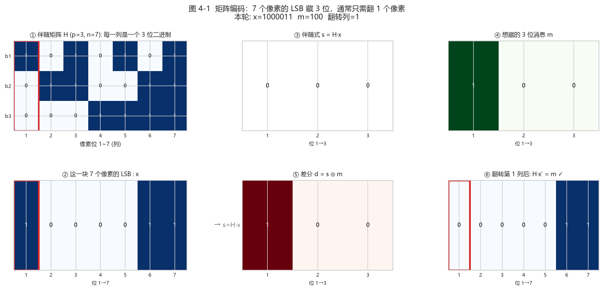
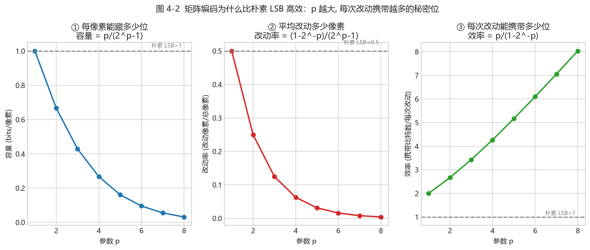
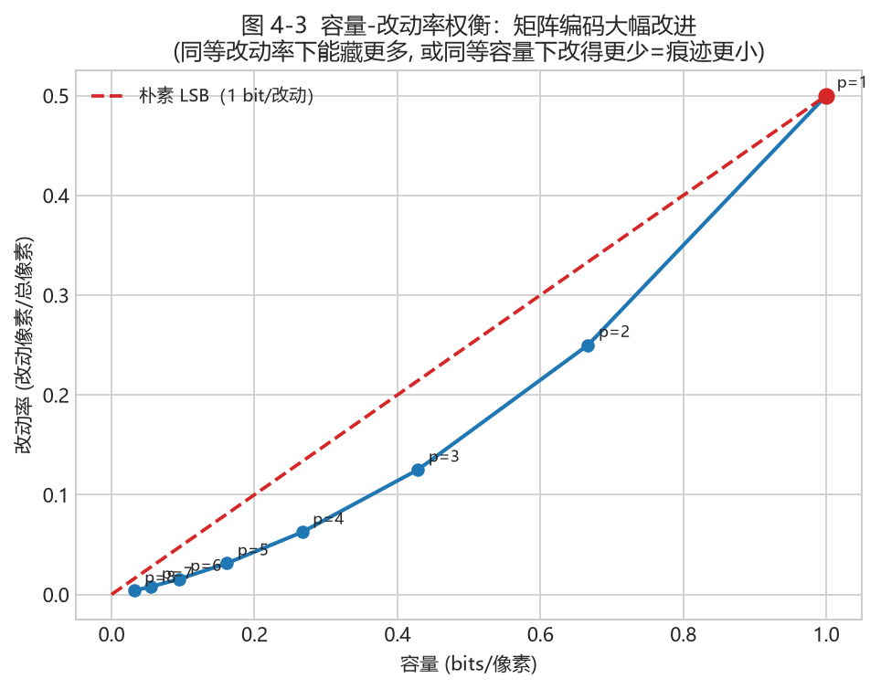

# 第 4 章 · 矩阵编码与 F5：少改一点，藏得更多（第 5 周）

<!-- lang-switch -->
> [🌐 English version](https://yukinoshita-lin.github.io/nsf5-steganography/en/content/ch04.html)


> **动手做｜** 本章目标：理解“嵌入效率”为什么重要；能手算 p=3 的汉明伴随式嵌入例子；看懂矩阵编码的原理图与效率曲线；知道 F5 的“收缩”问题出在哪。

## 4.1 从“每像素 1 位”到“平均每次改动藏 p 位”

朴素 LSB 每藏 1 bit 就平均改动 0.5 个像素，嵌入效率很低。如果有一种编码：每读 n 个像素组成的块，就能通过**最多改动 1 个像素**写入 p 位消息，改动次数就会大幅下降。这个想法叫 **矩阵嵌入（Matrix Embedding）**，它用到的数学工具是二元汉明码。

定义嵌入效率 α = 平均每次修改所携带的比特数。理论极限是每次修改最多携带 p 位，α(p) = p·2ᵖ/(2ᵖ−1)：p=2 时约 2.67，p=3 时约 3.43，p=4 时约 4.27，随 p 增大而上升，但需要的块长 n=2ᵖ−1 也在变大。

> **新手提示｜** 为什么 p 越大“越划算”？因为汉明码用 n=2ᵖ−1 个位置承载 p 位消息；p 越大，n 相对 p 的“浪费”越少，平均改 1 次能寄的信息越多。代价是块变大、可嵌入消息对载体结构更挑剔。我们先看 图 4-1 怎么直观体现“7 个像素装 3 位、只翻 1 个像素”。

## 4.2 汉明码速成：校验矩阵与伴随式

设块长 n=2ᵖ−1。构造一个 p×n 的**校验矩阵 H**，它的 n 列恰好是 GF(2)ᵖ 里的全部非零向量：p=3 时，七列就是二进制 1..7。把块内 n 个像素的 LSB 写成列向量 x，定义伴随式 s = H·x (mod 2)，它是一个 p 位向量。

嵌入 p 位消息 m 时，我们想通过翻转个别位，让新伴随式等于 m。因为 H 的每一列都不同，翻转第 j 位只会把伴随式变成 s⊕Hⱼ——也就是说，**任意需要的伴随式变化都对应某一列**。

1. 计算当前伴随式 s = H·x；
2. 若 s == m，块内无需改动；
3. 否则求差值 d = s ⊕ m（p 位非零向量）；
4. 在 H 中找到等于 d 的那一列，记为第 j 列；
5. 翻转第 j 个像素的 LSB，完成（H·x′ = m）。



*图 4-1（真实计算：① 校验矩阵 H（p=3, n=7），红色框是高亮的“目标列”；② 这一块的 7 个像素 LSB：x；③ 当前伴随式 s=H·x；④ 想藏的 3 位消息 m；⑤ 差分 d=s⊕m。因为 d 恰好等于 H 的第 1 列，所以② 里只需翻转第 1 个像素的 LSB，就得到 ⑥ 的新伴随式 = m）*

**把这张图读透，你就掌握了矩阵编码的全部**：
- **H 有 7 列，每一列是一个 3 位二进制**（对应 1~7）；
- **s = H·x**：把 x 里为 1 的位置对应的列异或起来，就得到当前伴随式；
- **想让伴随式变成 m**，只需把“等于 d=s⊕m”的那一列对应的像素 LSB 翻转；
- 结论：**藏 3 位消息，绝大多数情况只需改 1 个像素**。

## 4.3 手算一个 p=3 的例子

设块内 7 个像素的 LSB 为 x = [0,1,0,1,1,0,1]。列向量按二进制顺序（低位在上）：H₁=[1,0,0]，H₂=[0,1,0]，H₃=[1,1,0]，H₄=[0,0,1] 依此类推。先算伴随式：x 中取 1 的位置是第 2、4、5、7 列，做异或：H₂⊕H₄⊕H₅⊕H₇ = [0,1,0]⊕[0,0,1]⊕[1,0,1]⊕[1,1,1] = [0,0,1]，所以 s=[0,0,1]。

想嵌入 m=[1,1,0]：d = s⊕m = [0,0,1]⊕[1,1,0] = [1,1,1]。H₇=[1,1,1]，命中第 7 列，于是只翻转第 7 个像素的 LSB：x′=[0,1,0,1,1,0,0]。再算一次 s′=H·x′=[1,1,0]=m，成功。

**7 个像素承载 3 位消息，但平均只需要改动 (2³−1)/2³ ≈ 87.5% 的块里改 1 位**——约 0.875 次/块，折算每 3 位约 0.875 次改动，即每次改动约带 3.43 位。

> **动手做｜** 项目里 `src/matrix_demo.py` 把这个过程变成了可点击的可视化面板（GUI 的“矩阵编码演示”标签页）。先用 `demo_step(p, x, m_bin)` 看返回的字典里 s、d、命中的列号，再手工验证 H·x′ == m。

## 4.4 为什么高效很关键：容量、改动率与可检测性

单纯“藏得进去”不算本事；真正要紧的是**同样的消息量，改得越少，统计痕迹越小，越难被检测**。我们用真实公式把三种量随 p 的变化画出来，你就明白矩阵编码的取舍了。



*图 4-2（真实计算：随参数 p 增大——① 每像素容量 p/(2ᵖ−1) 单调下降；② 平均改动率 (1−2⁻ᵖ)/(2ᵖ−1) 大幅下降；③ 每次改动携带的比特数（嵌入效率）p/(1−2⁻ᵖ) 单调上升。虚线是朴素 LSB 的基准：容量 1、改动率 0.5、效率 1）*

**读图要点**：
- **改动率**（②）是“痕迹”的直接度量：p 越大，藏同样的消息改动的像素越少，越难被统计检测抓住；
- **效率**（③）衡量“每次改动有多少价值”：p=3 时约 3.43 位/改动，是朴素 LSB 的 3 倍多；
- **代价**（①）：p 越大，每像素容量越小，要藏同样多的消息需要更大的载体。

把它们合到一张“容量-改动率”权衡图上，取舍一目了然：



*图 4-3（真实计算：蓝线是矩阵编码在不同 p 下的“容量(横轴) vs 改动率(纵轴)”；红色虚线是朴素 LSB。可以看出，矩阵编码整条线都明显“低很多”——**同样的改动率下能藏更多，或同样的容量下改得更少、痕迹更小**。这就是为什么第 5 章的 nsF5 坚持用矩阵嵌入）*

> **新手提示｜** 隐写性能通常用两个数衡量：**容量**（能藏多少）与**失真/改动率**（会被察觉多少）。矩阵嵌入的意义就是**在同样的失真下把容量做上去**，或在同样容量下把失真压下来。这一“改得越少越安全”的思想，贯穿第 5 章 nsF5 与第 8 章检测。

## 4.5 F5：矩阵编码 + JPEG 系数减幅

F5 是 Westfeld 提出的 JPEG 隐写：在量化 DCT 交流系数上做矩阵嵌入。修改“位”不是翻转 LSB，而是让系数的**绝对值减小 1**（例如 +3→+2、−5→−4），这样既改变 LSB 奇偶，又不容易引入显著统计异常。

问题出在“收缩”：当绝对值已经是 1 的系数被减幅，会直接变成 0。而 0 系数在 JPEG 解码里意味着“没有这个频带分量”，F5 认为它不再是合法载体，于是丢掉这块、重试后续消息。**收缩**导致实际载荷变小、修改效率低于理论值，还留下可被统计的特征。

## 4.6 回到项目：MatrixEmbedding

> **回到项目看代码｜** 打开 `src/ns5_core.py` 的 `MatrixEmbedding` 类：`_embed()` 正是 4.2/4.3 步骤的直接代码——计算 s、比较 m、找列、翻转。而 图 4-1/4-2/4-3 就是这段代码背后数学的可视化。

*MatrixEmbedding._embed() 核心（真实代码节选）*

```python
xl = (c[pos] & 1).astype(np.uint8)     # 取块内 LSB
s  = syndrome(H, xl)                     # s = H·x
if np.array_equal(s, m): continue        # 恰好命中，不改
d = (s ^ m).astype(np.uint8)             # 差值
col = int(np.where(np.all(H == d[:, None], axis=0))[0][0])
c[pos[col]] ^= 1                         # 翻转命中像素
```

> **回到项目看代码｜** `src/efficiency.py` 的 `plot_code_family_and_efficiency()` 也会画出码族与效率图（保存到 `output/efficiency.png`），可与 图 4-2 互相印证。

## 4.7 小结与自我检查

- 矩阵嵌入以“块”为单位：n 个位置承载 p 位、至多改 1 位（图 4-1）；
- H 列互不相同 ⇒ 任意伴随式差值都能定位到唯一需要翻转的位置；
- 嵌入效率 α=p·2ᵖ/(2ᵖ−1)，随 p 增加但块长也增加（图 4-2）；
- **容量-改动率权衡**：改得越少越难检测（图 4-3），这是“为什么矩阵编码”的根本答案；
- F5 在 JPEG 系数上减幅嵌入，遇到 |系数|=1 减到 0 就“收缩”。

> **想一想｜** 如果 F5 遇到收缩就“跳过重试”，消息还可能正确解码吗？解码端如何知道哪块被跳过？想不通没关系——第 5 章的 nsF5 用湿纸编码彻底绕开了这个难题。再想一层：结合 图 4-3，如果我只想藏 0.2 bit/像素，矩阵编码能把改动率压到多少（相比朴素 LSB 的 0.1）？这直接决定了隐写检测的难度。
