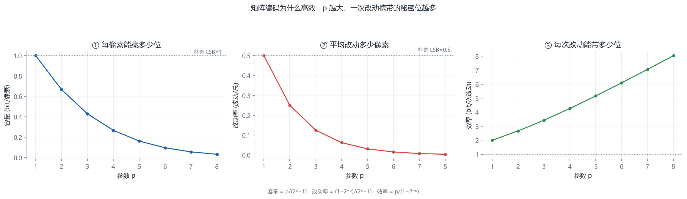
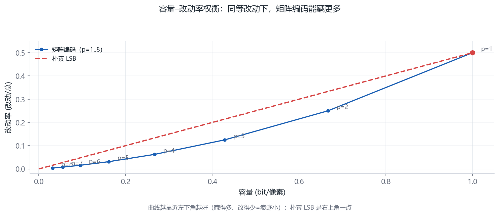
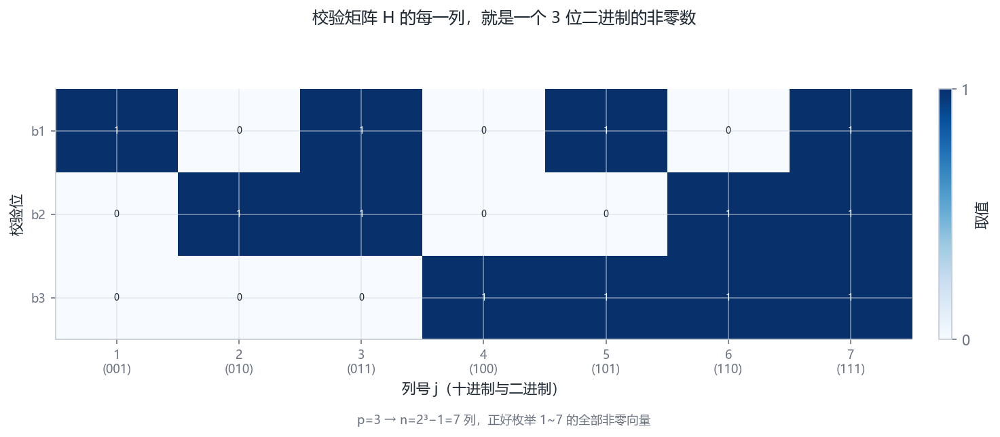
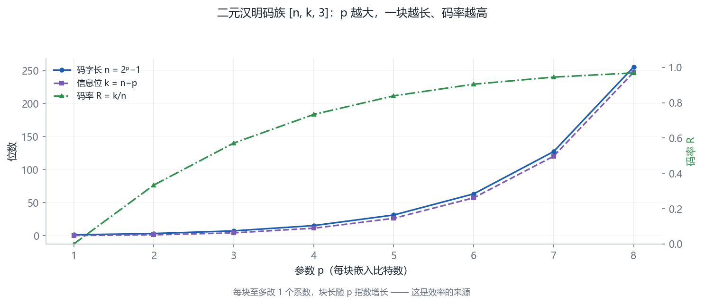
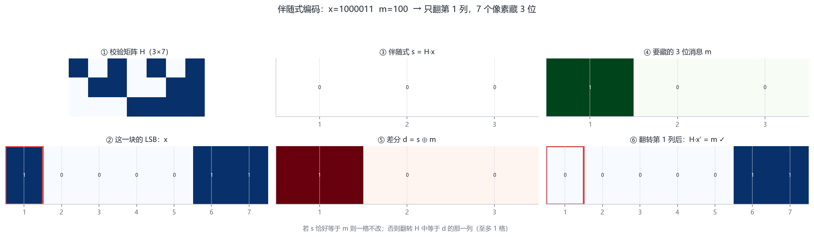
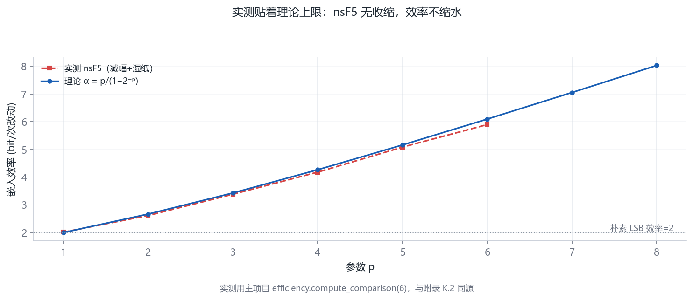
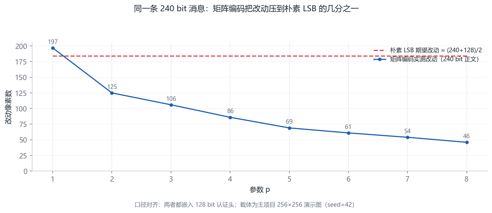

# 第 4 章 · 矩阵编码与 F5：少改一点，藏得更多（第 5 周）

<!-- lang-switch -->
> [🌐 English version](https://yukinoshita-lin.github.io/nsf5-steganography/en/content/ch04.html)


> **本章导航** ·　先看问题，再读正文
> 
> **核心问题　每像素只能藏 1 位的 LSB，能不能做到“少改一点、藏得更多”？**
> 
> **读完你能回答**
> 
> - 写出汉明校验矩阵 H 与伴随式定位的完整过程；
> 
> - 手算一个 p=3 的例子：从 H、x、s、m 到“翻转哪一列”；
> 
> - 解释嵌入效率 α 与参数 p 的关系，说明矩阵编码为什么更划算；
> 
> - 说清 **F5 = 矩阵编码 + JPEG 系数减幅**。
> 
> *从“每像素 1 位”到“平均每次改动藏 p 位”——这一章讲的是那笔省下来的账。*

**开场问题：把 3000 比特藏进一张图，最少要改多少个像素？**朴素 LSB 的答案是约 1500 次（一半像素 LSB 不对）。但 1990 年代末 Crandall 提出的矩阵编码给出了一种交易：**用更多的位置，换更少的改动**——把像素分成块，每块 7 个位置只承载 3 个比特，并且保证每块至多改 1 个位置。改动数立刻从 1500 降到约 875。这不是魔法，是汉明码。本章把这笔交易的定价公式推导出来，并用项目实测数据对账。

| **小节** | **回答的问题** | **你的产出** |
| --- | --- | --- |
| 4.1 效率问题 | “少改”值多少钱？ | 能定义嵌入效率 α |
| 4.2 汉明码速成 | H 矩阵和伴随式怎么用？ | 能写出 p=3 的 H 并解伴随式 |
| 4.3 手算例子 | 一整块怎么嵌、怎么纠错？ | 能独立复算 4.3 的例子 |
| 4.4 F5 | 换到 JPEG 系数上会出什么新问题？ | 能解释收缩的连锁反应 |
| 4.5 回到项目 | 实测效率与理论差多少？ | 能对照效率曲线读出结论 |

> **动手做｜
本章目标：理解“嵌入效率”为什么重要；能手算 p=3 的汉明伴随式嵌入例子；知道 F5 的“收缩”问题出在哪。**

## 4.1 从“每像素 1 位”到“平均每次改动藏 p 位”

朴素 LSB 每藏 1 bit 就平均改动 0.5 个像素，嵌入效率很低。如果有一种编码：每读 n 个像素组成的块，就能通过最多改动 1 个像素写入 p 位消息，改动次数就会大幅下降。这个想法叫 矩阵嵌入（Matrix Embedding），它用到的数学工具是二元汉明码。

定义嵌入效率 α = 平均每次修改所携带的比特数。理论极限是每次修改最多携带 p 位，α(p) = p·2ᵖ/(2ᵖ−1)：p=2 时约 2.67，p=3 时约 3.43，p=4 时约 4.27，随 p 增大而上升，但需要的块长 n=2ᵖ−1 也在变大。

> **新手提示｜
为什么 p 越大“越划算”？因为汉明码用 n=2ᵖ−1 个位置承载 p 位消息；p 越大，n 相对 p 的“浪费”越少，平均改 1 次能寄的信息越多。代价是块变大、可嵌入消息对载体结构更挑剔。**



图 4-1 容量 / 改动率 / 效率随 p 的理论曲线。这张图回答的是：矩阵编码为什么比朴素 LSB 更划算？三条理论曲线，虚线为朴素 LSB 参照——矩阵编码为什么更划算，一图看懂



图 4-2 容量–改动率权衡曲线。这张图回答的是：少改一点，究竟能省多少？矩阵编码的容量-改动率曲线与朴素 LSB 对照点：少改一点，藏得更多

## 4.2 汉明码速成：校验矩阵与伴随式

设块长 n=2ᵖ−1。构造一个 p×n 的校验矩阵 H，它的 n 列恰好是 GF(2)ᵖ 里的全部非零向量：p=3 时，七列就是二进制 1..7。把块内 n 个像素的 LSB  写成列向量 x，定义伴随式 s = H·x (mod 2)，它是一个 p 位向量。

嵌入 p 位消息 m 时，我们想通过翻转个别位，让新伴随式等于 m。因为 H 的每一 列都不同，翻转第 j 位只会把伴随式变成 s⊕Hⱼ——也就是说，任意需要的伴随式 变化都对应某一列。

计算当前伴随式 s = H·x；

若 s == m，块内无需改动；

否则求差值 d = s ⊕ m（p 位非零向量）；

在 H 中找到等于 d 的那一列，记为第 j 列；

翻转第 j 个像素的 LSB，完成（H·x′ = m）。

把 4.2 节的流程变成一张可以贴在墙上的“对账表”：p=3 时，H 的 7 列恰好是二进制 1..7 的全部非零向量，于是“伴随式差值 d”与“要翻转的位置”一一对应——查表即可，不用解方程：

| **差值 d（伴随式变化）** | **命中的 H 列** | **要翻转的像素（块内第几位）** |
| --- | --- | --- |
| [1,0,0] | H₁ | 第 1 位 |
| [0,1,0] | H₂ | 第 2 位 |
| [1,1,0] | H₃ | 第 3 位 |
| [0,0,1] | H₄ | 第 4 位 |
| [1,0,1] | H₅ | 第 5 位 |
| [0,1,1] | H₆ | 第 6 位 |
| [1,1,1] | H₇ | 第 7 位 |

这张表还藏着矩阵编码最漂亮的一个性质：**d = [0,0,0]（当前伴随式恰好等于目标）时，一个位都不用翻**。消息随机时，这种情况以 1/2ᵖ 的概率发生（p=3 即 1/8 的块“免改”）。这不是运气，是设计：n 个位置承載 p 位消息，本来就有 2^p 种伴随式状态，目标状态撞上当前状态的概率就是 1/2^p。第 5 章你会看到，nsF5 还要在这个“免改概率”上叠加一层湿纸约束。

> **想一想｜** 为什么 H 的列必须**互不相同**？假设有两列相同（比如 H₃ = H₅），d = H₃ 时翻第 3 位或第 5 位都行——看似更灵活，但 d = H₃⊕H₅ = 0 时会产生什么歧义？反过来想：n 列互不相同且取遍全部非零向量，这为什么恰好要求 n = 2ᵖ − 1？（这是“块长为什么是 2ᵖ−1”的代数根源。）

把伴随式的定义写成式子。所有运算都在 GF(2)（模 2）上进行：加法即异或，乘法即与。p×n 校验矩阵 H 的第 j 列记作 Hⱼ，则块内 LSB 向量 x 的伴随式是：

也就是说：**伴随式 = 所有“值为 1 的位置”所对应 H 列的异或**。嵌入时希望伴随式从 s 变到 m，需要补上的差值 d = s ⊕ m，而 d 恰好等于某一列时，翻转那一位即可。p=3 的 H 矩阵如下（列从左到右为 H₁…H₇，与 4.3 节的手算一致）：

| `1` | `0` | `1` | `0` | `1` | `0` | `1` |
| --- | --- | --- | --- | --- | --- | --- |
| `0` | `1` | `1` | `0` | `0` | `1` | `1` |
| `0` | `0` | `0` | `1` | `1` | `1` | `1` |

七列按二进制读出恰好是 1..7 的全部非零向量（列序 4,2,6,1,5,3,7 是项目 build_hamming 的固定实现）。这张表配上 4.2 节的查表流程，就是矩阵编码的全部数学。



图 4-3 汉明校验矩阵 H（p=3）。这张图回答的是：伴随式凭什么能定位到“该翻哪一列”？H 的列按 1~7 的二进制排列，第 j 列即 j 的三位二进制——伴随式定位的全部秘密



图 4-4 汉明码族参数。这张图回答的是：参数 p 变大，是省了改动还是费了位置？码字长 n、信息位 k 与码率 R 随参数 p 的变化——p 越大越省改动、越费位置

## 4.3 手算一个 p=3 的例子

设块内 7 个像素的 LSB 为 x = [0,1,0,1,1,0,1]。列向量按二进制顺序（低位在上）：H₁=[1,0,0]，H₂=[0,1,0]，H₃=[1,1,0]，H₄=[0,0,1] 依此类推。先算伴随式：x 中取 1 的位置是第 2、4、5、7 列，做异或：H₂⊕H₄⊕H₅⊕H₇ = [0,1,0]⊕[0,0,1]⊕[1,0,1]⊕[1,1,1] = [0,0,1]，所以 s=[0,0,1]。

想嵌入 m=[1,1,0]：d = s⊕m = [0,0,1]⊕[1,1,0] = [1,1,1]。H₇=[1,1,1]，命中第 7 列，于是只翻转第 7 个像素的 LSB：x′=[0,1,0,1,1,0,0]。再算一次 s′=H·x′=[1,1,0]=m，成功。

7 个像素承载 3 位消息，但平均只需要改动 (2³−1)/2³ ≈ 87.5% 的块里改 1 位——约 0.875 次/块，折算每 3 位约 0.875 次改动，即每次改动约带 3.43 位。

> **动手做｜
项目里 src/matrix_demo.py 把这个过程变成了可点击的可视化面板（GUI 的“矩阵编码演示”标签页）。先用 demo_step(p, x, m_bin) 看返回的 字典里 s、d、命中的列号，再手工验证 H·x′ == m。**



图 4-5 伴随式编码六步流程（p=3 手算例）。这张图回答的是：从 H、x、s、m 到“翻转哪一列”，中间经过哪几步？从 H、x、s、m、d 到翻转一列的完整算例——块内至多修改 1 个系数

理论效率 α(p) = p·2ᵖ/(2ᵖ−1) 的推导，值得用三行算草纸写清楚，因为它解释了“为什么值得”（原文 4.1 已给出公式）：每块 n = 2ᵖ−1 个位置承载 p 位；由 4.2 节，块需要改动的概率是 (2ᵖ−1)/2ᵖ，因此每块平均改动次数是 1 − 1/2ᵖ；于是

```text
α(p) = 携带比特 / 平均改动 = p / (1 − 1/2ᵖ)
     = p·2ᵖ / (2ᵖ − 1)
p=1: 2/1   = 2.00    p=2: 8/3   ≈ 2.67
p=3: 24/7  ≈ 3.43    p=4: 64/15 ≈ 4.27
p→∞ : α → p（每块最多改 1 位，极限就是“每改 1 位带 p 位”）
```

理论要过实测这一关。用 run_e2e.py 的效率扫描（同一张图、**满容量填充**，实测 2026-10-04；数字口径为 compute_comparison(6)，即把每个 p 的可用位置全部填满）：

| **p** | **块长 n** | **码率 k/n** | **理论 α** | **实测 α** | **实测改动像素** |
| --- | --- | --- | --- | --- | --- |
| 1 | 1 | 1.00 | 2.00 | 2.01 | 32 502 |
| 2 | 3 | 0.33 | 2.67 | 2.62 | 16 655 |
| 3 | 7 | 0.43 | 3.43 | 3.38 | 8 263 |
| 4 | 15 | 0.27 | 4.27 | 4.18 | 4 149 |
| 5 | 31 | 0.16 | 5.16 | 5.08 | 2 054 |
| 6 | 63 | 0.10 | 6.10 | 5.90 | 1 035 |

三行结论，行行有味道。其一，实测 α 略低于理论 α——像素域的湿点保护（第 5 章）会 occasionally 改变可翻转集合，这是真实系统对理想公式的“摩擦力”。其二，改动数随 p 指数级下降，但**码率**（每位置承载的比特数）也在暴跌：p=6 时 63 个位置只带 6 位，大部分容量被浪费了。其三，改动越少，统计指纹越弱——**效率、容量、安全性三者构成一个铁三角**，任何隐写算法都是在这三者之间选一个操作点。这本书剩下的所有算法对比，都是在挪这个三角形的顶点。

**口径提醒（勿混比）。** 上表的“实测改动像素”是**满容量填充**的结果，不是某条固定消息的结果。若换成 run_e2e.py 里那条 63 字节（504 比特）的演示消息，同一张图 p=3 只需改动 **188** 像素（第 2 章 run_e2e 输出里的“改动 188 像素”就是它）。8 263 与 188 分母不同：前者是“填满所有可用位置”，后者是“只藏 504 比特”。附录 K.2 已把两个口径分列成两行，便于逐行对账。

> **想一想｜** run_e2e.py 实测里 p=1 的改动数是 32 502，而朴素 LSB（无矩阵编码）改同一消息约需多少次？（提示：504 比特 × 0.5 = 252。）咦，比 32 502 少多了？——注意 p=1 时块长 n=1、码率 1.0，它就是朴素 LSB 本身；32 502 是“整个随机测试图全部位置”的改动数，而 252 是 504 比特消息的改动数。搞清这两个数字的分母差异，你就真正读懂了效率表。

把效率推导写成两行式子。一块 n = 2ᵖ−1 个位置承载 p 位，由查表可知：伴随式差值 d 均匀分布于 2ᵖ 种取值，其中 d = 0（免改）占 1/2ᵖ，其余每种各占 1/2ᵖ、各对应恰好 1 次翻转。于是每块平均改动次数为：

每块携带 p 位，所以效率（每次改动平均携带的比特数）为：

而实测 α(3) = 3.38（504 比特、8 263 次改动，2026-10-04）——与理论的差值来自像素域湿点保护，第 5 章会把这个“摩擦力”变成主角。

## 4.4 F5：矩阵编码 + JPEG 系数减幅

把“收缩”的连锁反应用一个具体序列走一遍，你会看到它为什么比“损失容量”更讨厌。设某块抽到的载体系数（按提取顺序）是 [+3, +1, −2, +4, +1, −3, +5]，伴随式计算指出需要翻转第 2 位。第 2 位是 +1——减幅后变成 0。此时灾难分三步发生：

1. 提取端收集载体时按“非零 AC”过滤，这个突然归零的系数从序列里消失，**后面所有系数的序号整体前移一位**——不仅是这一块，包括后续所有块；

2. 伴随式从此全错，除非把这一块整个作废、消息从下一块重新开始（F5 的做法）；

3. 作废意味着容量损失，重试意味着更多减幅、更多 +1 系数被卷进来——嵌得越满，收缩雪崩越猛。

更隐蔽的是第三层：被减到 0 的系数在直方图上留下凹痕（0 过多、±1 偏少），这本身就是可检测特征——第 5 章的湿纸编码会把这批“碰不得”的位置圈出来绕着走，一劳永逸地掐灭这场雪崩。

F5 是 Westfeld 提出的 JPEG 隐写：在量化 DCT 交流系数上做矩阵嵌入。修改“位”不是翻转 LSB，而是让系数的绝对值减小 1（例如 +3→+2、−5→−4），这样既改变 LSB 奇偶，又不容易引入显著统计异常。

问题出在“收缩”：当绝对值已经是 1 的系数被减幅，会直接变成 0。而 0 系数在 JPEG 解码里意味着“没有这个频带分量”，F5 认为它不再是合法载体，于是丢掉 这块、重试后续消息。收缩导致实际载荷变小、修改效率低于理论值，还留下 可被统计的特征。

## 4.5 回到项目：MatrixEmbedding 与效率曲线

> **回到项目看代码｜
打开 src/ns5_core.py 第 216 行附近的 MatrixEmbedding 类： _embed() 正是 4.3 步骤的直接代码——计算 s、比较 m、找列、翻转。 src/efficiency.py 则画出了理论 α(p) 与实测效率的对比图。**

MatrixEmbedding._embed() 核心（真实代码节选）

```text
xl = (c[pos] & 1).astype(np.uint8)     # 取块内 LSB
s  = syndrome(H, xl)                     # s = H·x
if np.array_equal(s, m): continue        # 恰好命中，不改
d = (s ^ m).astype(np.uint8)             # 差值
col = int(np.where(np.all(H == d[:, None], axis=0))[0][0])
c[pos[col]] ^= 1                         # 翻转命中像素
```

生成并查看码族/效率图

```python
import sys; sys.path.insert(0, "src")
from efficiency import plot_code_family_and_efficiency
path = plot_code_family_and_efficiency(p_max=6)
print(path)   # output/efficiency.png
```



图 4-6 理论 vs 实测嵌入效率。这张图回答的是：汉明码族的理论收益，在真实载体上兑现了多少？理论嵌入效率曲线与 nsF5 实测值——汉明码族的理论收益在真实载体上兑现了多少



图 4-7 固定消息的改动数对比。这张图回答的是：实测改动数真的贴合理论吗？同一 240 bit 正文下，各 p 的实测改动像素与朴素 LSB 期望——实测贴合理论

## 4.6 小结与自我检查

矩阵嵌入以“块”为单位：n 个位置承载 p 位、至多改 1 位；

H 列互不相同 ⇒ 任意伴随式差值都能定位到唯一需要翻转的位置；

嵌入效率 α=p·2ᵖ/(2ᵖ−1)，随 p 增加但块长也增加；

F5 在 JPEG 系数上减幅嵌入，遇到 |系数|=1 减到 0 就“收缩”。

> **想一想｜
如果 F5 遇到收缩就“跳过重试”，消息还可能正确解码吗？解码端如何知道哪块被跳过？想不通没关系——第 5 章的 nsF5 用湿纸编码彻底绕开了这个难题。**

**本章小结。**矩阵编码 = 用块内冗余换改动次数：n=2ᵖ−1 个位置带 p 位、至多改 1 位、平均改动 1−1/2ᵖ 次；效率 α = p·2ᵖ/(2ᵖ−1)（p=3 时 24/7≈3.43，实测 3.38）；F5 把这套编码搬到 JPEG 系数上，用减幅代替翻转，代价是收缩。

> **动手做｜** 章末练习（提示与答案见附录 J）
> 
> P4.1（手算）x = [1,1,0,1,0,0,1]，想嵌入 m = [0,1,1]。算出伴随式、差值 d、要翻转的位置与最终码字；再对码字做一次“错第 5 位→纠错”的演练。
> 
> P4.2（推导）p=2 时写出 H 的全部 3 列（二进制 1、2、3），并推导 α(2) = 8/3。若一条 600 比特的消息分别用 p=2 与 p=3 嵌入，各需要多少块？各平均改多少位？
> 
> P4.3（思考）矩阵编码的“免改概率”是 1/2ᵖ。如果消息不是随机的而是全 0（比如一段静音数据），免改概率还成立吗？这对隐写实践有什么提醒？
> 
> P4.4（上机）跑 4.5 节的 efficiency 扫描，把消息长度改成 1008 比特，观察各 p 档的改动数是否恰好翻倍；解释你的观察。
> 
> P4.5（思考·选做）“改动少”与“容量大”在 p 的选择上是对抗的。如果你要往一张 512×512 的图里藏一封 2 KB 的信，你会选哪个 p？列出你的算术。
