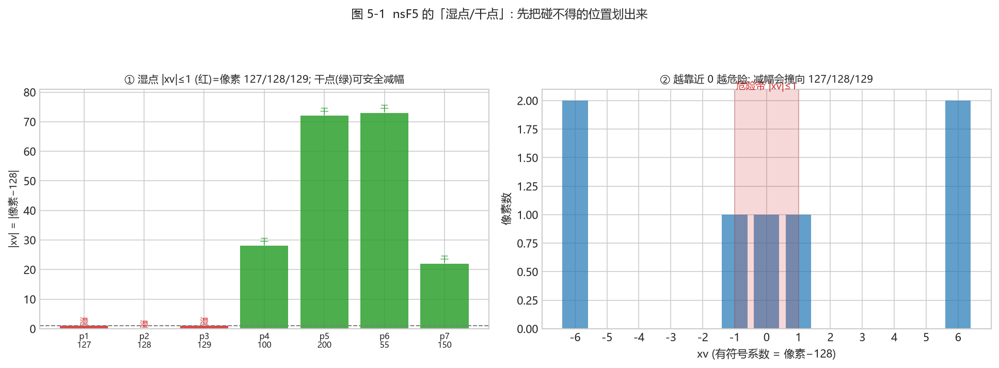
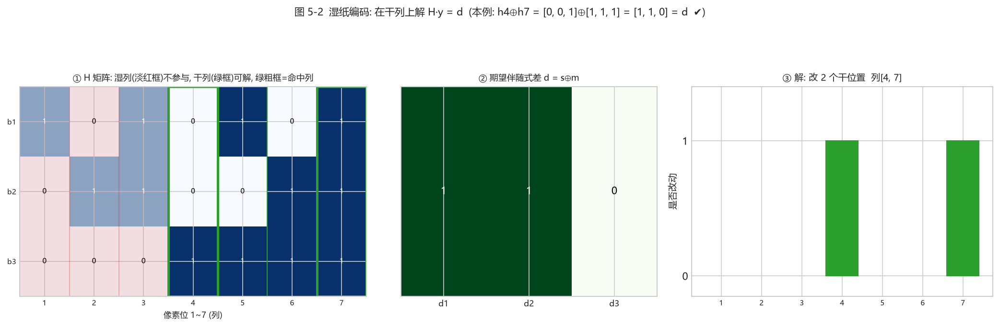

# 第 5 章 · nsF5 与湿纸编码：项目的核心算法（第 6 周）

<!-- lang-switch -->
> [🌐 English version](https://yukinoshita-lin.github.io/nsf5-steganography/en/content/ch05.html)


> **动手做｜** 本章目标：说清“收缩”为什么伤效率；理解湿纸编码“湿点不动、干点解方程”的思想；能对照 ns5_core.py 讲出 nsF5 嵌入的完整流程。我们配了两张真实计算图（图 5-1 / 图 5-2）。

## 5.1 先把问题拧清楚：F5 的收缩

F5 在 JPEG 量化系数上做减幅修改：系数绝对值每被减 1，LSB 奇偶就翻转一次。但绝对值 = 1 的系数（例如 +1、−1）再减就变成 0。对 JPEG 来说，0 系数是“缺席的频带”，不适合继续当载体，F5 只能放弃这一块重新寻找位置——这就是**收缩（shrinkage）**。

- 收缩让**实际容量**低于理论值：块被浪费，消息需要更多位置；
- 收缩让**嵌入效率**低于 α(p)：为补偿损失需要更多次修改；
- 收缩还会留下可检测的统计特征：被改到 0 的系数变多，直方图出现异常。

项目在空间域（像素）上做了一个巧妙类比：把像素值减去 128 变成“有符号值” xv = 像素 − 128，于是 |xv|≤1 的像素（127、128、129）就是“减幅会撞到零附近”的危险位置。矩阵嵌入在 JPEG 上的收缩难题，在像素域里变成了“127/128/129 不能作为普通修改对象”的同一问题。

## 5.2 湿纸编码：先划湿点，再解方程

**湿纸编码（Wet Paper Coding）** 是 Fridrich 等人提出的框架，用来回答一个问题：如果载体里有一部分位置“碰不得”（像被水浸湿的纸，写了也看不见），能不能只用其余“干”位置完成消息嵌入？

答案是可以，而且不需要通信双方预先商量哪些位置是湿的——只要算法能从图像内容本身重建出同样的湿/干划分即可。项目正是这样做的：

1. 对每个块，先找出“减幅会变成零/危险”的位置，标记为湿点；
2. 真正的问题是：在**干位置**集合上找一个修改向量 e，使翻转这些位置后整块的伴随式恰好等于目标 m；
3. 即解方程 H[:,干] · y = d，其中 d = s⊕m 是期望的伴随式变化；
4. 项目按“单个干列命中 → 两个干列异或命中 → GF(2) 高斯消元兜底”的顺序求解，尽量少改；
5. 解出的 y 是 0/1 向量：y=1 的位置就是实际要减幅的干位置。



*图 5-1（真实计算：① 一个 p=3 的块，像素 127/128/129 因 “|xv|≤1、减幅会撞向 0” 被判为**湿点**(红)，其余为**干点**(绿)；② 把像素−128 映成有符号系数 xv，越靠近 0 越危险）*

> **读图要点｜** 第一步永远是“**先划湿点**”：把减幅后可能变成非法值（0 系数 / 撞零）的位置提前排除。这样后面的嵌入只会在安全的位置上发生——这正是 nsF5 能不收缩、不重试的关键。

> **新手提示｜** 为什么“先标记湿点”就不收缩了？因为收缩的根源是“改到一半才发现改成了 0”。nsF5 把所有会撞零的位置提前排除，只在保证安全的干点上求解，于是每个块都能成功嵌入，既不用重试，也不会出现多余的 0 系数。

## 5.3 读懂项目：nsF5Pixel._embed()

`src/ns5_core.py` 里 `nsF5Pixel` 类继承自 `MatrixEmbedding`，只重写了 `_embed()`。逐行读这段代码，你会看到完整的 nsF5 决策树：

*nsF5Pixel._embed() 决策树（伪代码流程，逻辑与原代码一致）*

```text
xv = c[pos].astype(np.int16) - 128     # 像素→有符号系数
s = syndrome(H, (xv & 1).astype(np.uint8))
if s == m: continue                    # 伴随式已匹配
tc = 命中列(H, s ^ m)                  # 最“直接”的候选位置
if abs(xv[tc]) > 1:                    # 减幅不会撞零 → 直接改
    c[pos[tc]] -= sign(xv[tc])         # 向 128 靠拢一步
else:                                  # 候选位置是湿点
    dry = [k for k in range(n) if abs(xv[k]) > 1]
    e = solve_wet_paper(H, dry, d)     # 只在干点上解方程
    if e: 按 e 减幅所有命中干点
    else: 兜底翻转目标位 LSB（保证可解码）
```

## 5.4 再看三个求解函数

| **函数** | **作用** | **关键点** |
| --- | --- | --- |
| solve_wet_paper(H, dry_cols, target) | 在干列里找尽量稀疏的解 | 权重 1 → 权重 2 → 高斯兜底 |
| gauss_solve_GF2(cols, b) | GF(2) 高斯消元解线性方程组 | 自由变量置 0 压低改动数 |
| permute_index(total, seed) | 确定性伪随机置换 | splitmix64 + Fisher–Yates，可 C++ 加速 |

### 5.4.1 一个能算的 GF(2) 例子（p=3，干列足够）

设 p=3。`build_hamming(3)` 生成的第 j 列就是二进制数 j 的 3 位展开（最低位在上），把它写成 $h_1,\dots,h_7$：

$$
H=\begin{bmatrix}
1&0&1&0&1&0&1\\
0&1&1&0&0&1&1\\
0&0&0&1&1&1&1
\end{bmatrix},
\qquad
h_1=\begin{smallmatrix}1\\0\\0\end{smallmatrix},
h_2=\begin{smallmatrix}0\\1\\0\end{smallmatrix},
h_3=\begin{smallmatrix}1\\1\\0\end{smallmatrix},
h_4=\begin{smallmatrix}0\\0\\1\end{smallmatrix},
h_5=\begin{smallmatrix}1\\0\\1\end{smallmatrix},
h_6=\begin{smallmatrix}0\\1\\1\end{smallmatrix},
h_7=\begin{smallmatrix}1\\1\\1\end{smallmatrix}
$$

假设块内像素 1、2、3 是湿点（`|xv|≤1`，即 127/128/129），干列是 $\{4,5,6,7\}$。再假设期望的伴随式差 $d = s\oplus m = (1,1,0)^\top$。



*图 5-2（真实计算：① H 矩阵——湿列(淡红框)不参与，干列(绿框)可解，绿粗框=命中的列；② 期望的伴随式差 d；③ 解：在干列上找尽量少的列使其异或等于 d。本例单列无命中，双列命中 h₄⊕h₇ = d，于是改第 4、7 两列）*

> **读图要点｜**
> - **单列命中**：看干列里有没有一列恰好等于 d（本例没有）；
> - **双列命中**：看有没有两列异或等于 d（本例 h₄⊕h₇=[0,0,1]⊕[1,1,1]=[1,1,0]=d，命中）；
> - 若都不行，才上 **GF(2) 高斯消元**兜底。**核心：只在“干点”上解方程，湿点完全不动。**

**第一步，单列命中：** 看四个干列有没有一个恰好等于 $d=(1,1,0)^\top$：$h_4=(0,0,1)^\top$、$h_5=(1,0,1)^\top$、$h_6=(0,1,1)^\top$、$h_7=(1,1,1)^\top$。都没有等于 $(1,1,0)^\top$ → 单列无命中。

**第二步，双列异或：** 找两个干列异或等于 $d$。例如 $h_5\oplus h_6 = (1,0,1)^\top\oplus(0,1,1)^\top=(1,1,0)^\top = d$ ✔。**命中！** 于是只改这两个干位置（对应的系数），无需高斯。（代码按随机顺序找第一对命中，实际可能采到 h₄⊕h₇ 这一组，与 h₅⊕h₆ 等价；二者都满足 `syndrome(H,e)=d`。）

### 5.4.2 什么时候才需要高斯消元？—— 干列张成整个 GF(2)ᵖ

上面干列 $\{4,5,6,7\}$ 有 4 个，它们张成整个 GF(2)³，所以绝大多数 $d$ 都能用单列或双列命中。但如果干列太少或线性相关，张成空间就缩水。

例：只有干列 $\{4,5\}$（湿点更多），它们及两两异或能覆盖的伴随式只有 4 种：$(0,0,0)$、$h_5=(1,0,1)^\top$、$h_6=(0,1,1)^\top$、$h_5\oplus h_6=(1,1,0)^\top$。若 $d=(0,0,1)^\top$，这几种都覆盖不到——**无解**。

为什么？GF(2) 高斯消元把干列拼成 $A=[h_5\;h_6]$，这是 $3\times2$ 矩阵，秩最多为 2 < p=3，**不可能张成 3 维空间**。只有当 $d$ 落在 $\mathrm{span}(A)$ 里才有解；$d=(0,0,1)^\top\notin\mathrm{span}\{(1,0,1)^\top,(0,1,1)^\top\}$，所以 `gauss_solve_GF2` 返回 `None`，`solve_wet_paper` 也返回 `None`。**这就是"干点不足"的数学本质：秩 < p ⇒ 某些消息位无法实现。**

> **可解性判据｜** 要在干点上任意嵌入 p 位消息，干列数通常得 ≥ p，并且这些干列要张成整个 GF(2)ᵖ。这正是"湿纸编码需要足够干点"的原因（nsF5 里干点几乎总是够用；极端情形代码会兜底翻转目标位以保证可解码）。

### 5.4.3 自由变量置 0 = 尽量少改

高斯消元解 $A\,y=d$ 一般有无穷多个解（当列数多于秩时）。`gauss_solve_GF2` 把**自由变量置 0**，等效于"只在必需的干列上改动"，从而**压低改动像素数**——这既提升嵌入效率，也让统计痕迹更轻。

> **回到项目看代码｜** 打开 `src/ns5_core.py` 第 145–215 行，对照 5.4 的表格逐段读。建议先读函数注释，再用 `src/test_core.py` 的 `test_wet_paper_needed()` 验证：它把像素强制设成 127/128/129 制造湿点，仍能完成嵌入/解码往返。

## 5.5 验证实验：效率与往返

*运行核心自测 + 对比两种方法*

```python
python src\test_core.py
# 对比 matrix 与 nsF5 改动像素数：
import sys; sys.path.insert(0, "src")
import numpy as np; from ns5_core import embed_string
img = np.random.default_rng(0).integers(0, 256, (64, 64), np.uint8)
for method in ("matrix", "nsF5"):
    stego, rep, nb = embed_string(img, "Hello nsF5!", method=method, p=3)
    print(method, "改动", rep["cover_changed"], "像素 / 容量", nb)
```

对同一张随机图、同一条消息，matrix 与 nsF5 的改动数不一定谁更少——因为 nsF5 的保护范围（127/128/129）在随机图上很少触发。真正的差异出现在“危险像素密集”的图上：nsF5 依然能无收缩完成嵌入，matrix 则可能反复失效。

> **动手做｜** 把 `img` 换成一整块都是 127/128/129 的“危险图”，再对比两种方法的成功次数与改动数，直观感受湿纸编码的价值。

## 5.6 小结与自我检查

- 收缩 = 减幅撞零导致块作废，损伤容量、效率与统计安全（图 5-1 的“危险带”）；
- 湿纸编码把“不能改的位置”预先划为湿点，只在干点解伴随式方程（图 5-2）；
- nsF5 = 矩阵嵌入 + 湿纸编码，无收缩、无重试；
- 项目在像素域用 xv = 像素−128 模拟 JPEG 系数，|xv|≤1 视为湿点。

> **想一想｜** 为什么湿纸编码“不需要预先约定湿点位置”？解码端怎么知道哪些像素不能用来承载消息？提示：解码端只需要读 LSB 算伴随式，它不需要知道嵌入时绕过了谁。再想一层：如果一块里湿点太多、干点张不成整个 GF(2)ᵖ，会发生什么？（结合 5.4.2 的秩论证。）
