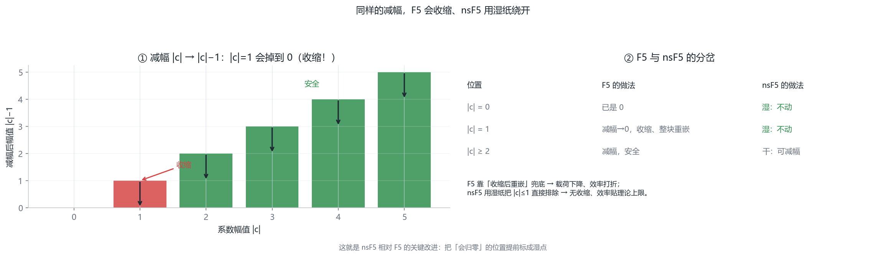
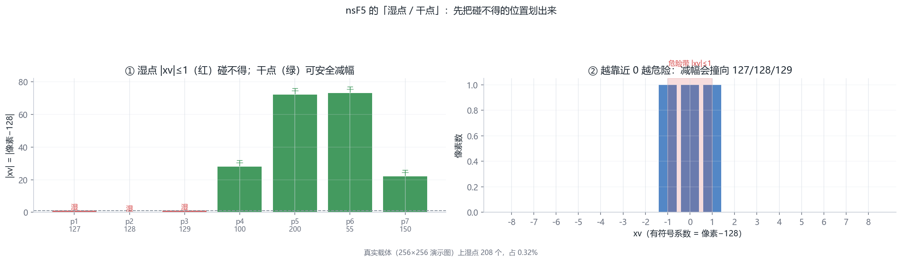
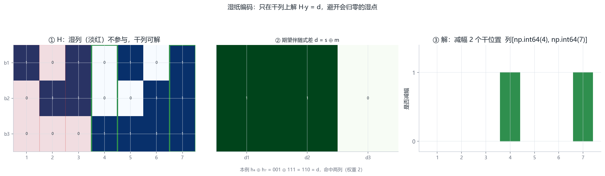
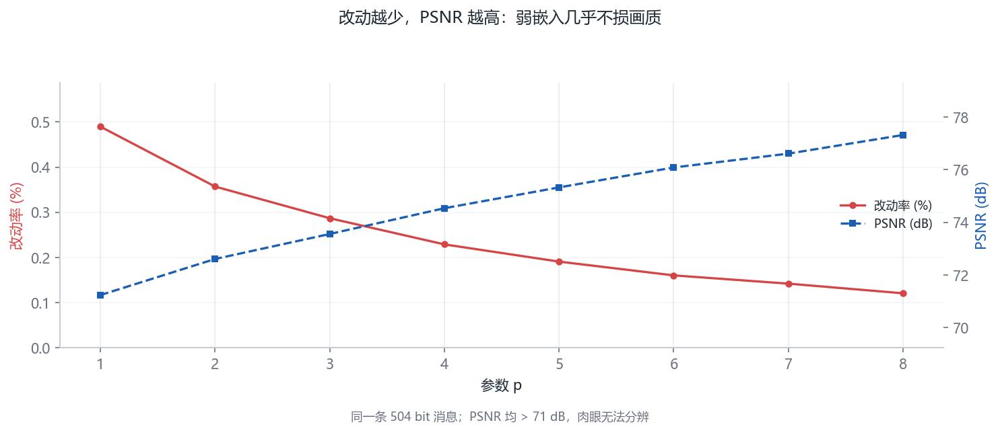
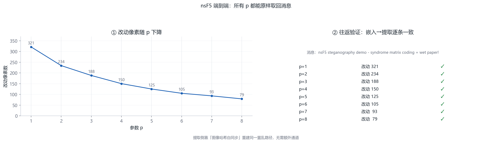

# 第 5 章 · nsF5 与湿纸编码：项目的核心算法（第 6 周）

<!-- lang-switch -->
> [🌐 English version](https://yukinoshita-lin.github.io/nsf5-steganography/en/content/ch05.html)


> **本章导航** ·　先看问题，再读正文
> 
> **核心问题　F5 的“收缩”为什么会毁掉消息？nsF5 用什么绕开它？**
> 
> **读完你能回答**
> 
> - 解释减幅映射 |c|→|c|−1 与 F5 收缩之间的因果关系；
> 
> - 划出湿点与干点，说明“哪些位置碰不得、哪些位置可以安全减幅”；
> 
> - 写出湿纸方程 **H·e = d** 并解一个 p=3 的算例；
> 
> - 说明 nsF5 为什么能把改动控制在“至多一处”。
> 
> *先划禁区，再解方程——这是本项目核心算法的全部直觉。*

**开场问题：如果“能修改的位置”不由你指定，而是由图像内容当场圈定，方程还解得出来吗？**第 4 章的矩阵编码默认所有位置都听你的；但 JPEG 的世界里，|c|=1 的系数是“减幅即塌方”的雷区，必须绕行。绕行之后，伴随式方程的可用列少了一截，原来“查表即得”的解法失效。湿纸编码（Fridrich et al.）给出的答案漂亮而彻底：**方程照样有解，而且通信双方甚至不用商量哪些位置被划掉了。**这就是 nsF5 比 F5 多出来的那块拼图，也是本项目像素域实现的核心。

| **小节** | **回答的问题** | **你的产出** |
| --- | --- | --- |
| 5.1 收缩问题 | 像素域的“雷区”长什么样？ | 能指出 127/128/129 为什么危险 |
| 5.2 湿纸编码 | 干点上怎么解方程？ | 能手算一个 6 载体的玩具例 |
| 5.3 读代码 | _embed() 的决策树是什么？ | 能逐行对应到 5.2 的数学 |
| 5.4 三个求解器 | 单列/双列/消元怎么分工？ | 能说清“少改优先”的次序 |
| 5.5 验证实验 | nsF5 比矩阵编码好在哪？ | 能设计一个公平的对比实验 |

> **动手做｜
本章目标：说清“收缩”为什么伤效率；理解湿纸编码“湿点不动、干点解方程”的思想；能对照 ns5_core.py 讲出 nsF5 嵌入的完整流程。**

## 5.1 先把问题拧清楚：F5 的收缩

F5 在 JPEG 量化系数上做减幅修改：系数绝对值每被减 1，LSB 奇偶就翻转一次。但绝对值 = 1 的系数（例如 +1、−1）再减就变成 0。对 JPEG 来说，0 系数是 “缺席的频带”，不适合继续当载体，F5 只能放弃这一块重新寻找位置——这就是收缩（shrinkage）。

收缩让实际容量低于理论值：块被浪费，消息需要更多位置；

收缩让嵌入效率低于 α(p)：为补偿损失需要更多次修改；

收缩还会留下可检测的统计特征：被改到 0 的系数变多，直方图出现异常。

项目在空间域（像素）上做了一个巧妙类比：把像素值减去 128 变成“有符号值” xv = 像素 − 128，于是 |xv|≤1 的像素（127、128、129）就是“减幅会撞到零附近” 的危险位置。矩阵嵌入在 JPEG 上的收缩难题，在像素域里变成了“127/128/129 不能作为普通修改对象”的同一问题。

像素域的类比值得再钉一遍，因为它把 JPEG 的抽象问题变成了看得见的数字：把像素减 128 得到有符号值 xv，则 xv=+3 的像素是 131。减幅 = |xv| − 1 且保符号：+3 → +2（像素 131→130），LSB 从 1 变 0，正是“改一位”。而 xv = −1（像素 127）减幅会变成 +1——**符号翻转了，但 LSB 恰恰没变**（−1 与 +1 的奇偶相同）；xv = 0（像素 128）减幅更是无定义。所以 127、128、129 三个像素是“动之即乱”的雷区，统一划为湿点。

这个细节暴露了一个容易被忽略的事实：**“改一位”的目标并不是任何数值变化都能达成**。LSB 是奇偶，数值变化要翻转奇偶，只有 ±1、±3、±5……这类奇数步长才行；而减幅固定是 −1（奇数步长 ✓），但它同时要求幅值不能到 0、符号不能翻。把这两个约束合并，就得到“湿点 = |xv| ≤ 1”这条朴素而准确的规则。

减幅操作本身也值得一个正式定义——它是整个 nsF5 的“原子修改”：

两个条件各管一件事：|c| ≥ 2 保证减完不塌方（|c′| ≥ 1）、不翻符号；而“减 1”是奇数步长，奇偶必然翻转——所以它是一次合法的“改一位”。对照第 4 章矩阵编码的“查表翻一位”：矩阵编码负责**选哪个位置翻**，减幅负责**翻的方式**，两者在 nsF5 里合体。



图 5-1 减幅映射与 F5 收缩。这张图回答的是：F5 的“收缩”是怎么把消息毁掉的？减幅映射 |c|→|c|−1 的收缩点与 F5/nsF5 分岔——收缩是 F5 的老问题，nsF5 绕开了它

## 5.2 湿纸编码：先划湿点，再解方程

湿纸编码（Wet Paper Coding） 是 Fridrich 等人提出的框架，用来回答一个 问题：如果载体里有一部分位置“碰不得”（像被水浸湿的纸，写了也看不见）， 能不能只用其余“干”位置完成消息嵌入？

答案是可以，而且不需要通信双方预先商量哪些位置是湿的——只要算法能从图像 内容本身重建出同样的湿/干划分即可。项目正是这样做的：

对每个块，先找出“减幅会变成零/危险”的位置，标记为湿点；

真正的问题是：在干位置集合上找一个修改向量 e，使翻转这些位置后整块的伴随式恰好等于目标 m；

即解方程 H[:,干] · y = d，其中 d = s⊕m 是期望的伴随式变化；

项目按“单个干列命中 → 两个干列异或命中 → GF(2) 高斯消元兜底”的顺序求解，尽量少改；

解出的 y 是 0/1 向量：y=1 的位置就是实际要减幅的干位置。

> **新手提示｜
为什么“先标记湿点”就不收缩了？因为收缩的根源是“改到一半才发现改成了 0”。nsF5 把所有会撞零的位置提前排除，只在保证安全的干点上求解，于是每个块都能成功嵌入，既不用重试，也不会出现多余的 0 系数。**

按 CSAPP 的规矩，用一个能全部笔算的玩具例把湿纸编码走通。设 p=2（块内载体 6 个，H 的 6 列按 [1,0]、[0,1]、[1,1]、[1,0]、[0,1]、[1,1] 排布），载体系数与其 LSB（x）如下：

| **位置** | **1** | **2** | **3** | **4** | **5** | **6** |
| --- | --- | --- | --- | --- | --- | --- |
| 系数据 c | +3 | +1 | −2 | +4 | +1 | −7 |
| LSB x（奇偶） | 1 | 1 | 0 | 0 | 1 | 1 |
| H 列 | [1,0] | [0,1] | [1,1] | [1,0] | [0,1] | [1,1] |
| 湿/干（\|c\|=1 为湿） | 干 | **湿** | 干 | 干 | **湿** | 干 |

目标伴随式 m = [1,1]。先算当前伴随式 s = H·x：只把 x=1 的干位列异或起来——位置 1、6 的列是 [1,0] 和 [1,1]（位置 2、5 是湿点不参与），s = [1,0] ⊕ [1,1] = [0,1]。差值 d = s ⊕ m = [1,0]。在**干位**里找等于 d 的列：位置 1（[1,0]）命中——翻转它。位置 1 的系数 +3 减幅成 +2（3→2，幅值 −1、保符号，恰好是一次合法减幅）。验证：新 x = [0,1,0,0,1,1]，s′ = [1,1] ✓ 消息到位。

这个例子里藏了湿纸编码的全部要点：**湿点不参与方程**（位置 2、5 的列被划掉，哪怕它们恰好也能命中 d）；**翻转天然就是一次合法减幅**（干点 |c|≥2，减 1 不会塌方）；**双方无需共享湿点表**——提取端用同样的图像内容、同样的规则重新推导湿/干划分即可。最后一点是湿纸编码真正的贡献：它把“哪些位置可用”从通信双方必须协商的先验信息，变成了载体自身的函数。

> **想一想｜** 如果把 toy 例里的目标改成 m = [0,1]，d = s⊕m = [0,0]——零向量在 H 的列里不存在，这意味着什么？（提示：回到 4.2 节“d=[0,0,0] 免改”的结论。）那如果 d = [1,1] 而干位里没有任何单列等于它呢？——检查位置 3 与 6：[1,1]⊕[1,1] = [0,0]，说明同时翻转这两位也能凑出 d。“两列异或命中”正是项目三个求解器里的第二级。

湿纸编码的数学内核只有一行方程——在 GF(2) 上解一个限制了自由变量的线性方程组：

其中 d = s ⊕ m 是伴随式差值，e 是 0/1 修改向量（eⱼ = 1 表示翻转第 j 个载体）。5.2 节玩具例的方程展开来是：

湿点约束划掉 e₂ 与 e₅（强制为 0），方程退化为 4 个未知数 2 个方程——解空间有 2² = 4 个解，项目的求解器按“单列命中 → 两列异或 → 高斯消元”的次序取**改动最少**的那一个（toy 例取 e₁ = 1）。解空间非空的条件由 GF(2) 的秩决定：只要湿点没有把 H 的列秩“打残”，方程就有解——这正是“湿纸”名字下真正的数学保证。



图 5-2 湿点 / 干点划分。这张图回答的是：哪些位置碰不得、哪些位置可以安全减幅？湿点（碰不得）与干点（可减幅）的划分及危险带——先划禁区，再解方程



图 5-3 湿纸求解（p=3 算例）。这张图回答的是：在干列上，方程 H·e = d 是怎么解出来的？在干列上解出减幅位置：单列命中或双列异或命中——湿纸编码怎么把方程解出来

## 5.3 读懂项目：nsF5Pixel._embed()

```text
src/ns5_core.py 里 nsF5Pixel 类继承自 MatrixEmbedding，只重写了 _embed()。逐行读这段代码，你会看到完整的 nsF5 决策树：
```

nsF5Pixel._embed() 决策树（伪代码流程，逻辑与原代码一致）

```text
xv = c[pos].astype(np.int16) - 128     # 像素→有符号系数
s = syndrome(H, (xv & 1).astype(np.uint8))
if s == m: continue                    # 伴随式已匹配
tc = 命中列(H, s ^ m)                  # 最“直接”的候选位置
if abs(xv[tc]) > 1:                    # 减幅不会撞零 → 直接改
    c[pos[tc]] -= sign(xv[tc])         # 向 128 靠拢一步
else:                                  # 候选位置是湿点
    dry = [k for k in range(n) if abs(xv[k]) > 1]
    e = solve_wet_paper(H, dry, d)     # 只在干点上解方程
    if e: 按 e 减幅所有命中干点
    else: 兜底翻转目标位 LSB（保证可解码）
```

## 5.4 再看三个求解函数

三个求解器的分工次序，本质是一条“改动数量递增”的阶梯：先看有没有单列直接命中（改 1 位）；再看有没有两列异或命中（改 2 位）；都没有才上 GF(2) 高斯消元（理论上界 p 位）。为什么要这么讲究次序？因为**改动次数 = 统计指纹**，第 3 章刚讲完。还有一个容易被忽视的性质：整个求解过程不引入任何随机数——种子由输入派生（第 6 章细讲），相同输入必然得到相同的修改方案。0.2.0 起这条“逐字节可复现”承诺同样覆盖 JPEG 域，它是 repro 契约（实验档案一键重跑）的基石。

| **函数** | **作用** | **关键点** |
| --- | --- | --- |
| solve_wet_paper(H, dry_cols, target) | 在干列里找尽量稀疏的解 | 权重 1 → 权重 2 → 高斯兜底 |
| gauss_solve_GF2(cols, b) | GF(2) 高斯消元解线性方程组 | 自由变量置 0 压低改动数 |
| permute_index(total, seed) | 确定性伪随机置换 | splitmix64 + Fisher–Yates，可 C++ 加速 |
| 回到项目看代码｜
打开 src/ns5_core.py 第 145–215 行，对照 5.4 的表格逐段读。建议先读函数注释，再用 src/test_core.py 的 test_wet_paper_needed() 验证：它把像素强制设成 127/128/129 制造湿点，仍能完成嵌入/解码往返。 | 回到项目看代码｜
打开 src/ns5_core.py 第 145–215 行，对照 5.4 的表格逐段读。建议先读函数注释，再用 src/test_core.py 的 test_wet_paper_needed() 验证：它把像素强制设成 127/128/129 制造湿点，仍能完成嵌入/解码往返。 | 回到项目看代码｜
打开 src/ns5_core.py 第 145–215 行，对照 5.4 的表格逐段读。建议先读函数注释，再用 src/test_core.py 的 test_wet_paper_needed() 验证：它把像素强制设成 127/128/129 制造湿点，仍能完成嵌入/解码往返。 |

## 5.5 验证实验：效率与往返

运行核心自测 + 对比两种方法

```bash
python src\test_core.py
# 对比 matrix 与 nsF5 改动像素数：
import sys; sys.path.insert(0, "src")
import numpy as np; from ns5_core import embed_string
img = np.random.default_rng(0).integers(0, 256, (64, 64), np.uint8)
for method in ("matrix", "nsF5"):
    stego, rep, nb = embed_string(img, "Hello nsF5!", method=method, p=3)
    print(method, "改动", rep["cover_changed"], "像素 / 容量", nb)
```

对同一张随机图、同一条消息，matrix 与 nsF5 的改动数不一定谁更少——因为 nsF5 的保护范围（127/128/129）在随机图上很少触发。真正的差异出现在“危险像素 密集”的图上：nsF5 依然能无收缩完成嵌入，matrix 则可能反复失效。



图 5-4 改动率与 PSNR。这张图回答的是：改动越少，保真一定越高吗？nsF5 各 p 的改动率与 PSNR——改动越少，保真越高



图 5-5 端到端往返验证。这张图回答的是：容量换保真之后，还能一个 bit 都不错吗？各 p 的改动像素数与往返提取一致性——容量换保真，但一个 bit 都不能错

## 5.6 小结与自我检查

收缩 = 减幅撞零导致块作废，损伤容量、效率与统计安全；

湿纸编码把“不能改的位置”预先划为湿点，只在干点解伴随式方程；

nsF5 = 矩阵嵌入 + 湿纸编码，无收缩、无重试；

项目在像素域用 xv = 像素−128 模拟 JPEG 系数，|xv|≤1 视为湿点。

> **想一想｜
为什么湿纸编码“不需要预先约定湿点位置”？解码端怎么知道哪些像素不能用来承载消息？提示：解码端只需要读 LSB 算伴随式，它不需要知道嵌入时绕过了谁。**

**本章小结。**收缩的根源是“减幅撞零”，它的代价是容量、效率、统计安全三连击；湿纸编码把雷区划为湿点、只在干点上解伴随式方程，双方凭图像内容各自重建湿/干划分；nsF5 = 矩阵编码 + 湿纸编码，无收缩、无重试；像素域用 xv = 像素 − 128 完美复刻 JPEG 的语义。

> **动手做｜** 章末练习（提示与答案见附录 J）
> 
> P5.1（手算）把 5.2 节玩具例的目标换成 m = [0,1]，重算 d 与需要的翻转；再换成 m = [1,1]（用两列异或）算一次。
> 
> P5.2（手算）像素行 [131, 128, 129, 134, 130, 133] 的 xv 与湿点各是什么？若伴随式要求翻转位置 4，减幅后像素值变成多少？
> 
> P5.3（思考）湿纸编码为什么要求“提取端能从图像内容重建湿/干划分”？如果湿点由口令的伪随机数决定而不由内容决定，会发生什么？（提示：嵌入会改动图像，改动后重算的湿点还一样吗？）
> 
> P5.4（上机）跑 5.5 节对比实验，把测试图换成 img/cover.png（平滑图），比较 matrix 与 nsF5 的改动数——这次 nsF5 应该明显更少。解释为什么换图后结论反转。
> 
> P5.5（思考·选做）如果一张图的全部载体都是湿点（比如全 128 的纯色图），湿纸编码还有解吗？项目会怎么表现？（对照 test_capacity_error 的行为。）
