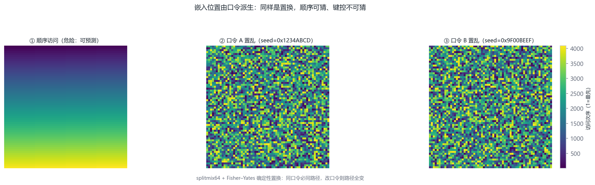
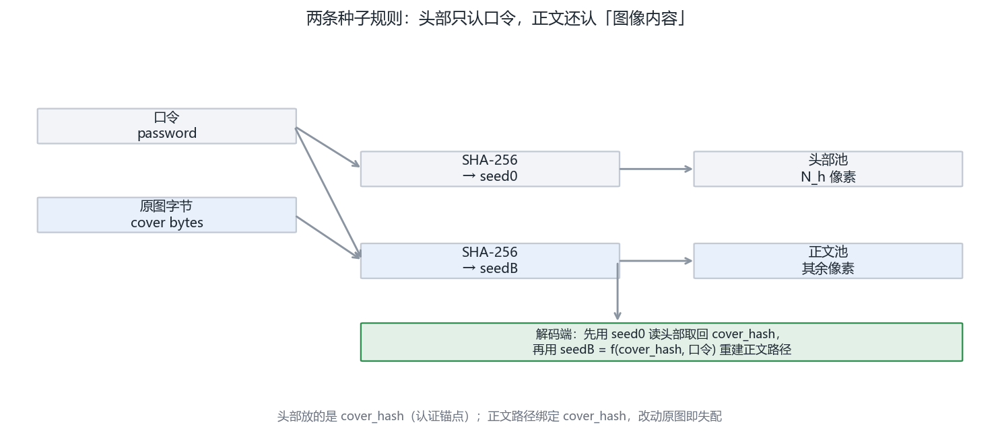
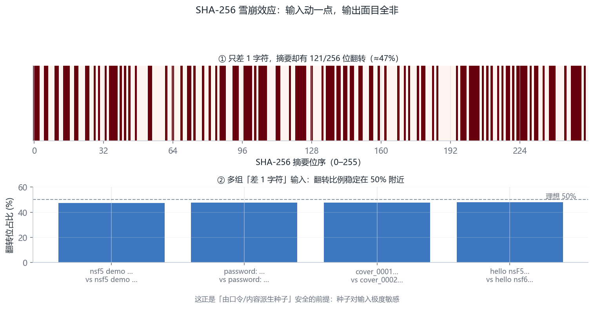
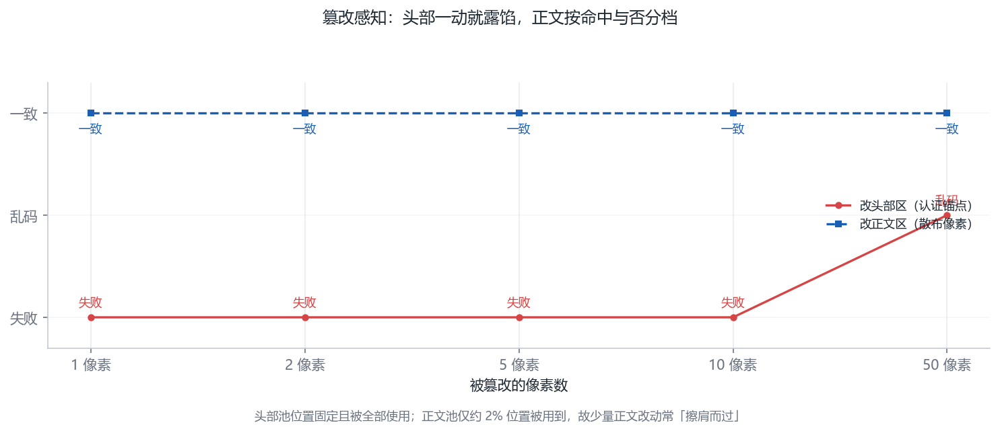
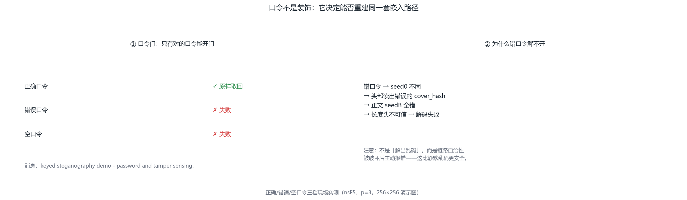

# 第 6 章 · 口令、SHA-256 与“键控”安全设计（第 6–7 周）

<!-- lang-switch -->
> [🌐 English version](https://yukinoshita-lin.github.io/nsf5-steganography/en/content/ch06.html)


> **本章导航** ·　先看问题，再读正文
> 
> **核心问题　如果嵌入位置是固定的，攻击者会怎样？键控如何让它变得不可预测？**
> 
> **读完你能回答**
> 
> - 说明“固定位置必被抓”的道理（位置本身就是可统计的信号）；
> 
> - 复述两条种子规则：`seed0 = f(口令)`、`seedB = f(cover_hash, 口令)`；
> 
> - 解释 SHA-256 的**雪崩效应**，说明“差一字符、seed 差千里”；
> 
> - 说清篡改感知能感知什么、不能感知什么。
> 
> *键控把“藏在哪里”从公开约定变成只有持钥者知道的秘密。*

**开场问题：消息藏好了，攻击者也下载到了图——他离秘密还差几步？**第 5 章结束时，算法本身已经无懈可击，但有个前提没说出口：攻击者得先知道**藏在哪里**。如果嵌入位置是“从左上角开始顺序”，那这一步等于白送。本章解决“藏在哪”的问题，顺便回答一个更深的问题：**怎么让“藏的位置”既由口令决定、又由图像自己决定，而且通信双方不需要额外传一张“藏宝图”**。答案由三块积木搭成：SHA-256（强哈希）、splitmix64（确定性伪随机）、Fisher–Yates（无偏洗牌）。

| **小节** | **回答的问题** | **你的产出** |
| --- | --- | --- |
| 6.1 固定路径之殇 | 不加键控会输在哪？ | 能列出三类位置级攻击 |
| 6.2 两条种子规则 | 头部/正文两池怎么设计？ | 能画出嵌入端与解码端的对称流程 |
| 6.3 确定性置乱 | 种子怎么变成排列？ | 能手算 splitmix64 的第一步 |
| 6.4 篡改感知 | 哈希比对能感知什么、不能什么？ | 能说清键控 ≠ 完整性认证 |

> **动手做｜
本章目标：理解为什么嵌入位置要“由密钥决定”；会讲清解码自同步与篡改感知的原理；知道这套设计的边界在哪里。**

## 6.1 如果嵌入位置是固定的，会怎样？

假设每次都是从左上角开始顺序嵌。攻击者知道算法后，可以：① 直接读取前 N 个 像素的 LSB 还原消息；② 把消息原位复制到另一张“看起来相同”的图像上（位置 替换攻击）；③ 对固定区域做针对性扰动，既破坏你的消息又不改动其余图像。

因此现代隐写会把嵌入路径做成密钥控制的伪随机顺序：没有口令（或不知道 内容哈希）的人，不知道消息在哪一块，也无法进行位置级攻击。



图 6-1 键控置乱 vs 顺序访问。这张图回答的是：位置固定为什么必被抓？键控改变了什么？顺序访问与两条口令派生的键控置乱路径（64×64 网格）——固定位置必被抓，键控让位置不可预测

## 6.2 两条种子规则：先认图，再找正文

“两条种子规则”听起来抽象，其实是一张对称的流程表。嵌入端与解码端做的是**同一件事的两个方向**：

| **步骤** | **嵌入端** | **解码端** |
| --- | --- | --- |
| ① | derive_seed(口令) → seed0，置乱头部池，写入 cover_hash | derive_seed(口令) → seed0，逆置乱头部池，读出 cover_hash |
| ② | 校验：头部写入前算的哈希 = 当前图像哈希 | 校验：读出的 cover_hash = 当前图像哈希 |
| ③ | derive_seed(cover_hash + 口令) → seedB，置乱正文池，嵌入消息 | 同左，找到正文位置，提取消息 |

为什么要把两把钥匙拧在一起？单用口令：口令往往是人选的弱密钥，字典攻击一攻就破；单用内容哈希：谁都能算，等于没锁。**口令 ⊕ 内容哈希**的组合让“知道算法”和“知道口令”都变得不够——而且第二把钥匙直到第①步成功才出现，口令错误的人连正文在哪都不知道，只会得到一致的失败（而不是乱码），这本身就杜绝了“用错误输出反推口令对错”的旁路。

> **新手提示｜** 还有一个更深的巧思：cover_hash 是**原图**的哈希，不是含密图的。这意味着解码端必须拿到“未被改动的图像字节”才能通过第②步——于是这套机制顺手获得了篡改感知能力（6.4 节）：哪怕口令正确，图像被转存、被裁剪、被重压缩，哈希都会失配并明确报错。一个字段，两份用途——好的系统设计常常如此。

项目把像素分成两个池：头部池（开头 N_h 个块）与正文池（其余像素）。 密钥派生用两个独立的种子：

seed0 = 仅由口令派生：决定头部池的置乱顺序。头部里预埋的是 cover_hash——由原图像字节计算的 SHA-256 截断前 16 字节（128 位）；

seedB = cover_hash + 口令联合派生：决定正文池的置乱顺序与分块。

解码时，接收方先用自己的口令重建 seed0，读回头部取出 cover_hash， 再与口令一起重建 seedB，才能找到正文。口令错误或头部被破坏， 后续路径立刻失效——test_pwd_mismatch() 测的就是这一点。

项目中的种子派生（真实代码）

```python
def derive_seed(image_bytes, password=""):
    base = hashlib.sha256(image_bytes).hexdigest()
    if password:
        base = hashlib.sha256(
            base.encode() + password.encode()).hexdigest()
    return int(base, 16)
```



图 6-2 两条种子规则。这张图回答的是：为什么头部和正文要用两个不同的种子？头部 seed0 = f(口令)、正文 seedB = f(cover_hash, 口令) 的两级派生——先认图，再找正文



图 6-3 SHA-256 雪崩效应。这张图回答的是：口令差一个字符，种子会差多少？差 1 字符的 SHA-256 摘要差异位图与多组输入翻转比例——差之毫厘，seed 差之千里

## 6.3 确定性置乱：splitmix64 + Fisher–Yates

有了种子还不够，还要把它变成“1..N 的一个确定排列”。项目用 splitmix64 作为 伪随机源，执行 Fisher–Yates 洗牌：从末尾向前，每一步用伪随机数选一个位置交换。 同样的种子必然产生同样的排列——这正是“自同步”的数学基础。

> **回到项目看代码｜
打开 src/ns5_core.py 的 permute_index()：DLL 可用时调用 C++ 的 nsf5_permute，否则走 Python 同算法 fallback。两套实现必须给出 完全相同的排列，否则用 DLL 嵌入的图在无 DLL 的机器上无法解码。 src/cppembed.py 的 selfcheck() 专门做这种跨语言一致性校验。**

splitmix64 每一步做两件事：状态推进（加一个“黄金常数” 0x9E3779B97F4A7C15），再用三轮移位-乘法把状态搅碎，输出一个 64 位伪随机数。用种子 0 手算前三步（真实输出，与 ns5_core.py 的 Fisher–Yates 内联逻辑逐位一致）：

| **步** | **推进后状态 x** | **输出 r** |
| --- | --- | --- |
| 1 | 9e3779b97f4a7c15 | 16 294 208 416 658 607 535 |
| 2 | 3c6ef372fe94f82a | 7 960 286 522 194 355 700 |
| 3 | daa66d2c7ddf743f | 487 617 019 471 545 679 |

三个输出之间看不出任何规律——这正是“雪崩效应”：输入差 1 位，输出约一半的位会翻转。Fisher–Yates 洗牌从数组末尾向前走，每一步 i 用一个输出 r 选出 j = r mod (i+1)，交换位置 i 与 j。同样的种子必然得到同一个排列，这就是“自同步”的数学保证；不同的种子，排列近乎必然不同——64 位状态空间意味着你试遍地球上的沙粒也撞不到两个相同排列。

一个值得停下来想的细节：j = r mod (i+1) 有没有偏差？64 位远大于 i+1，模运算的偏差小于 2⁻⁶⁴ 量级——理论存在、工程可忽略。写进手册是因为“知道自己近似在哪里”与“近似本身”同样重要。

> **新手提示｜** 为什么不用 Python 自带的 random 模块？两个理由。其一，random 的算法与参数随版本可能变化，而 splitmix64 是一篇论文定死的常数——十年后重跑结果不变；其二，random 的内部状态可以被预测者通过观察输出反推，splitmix64 的一次输出不泄露状态的反向信息。“可复现”与“不可预测”在密码学里是一对需要分别设计的性质。

把第一步的全部中间值用十六进制摊开（真实计算，逐行可复算）。每行左边是操作、右边是结果：

```text
x ← 0 + 0x9E3779B97F4A7C15            = 0x9E3779B97F4A7C15
z ← x ^ (x >> 30)                    = 0x9E3779BB07979AF0
z ← z * 0xBF58476D1CE4E5B9 (mod 2⁶⁴) = 0x6F68261B57E7A770
z ← z ^ (z >> 27)                    = 0x6F682616BAE3641A
z ← z * 0x94D049BB133111EB (mod 2⁶⁴) = 0xE220A838BF5C9DDE
r ← z ^ (z >> 31)                    = 0xE220A8397B1DCDAF
  = 16294208416658607535
```

三招“移位-异或-乘常数”各司其职：第一次异或把低位信息翻到高位，两次大常数乘法（常数本身经过搜索挑选）让任何一位的变化都污染全部 64 位，最后一次异或把高位信息翻回低位。为什么用 mod 2⁶⁴？溢出丢弃是刻意的设计——丢弃进位让输出对输入的低位变化高度敏感，同时保证运算可逆性可控、速度极快。你在自己的机器上按这套常数手推，会得到逐位相同的结果。

## 6.4 篡改感知：到底能感知什么

用一组真实数字感受雪崩效应（2026-10-04 现算）：对两个只差一个字符的字节串求 SHA-256——

| **输入** | **SHA-256 摘要（前 32 个十六进制位）** |
| --- | --- |
| nsf5 demo image v1 | 528f940a 88e01819 2e96fdd1 7bc22fce … |
| nsf5 demo image v2 | b4bc0cc0 d6491e1d a734b65f 0132edb2 … |

两个输入只差最后 1 个字符（256 位输出里实测翻转 121 位 ≈ 47%，符合“约一半”的期望）。这就是“改 1 像素 → 哈希面目全非”的定量含义，也是 6.5 节实验 B 的原理。同时把边界说透：这套机制能告诉你“图像变过”，但说不出“怎么变的”与“谁变的”——它能感知一次无意转码，也能感知一次恶意替换，在它眼里两者等价。要区分它们，需要把哈希用密钥做 MAC（消息认证码），那是另一层设计，本项目在教学口径下刻意不做。

嵌入端在报告中给出 cover_hash（原图哈希）。任何像素被改动，图像字节的 SHA-256 都会改变。把收到的图像重新计算哈希，与嵌入端报告的（或头部解出的） 哈希比较：不一致 = 图像被动过。更妙的是，由于正文路径依赖这个哈希， 即使攻击者只改了一个像素，正文置乱种子也随之错位，解码结果会立刻崩溃或乱码。

同时要诚实地说清边界：这套机制是键控（keying）与篡改感知，不是密码学意义 上的完整性认证。头部哈希本身没有用密钥做 MAC，理论上有能力重嵌整张图的 攻击者可以同步更新头部哈希。README 把这个列为后续工作（例如引入 密钥化 MAC），阅读时注意区分“检测普通篡改”与“抵御恶意重嵌”。



图 6-4 篡改感知。这张图回答的是：改一个字节，提取会不会失败？头部区与正文区篡改对提取结果的影响——改一个字节，提取即失败

## 6.5 动手实验：口令错误与像素篡改

实验 A：口令不匹配应失败；实验 B：改 1 像素后解码

```python
import sys; sys.path.insert(0, "src")
import numpy as np; import image_io as IO
from ns5_core import embed_string, extract_string, get_image_hash
 
img = IO.load_as_gray("img/cover.png")
stego, rep, _ = embed_string(img, "secret", method="nsF5",
                             p=3, password="A")
print(extract_string(stego, method="nsF5", p=3, password="B"))
tampered = stego.copy(); tampered[0, 0] ^= 1   # 只改 1 个像素
print(get_image_hash(stego)[:16], "vs", get_image_hash(tampered)[:16])
print(extract_string(tampered, method="nsF5", p=3, password="A"))
```

> **避坑提醒｜
实验 B 的失败方式可能是 ValueError、乱码或截断消息，取决于被改像素落在哪块。不要期待“总是抛异常”——篡改感知的工程表现就是：与哈希比对失败，且正文无法自同步。**



图 6-5 口令门。这张图回答的是：口令错了，链路为什么会自洽性破坏？正确 / 错误 / 空口令的提取结果与失败原因——口令错，链路自洽性即破坏

## 6.6 小结与自我检查

固定路径 = 可预测 = 可被复制与针对；键控路径让隐藏位置由口令+内容决定；

头部放 128 位内容哈希，正文种子依赖该哈希 → 解码无需外部同步；

确定性置换（splitmix64 + Fisher–Yates）是自同步的数学保证；

键控 ≠ 完整性认证；强对抗场景需要密钥化 MAC。

> **想一想｜
如果两张不同的原图被嵌入了同一条消息，含密图的隐藏位置会一样吗？为什么？（提示：正文种子由什么决定？）**

**本章小结。**固定路径是靶子，键控路径让位置由“口令 + 内容哈希”共同决定；头部池放内容哈希、正文池用哈希加口令派生，解码端两步重建、无需传藏宝图；splitmix64 + Fisher–Yates 保证同种子同排列；雪崩效应让篡改无所遁形——但也只到“感知”为止。

> **动手做｜** 章末练习（提示与答案见附录 J）
> 
> P6.1（手算）splitmix64 从种子 0 出发：状态推进后的第一步 x 是多少（十六进制）？用 6.3 节的表核对。
> 
> P6.2（思考）攻击者拿到一张已嵌入的图与完整的算法源码，唯独没有口令。对照 6.2 的流程表，列出他每一步会卡在哪里；再假设他拿到了第二张“同一口令嵌入”的图，他能对比出什么？（这引出“多图同口令”的安全边界。）
> 
> P6.3（思考）为什么头部哈希不用口令做 MAC 在教学项目里“够用”，在真实取证产品里“不够”？各给出一条理由。
> 
> P6.4（上机）跑 6.5 节实验 A/B，再做一个变体：把含密图重新用画图软件打开另存为 PNG（像素不变），解码会成功吗？会的话，为什么哈希校验没有拦住它？
> 
> P6.5（上机·选做）用 hashlib 对同一段文本的两个“只差 1 个字符”的输入求 SHA-256，数一数有多少位不同；多跑几组，验证“约一半”的直觉。
