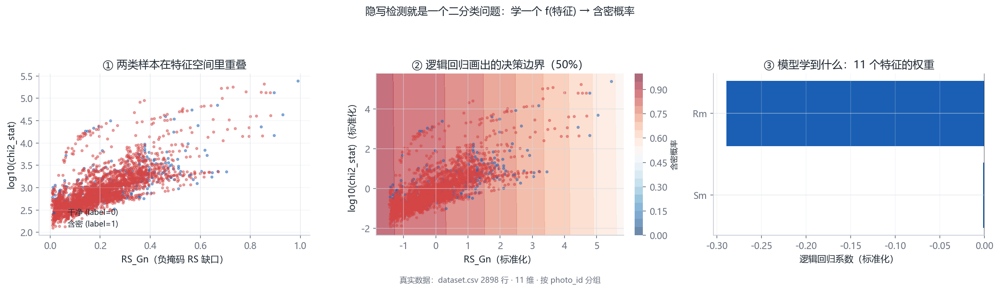
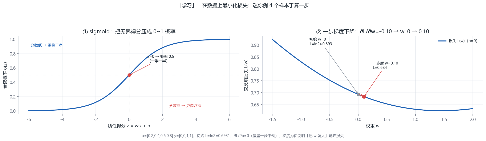
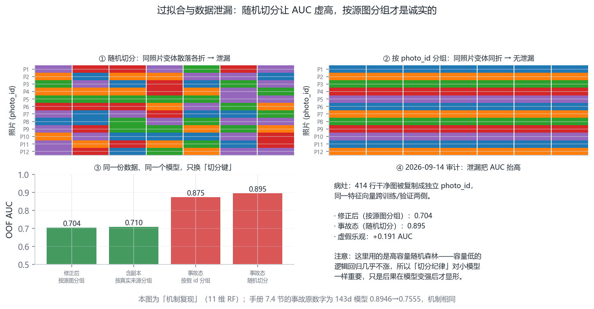
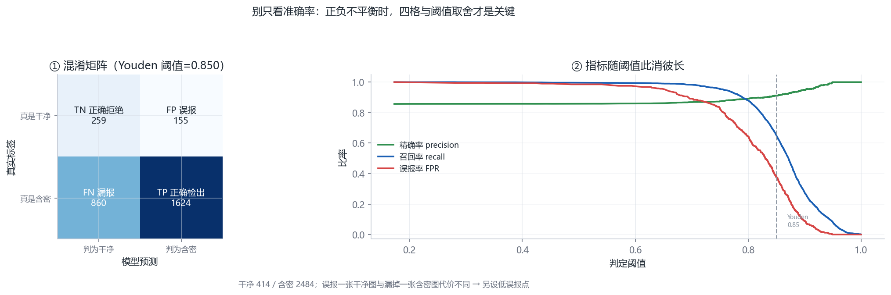
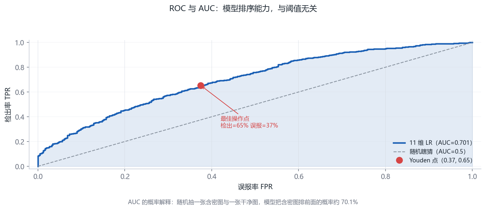

# 第 7 章 · 机器学习基础（写给第一次学的人）（第 7–8 周）

<!-- lang-switch -->
> [🌐 English version](https://yukinoshita-lin.github.io/nsf5-steganography/en/content/ch07.html)


> **本章导航** ·　先看问题，再读正文
> 
> **核心问题　模型到底是怎么“学”的？为什么“准确率”会骗人？**
> 
> **读完你能回答**
> 
> - 用 sigmoid 把无界得分压成概率，并手算一步梯度下降；
> 
> - 解释交叉熵损失与梯度方向（为什么“把 w 调大”能降损失）；
> 
> - 说明过拟合与数据泄漏，复述“按源图分组”为什么是纪律；
> 
> - 读懂混淆矩阵、ROC 与 AUC，并解释为什么不能只看准确率。
> 
> *本章为第一次学机器学习的人写：每个抽象都配一个可以手算的迷你例。*

**开场问题：给你 2898 行数据，每行 11 个数字，让你人工挑出哪些图藏了消息——你打算怎么挑？**肉眼看每行 11 个数，看十行就晕了。但这正是机器学习要替你做的事，而且它做的每一步——找规律、定阈值、报置信度——你都将在本章亲手算一遍小例子。本章不讲神经网络，只讲清楚一件事：**“学习”是怎么被还原成“在数据上最小化一个损失函数”的**。这是读懂第 8 章全部实验的最小前置。

| **小节** | **回答的问题** | **你的产出** |
| --- | --- | --- |
| 7.1 二分类视角 | 隐写检测在学习框架里长什么样？ | 能定义样本/特征/标签 |
| 7.2 数据 | 一行数据里的每列是什么？ | 知道 photo_id 为什么是命门 |
| 7.3 模型与损失 | “学”具体是在算什么？ | 能手算一步梯度下降 |
| 7.4 过拟合与泄漏 | 交叉验证为什么必须按组切？ | 能复述真实泄漏事故 |
| 7.5 评估指标 | AUC 之外还要看什么？ | 能解释 Youden 与低误报点 |

> **动手做｜
本章目标：建立“数据→特征→模型→评估”的完整框架；能讲清过拟合、交叉验证与数据泄漏；看懂 AUC 与阈值选择。**

## 7.1 隐写检测，本质上是一个二分类问题

把整件事换一个视角：给定一张图，它要么是干净载体（label=0），要么藏过消息 （label=1）。机器学习的任务，就是学一个函数 f(图像) → 0/1 或“含密概率”。 这正是项目里监督式隐写检测做的事。

整个监督学习只有四样东西：数据、特征、模型、评估。下面按这个顺序讲， 每个概念都立刻对应到项目代码。



图 7-1 二分类视角：散点、决策边界与权重。这张图回答的是：两个类别在特征空间里天生重叠吗？特征空间重叠、逻辑回归决策边界与标准化系数——两个类别天生有重叠

## 7.2 数据：样本、特征与标签

v1 把每张图压缩成 11 个数字，叫特征向量；v1.4 又在其上扩展出 143 维 v2 特征（见 8.8）。先以 11 维教学：所有样本组成一张表 data/dataset.csv，目前有 2898 行 = 414 张照片 ×（1 个干净 + 6 个含密变体），其中干净 414 个、含密 2484 个。

数据集长什么样（前 3 列是 11 维特征的一部分）

```python
Rm,Sm,Rn,Sn,RS_Gr,RS_Gn,chi2_pvalue,diff_entropy,lsb_diff_entropy,median_prefix_p,chi2_stat,label,photo_id,...
41316,4574,36608,5057,0.56,0.48,3.5e-278,1.99,0.986,2.7e-166,1719.3,0,0,...
40488,4907,35701,5342,0.54,0.46,2.0e-269,2.02,0.989,2.2e-155,1675.9,1,0,...
```

data/dataset.csv（真实前两行，数值截断显示）

注意 photo_id 这一列：同一张照片的干净版与各变体共享同一个 id。这个字段是防数据泄漏的关键（v1.4 的 v2 数据集扩到 12 档并混入真实 JPEG 干净样本，分组思想不变）。

## 7.3 模型怎么“学”：损失、梯度与逻辑回归

先看最简单的可解释模型——逻辑回归：它对特征做线性加权 z = w·x + b， 再用 sigmoid 函数 σ(z)=1/(1+e⁻ᶻ) 压到 0～1，输出“含密概率”。

训练就是找一组权重 w，使模型在所有样本上的损失最小。逻辑回归常用的 损失是交叉熵：预测 1 而真值是 0，损失就大；预测越错，惩罚越陡。 优化方法（如梯度下降）反复微调 w，让损失一点一点降下来。

> **新手提示｜
你不必现在会推梯度公式。先记住三句话：损失 = 模型错得有多离谱；训练 = 找一组参数让损失最小；梯度下降 = 沿着“损失下降最快的方向” 一次次挪动参数。项目用 scikit-learn 的 LogisticRegression， 这些细节都被封装好了。**

“训练就是调权重”值得用一个 4 样本的迷你数据集完整走一步。设一维特征 x 与标签 y：x = [0.2, 0.4, 0.6, 0.8]，y = [0, 0, 1, 1]（前两个干净、后两个含密）。初始 w = 0, b = 0，则每行的预测概率都是 σ(0) = 0.5。

| **量** | **计算** | **结果** |
| --- | --- | --- |
| 初始损失（交叉熵） | −mean(y·ln p + (1−y)·ln(1−p))，p 均为 0.5 | ln 2 ≈ 0.693 |
| 梯度 ∂L/∂w | mean((p−y)·x) = (0.5·0.2 + 0.5·0.4 − 0.5·0.6 − 0.5·0.8)/4 | −0.10 |
| 梯度 ∂L/∂b | mean(p−y) = (0.5+0.5−0.5−0.5)/4 | 0 |
| 一步更新（学习率 1） | w ← w − 1×(−0.10) | w = 0.10 |

读一读这步更新在说什么：梯度是负的，说明“把 w 往大调”能减少损失——直觉上，x 大的样本标签是 1，权重应当为正，模型正在从数据里“悟”出这条规律。重复“预测 → 算梯度 → 更新”几百次，w 会收敛到一个正数，模型学会“x 越大越可能含密”。第 8 章的 11 维、143 维模型做的事一模一样，只是 x 从 1 个数变成 143 个数、“悟”的规律从一条变成一张交织的网。

> **想一想｜** 上面那一步更新里，如果学习率取 100 会怎样？（w 直接飞到 −10，损失反而爆炸。）学习率是“每步走多远”的步长，太大来回震荡、太小磨蹭不动。项目用的 LightGBM 不用梯度下降而用“逐树累加”，但“每一步都要让损失可验证地下降”这条纪律是同一套。

把迷你例用到的三个公式正式写出来。预测概率：

交叉熵损失（对全部 N 个样本取平均）：

对权重与偏置求偏导（链式法则展开后形式出奇地干净）：

梯度里的 (pᵢ − yᵢ) 就是“预测偏差”：预测对了贡献 0，预测错了按错误方向推权重。7.3 节手算的 −0.10 与 0 正是这两个式子在 4 个样本上的取值——公式与算例严丝合缝。交叉熵的这个梯度形式是它被普遍采用的原因：不像平方损失那样在“自信地错”时梯度趋零。



图 7-2 sigmoid 与一步梯度下降。这张图回答的是：模型是怎么“学”的？学习率太大会怎样？sigmoid 曲线与迷你例的一步梯度下降——学习率太大一步跨过谷底

## 7.4 过拟合、交叉验证与数据泄漏

“按 photo_id 分组切分”这条纪律值得用一个真实事故来讲——它不是教科书上的“ hypothetical”，而是本项目 2026-09-14 审计里真实发生过的（docs/RESULTS.md 有据可查）：校园照片语料上的 143 维模型，某次评估报出 AUC 0.8946、弱密度档检出率 85.3%；审计发现 414 行 JPEG 干净样本的 photo_id 被错误地逐行编号（同一张照片占了 414 个 id），按源图分组形同虚设——修正后同一模型同一数据，AUC 掉到 0.7555、弱档检出掉到 44.2%。跌掉的 0.14 不是模型变笨了，而是**虚假的乐观被挤掉了**：泄漏让模型在测试时“认出了照片”，而不是“认出了隐写痕迹”。

怎么防？两条不变量写进了代码：其一，任何训练前校验都要断言“同一 photo_id 的全部样本只出现在一侧”；其二，置信区间按**源图**重采样而不是按图（同源样本高度相关，按图算会把有效样本量虚报 5 倍）。把这两条当成本章最重要的 takeaway——它们比任何模型技巧都更能决定你报告里数字的可信度。

> **避坑提醒｜** “随机切分”四个字在机器学习教材里默认无害，在隐写数据集上是定时炸弹。判断你的数据集需不需要按组切分，只问一个问题：**同一“源”会不会派生多个样本？**会——就必须按源分组。这个判据同样适用于医疗（同一病人多次拍片）、金融（同一客户多笔流水）等一切场景。

模型在“见过的数据”上表现好很容易，真正要测的是没见过的数据—— 这叫泛化。如果模型把训练样本背下来，在测试集上就会崩，这就是过拟合。

防止过拟合的标准流程是交叉验证：把数据切成若干折，轮流用其中一折当 验证集。但这里有一个隐蔽陷阱：同一张照片的 7 个样本高度相似，如果随机切分， 训练集里可能出现某照片的“兄弟样本”，模型等于提前看到了测试照片—— 这叫数据泄漏，AUC 会虚高得离谱。

> **避坑提醒｜
项目用 GroupKFold：按照片 id 分组切分，保证同一张照片的所有变体要么全在训练集、要么全在验证集。src/train_model.py 的  cv_auc() 只做这一件事，却决定了整个实验的可信度——这是本项目最值得学习的机器学习工程细节之一。**



图 7-3 过拟合与数据泄漏（分组 vs 随机）。这张图回答的是：不按源图分组，分数为什么是假的？随机 / 分组切分的折分配与“同源副本+独立 id”泄漏的 AUC 复现——不分组，分数就是假的

## 7.5 评估指标：别只看准确率

隐写检测的正负样本不平衡（干净少、含密多），且“误报一张干净图”和“漏掉一张 含密图”代价不同，所以要用一组指标：

| **指标** | **回答的问题** | **直觉** |
| --- | --- | --- |
| 准确率 accuracy | 整体猜对比例 | 不平衡时容易骗人 |
| 精确率 precision | 判为含密里有多少真含密 | 误报低→精确率高 |
| 召回率 recall | 真含密里抓到多少 | 漏报低→召回率高 |
| F1 | 精确率与召回率的调和平均 | 两者都想要时的折中 |
| ROC / AUC | 模型排序能力与阈值无关 | AUC=0.5 等于瞎猜 |

模型输出的是概率，还要选一个阈值才能变成 0/1 判断。阈值越高越保守 （误报少、漏报多）；阈值越低越激进（检出高、误报多）。项目训练时用  Youden 准则在“真阳率−假阳率”最大处选阈值，另外专门算一个“低误报点” 阈值（假阳率≤10%），供严格档使用。

Youden 阈值（真实代码逻辑）

```python
from sklearn.metrics import roc_curve
fpr, tpr, th = roc_curve(y_true, proba)
j = tpr - fpr                       # Youden J
best = float(th[np.argmax(j)])      # 离随机线最远的点
```

> **动手做｜
学完本节后运行 python src\train_model.py 一次。你不需要读懂全部输出，先找到三行：CV-AUC、测试集 AUC、低误报点检出率。第 8 章将逐行解释它们的含义。**

阈值一节再补两个项目里的真实设计决策。其一，Youden 点（真阳率−假阳率最大）是“默认操作点”，但隐写检测的真实场景里，**把一张干净照片判成含密**（冤枉好人）的代价往往高于漏掉一张弱嵌入图——所以模型另存一个“低误报点”阈值。其二，模型上线前在 1514 张**从未见过的真实干净照片**（校园 414 + DIV2K 100 + ALASKA#2 1000）上实测误报率并给出 Wilson 置信区间——在训练分布内测误报是自欺，OOD 测出来才算数（详见 8.8）。



图 7-4 混淆矩阵与指标随阈值。这张图回答的是：阈值挪一下，指标会怎么变？Youden 阈值下的混淆矩阵与 precision / recall / FPR 曲线——阈值一挪，指标全变



图 7-5 ROC 与 AUC（真实数据）。这张图回答的是：只看准确率，会怎样误判一个模型？按源图分组 OOF 的 ROC 曲线、AUC 与 Youden 操作点——只看一个准确率会误判模型

## 7.6 小结与自我检查

监督学习 = 用带标签样本学一个从特征到答案的函数；

随机切分在同源样本上会泄漏信息，GroupKFold 按组切分才是诚实的；

AUC 衡量排序能力，阈值决定实际操作点；

误报率与检出率是一对矛盾，Youden/低误报点是两种取舍。

> **想一想｜
如果一份论文的隐写检测 AUC=0.95 但没说怎么切分数据，你会先怀疑什么？把怀疑写下来，这就是你评估一切 ML 实验的起点。**

**本章小结。**监督学习四件套（数据/特征/模型/评估）在隐写场景的对应物：dataset.csv 的行、11/143 维特征、逻辑回归到 LightGBM、AUC 与按档检出率；交叉验证必须按 photo_id 分组，泄漏的代价是 0.14 的虚假 AUC；阈值是操作点，Youden 与低误报点是两种诚实的选择。

> **动手做｜** 章末练习（提示与答案见附录 J）
> 
> P7.1（手算）把 7.3 节迷你例的学习率改为 10，重算一步更新后的 w 与新损失——观察“步长过大”的震荡。
> 
> P7.2（手算）4 个样本、2 折的交叉验证：写出“按 x 分组”与“按伪 photo_id 分组（同源样本同折）”两种切法，哪种更合理？为什么？
> 
> P7.3（思考）混淆矩阵四个格子里，“把干净图判成含密”对应哪一格？在取证场景下它的社会成本是什么？
> 
> P7.4（上机）用 sklearn 对 7.3 节的 4 样本例跑 LogisticRegression，核对 w、b 与手算方向一致。
> 
> P7.5（思考·选做）“模型 A 在校园语料 AUC 0.89，模型 B 在 BOSSbase 上 0.81，A 比 B 强”——这句话错在哪？用 RESULTS.md 的原话回答。
