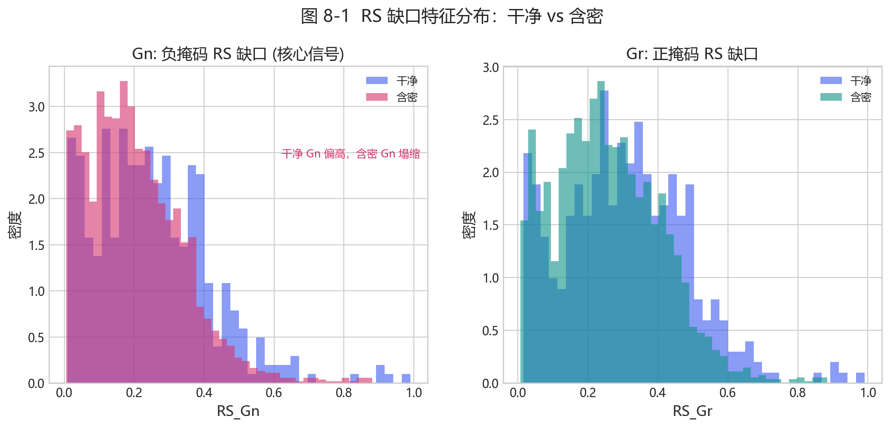
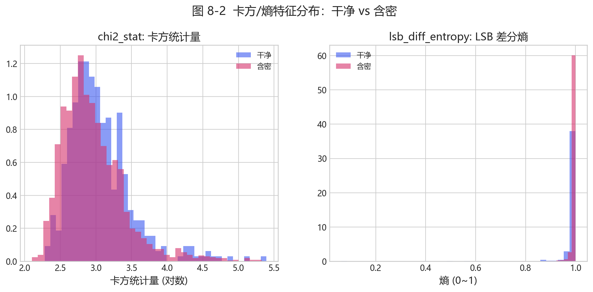
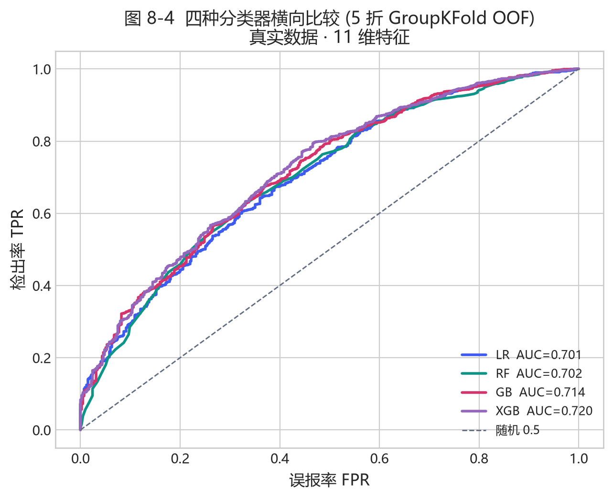
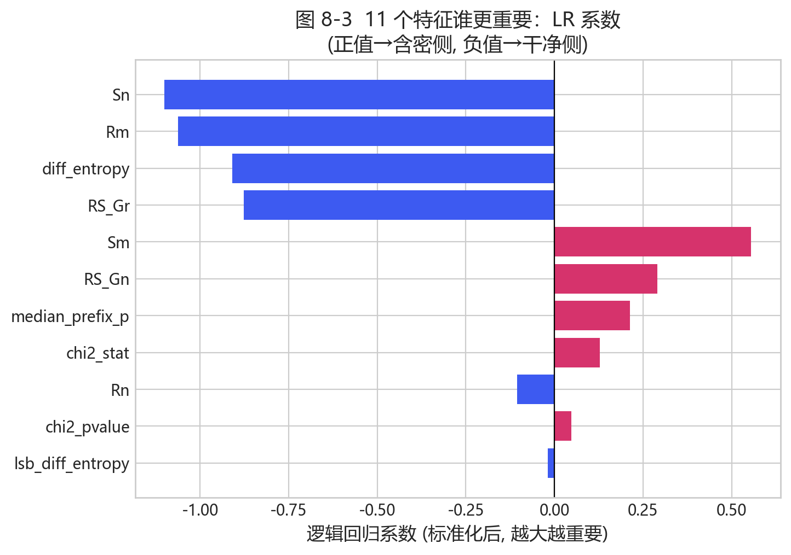
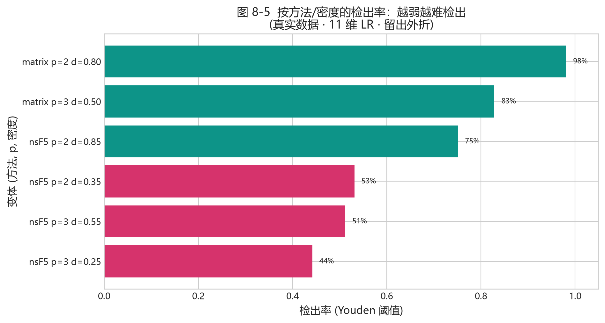

# 第 8 章 · 用机器学习做隐写检测（第 8–14 周）

<!-- lang-switch -->
> [🌐 English version](https://yukinoshita-lin.github.io/nsf5-steganography/en/content/ch08.html)


> **动手做｜** 本章目标：知道**为什么用“特征”而不是直接看像素**；认识 11 个特征各自在“量什么”（并配上真实分布图）；看懂 4 种分类器、4 个真实 ROC；跑通“生成数据→训练→判定”全流程。第 8.8 讲项目 v1.4 的完整演进。

## 8.0 本章路线图（约 4–8 周）

1. **第 1 步（约 1 周）**：8.1，理解“为什么用特征而不是裸 CNN”——这是本书**最重要的一步**，请务必想通。
2. **第 2 步（约 2 周）**：8.2，逐个认识 11 个特征。配合 图 8-1/8-2 的分布，对照公式和 `steganalysis.py`。
3. **第 3 步（约 2 周）**：8.3~8.4，看懂“数据怎么来 + 训练脚本怎么读”。配合 图 8-3/8-4。
4. **第 4 步（约 2 周）**：8.5~8.7，学会读 ROC/检出率，跑一遍完整流程。
5. **第 5 步（进阶, 约 1 周）**：8.8 的 v1.4 演进（SRM、143 维、双版本），这是“广、全、实”里最接近论文的部分。

---

## 8.1 一个反直觉的问题：为啥不直接让 AI“看图”？

你都听说过深度学习能看图识别猫狗，那为什么不直接把像素喂给神经网络、让它自己学“藏没藏东西”呢？项目试过，**验证 AUC≈0.50，等于完全瞎猜**。原因很好懂：

- 隐写改的是**极微弱的高频信号**（LSB 那一层），比照片里的内容、纹理弱太多，信噪比极低；
- 神经网络很容易学到“这张是风景、那张是人像”，而不是“藏没藏”；
- 真正独立的样本是**照片的张数**（几百张），而深度模型往往需要成千上万张。

所以项目换了一条路：**用人的领域知识去“量”隐写留下的统计痕迹（特征），再让一个简单的分类器判断**。v1 用 11 个特征，小样本时 AUC 约 0.75~0.79；v1.4 升级到 143 维 + LightGBM 后到 0.90+（见 8.8），但“特征法好过裸 CNN”的结论没变。

> **新手提示｜** 这不是“深度学习没用”，而是一堂**“在数据少的时候怎么选方法”**的课：**先用可解释的强特征验证信号到底存不存在，再考虑更复杂的模型**。不少工程问题都是这个次序。

## 8.2 认识 11 个特征：它们在“量”什么

v1 的 11 个特征由 C++ 库 `cpp/fsfeatures.dll` 计算（Python 封装在 `src/fsfeatures.py`）；v2 的 143 维在 `src/featurize_v2.py` 组装。先记一个总印象：**这 11 个数，就是 11 把尺子，专门量“LSB 平面是不是被搞乱过”**。量什么可以分三组：

| 特征 | 量什么 | 藏过东西后会怎样 |
| --- | --- | --- |
| Rm / Sm / Gr | 正掩码下“常规/奇异”组数与缺口 | Gr 下降 |
| Rn / Sn / Gn | 负掩码下“常规/奇异”组数与缺口 | **Gn 明显塌缩（核心信号）** |
| chi2_stat / chi2_pvalue | 灰度对是否被“抹均匀” | 灰度对趋匀，p 上升 |
| diff_entropy | 图像本底粗糙度 | 用来认出天然噪声图 |
| lsb_diff_entropy | LSB 位面乱不乱 | 随机化后趋近 1 |
| median_prefix_p | 20 段前缀卡方 p 的中位数 | 整体乱时升高 |

下面把三组“尺子”的本事讲清楚。**先看分布图，再讲公式**——图比公式直观。

### 8.2.1 RS 分析：核心信号 Gn 怎么来的

RS（Regular-Singular）先把像素流**每 4 个分成一组** $g=(g_1,g_2,g_3,g_4)$，定义“这组有多光滑”，用组内相邻像素的差加起来：

$$
f(g)=|g_1-g_2|+|g_2-g_3|+|g_3-g_4| .
$$

选一个掩码 $M=(0,1,1,0)$，对组里某些位置做 LSB 翻转，得到新的光滑度 $f_M$；取补得到负掩码。于是每个组可以分为：

- **常规（Regular）**：翻转后 $f_M > f$（更“光滑规则”）；
- **奇异（Singular）**：翻转后 $f_M < f$（更“乱”）。

最后算两类组数的**差值占总数比例**，这就是缺口：

$$
G_r=\frac{R_M-S_M}{n},\qquad G_n=\frac{R_{-M}-S_{-M}}{n}.
$$



*图 8-1（真实数据：干净图(蓝)和含密图(红)的 RS 缺口分布。左：Gn（负掩码）——干净图集中在偏高位置、含密图塌向低处，这就是最强的判别信号；右：Gr（正掩码）也有区分，但不如 Gn 干净）*

**大白话**：干净图 LSB 位面是有结构的（相邻像素 LSB 往往相关），负掩码一翻，很多组会从“常规”变成“奇异”，所以 $G_n$ 明显为正（干净图常在 0.3~0.7）。**藏过东西后 LSB 被随机化，正反掩码效果趋同，$G_n$ 就塌下来接近 0。所以 Gn 塌缩 = 藏过的强力证据。**

*对照代码——`src/steganalysis.py::rs_metrics`：*

```python
gi = groups.astype(np.int16)                     # 一组 4 个像素
fg = np.abs(np.diff(gi, axis=1)).sum(axis=1)     # f(g) = Σ|相邻差|
pos = ((gi ^ mask) & 0xFF)                        # 正掩码翻转后的组
fM  = np.abs(np.diff(pos, axis=1)).sum(axis=1)
Rm = int(np.sum(fM > fg)); Sm = int(np.sum(fM < fg))
# 最后 {"Gr": (Rm - Sm) / n, "Gn": (Rn - Sn) / n}
```

### 8.2.2 卡方检验：灰度对是不是“被抹匀了”

Westfeld 把灰度值两两配对 $(2i,\,2i+1)$。干净图里这两个灰度出现的频率往往不同；LSB 随机化会把它俩“拉平”。于是用**卡方**衡量“偏离均匀”的程度：

$$
\chi^2=\sum_i \frac{(O_i-E_i)^2}{E_i},\qquad O_i=\text{观测到的偶灰度频率},\ E_i=\frac{f_{2i}+f_{2i+1}}{2}.
$$

p 值由**不完全伽马**算出：$p=Q(df/2,\ \chi^2/2)$，自由度 $df=$（有效灰度对数 − 1）。

**大白话**：p 值越高，说明观测和“完全均匀”的期望差异越小，也就是这一对灰度**已经被随机化/藏过了**。

> **一个小细节（看得懂就行）**：代码里写的是 `(even-odd)²/(even+odd)`，正好是上面教科书式的 2 倍。因为只是把每个数乘个常数，它比较“哪张图更可疑”的**排序不变**，只是 p 值的刻度不同。

*对照代码——`steganalysis.py::chi2_stats` 与 `_prefix20_p`：*

```python
even = counts[0::2]; odd = counts[1::2]
stat = float(np.sum((even[mask]-odd[mask])**2 / sums[mask]))   # 卡方值
return stat, float(chi2_sf(stat, n-1)), n-1                    # 卡方值, p, df
```

> **回到代码｜** `median_prefix_p` 把整图切成 20 段前缀，每段算一个 p，取中位数——这样单段的偶然波动就不影响判断。

### 8.2.3 熵：图像“天然有多乱”

相邻像素绝对差值的**香农熵**，度量图像本底的乱度：

$$
H=-\sum_{d=0}^{255} p(d)\log_2 p(d),\qquad p(d)=\frac{\#\{\text{相邻绝对差}=d\}}{\text{总对数}} .
$$

- `diff_entropy`：对灰度差分算熵。平滑/结构化的图低（≈1~3），高噪声/抖动的图接近 8。
- `lsb_diff_entropy`：先只取 LSB 位面（像素按位与 1），再算相邻差熵，范围 0~1。LSB 完全随机 → 1，明显有结构 → <0.7。



*图 8-2（真实数据：左：卡方统计量（对数）——干净图(蓝)更高（奇偶更不齐），含密图(红)偏低（更“抹平”）；右：LSB 差分熵——含密图(红)偏向 1（LSB 更随机），干净图(蓝)偏低）*

**大白话**：这两个特征的作用是**认出“本来就乱”的图**（高噪声照片、抖动图），别把它们误判成隐写——给“能不能可靠下结论”兜底。比如 `lsb_diff_entropy` 非常接近 1 的图，可能是天然噪声，也可能是藏过了，需要结合其它特征交叉印证。

## 8.3 数据怎么来：make_dataset.py 的“1+6”设计

训练数据不能靠手工藏几条消息。`src/make_dataset.py` 对每张源照片生成 1 张干净图 + 6 个含密变体（v1.4 支持 12 档，见 8.8）：

| 变体（方法、p、密度） | 强度 | 目的 |
| --- | --- | --- |
| clean | — | 提供干净的负样本 |
| nsF5, p=3, d=0.25 | 弱 | 贴近真实隐蔽通信的弱密度 |
| nsF5, p=3, d=0.55 | 中 | 中等强度 |
| nsF5, p=2, d=0.35 | 中弱 | p 越小效率越低，痕迹更强 |
| nsF5, p=2, d=0.85 | 强 | 强嵌入，足迹明显 |
| matrix, p=3, d=0.50 | 中 | 对比另一种方法 |
| matrix, p=2, d=0.80 | 强 | 普通矩阵编码的高密度 |
| v1.4 再 +6 档 | — | nsF5 p3 d0.40；matrix p3 d0.40/0.60；lsb d0.30/0.50/0.70 |

所有图统一缩放为 512×512 灰度；特征由 C++ 提取，含密变体由 C++ 嵌入路径生成，保证训练与推理一致。

> **新手提示｜** 注意右边的“p、density”就是 8.1 说的“嵌入强度”：**档位越强，藏得越多，统计痕迹越明显，分类器越好判**。这也解释了为什么后面“弱密度更难检测”（见 图 8-5）。

## 8.4 训练脚本怎么读：train_model.py

`python src\train_model.py` 是一条完整的“诚实评估流水线”：

1. 读表，删掉特征缺失的行；
2. 按 `photo_id` 预留 25% 作最终测试集（这些照片绝不进训练池）；
3. 训练池上做 5 折交叉验证，比较**逻辑回归 / 随机森林 / 梯度提升 / XGBoost**；
4. 选 CV 最好的模型，在训练池内再切 20% 当校准集，挑阈值；
5. 用全部训练池重训，在留出的测试集上报 AUC / 准确率等；
6. 按（方法、p、密度）分组报每档检出率；
7. 保存模型与阈值到 `models/stego_classifier.joblib`。

### 8.4.1 四种分类器，各是什么路数（只讲思想 + 真实对比）

第 3 步比的是四个模型，其实就三种思路：

- **逻辑回归（LR）**：第 7 章讲的“画一条线 + sigmoid 输出概率”。**最直观、最稳、最好解释**；缺点是线是一根直的，不会拐弯。
- **随机森林（RF）**：**一群树投票**。每棵树都在问一连串“如果这个特征大于某数就分到左，否则右”。多棵树分别用不同样本、不同特征训练，最后少数服从多数。**稳、抗过拟合**。
- **梯度提升 / XGBoost（GB/XGB）**：**接力补错**。不是同时种很多树，而是一棵接一棵，后一棵专门去补前一棵没做对的地方。XGBoost 是它的“升级版”，多了些防过拟合的规矩，跑得快、效果常最好。

```python
def lr(seed=0):  return make_pipeline(StandardScaler(), LogisticRegression(max_iter=2000, C=0.1, random_state=seed))
def rf(seed=0):  return RandomForestClassifier(n_estimators=500, max_depth=None, min_samples_split=2, n_jobs=-1, random_state=seed)
def gb(seed=0):  return GradientBoostingClassifier(n_estimators=300, learning_rate=0.05, max_depth=3, random_state=seed)
def xg(seed=0):  return XGBClassifier(n_estimators=400, learning_rate=0.05, max_depth=4,
                    subsample=0.9, colsample_bytree=0.8, eval_metric="logloss", random_state=seed, n_jobs=-1)
```



*图 8-4（真实数据 · 11 维特征 · 5 折 GroupKFold OOF：四个分类器的 ROC 几乎叠在一起，AUC 都在 0.70~0.72 之间。这说明**在这个 11 维特征上，方法之间的差别不大**——瓶颈更多在“特征”而非“分类器”。这反过来印证了 8.1 的思路：先做对特征，再挑分类器）*

> **想了解再点｜** 树怎么“问”最合适：每次挑一个特征和一个阈值，把样本分成两堆，让每堆尽量“纯”。纯度常用**基尼不纯度** $G=1-\sum_c p_c^2$ 或信息熵衡量。`n_estimators=500` 指种 500 棵树；`learning_rate=0.05` 是“一步步别走太快”。公式不必背，知道“树找纯净的切分、XGBoost 更克制”即可。

### 8.4.2 哪个特征更重要：看看 LR 学到的系数

既然分类器差别不大，那**特征**才是关键。逻辑回归学出的权重 $w$ 直接告诉我们每个特征“往判断里贡献了多少、方向如何”：



*图 8-3（真实数据 · 11 维 · 标准化后 LR 系数：正值(红)→往“含密”方向推，负值(蓝)→往“干净”方向拉，绝对值越大越重要。可以看到 Sn、Rm、diff_entropy、RS_Gr 贡献很大（负），Sm、RS_Gn、median_prefix_p、chi2_stat 贡献较大（正））*

**读图要点**：
- 系数**绝对值大**的特征，对判断影响大；
- 系数**为正**的特征，值越大越像含密；**为负**则相反；
- 这正好呼应 图 8-1：Gn 越大越像干净（所以系数带一定方向）。

### 8.4.3 一个很关键的细节：OOF 与“别用自己考自己”

第 3 步的交叉验证不只是为了比较模型，还要得到一个干净的“模型可信度”数字。它的做法是：**每个样本只在“没见过它的那折”上被预测一次**，把这些预测收集起来（这叫 OOF，out-of-fold）。这样拿到的分数是“诚实的”，没有被“自己训练自己”污染。

> **避坑提醒｜** 校准集用来挑阈值，测试集只许用一次。反复用测试集调阈值，测试集就“脏”了。项目用**训练/校准/测试**三层结构，是工业界认可的严谨做法。

## 8.5 怎么读结果：ROC、AUC 与按档检出率

综合评估时，除了整体 AUC（图 7-6），还要看**每一档（方法、p、密度）的检出率**，因为不同档差异很大。



*图 8-5（真实数据 · 11 维 LR · 留出外折 · Youden 阈值：按（方法、p、密度）分组的检出率。可以看到**强密度（matrix p2/p3）接近 90%+，弱密度（nsF5 p3 d0.25）明显低（约 50%+）**——这就是“嵌入越弱越难检测”的直接证据）*

> **回到项目看代码｜** 对比 `thesis/data/det_density.csv`：弱档 nsF5 p3 d≈0.3 检出约 48%~64%，强档 matrix p2/p3 接近 75%~99%。这就印证了 8.3 的话——**小密度统计足迹弱，特征信号弱，所以更难检出**，不是玄学。

## 8.6 灵敏度：在 GUI 里怎么切换“松紧”

`src/ml_predict.py` 的 `MLPredictor` 预处理好图像（转灰度→512×512），按模型记录的特征数自动走 11 维或 143 维，再输出含密概率。“灵敏度”其实就是**换一个判定阈值**：

| 灵敏度 | ML 阈值 | 效果 |
| --- | --- | --- |
| 严格（低误报） | threshold_low_fp | 干净图误判最少，弱含密更易漏 |
| 均衡 | Youden 阈值 | 检出与误报平衡，默认档 |
| 宽松（高检出） | Youden×0.75 | 弱密度检出更多，误报略升 |

*对照代码——`ml_predict.py::_threshold`：*

```python
if self.sensitivity.startswith("严格"): return float(d.get("threshold_low_fp", d["threshold"]))
if self.sensitivity.startswith("宽松"): return max(0.05, float(d["threshold"]) * 0.75)
return float(d["threshold"])
```

> **新手提示｜** “宽松”并没有换模型，只是把**判定阈值下调 25%**。阈值越低越“激进”：藏得少的也判出来，但误报也变多——这就是 图 7-7/7-8 说的“阈值=严一点还是松一点”，很直观。

GUI 的“分析”页会把启发式概率和 ML 概率**并排显示**，要求你交叉印证、别只看一个数——这是项目刻意保留的“诚实”设计。

## 8.7 动手实验：从训练到单图判定

完整链路（v1 数据集；v2 与双版本命令见 8.8）

```python
# 1) 生成数据集（可换成自己的照片目录）
python src\make_dataset.py
 
# 2) 训练与评估
python src\train_model.py
 
# 3) 对单张图做 ML 判定
import sys; sys.path.insert(0, "src")
import numpy as np
from PIL import Image
from ns5_core import embed_string
from ml_predict import get_predictor
a = np.asarray(Image.open("img/cover.png").convert("L"))
s, _, _ = embed_string(a, "ML test", method="nsF5", p=3)
print(get_predictor().predict(s))
```

> **动手做｜** 做一个“诚实性小实验”：先对一张照片判定（应接近干净），再嵌入弱档消息（nsF5 p=3、密度 0.25 附近）重新判定。观察概率是不是**只微弱上升**——这正是 README 里“弱密度要交叉印证”的现场体会。

> **对照第 7 章公式｜** 第 3 步 `predict()` 内部就是：特征 $x$ → 加权求和 $z=w·x+b$ → sigmoid 变概率 → 和阈值比较得出判定。

## 8.8 v1.4.0 更新：SRM、143 维特征与双版本模型（2026-09）

8.1~8.7 讲的是 v1.0~v1.3 路线：11 维特征 + LR/XGB，AUC 约 0.75~0.79。v1.4.0 沿三条线升级：SRM 高通滤波预处理、143 维 v2 特征与 12 档变体、以及最终的 LightGBM 双版本模型。下面按演进顺序讲，帮你读懂 README 里的实验表。

### 8.8.1 SRM 高通滤波：同源有收益，跨源反而亏

SRM（Spatial Rich Model）是一组**高通滤波核**。`src/srm_filter.py` 实现 30 个标准核，对图像逐核滤波后取最大绝对响应、clip 到 ±4 再缩放成一张“增强图”，喂给原有特征器。CPU（numpy）与 GPU（torch）双实现，开关是 `make_dataset.py --preprocess srm` 和 GPU 的 `use_srm=True`。

| 指标 | 同源原图基线 | 同源 SRM 增强 |
| --- | --- | --- |
| 5 折 CV-AUC | 0.7594 | 0.7922 |
| held-out 测试 AUC | 0.7811 | 0.8085 |
| 弱档 nsF5 p3 d0.25 检出 | 51.9% | 62.5% |
| nsF5 p2 d0.35 检出 | 76.0% | 90.4% |
| 低误报点含密检出 | 41.2% | 50.3% |
| 干净误报（低误报阈值） | 9.6% | 9.6% |

> **避坑提醒｜** SRM 的收益只出现在**同源**数据里。跨源合并（校园 + BOSSbase 全量）时，SRM 反而把 CPU 测试 AUC 从 0.741 拉到 0.704、GPU 验证 AUC 从 0.651 拉到 0.572——高通滤波在压掉图像内容的同时，也压平了不同相机/压缩源之间的差异。所以默认模型用**未 SRM** 的合并全量，SRM 单源校园模型另存为 campus_srm 专用。

### 8.8.2 v2 143 维特征与 12 档变体

`src/featurize_v2.py` 在 11 维基础上新增：30 个 SRM 残差的均值/绝对均值/标准差（90 维）、20 段整图前缀卡方 p、20 段 LSB 前缀卡方 p，以及 texture_noise 与 est_rate（2 维），合计 143。变体从 6 档扩到 12 档：追加 nsF5 p3 d0.40、matrix p3 d0.40/0.60，以及 lsb d0.30/0.50/0.70。

严格 A/B（同一测试集照片分组、5 折 GroupKFold OOF）：v2 数据集本身带来 +0.019；再加 143 维又 +0.027（OOF 0.8143、held-out 0.8278），累计约 +0.05 AUC。

> **新手提示｜** 143 维不是凭空多出来的，就是把 8.2 的三组“尺子”**量得更细、从更多角度**：BASE 11 是主干；SRM 90 是残差统计；PREFIX 20 + LSB-PREFIX 20 是卡方检验的“分 20 段 + LSB 版”。它们仍在测同一件事——统计足迹。

### 8.8.3 真实 JPEG 干净图暴露的部署问题与修复

v2 逻辑回归在训练分布内 AUC 很高，但部署到真实 JPEG 干净照片时**几乎全判 1.0**：SRM 残差对 JPEG 高频噪声过于敏感。修复办法是把 414 张真实 JPEG 干净图作为独立 `photo_id`（与原训练集完全不相交）加入训练，得 `dataset_campus_v2_jpeg.csv`，再做 LGB 网格调优。最终 LGB tuned 成为新默认：held-out AUC 0.8946、8-split 平均 0.9085，弱档 nsF5 p3 d0.25 检出率从 67.9% 升到 85.3%。

> **新手提示｜** 这是一个**分布漂移**的活例子：模型在“校园 PGM/BMP 灰度”里学得好，一到“真实 JPEG 相机噪声”就崩。项目用“把真实 JPEG 干净图加进训练”来纠正——**训练数据必须覆盖真实部署场景**，不然分数再高也是自嗨。

### 8.8.4 双版本部署：143d 稳健 vs 53d 可解释

可解释性实验发现：143 维里约 73% 的增益来自 31 个可解释特征（BASE 11 + PREFIX 20）；SRM 90 维单个特征 AUC 平均只有 0.50~0.52（接近随机），但在 LGB 里起到“过滤 JPEG 噪声、提升 OOD 鲁棒性”的作用。于是保留两套模型：

| 维度 | 143d 默认（稳健） | 53d 可解释 |
| --- | --- | --- |
| 特征构成 | BASE11 + SRM90 + PREFIX20 + LSB-PREFIX20 + TEX/EST2 | 去 SRM 后的 53 维 |
| 8-split 平均 AUC | 0.9085 | 0.9227 |
| Held-out AUC | 0.8946 | 0.9100 |
| 弱档 nsF5 p3 d0.25 | 85.3% | 87.2% |
| 真实 JPEG 干净 OOD | 1/8 fp（median 0.011） | 3/8 fp（median 0.028） |
| 适用场景 | 通用部署 / 异构数据 / 真实图 | 论文 / 答辩 / 教学 / 单图可解释 |

`MLPredictor()` 默认加载 143d；传 `model_path` 可切 53d。推理时按模型记录的特征数自动选 11 维或 143 维。GUI 的模型切换仍在规划，当前通过 API：

*v1.4.0 双版本模型切换示例*

```python
from ml_predict import MLPredictor
 
# 默认：143d 稳健版（models/stego_classifier.joblib）
pred_143 = MLPredictor()
 
# 53d 可解释版（去 SRM 90 维，AUC 更高、可逐维解释）
pred_53 = MLPredictor(
    model_path='models/stego_classifier_v2_jpeg_lgb_51d.joblib',
    clip_outliers=False)
 
r = pred_53.predict(img)
# {'probability': ..., 'verdict': ..., 'threshold': ...}
```

> **动手做｜** 实验任务：用 `$env:DS_FILES = "dataset_campus_v2_jpeg.csv"` 重新训练，分别用 143d 与 53d 对“真实 JPEG 干净图”和“弱档 nsF5 p3 d0.25 嵌图”做判定，把 AUC 与 OOD 行为写进实验报告。

> **避坑提醒｜** v2/53d 模型只在训练分布附近可靠。对新相机/压缩源，先做小规模 OOD 测试再谈部署。

## 8.9 小结与自我检查

**一句话总结本章**：在“小样本 + 弱信号”的约束下，**领域特征 + 简单分类器**比裸 CNN 更可靠；而“特征”的质量决定了上限，分类器只是把特征里的信号挖出来。

- 11 个特征 = RS 家族（Gn 塌缩）+ 卡方家族（灰度对被抹匀）+ 熵/随机度基线（认出天然乱图）；分布见 图 8-1/8-2。
- 四个分类器（LR/RF/GB/XGB）在 11 维特征上差距不大（图 8-4），真正拉开差距的是**特征**（图 8-3）与**数据**。
- **训练/校准/测试三层结构 + GroupKFold** 是实验可信度的骨架；
- 越弱越难检测（图 8-5），检测能力有物理上限；
- ML 概率应与启发式判读**交叉印证**；v1.4 之后双版本模型很强，但真实部署前仍要做 JPEG OOD 验证（8.8）。

> **想一想｜** 同一张照片有 7 个样本，为什么不能用“随机 80/20 切分”？请设计一个最小例子，说明泄漏会让 AUC 虚高多少。再想一层：如果在 8.6 把“宽松”档阈值再下调，误报率会怎么变？为什么“检得更全”和“误报更少”总是一对矛盾？最后想想：如果给你 10 万张独立照片，你还会坚持“用特征而不是裸 CNN”吗？为什么？
