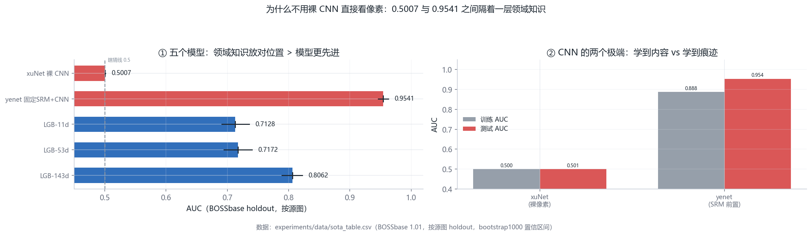
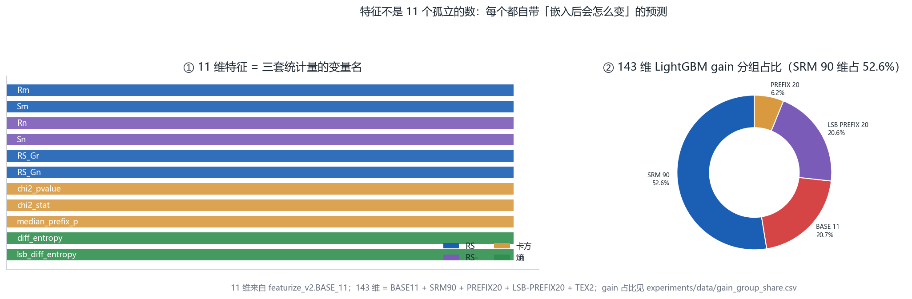
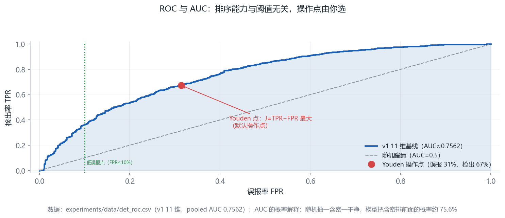
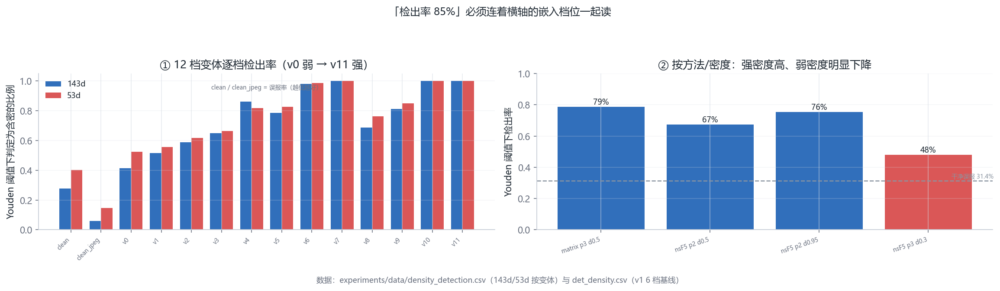
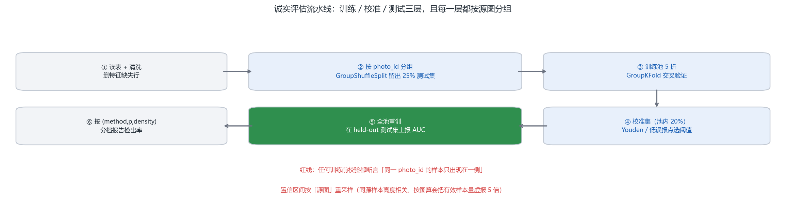
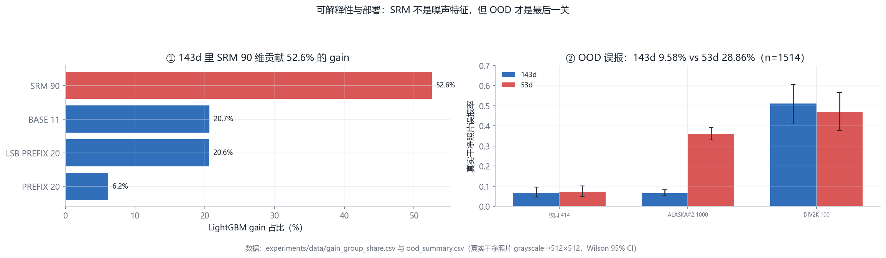

# 第 8 章 · 用机器学习做隐写检测（第 8–9 周）

<!-- lang-switch -->
> [🌐 English version](https://yukinoshita-lin.github.io/nsf5-steganography/en/content/ch08.html)


> **本章导航** ·　先看问题，再读正文
> 
> **核心问题　为什么“深度学习直接看像素”在这个任务上会失败？**
> 
> **读完你能回答**
> 
> - 说清 11 维特征与 143 维（含 SRM）的构成与“出身”；
> 
> - 解释裸 CNN 在 BOSSbase 上只有 **0.5007** 意味着什么；
> 
> - 读懂按档检出率，说明“强密度高、弱密度明显下降”；
> 
> - 说清 **OOD 误报率**为什么是部署前的最后一关。
> 
> *“更好的模型”不是默认成立的——本章用一组真实数字把它拆开看。*

**开场问题：0.5007 与 0.9541，同一个任务、同一份数据，两个模型差了一整个太平洋——差在哪？**这两个 AUC 都是本项目在 BOSSbase 基准上的真实实测值（详见 docs/RESULTS.md）：前者是“裸 CNN 直接看像素”，后者是“固定 SRM 高通滤波 + 小型卷积网络”。中间 0.45 的差距没有一行魔法——它全部来自**领域知识被放在了管线的哪个位置**。本章讲完，你应当能自己解释这张表：

| **模型** | **特征** | **AUC** | **一句话诊断** |
| --- | --- | --- | --- |
| 裸 CNN (xuNet 结构) | 原始像素 | 0.5007 | 学到了内容，没学到痕迹 |
| 固定 SRM + CNN (yenet) | SRM 残差 | 0.9541 | 领域知识放在第一层，CNN 学高层 |
| LGB-11d | 手工 11 维 | 0.7128 | 小样本下可靠的教学基线 |
| LGB-143d | SRM 90 + 其余 53 维 | 0.8062 | 默认部署版：容量与稳健的平衡 |
| LGB-53d | 可解释子集 | 0.7172 | 每一维都能讲出故事 |

| **小节** | **回答的问题** | **你的产出** |
| --- | --- | --- |
| 8.1 为什么不用 CNN | 路线选择的依据是什么？ | 能复述三条理由与两个 AUC |
| 8.2 认识 11 特征 | 每个特征在度量什么？ | 能把特征名与第 3 章的统计量对上 |
| 8.3 数据设计 | “1+6”变体为什么这样配？ | 能解释强中弱三档的用意 |
| 8.4 训练流水线 | “诚实评估”由哪几层组成？ | 能画出训练/校准/测试三层图 |
| 8.5 读结果 | AUC 与按档检出率怎么读？ | 能向他人解释一张 ROC 图 |
| 8.8 SRM 与双版本 | v2 升级升在哪、坑在哪？ | 能讲出 OOD 部署的真实教训 |

> **动手做｜
本章目标：理解“为什么是 11 维统计特征而不是裸像素 CNN”；认识每个特征在测什么；跑通数据生成→训练→评估→GUI 判定全链路。**

## 8.1 先回答一个反直觉的问题：为什么不用 CNN 直接看像素？

深度学习直接吃像素（“裸 CNN”）在这个任务上并不好用。项目在 414 张照片上 试过多架构深度卷积网络，验证 AUC≈0.50，即完全无法泛化。原因值得细品：

隐写改动的是极弱的高频信号（LSB 层），信噪比远低于物体、纹理等视觉内容；

CNN 很容易学到“照片内容”而不是“隐藏痕迹”，一旦测试照片风格不同就失效；

真正独立的样本数量是照片数（几百张），而深度模型通常需要成千上万张独立源图。

于是项目选择“领域知识做特征 + 简单分类器”路线：手工设计能直接度量 LSB 统计足迹的特征，再用逻辑回归/树模型判别。v1 时代 11 维特征在小样本上的 AUC 约 0.75～0.79；v1.4 升级到 143 维 + LGB 双版本后达到 0.90+（见 8.8），但“特征法优于裸 CNN”的基本结论不变。

> **新手提示｜
这不是“深度学习无用”的结论，而是“在样本量约束下如何选建模策略”的方法论课：先用可解释的强特征验证信号是否存在，再考虑更复杂 的模型。很多工程问题都遵循这个次序。**



图 8-1 隐写检测的模型全景与路线之争。这张图回答的是：为什么“深度学习直接看像素”在这题上会失败？五个模型的 AUC 与置信区间，以及两个 CNN 的训练/测试落差——裸 CNN 为什么“稳定地不会”

## 8.2 认识 11 个特征

11 维特征不是 11 个孤立的数，而是第 3 章三套统计量的“变量名”。把名字与来历对上，每个特征就都有了性格（特征名与 featurize_v2.py 的 BASE_11 一致）：

| **特征名** | **出身** | **在度量什么** |
| --- | --- | --- |
| Rm / Sm | RS 分析 | M/F 翻转后变平滑的组占比——位面结构的正反面 |
| Rn / Sn | RS 分析（负掩码） | 负翻转下的对照占比，用于扣除图像本底的对称性 |
| RS_Gr / RS_Gn | RS 分析 | (R−S)/N 的正负两版——3.4 节的 Gn 全家 |
| chi2_pvalue / chi2_stat | 卡方检验 | 偶奇配对被拉平的程度（p 高越可疑） |
| diff_entropy / lsb_diff_entropy | 信息论 | 相邻像素差分的熵——纹理本底的“随机度基线” |
| median_prefix_p | 卡方前缀族 | 20 个前缀段 p 值的中位数——局部随机化的探测器 |

注意它们的设计哲学：**每一个特征都自带“嵌入后会怎么变”的预测**——嵌入后 Rm 降、chi2_pvalue 升、lsb_diff_entropy 变化。机器学习在这里的角色不是“发明规律”，而是“把十几个各有盲区的预测器加权成一个决策”。这也是 8.1 节“领域知识做特征”的含义：特征的解释性让模型出错时你知道去哪查。

> **新手提示｜** 差分熵是什么？把相邻像素的差分（右邻减自身）画成直方图，它的 Shannon 熵就是 diff_entropy。平滑图的差分集中在 0 附近（熵低），纹理图的差分散得开（熵高）。嵌入会把 LSB 层的差分直方图“抬平”——所以 lsb_diff_entropy 是专门盯着 LSB 层的这一份。

v1 的 11 维特征全部由 C++ 库 cpp/fsfeatures.dll 计算（Python 绑定在 src/fsfeatures.py）；v2 的 143 维特征在 src/featurize_v2.py 中组装。按“测什么”可以分成三组：

| **特征** | **含义** | **嵌入后会怎样** |
| --- | --- | --- |
| Rm / Sm / Gr | 正掩码下常规/奇异组数与缺口 | Gr 下降（结构受损） |
| Rn / Sn / Gn | 负掩码下常规/奇异组数与缺口 | Gn 显著塌缩（核心信号） |
| chi2_stat / chi2_pvalue | 卡方统计量及其 p 值 | 灰度对趋向均匀，p 上升 |
| diff_entropy | 灰度差分熵：图像本底粗糙度 | 用于识别天然噪声图 |
| lsb_diff_entropy | LSB 位面差分熵 | 随机化后趋近 1 |
| median_prefix_p | 20 个前缀段卡方 p 的中位数 | 整体随机化时升高 |
| 回到项目看代码｜
打开 src/steganalysis.py，找到 diff_entropy() 与  lsb_diff_entropy()：它们用相邻像素差值的香农熵估计“随机度基线”。再打开 src/fsfeatures.py，看 11 维特征是如何排列并交给 C++ 的。 | 回到项目看代码｜
打开 src/steganalysis.py，找到 diff_entropy() 与  lsb_diff_entropy()：它们用相邻像素差值的香农熵估计“随机度基线”。再打开 src/fsfeatures.py，看 11 维特征是如何排列并交给 C++ 的。 | 回到项目看代码｜
打开 src/steganalysis.py，找到 diff_entropy() 与  lsb_diff_entropy()：它们用相邻像素差值的香农熵估计“随机度基线”。再打开 src/fsfeatures.py，看 11 维特征是如何排列并交给 C++ 的。 |



图 8-2 11 维特征的出身与 143 维的构成。这张图回答的是：11 维和 143 维特征各由什么组成？11 维特征按统计量家族着色，及 143 维的 gain 分组占比——先懂特征，再谈模型

## 8.3 数据怎么来：make_dataset.py 的“1+6”设计

src/make_dataset.py 对每张源照片生成 1 张干净图 + 6 个含密变体（v1.4 另支持 12 档 v2 变体，见 8.8）：

| **变体（方法, p, 密度）** | **强度** | **目的** |
| --- | --- | --- |
| clean | — | 提供干净的负样本 |
| nsF5, p=3, d=0.25 | 弱 | 贴近真实隐蔽通信的弱密度 |
| nsF5, p=3, d=0.55 | 中 | 中等密度，检验一般强度 |
| nsF5, p=2, d=0.35 | 中弱 | p 越小效率越低，痕迹更强 |
| nsF5, p=2, d=0.85 | 强 | 强嵌入，统计足迹明显 |
| matrix, p=3, d=0.50 | 中 | 对比另一方法 |
| matrix, p=2, d=0.80 | 强 | 普通矩阵编码的高密度 |
| v1.4 再 +6 档 | — | nsF5 p3 d0.40；matrix p3 d0.40/0.60；lsb d0.30/0.50/0.70 |

所有图统一缩放为 512×512 灰度；特征全部由 C++ 提取，含密变体由 C++ 嵌入路径 生成，保证训练与推理一致。

## 8.4 训练脚本怎么读：train_model.py

```bash
python src\train_model.py 的流程是一条完整的“诚实评估流水线”：
```

读表并删除特征缺失的行；

按 photo_id 用 GroupShuffleSplit 预留 25% 作为最终测试集（本组照片绝不进训练池）；

训练池上做 5 折 GroupKFold 交叉验证，比较逻辑回归 / 随机森林 / 梯度提升 / XGBoost；

选出 CV-AUC 最高的模型，在训练池内再切 20% 作为校准集选阈值（Youden 与低误报点）；

用全部训练池重训，在 held-out 测试集上报 acc / balanced acc / AUC / 分类报告；

按（method, p, density）分组报告每档检出率；

保存模型与阈值到 models/stego_classifier.joblib（v1.4 起支持 LGB 网格调优、Stacking 与 53d 可解释版另存）。

> **避坑提醒｜
校准集用于挑阈值，测试集只许用一次。如果反复拿测试集调阈值，测试集就“脏”了。项目用三层结构——训练/校准/测试，是工业界也认可的 严谨做法。**

## 8.5 怎么读结果：ROC、AUC 与按档检出率



图 8-3 隐写检测 ROC 与 AUC（v1 基线）。这张图回答的是：v1 基线的 ROC 与操作点长什么样？v1 数据集 11 维基线的 ROC 曲线、Youden 操作点与低误报点（按照片分组留出外折）

ROC 曲线把阈值从 1 扫到 0，画出“检出率 vs 误报率”。AUC 是曲线下面积：0.5 是瞎猜。v1 基线上 0.75 量级说明“大部分时候能把含密图排在干净图前面”，但弱密度仍容易漏；v1.4 双版本模型（见 8.8）把 8-split 平均 AUC 做到 0.8980（143d）/ 0.8461（53d），口径见 docs/RESULTS.md。



图 8-4 按档检出率（逐变体与按方法/密度）。这张图回答的是：强密度和弱密度的检出率差多少？v1 数据集 6 档基线的逐档检出率与按方法/密度汇总（Youden 阈值）：强密度高、弱密度明显下降

> **回到项目看代码｜对比 experiments/data/density_grid.csv（第 5 章实验产出的真实统计）：lsb 各档几乎 100% 检出，matrix p2 d0.80 约 95%，而弱档 nsF5 p3 d0.25 只有约 47%、nsF5 p3 d0.55 约 55%。这说明“弱嵌入更难检测”不是玄学，而是统计足迹随密度衰减的直接结果。**

AUC 有一个值得刻在脑子里的概率解释：**随机抽一张含密图和一张干净图，模型给含密图更高分的概率**。LGB-143d 在 BOSSbase 上 0.8062，读作“十次对比里约八次排对”；xuNet 的 0.5007 读作“跟抛硬币没区别”。这个解释让 AUC 不依赖任何阈值，也因此它回答不了“设了阈值之后误报多少”——那是 ROC 曲线上你选的那个点的责任。

按档检出率（图 8-2）则回答另一个更残酷的问题：**嵌入率降到多少时检测会失效**。v1 基线的曲线是“强密度 90%+、弱密度掉到六成”；v2 143 维把整条曲线上抬，但最弱档依然最难——这不是模型不行，而是信息论在设限：0.2% 像素改动的统计痕迹，本来就逼近自然图像自身的噪声地板。读实验报告时，先看横轴的嵌入档位再看数字，否则任何“检出率 85%”都是无意义的口号。

> **想一想｜** 同一个 143d 模型，在校园语料上 AUC 0.8939、在 BOSSbase 上 0.8062——模型没变，数字差了 0.09。回到 7.4 节的“按组切分”与 RESULTS.md 的语料表，列出至少两条可能造成差异的语料属性（提示：图像内容风格、负样本构成、分辨率与 JPEG 历史）。

AUC 的概率解释写成式子（Mann–Whitney 统计量的归一化形式）：

其中 s₁ 是含密图的模型得分、s₀ 是干净图的得分，指示函数 1[·] 在括号内为真时取 1。于是 AUC = 0.8062 读作：随机抽一张含密图与一张干净图，模型把含密图排在前面的概率约 80.6%。它绕过了阈值——这也正是它回答不了“误报率多少”的原因：误报率是曲线上你选的那个点的纵坐标，由 Youden 或低误报准则决定。



图 8-5 诚实评估流水线（训练/校准/测试三层）。这张图回答的是：一个诚实的评估流程要经过哪几步？从读表到分档报告的六步流水线与两条分组不变量——评估流程本身也要经得起审计

## 8.6 灵敏度：在 GUI 里如何工作

src/ml_predict.py 的 MLPredictor 预处理好图像（转灰度→512×512）后，按模型记录的特征列数自动走 v1 11 维或 v2 143 维特征提取，再输出含密概率。灵敏度三档通过切换阈值工作：

| **灵敏度** | **ML 阈值** | **效果** |
| --- | --- | --- |
| 严格（低误报） | threshold_low_fp | 干净图误判最少，弱含密更容易漏 |
| 均衡 | Youden 阈值 | 检出与误报平衡，默认档 |
| 宽松（高检出） | Youden×0.75 | 弱密度检出更多，误报略升 |

GUI 的“分析”页会把启发式概率与 ML 概率并排显示，要求你交叉印证， 而不是只看一个数——这是项目刻意保留的诚实设计。

## 8.7 动手实验：从训练到单图判定

完整链路（v1 数据集；v2 与双版本命令见 8.8）

```text
# 1) 生成数据集（可用自己的照片目录替代 F:\DCIM\Camera）
python src\make_dataset.py
 
# 2) 训练与评估
python src\train_model.py
 
# 3) 对单张图做 ML 判定
import sys; sys.path.insert(0, "src")
import numpy as np
from PIL import Image
from ns5_core import embed_string
from ml_predict import get_predictor
a = np.asarray(Image.open("img/cover.png").convert("L"))
s, _, _ = embed_string(a, "ML test", method="nsF5", p=3)
print(get_predictor().predict(s))
```

> **动手做｜
做一个“诚实性小实验”：先对一张照片做 ML 判定（应接近干净），再嵌入弱档消息（nsF5 p=3、密度 0.25 附近）重新判定。观察概率是否只 微弱上升。这正是 README 里“弱密度需交叉印证”警告的现场体验。**

## 8.8 v1.4.0 更新：SRM、143 维特征与双版本模型（2026-09）

8.1–8.7 描述的是 v1.0–v1.3 的路线：11 维特征 + LR/XGB，AUC 约 0.75–0.79。v1.4.0 沿三条线做了升级：SRM 高通滤波预处理、143 维 v2 特征与 12 档变体、以及最终的 LightGBM 双版本模型。下面按项目实际演进顺序讲，帮助你读懂 README 中那一长串实验表。

8.8.1 SRM 高通滤波：同源有收益，跨源反而亏

SRM（Spatial Rich Model）是 Fridrich 体系的一组高通滤波核。src/srm_filter.py 实现 30 个标准核（一阶差分 8 + 二阶 4 + 三阶 8 + 边缘 3×3/5×5 共 8 + 方形 3×3/5×5 共 2），对图像逐核滤波后取最大绝对响应、clip 到 ±4 再缩放成单通道“增强图”，喂给原有特征器。CPU（numpy）与 GPU（torch）双实现，接入开关是 make_dataset.py --preprocess srm 与 GPU 的 use_srm=True。

| **指标** | **同源原图基线** | **同源 SRM 增强** |
| --- | --- | --- |
| 5 折 CV-AUC | 0.7594 | 0.7922 |
| held-out 测试 AUC | 0.7811 | 0.8085 |
| 弱档 nsF5 p3 d0.25 检出 | 51.9% | 62.5% |
| nsF5 p2 d0.35 检出 | 76.0% | 90.4% |
| 低误报点含密检出 | 41.2% | 50.3% |
| 干净误报（低误报阈值） | 9.6% | 9.6% |
| 避坑提醒（v1 时期对照，数字未在当前版本复现）｜当年观察到：SRM 预处理的收益只在“同源”数据内出现。跨源合并（校园 + BOSSbase 全量）时，SRM 反而把 CPU 测试 AUC 从 0.741 拉到 0.704、GPU 验证 AUC 从 0.651 拉到 0.572——高通滤波在压掉图像内容的同时，也压平了不同相机/压缩源之间的可分性。因此默认模型采用未 SRM 的合并全量；SRM 单源校园模型另存为 campus_srm 专用。 | 避坑提醒（v1 时期对照，数字未在当前版本复现）｜当年观察到：SRM 预处理的收益只在“同源”数据内出现。跨源合并（校园 + BOSSbase 全量）时，SRM 反而把 CPU 测试 AUC 从 0.741 拉到 0.704、GPU 验证 AUC 从 0.651 拉到 0.572——高通滤波在压掉图像内容的同时，也压平了不同相机/压缩源之间的可分性。因此默认模型采用未 SRM 的合并全量；SRM 单源校园模型另存为 campus_srm 专用。 | 避坑提醒（v1 时期对照，数字未在当前版本复现）｜当年观察到：SRM 预处理的收益只在“同源”数据内出现。跨源合并（校园 + BOSSbase 全量）时，SRM 反而把 CPU 测试 AUC 从 0.741 拉到 0.704、GPU 验证 AUC 从 0.651 拉到 0.572——高通滤波在压掉图像内容的同时，也压平了不同相机/压缩源之间的可分性。因此默认模型采用未 SRM 的合并全量；SRM 单源校园模型另存为 campus_srm 专用。 |

8.8.2 v2 143 维特征与 12 档变体

```text
src/featurize_v2.py 在 11 维基础上增加：30 个 SRM 残差的均值/绝对均值/标准差（90 维）、20 段整图前缀卡方 p、20 段 LSB 前缀卡方 p，以及 texture_noise 与 est_rate（2 维），合计 143 维。训练变体从 6 档扩展到 12 档：追加 nsF5 p3 d0.40、matrix p3 d0.40/0.60，以及 lsb d0.30/0.50/0.70。
```

严格 A/B（同一测试集照片分组、5 折 GroupKFold OOF）：v2 数据集本身带来 +0.019（同 11 维时 0.7868 vs 0.7678）；在 v2 数据集上再加 143 维又 +0.027（OOF 0.8143、held-out 0.8278）。累计约 +0.05 AUC。

8.8.3 真实 JPEG 干净图暴露的部署问题与修复

v2 LR 在训练分布内 AUC 很高，但部署到真实 JPEG 干净照片时几乎全判 1.0：SRM 残差对 JPEG 高频噪声过于敏感。修复办法是把 414 张真实 JPEG 干净图加进训练，得到 dataset_campus_v2_jpeg.csv，再做 LGB 网格调优。【2026-09-14 审计更正】这批 JPEG 干净行当初被赋予了独立 photo_id，而其特征与对应 clean 行逐位相同（是副本）：同一张源图的样本因此可以跨训练/验证两侧，“按源图划分”名存实亡、指标被抬高；同一批 GPU 特征还把像素先除以 255 再过高通滤波，与推理端 CPU 特征相差约 30 倍。两处都已修复并重跑（修复方式见 experiments/add_jpeg_clean.py，细节见 docs/RESULTS.md 与 CHANGELOG 1.6.2）。现口径：143d held-out AUC 0.8939、8-split 平均 0.8980、弱档 nsF5 p3 d0.25 检出 50.0%；53d 为 0.8391 / 0.8461 / 41.4%。

8.8.4 双版本部署策略：143d 稳健 vs 53d 可解释

可解释性实验（2026-09-14 按修正后的特征口径重算）：143 维里 SRM 90 维贡献了 52.6% 的 LightGBM gain，BASE 11 占 20.7%、LSB PREFIX 20 占 20.6%、PREFIX 20 占 6.2%；消融显示去掉 SRM 90 维后 5 折 OOF AUC 从 0.9010 掉到 0.8513（约 +0.05 AUC）。也就是说修好尺度之后 SRM 不是“噪声特征”。于是项目保留两套模型：

| **维度** | **143d 默认（稳健）** | **53d 可解释** |
| --- | --- | --- |
| 特征构成 | BASE11 + SRM90 + PREFIX20 + LSB-PREFIX20 + TEX/EST2 | 去 SRM 后的 53 维 |
| 8-split 平均 AUC | 0.8980 | 0.8461 |
| Held-out AUC | 0.8939 | 0.8391 |
| 弱档 nsF5 p3 d0.25 | 50.0% | 41.4% |
| 真实 JPEG 干净 OOD | 9.58%（n=1514，95%CI 8.20–11.16%） | 28.86%（n=1514，95%CI 26.64–31.20%） |
| 推荐场景 | 通用部署 / 异构数据 / 真实图 | 教学 / 答辩 / 单图可解释（AUC 略低约 0.05） |

```text
MLPredictor() 默认加载 143d；传入 model_path 可切 53d。推理时会按模型记录的特征列数自动选择 11 维或 143 维特征提取。GUI 的模型单选框仍在规划中，当前通过 API 切换：
```

v1.4.0 双版本模型切换示例

```text
from ml_predict import MLPredictor
 
# 默认：143d 稳健版（models/stego_classifier.joblib）
pred_143 = MLPredictor()
 
# 53d 可解释版（去 SRM 90 维，AUC 略低、但可逐维解释）
pred_53 = MLPredictor(
    model_path='models/stego_classifier_v2_jpeg_lgb_51d.joblib',
    clip_outliers=False)
 
r = pred_53.predict(img)
# {'probability': ..., 'verdict': ..., 'threshold': ...}
动手做｜实验任务：用 $env:DS_FILES = "dataset_campus_v2_jpeg.csv" 重新训练，分别用 143d 与 53d 对“真实 JPEG 干净图”和“弱档 nsF5 p3 d0.25 嵌入图”做判定，把 AUC 与 OOD 行为写进实验报告。
避坑提醒｜v2/53d 模型只在训练分布附近可靠：训练含校园照片（PGM/BMP 灰度派生）与已加入的 JPEG 干净样本。对全新相机/压缩源，先做小规模 OOD 测试再谈部署。
```



图 8-6 特征 gain 可解释性与 OOD 误报率。这张图回答的是：模型没见过的新分布，才是部署前的最后一关吗？143d 的 gain 分组占比与按来源的 OOD 误报率（含置信区间）——模型没见过的新分布才是真边界

## 8.9 小结与自我检查

小样本 + 弱信号场景下，领域特征 + 简单模型通常比裸 CNN 更可靠；

11 个特征 = RS 家族 + 卡方家族 + 熵/随机度基线；

训练/校准/测试三层结构 + GroupKFold 是实验可信度的骨架；

ML 概率与启发式判读应交叉印证，弱密度检测有其物理上限。

v1.4 之后双版本模型在训练分布内已很强，但真实部署前仍必须做 OOD 验证：本项目在 1514 张真实干净照片（校园 414 + DIV2K 100 + ALASKA#2 1000）上实测，143d 误报 9.58%（95%CI 8.20–11.16%）、53d 28.86%（26.64–31.20%）；DIV2K 这类 2K 高清图是主要失分来源（143d 约 51%）。评估脚本 experiments/ood_eval.py，结果见 docs/RESULTS.md 第 5 节。

> **想一想｜
数据集中同一张照片有 7 个样本，为什么不能用“随机 80/20 切分”？请设计一个最小例子说明泄漏会让 AUC 虚高多少。**

**本章小结。**路线之争的答案是“领域知识的位置”：裸 CNN 0.5007、固定 SRM 前置的 yenet 0.9541、手工特征 + LGB 0.71～0.81——知识放对地方比模型更先进更重要；11 维特征每个都有第 3 章的出身；训练/校准/测试三层 + 按源图分组是诚实的骨架；OOD 误报率是部署前的最后一关，1514 张真实干净照片是本项目交出的答卷。

> **动手做｜** 章末练习（提示与答案见附录 J）
> 
> P8.1（思考）把 8.1 节主表里的五个模型按“领域知识含量”从高到低排序，再看 AUC 排序——两者一致吗？有没有反例，怎么解释？
> 
> P8.2（手算）一个 ROC 点：阈值取最高时检出率 0%、误报率 0%；取最低时 100%/100%。若模型完美，曲线长什么样？AUC 多少？
> 
> P8.3（上机）跑 8.7 节完整链路（数据生成→训练→单图判定），把你自己的照片目录喂进去，记录 AUC 与混淆矩阵；对比 README 的数字并解释差异来源。
> 
> P8.4（思考）8.8.3 的部署事故里，“真实 JPEG 干净照片被全判 1.0”的根因是 SRM 残差对 JPEG 噪声过敏。如果反过来把训练数据全部换成 JPEG 图、部署到 PNG 场景，你会预期什么问题？
> 
> P8.5（思考·选做）53d 可解释版牺牲 0.09 的 AUC 换“每一维可解释”。列举两个必须选 53d 的场景与两个必须选 143d 的场景。
