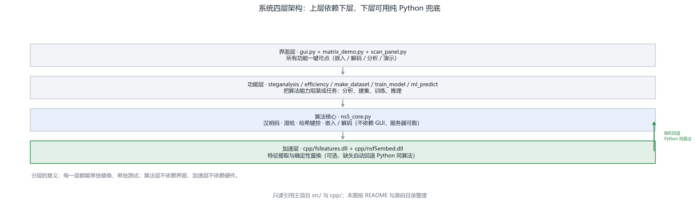
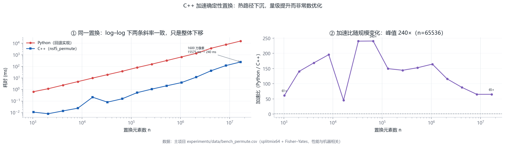
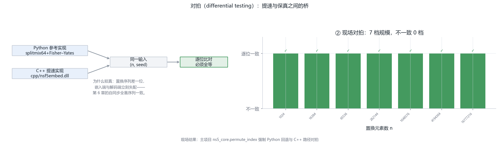
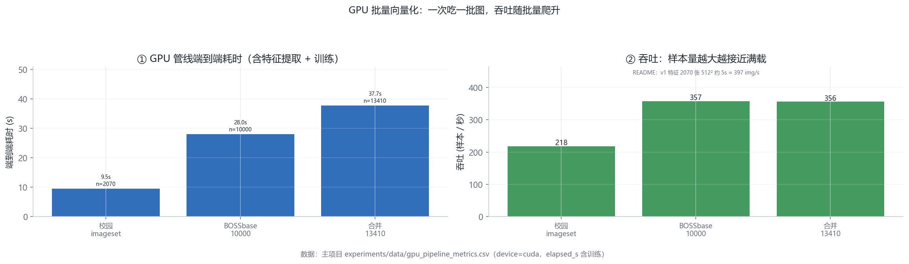
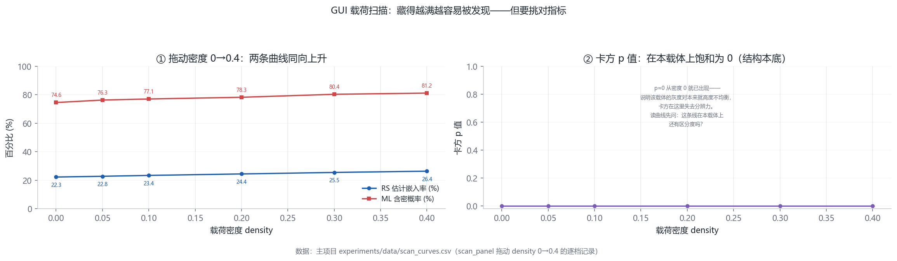
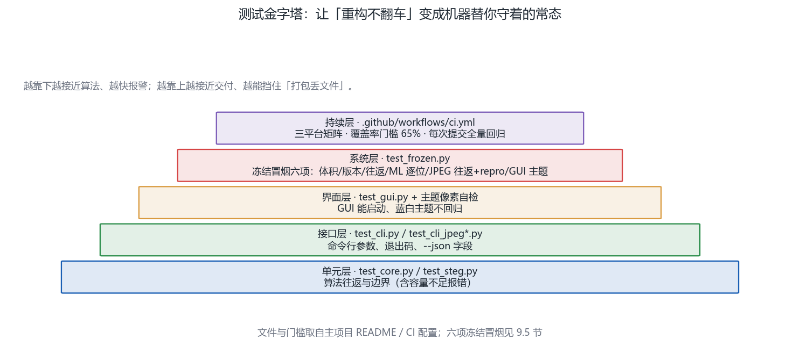

# 第 9 章 · 工程化：C++、GPU、GUI 与测试（第 10 周）

<!-- lang-switch -->
> [🌐 English version](https://yukinoshita-lin.github.io/nsf5-steganography/en/content/ch09.html)


> **本章导航** ·　先看问题，再读正文
> 
> **核心问题　同一份算法代码，凭什么说它“工程上可靠”？**
> 
> **读完你能回答**
> 
> - 画出四层架构，并举例说明“缺失即回退”的降级路径；
> 
> - 解释**对拍（differential testing）**，以及“先测量、再下沉”的热路径纪律；
> 
> - 说明 GPU 一致性的难点，与“只吃可并行的归约”这条设计原则；
> 
> - 列出测试金字塔的五层与六项冻结冒烟各自守护什么。
> 
> *算法正确只是底线；本章把“工程可靠”拆成一张可以执行的清单。*

**开场问题：同一份算法代码，凭什么说它“工程上可靠”？**算法正确（第 5 章的往返自检）只是底线。工程可靠性要回答三个更难的问题：慢的环节能不能快（性能）、快的环节会不会算错（一致性）、没有加速硬件的用户能不能用（降级）。本章的项目给出了教科书级的答案：C++ 对拍、GPU 批量化、DLL 缺失自动回退、六项冻结冒烟。读完本章，你应当能把“工程可靠”从一句口号拆成一张可以执行的清单。

| **小节** | **回答的问题** | **你的产出** |
| --- | --- | --- |
| 9.1 分层 | 代码怎么切成四层？ | 能画出分层图并举例说明回退 |
| 9.2 C++ 加速 | 热路径怎么找、怎么保证不错？ | 能解释“对拍”（differential testing） |
| 9.3 GPU 版 | 批量向量化换了什么？ | 能说出 GPU 一致性的难点 |
| 9.4 GUI | 教学演示怎么设计？ | 知道 matrix_demo/scan_panel 的用途 |
| 9.5 测试与 CI | 重构的安全网是什么？ | 能列出六项冻结冒烟 |

> **动手做｜
本章目标：看懂“算法”如何变成“软件”；理解为什么需要 C++ 与 GPU 加速、如何保证跨语言一致；会运行测试与 CI 流程。**

## 9.1 系统架构：分层而不耦合



图 9-1 系统四层架构。这张图回答的是：代码为什么这么分层？缺一层会怎样？加速层 / 算法核心 / 功能层 / 界面层与缺失回退路径——分层而不耦合

加速层：cpp/fsfeatures.dll（特征）、cpp/nsf5embed.dll（嵌入/置乱）；

算法核心：ns5_core.py——汉明码、湿纸、哈希键控、嵌入/解码；

功能层：steganalysis.py、efficiency.py、make_dataset.py、train_model.py、ml_predict.py；

界面层：gui.py + matrix_demo.py + scan_panel.py，所有功能一键可点。

分层的意义：算法层不依赖 GUI，可以在无界面环境（服务器/CI）里跑；加速层 缺失时自动回退 Python，保证功能永远可用。

## 9.2 C++ 加速：为什么是“热路径”，以及如何保证没错

Python 逐元素循环极慢，但隐写有两个典型热路径：确定性置换（把 1600 万 像素的顺序洗一遍）与特征提取（对每张图做 RS/卡方/熵统计）。把它们下沉到 C++ 动态库，性能可以提升几个数量级：置换加速随规模变化（数据见 experiments/data/bench_permute.csv，可用 `python experiments/tools/gen_bench.py --only permute` 复现；性能与机器相关）：4096²（1600 万像素）Py ≈15.6 秒 → C++ ≈0.24 秒（约 65 倍），同一份基准里小规模（6.5 万）最高约 240 倍。。



图 9-2 确定性置换性能。这张图回答的是：热路径下沉到 C++，实测快了多少？Python vs C++ 确定性置换耗时（log–log）与加速比曲线——热路径下沉的实测收益

性能提升的前提是“结果完全一样”。Python 调 DLL 用的是 ctypes， 项目为此设计了自校验：

```text
cppembed.py 用同一图像分别走 C++ 与 Python 路径嵌入，比较输出是否像素级一致；
```

```text
fsfeatures.py 的 check_against_python() 逐特征核对 C++ 与 Python 结果；
```

DLL 缺失或加载失败时自动回退 Python 同算法，保证嵌入/解码两端序列恒定可逆。

> **避坑提醒｜
跨语言一致性是“可加速”的前提，也是调试的雷区：C++ 端位运算、取整、溢出行为与 Python/NumPy 不完全一致。遇到“有 DLL 能嵌、无 DLL 解不了”的诡异 bug，先跑 cppembed.selfcheck() 和 fsfeatures.check_against_python()，而不是去改算法。**

“对拍”（differential testing）值得单独讲透，因为它是数值工程里最便宜的正确性武器：同一个函数写两份实现（一份 Python 参考实现、一份 C++ 提速实现），喂**完全相同的输入**，要求输出**逐位一致**。项目里确定性置换的对拍就是范例——固定种子、固定数组规模，Python 版与 DLL 版各自洗牌，diff 两个输出序列，必须一字不差。为什么这么较真？因为置换序列一旦有哪怕一位不同，嵌入与解码两端立刻失配（第 6 章的自同步全靠序列一致）。“提速”与“保真”之间的这座桥，就是对拍。

热路径怎么找也有纪律：**先测量，再下沉**。用 cProfile 跑一次大图嵌入，看时间花在哪——实测会发现时间集中在两处：纯 Python 的逐元素洗牌循环，与逐像素的特征统计。其余代码（哈希、编码、文件 IO）占比不到一成，下沉它们是白费力气。“优化前先测量”这六个字，是 CSAPP 从头到尾反复敲的黑板字。



图 9-3 对拍：Python vs C++。这张图回答的是：提速之后，怎么保证 C++ 版没有算错？对拍机制与逐档一致性的现场结果——提速与保真之间靠“逐位一致”搭桥

## 9.3 GPU 版：把 11 维特征“批量向量化”

gpu/ 目录用 PyTorch 把特征计算改写成张量算子：一次读入一批 512×512 灰度图，在 GPU 上并行完成直方图、RS、卡方与熵计算，再落回 CPU。v1.4 新增 gpu/featurize_v2_gpu.py 支持 143 维 v2 特征（含 SRM 卷积）。README 实测 v1 特征 2070 张约 5 秒（≈410 张/秒），且与 CPU 参考实现逐位一致（浮点误差 ~1e-7）。



图 9-4 GPU 批量管线。这张图回答的是：GPU 批量化换来了多少吞吐？v1 11 维特征提取吞吐：CPU(C++) vs GPU(torch 批量) 与端到端耗时

> **回到项目看代码｜
读 gpu/featurize_gpu.py 的自检函数：它把 GPU 结果与 src/fsfeatures.py 的 CPU 结果逐元素比较。bit 级一致是这套双实现能并存的前提。再读 README 关于吞吐边界的讨论：小批量时主机↔设备拷贝开销可能让 GPU 反而不如 C++——这是诚实评测，不是“GPU 一定更快”的营销话术。**

GPU 一致性比 CPU 对拍更难，原因是浮点：同一串加法在 GPU 上可能改变求和顺序，结果差在最后几位有效数字上。项目的对策是**把特征设计成对顺序不敏感的统计量**（直方图计数、均值、熵），并在管线里先跑 CPU 再跑 GPU、逐特征比对误差上限。这给出一条通用原则：**能在 GPU 上安全加速的，首先是“可交换、可并行的归约”**；带复杂依赖的串行逻辑（比如湿纸求解）留在 CPU，不是技术不行，是设计对。

## 9.4 GUI：把研究工具变成可教学的应用

```text
src/gui.py 的主界面围绕“嵌入→解码→分析”三步设计。真正出彩的是两个教学面板：
```

矩阵编码演示（matrix_demo.py）：随机/手点一个块，实时计算 s、m、d，高亮命中的列与被改系数，直观展示“至多改 1 位”；

载荷扫描（scan_panel.py）：拖动 payload 0→0.4，逐档重新嵌入并刷新卡方 p 值、RS 估计率与 ML 概率三条曲线，观察“藏得越满越容易被发现”。



图 9-5 GUI 载荷扫描。这张图回答的是：嵌入密度变化时，各种可检测性指标怎么动？密度扫描下 RS 估计率、ML 概率与卡方 p 值的变化——统计可检测性随嵌入密度变化

> **避坑提醒｜
注意 GUI 文案里的严谨措辞：单张图没有“AUC”（AUC 需要一组正负样本），所以扫描面板用的是模型概率作为趋势示意。阅读软件输出时，要区分 “单图概率”与“数据集指标”，这是容易被误用的一处。**

## 9.5 测试与 CI：让重构不翻车

| **测试文件** | **验证内容** | **心智模型** |
| --- | --- | --- |
| test_core.py | 汉明矩阵正确性、嵌入/解码往返、湿纸、口令错误 | 算法没坏 |
| test_steg.py | 盲分析能区分干净图与含密图 | 分析没坏 |
| test_false_positive.py | 大量干净图不误报（回归） | 误报没失控 |
| test_gui.py | 窗口能构建、载入与预览 | 界面没坏 |

```text
.github/workflows/ci.yml 会在每次推送到 main 或提 PR 时自动跑核心测试、 构建 wheel 与 sdist；推送 v* 标签时自动发 GitHub Release。 这套“测试 + 打包 + 自动发布”是算法项目走向可复用工具的标准姿势。
```

把项目的测试网按“离算法的距离”排成一张金字塔，每层都有真实文件对应：

| **层级** | **项目里的位置** | **守住什么** |
| --- | --- | --- |
| 单元层 | test_core.py / test_steg.py | 算法函数的往返与边界（含容量不足报错） |
| 接口层 | test_cli.py / test_cli_jpeg*.py | 命令行参数、退出码、--json 字段 |
| 界面层 | test_gui.py + GUI 主题像素自检 | GUI 能启动、蓝白主题不回归 |
| 系统层 | test_frozen.py 冻结冒烟六项 | 体积 / 版本 / 往返 / ML 逐位 / JPEG 往返+repro / GUI 主题 |
| 持续层 | GitHub Actions（覆盖率门槛 65%） | 三平台矩阵 + 每次提交全量回归 |

六项冻结冒烟里最容易被低估的是第 4 项“ML 逐位一致”与第 5 项“JPEG 往返+repro”：它们防的不是代码写错，而是**打包时静默丢依赖**——DLL 或模型没进安装包，功能降级却无报错。让“降级”变成红灯而不是静默，是打包工程最痛的一课（v1.8/v1.9 两次踩坑后固化成冒烟项）。



图 9-6 测试金字塔。这张图回答的是：重构不翻车的安全网由哪几层构成？单元→接口→界面→系统→持续五层测试与各自的守护对象——重构不翻车的安全网

## 9.6 代码阅读路线图（按需选用）

入口：src/run_e2e.py（最短路径，串起所有模块）；

数据层：image_io.py → 数组怎么进出的；

嵌入层：ns5_core.py 从上到下读一遍（哈希、置换、汉明、湿纸、高层 API）；

分析层：steganalysis.py 的 analyze() 逆向追踪每个统计量；

ML 层：train_model.py 主流程 → featurize_v2.py / srm_filter.py （v1.4）→ ml_predict.py 双版本推理；

加速层：cppembed.py / fsfeatures.py 的 ctypes 与自校验；

界面层：gui.py 找按钮回调，顺藤摸瓜到算法函数。

> **想一想｜
为什么 ns5_core.py 的注释反复强调“改了置换算法会破坏可逆性”？请结合 v1.2.1 修复（DLL 缺失自动回退）想：如果 Python 与 C++ 排列不一致，会出现什么灾难性现象？**

## 9.7 v1.4.0 更新：SRM、多源数据与模型工程（2026-09）

v1.4.0 新增/改动了若干工程模块，阅读新代码时先认目录：

| **新文件 / 模块** | **职责** | **学习要点** |
| --- | --- | --- |
| src/srm_filter.py | 30 个标准 SRM 高通核，numpy/torch 双实现 | 核清单、归一化、增强图生成 |
| src/featurize_v2.py | 143 维 v2 特征组装与 CPU 实现 | ALL_FEATURE_NAMES、featurize_v2() |
| gpu/featurize_v2_gpu.py | GPU 批量 143 维特征与一致性自检 | extract_features_v2_gpu() |
| src/make_dataset.py 扩展 | 多进程 -j、SRM/feature-set/variants | 按图并行、输出逐行一致 |
| src/train_model.py 扩展 | DS_FILES 多数据集、Stacking、LGB 调优 | 双版本模型保存与阈值 |
| gpu/make_imageset.py 扩展 | memmap 逐张落盘、--out/--id-offset | 多源分工、避免 OOM |

数据侧：项目建立了纯校园照片基准 data/campus_jpg（414 张，移除早期 DIP4E 教材图），并引入隐写分析事实标准 BOSSbase 1.01（1 万张 512² 灰度 PGM）做多源合并。2026-09-14 复核（可追到 experiments/data/gpu_pipeline_metrics.csv）：GPU 单跑校园 imageset AUC 0.7903（Youden 阈值 0.713、acc 0.802），BOSSbase 单跑 AUC 0.6438（0.798 / 0.655）；合并训练因仓库现有的 BOSSbase 图像集为 10000 样本（早期为 50000），改按 3410+10000=13410 样本重跑，AUC 0.6672。make_dataset.py 支持多进程（16 核约 5.6 倍加速），GPU 图像集用 memmap 逐张落盘避免大数组 OOM。

工程配套：许可证从 MIT 改为 Apache-2.0（新增 NOTICE 与第三方声明），README 与 pyproject 的版本/主页同步为 v1.4.0；C++ DLL 与 Python 的像素级/特征级一致性自检仍然保留。

> **动手做｜跑一次 python gpu\featurize_v2_gpu.py 自检；然后按 README 用 data\campus_jpg 与 data\BOSSbase_1.01 各生成一源数据，对比“单源校园 / BOSSbase 单源 / 两源合并”三组模型的 AUC。这是 v1.4 最值得亲手复现的“数据域”实验。**

**本章小结。**分层的意义是“每一层都可以单独替换与单独测试”；热路径靠测量找、靠对拍保真；GPU 只吃可并行的归约；测试金字塔从单元到冻结冒烟，把“重构不翻车”变成机器替你守着的常态。

> **动手做｜** 章末练习（提示与答案见附录 J）
> 
> P9.1（上机）用 cProfile 跑一次大图（4096×4096）嵌入，找出耗时前三的函数，对照 9.2 节判断哪些值得下沉。
> 
> P9.2（上机）设计并执行一个对拍实验：固定种子分别调用 Python 与 C++ 的确定性置换，写出验证“逐位一致”的脚本思路。
> 
> P9.3（思考）为什么“DLL 缺失自动回退 Python”比“直接报错退出”更符合本项目定位？什么场景下反而应该报错退出？
> 
> P9.4（思考·选做）九层的测试金字塔里，哪一层在“改完算法参数”时最先报警？哪一层在“打包丢文件”时最先报警？
