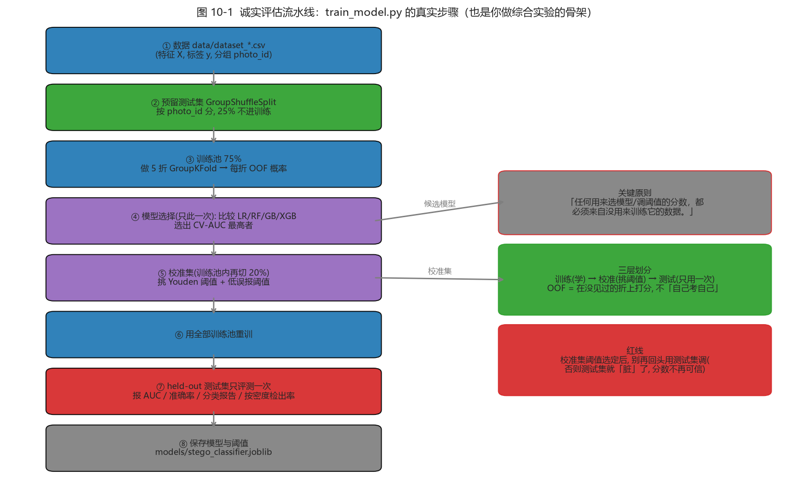

# 第 10 章 · 综合实践：从“读懂”到“做出来”（第 11–12 周）

<!-- lang-switch -->
> [🌐 English version](https://yukinoshita-lin.github.io/nsf5-steganography/en/content/ch10.html)

> **动手做｜** 本章目标：用两周时间完成一个可演示的改进实验。下面给出三个由易到难的方向与验收清单，你也可以把它们组合起来。**但在动手之前，先记住“怎么做实验才算数”的骨架（图 10-1）。**

## 10.0 实验方法论：先学会“怎么算才算数”

一个实验结论靠不靠谱，不取决于你“多努力”，而取决于你有没有守住**评估的诚实性**。这正是第 7、8 章反复讲的骨架，综合实践时它决定你的一切结论：

*图 10-1（`train_model.py` 的真实步骤——也是你做综合实验的骨架：数据 → 按 photo_id 预留测试集 → 训练池 5 折 GroupKFold 取 OOF → 只此一次选模型 → 校准集挑阈值 → 全量重训 → held-out 测试集只评一次 → 保存）*

> **读图要点｜**
> - **测试集只许碰一次**：反复拿它调阈值，测试集就“脏”了，分数不再可信；
> - **校准集**：只在训练池内再切出，专门用来挑阈值（Youden / 低误报点）;
> - **OOF（out-of-fold）**：每个样本只在“没见过它的那一折”上被打分，用于选模型——这防止“用训练自己证明自己”。
>
> 无论你选下面哪个方向，**都要回到这张图**：先跑通基线（图 10-1 全流程），再做小改动，用 `GroupKFold` 给出诚实对照。记住那句话：**“改了 A、结果变好”不足以服人，要用训练/校准/测试三层结构 + 分组切分证明它真的变好。**

## 10.1 方向 A：复现并批判性验证（最稳）

选论文/README 中的 1～2 个结论，自己重新跑并尝试“推翻”它：

- 复现码族图：理论 α(p) 是否与实测吻合？p 取大后偏差从哪来？

- 复现检测实验：换你自己的照片训练，比较 v1 11 维基线（约 0.75–0.79）与 README 的 v1.4 双版本结果，观察照片风格对 AUC 的影响；

- 复现篡改实验：改 1 像素、改 1 行、改 1 块，解码失败率各是多少？

> **避坑提醒｜** 复现 ≠ 照抄。复现的意义是**理解每个数字从哪来**：AUC 是 OOF 还是 held-out？用没用 `photo_id` 分组？阈值怎么定的？这些问题（见第 7 章）决定了你能否“批判性验证”而不是“盲信论文”。

| **验收项** | **通过标准** |
| --- | --- |
| 实验日志 | 记录环境、命令、参数、原始输出 |
| 图表 | 至少 2 张自绘曲线/对比图，坐标与图例完整 |
| 结论 | 能区分“验证了论文”与“与论文不一致”并给原因 |
| 可复现 | 提供一键脚本或逐条命令，别人能重跑 |

## 10.2 方向 B：功能扩展（最有成就感）

- **支持中文/UTF-8 消息**：把 `encode_string()` 的 ASCII 编码改为 UTF-8（注意长度头现在是字节数而非字符数）；

- **彩色通道扩展**：目前仅用 R 通道，可研究 R/G/B 三通道如何分配容量与安全性；

- 新增特征：在 v1 11 维或 v2 143 维基础上加一个你认为能区分 clean/stego 的统计量，用 GroupKFold 评估 AUC 是否真的上升；

- **对比新算法**：实现朴素 LSB 替换，与 nsF5 在相同载荷下比较 Gn 塌缩与检出率。

> **避坑提醒｜** 每次扩展都要跑 `test_core.py` 与 `test_steg.py`，保证“嵌入→解码”往返仍然成立。修改编码方案时，解码端必须同步修改——这是初学者最常忘的。

> **提示｜** “新增特征”这类扩展最容易“自我感觉良好”：加了一个特征、AUC 微涨就以为赢了。请务必回到图 10-1——用**同一组测试照片、5 折 GroupKFold OOF** 做 A/B，否则你的 “+0.01” 可能只是随机波动（这正是 7.8 讲的数据泄漏/泛化的实操）。

## 10.3 方向 C：教学演示再包装

把 GUI 里的矩阵编码演示扩展成一套可讲解的教材页/动画脚本，例如：

- 逐步动画：随机块 → 显示 H → 算 s → 给 m → 求 d → 高亮 → 校验；

- 题库模式：随机出题让你手算“该翻转哪一位”，自动判分；

- 对比模式：同一消息分别用 LSB、matrix p3、nsF5 p3 嵌入，并排显示改动数与 Gn。

## 10.4 论文与代码对照阅读表

| **论文章节** | **对应代码** | **读它之前先掌握** |
| --- | --- | --- |
| 第 2 章 技术基础 | ns5_core.py / steganalysis.py | LSB、汉明码、湿纸、卡方/RS |
| 第 3 章 需求分析 | README 功能总览 | 隐写与隐写分析博弈观 |
| 第 4 章 总体设计 | arch 图 + ns5_core.py | 分层架构、哈希键控流程 |
| 第 4.5 节 加速 | cppembed.py / fsfeatures.py | ctypes 与一致性自校验 |
| 第 4.6 节 GPU | gpu/*.py | 张量化、批量、吞吐边界 |
| 第 5 章 实验 | run_e2e / make_dataset / train_model | GroupKFold、AUC、Youden |

*提示：论文草稿已更新为 thesis/thesis1.pdf（v1.4.0 实验，含 SRM/143d/53d 与多源数据），上表以早期论文章节为例，阅读时按新论文目录对照。*

## 10.5 汇报/答辩常见问题与应答要点

| **高频问题** | **应答要点** |
| --- | --- |
| LSB 隐写为什么能被发现？ | 相邻灰度对被拉平（卡方）+ LSB 结构塌缩（RS），先讲直觉再讲统计量 |
| 矩阵编码为什么“改得少”？ | n=2ᵖ−1 个位置承载 p 位，H 列互异 → 任一伴随式差对应唯一位置 |
| nsF5 相比 F5 好在哪里？ | 湿纸预标记湿点、只在干点解方程，无收缩无重嵌 |
| 湿纸编码怎么解方程？ | GF(2) 线性方程 H_dry·y=d，先试单列/双列，再高斯消元兜底 |
| 为什么不用裸 CNN？ | 小样本弱信号下学不到泛化特征；特征+简单模型更稳（AUC 实证） |
| AUC 0.756 说明什么？ | 排序能力尚可但弱密度难检；AUC 与“具体阈值下检出率”是两回事 |
| 哈希键控能防什么？ | 防位置可预测/复制；能感知普通篡改，但不是密钥化 MAC |
| C++/GPU 加速有没有风险？ | 有：必须做跨语言一致性校验，否则嵌入解码会不可逆 |
| “你的模型更好”怎么证明？ | 回到图 10-1：同测试照片、5 折 GroupKFold OOF、训练/校准/测试分离；报告单图概率 ≠ 数据集 AUC |

## 10.6 交付清单（最后一周）

- 改进代码 diff（自己能讲清每处改动）；

- 实验脚本 + 原始输出（不加工、不挑数）；

- 2～3 张图表（效率/ROC/密度检出/篡改任选）；

- 3～5 页报告：问题→方法→结果→局限→下一步；

- 5 分钟演示：从嵌入到分析的一条龙运行；

- 能脱稿回答 10.5 表中的任意三个问题。

> **想一想｜** 你的改进实验，打算采用图 10-1 的哪一条“诚实保证”来讲清“结果可信”？如果别人质疑“你是不是反复调测试集才得到这个结果”，你该怎么回应？（提示：把“测试集只用一次”这条红线讲清楚，并展示 OOF/校准集的结果。）
