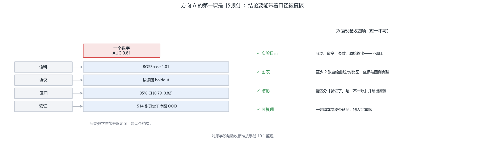
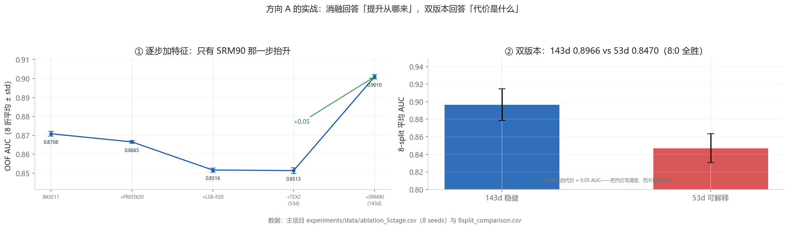
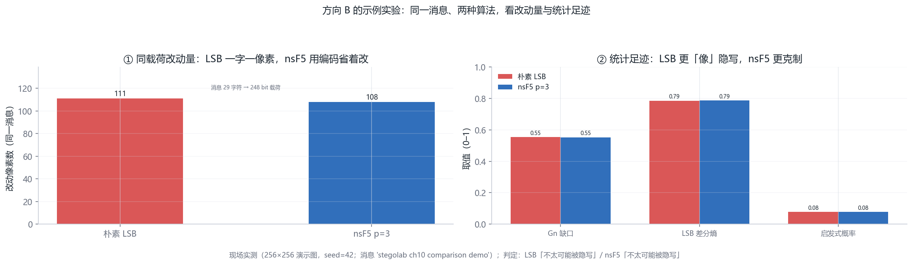
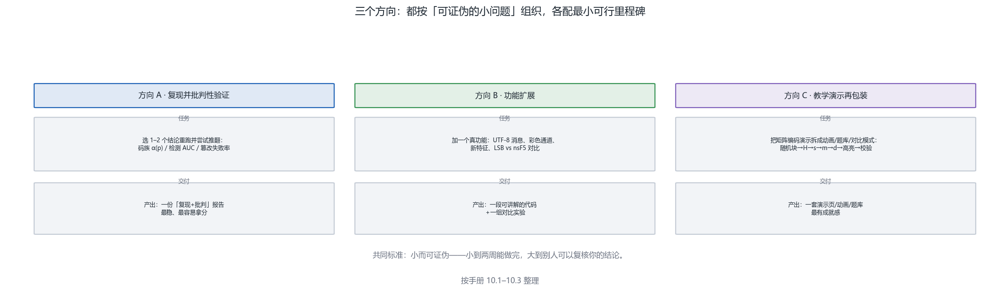
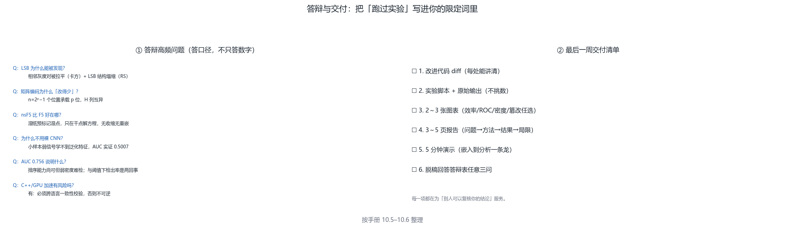

# 第 10 章 · 综合实践：从“读懂”到“做出来”（第 11–12 周）

<!-- lang-switch -->
> [🌐 English version](https://yukinoshita-lin.github.io/nsf5-steganography/en/content/ch10.html)

> **本章导航** ·　先看问题，再读正文
> 
> **核心问题　读懂和做出来之间，隔着的是什么？**
> 
> **读完你能回答**
> 
> - 用一个“小而**可证伪**”的标准给你的选题划定范围；
> 
> - 对账一份结论必须核对的四项：语料、协议、置信区间、是否可溯源；
> 
> - 设计一个**带对照**的消融实验（我改了什么、和谁比、在什么协议下比）；
> 
> - 按交付清单逐项打勾，并能脱稿回答答辩高频三问。
> 
> *宁可把一个小问题答得干净利落，也不要在一个大问题上留一堆“可能、大概”。*

**开场问题：读懂和做出来之间，隔着的是什么？**不是更多知识——12 周的知识已经够用——而是一个**可证伪的小问题**：它小到两周能做完，又大到做完后你能拿出一个别人可以复核的结论。CSAPP 的实验设计哲学是：宁可回答一个小问题答得干净利落，也不要在一个大问题上留下一堆“可能、大概”。本章三个方向（复现验证 / 功能扩展 / 教学再包装）都按这个标准组织，每个方向都配了最小可行里程碑。

| **小节** | **回答的问题** | **你的产出** |
| --- | --- | --- |
| 10.1 方向 A | 结论经得起重跑吗？ | 一份“复现+批判”报告 |
| 10.2 方向 B | 能不能加一个真功能？ | 一段可讲解的代码与对比实验 |
| 10.3 方向 C | 怎么讲给别人听？ | 一套演示页/动画/题库 |
| 10.5 答辩 | 评委最爱问什么？ | 脱稿回答任意三问 |
| 10.6 交付 | 最后一周交什么？ | 对照清单逐项打勾 |

> **动手做｜
本章目标：用两周时间完成一个可演示的改进实验。下面给出三个由易到难 的方向与验收清单，你也可以把它们组合起来。**

## 10.1 方向 A：复现并批判性验证（最稳）

“批判性验证”的第一课是**对账**：把你要验证的结论与权威结果表（docs/RESULTS.md）逐字段核对——语料是什么、协议是按源图分组还是随机切分、数字有没有置信区间。摘一行主表做示范（BOSSbase、按源图 holdout）：

| **模型** | **特征** | **AUC** | **95% CI** |
| --- | --- | --- | --- |
| LGB-11d | 11 维 | 0.7128 | [0.6913, 0.7360] |
| LGB-143d | 143 维 | 0.8062 | [0.7894, 0.8225] |
| LGB-53d | 53 维 | 0.7172 | [0.6943, 0.7406] |
| xuNet（裸像素 CNN） | 原始像素 | 0.5007 | [0.5004, 0.5012] |
| yenet（SRM+CNN） | 30 SRM 固定核 | 0.9541 | [0.9463, 0.9630] |

拿到这张表，好的批判性问题会自己冒出来：143d 对 11d 的提升（+0.09）主要来自 SRM 特征还是数据规模？（8.8 节的 A/B 实验已回答一半——同数据下 143 维另有增益。）为什么裸 CNN 的置信区间那么窄却贴着 0.5？（它稳定地“不会”，稳定也是一种可复现。）把你冒出的问题写下来，挑一个能动手的。

选 README / docs/RESULTS.md 中的 1～2 个结论，自己重新跑并尝试“推翻”它：

复现码族图：理论 α(p) 是否与实测吻合？p 取大后偏差从哪来？

复现检测实验：换你自己的照片训练，比较 v1 11 维基线（约 0.75–0.79）与 README 的 v1.4 双版本结果，观察照片风格对 AUC 的影响；

复现篡改实验：改 1 像素、改 1 行、改 1 块，解码失败率各是多少？

| **验收项** | **通过标准** |
| --- | --- |
| 实验日志 | 记录环境、命令、参数、原始输出 |
| 图表 | 至少 2 张自绘曲线/对比图，坐标与图例完整 |
| 结论 | 能区分“验证了论文”与“与论文不一致”并给原因 |
| 可复现 | 提供一键脚本或逐条命令，别人能重跑 |

图 10-1 可复核结论的解剖。这张图回答的是：一个可复核的数字必须携带哪些限定词？一个可复核数字必须携带的限定词，与复现验收四项——让结论经得起重跑

## 10.2 方向 B：功能扩展（最有成就感）

支持中文/UTF-8 消息：v1.8 起已在 encode_string() 内实现（长度头单位是字节数），可对照源码校对你的实现；

彩色通道扩展：目前仅用 R 通道，可研究 R/G/B 三通道如何分配容量与安全性；

新增特征：在 v1 11 维或 v2 143 维基础上加一个你认为能区分 clean/stego 的统计量，用 GroupKFold 评估 AUC 是否真的上升；

对比新算法：实现朴素 LSB 替换，与 nsF5 在相同载荷下比较 Gn 塌缩与检出率。

> **避坑提醒｜
每次扩展都要跑 test_core.py 与 test_steg.py，保证“嵌入→解码”往返仍然成立。修改编码方案时，解码端必须同步修改——这是初学者最常忘的。**

图 10-2 消融与双版本对比。这张图回答的是：新增一个特征，怎么证明它真的有用？143 维逐组增益消融与 143d/53d 双版本 8-split 对比——新增一个特征怎么证明它有用

图 10-3 LSB vs nsF5 同载荷对比。这张图回答的是：同一个消息，两种算法各付什么代价？同载荷下朴素 LSB 与 nsF5 的改动量、统计足迹与启发式判定——同一个消息，两种代价

## 10.3 方向 C：教学演示再包装

把 GUI 里的矩阵编码演示扩展成一套可讲解的教材页/动画脚本，例如：

逐步动画：随机块 → 显示 H → 算 s → 给 m → 求 d → 高亮 → 校验；

题库模式：随机出题让你手算“该翻转哪一位”，自动判分；

对比模式：同一消息分别用 LSB、matrix p3、nsF5 p3 嵌入，并排显示改动数与 Gn。

图 10-4 三个方向。这张图回答的是：综合实践可以往哪三个方向做？方向 A 复现 / B 扩展 / C 教学的任务与交付——把读懂的东西讲给别人听

## 10.4 文档与代码对照阅读表

| **论文章节** | **对应代码** | **读它之前先掌握** |
| --- | --- | --- |
| 第 2 章 技术基础 | ns5_core.py / steganalysis.py | LSB、汉明码、湿纸、卡方/RS |
| 第 3 章 需求分析 | README 功能总览 | 隐写与隐写分析博弈观 |
| 第 4 章 总体设计 | arch 图 + ns5_core.py | 分层架构、哈希键控流程 |
| 第 4.5 节 加速 | cppembed.py / fsfeatures.py | ctypes 与一致性自校验 |
| 第 4.6 节 GPU | gpu/*.py | 张量化、批量、吞吐边界 |
| 第 5 章 实验 | run_e2e / make_dataset / train_model | GroupKFold、AUC、Youden |

提示：本项目不再随仓库分发论文稿；对外数字一律以 docs/RESULTS.md（权威结果表）为准，它逐行标注了语料、协议与是否可溯源。下表按早期论文章节举例，阅读时请对照该表。

## 10.5 汇报/答辩常见问题与应答要点

答辩的加分项往往不在答案本身，而在**引用的口径**。同样一句“AUC 0.81”，说出“LGB-143d，BOSSbase 1.01，按源图 holdout，95% 置信区间 [0.79, 0.82]，另有 1514 张真实干净照片的 OOD 误报率实测”与只说一个数字，是两个档次。评委由此判断你有没有亲手跑过实验——因为只有跑过的人才会自然地带出这些限定词。

| **高频问题** | **应答要点** |
| --- | --- |
| LSB 隐写为什么能被发现？ | 相邻灰度对被拉平（卡方）+ LSB 结构塌缩（RS），先讲直觉再讲统计量 |
| 矩阵编码为什么“改得少”？ | n=2ᵖ−1 个位置承载 p 位，H 列互异 → 任一伴随式差对应唯一位置 |
| nsF5 相比 F5 好在哪里？ | 湿纸预标记湿点、只在干点解方程，无收缩无重嵌 |
| 湿纸编码怎么解方程？ | GF(2) 线性方程 H_dry·y=d，先试单列/双列，再高斯消元兜底 |
| 为什么不用裸 CNN？ | 小样本弱信号下学不到泛化特征；特征+简单模型更稳（AUC 实证） |
| AUC 0.756 说明什么？ | 排序能力尚可但弱密度难检；AUC 与“具体阈值下检出率”是两回事 |
| 哈希键控能防什么？ | 防位置可预测/复制；能感知普通篡改，但不是密钥化 MAC |
| C++/GPU 加速有没有风险？ | 有：必须做跨语言一致性校验，否则嵌入解码会不可逆 |

图 10-5 答辩与交付清单。这张图回答的是：答辩时哪些点最容易失分？答辩高频问题应答要点与最后一周交付清单——加分项在引用的口径

## 10.6 交付清单（最后一周）

改进代码 diff（自己能讲清每处改动）；

实验脚本 + 原始输出（不加工、不挑数）；

2～3 张图表（效率/ROC/密度检出/篡改任选）；

3～5 页报告：问题→方法→结果→局限→下一步；

5 分钟演示：从嵌入到分析的一条龙运行；

能脱稿回答 10.5 表中的任意三个问题。

**本章小结。**选题标准是“小而可证伪”；方向 A 练对账与复现、方向 B 练功能与对比、方向 C 练表达与教学；交付清单的每一项都在为“别人可以复核你的结论”服务——这也是本手册从第 1 章贯穿到最后的一条主线。

> **动手做｜** 章末练习（提示与答案见附录 J）
> 
> P10.1（写作）从 10.1 的对账表里挑一个你最想质疑的数字，写出：怀疑的理由、复现步骤、判定标准。一页以内。
> 
> P10.2（设计）为方向 B 的“新增一个特征”写出实验设计：假设、数据、协议（记得按源图分组）、判定标准（AUC 提升多少才算数）。
> 
> P10.3（演练）对照 10.5 的答辩表自问自答三题，录音回放——自己听一遍胜过排练十遍。
