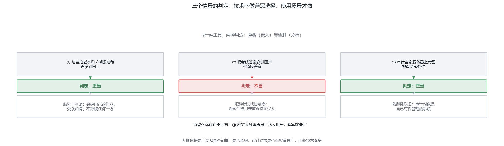
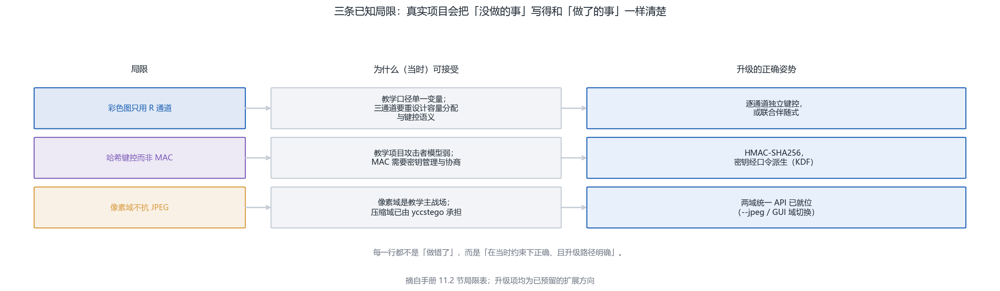
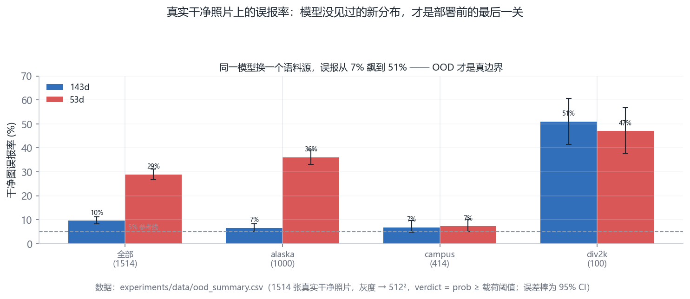
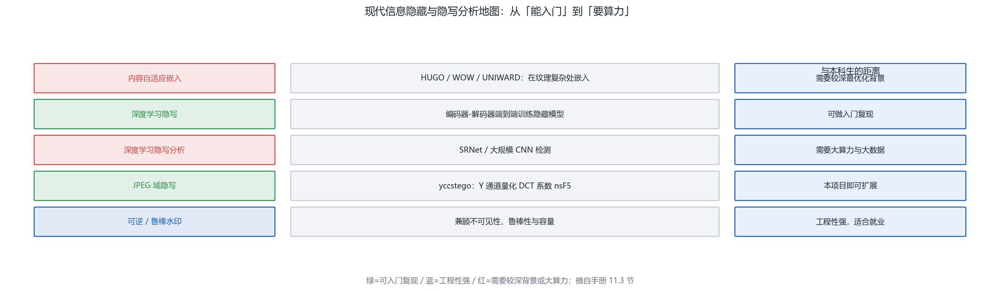
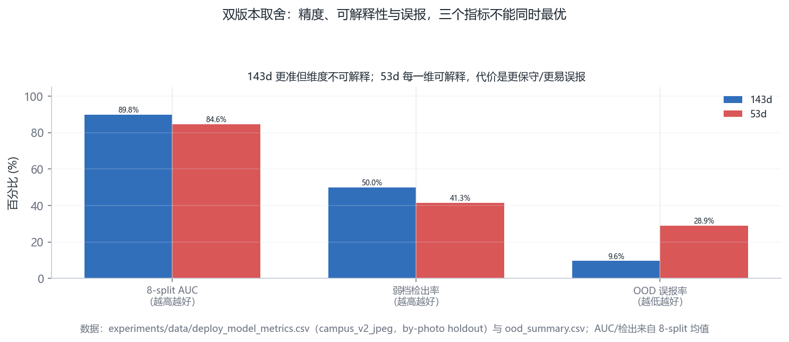
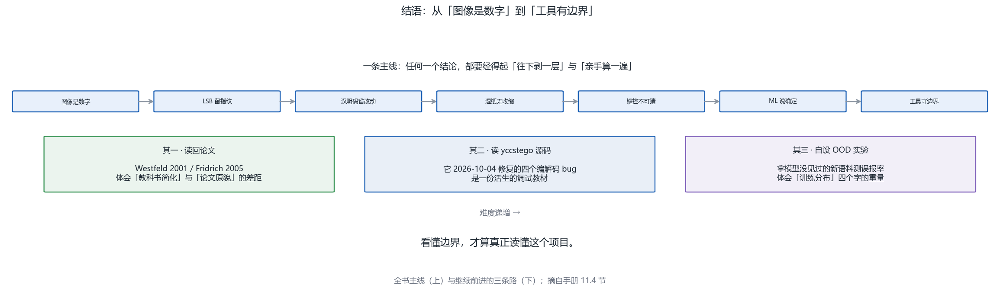

# 第 11 章 · 边界、伦理与继续前进（穿插学习）

<!-- lang-switch -->
> [🌐 English version](https://yukinoshita-lin.github.io/nsf5-steganography/en/content/ch11.html)

> **本章导航** ·　先看问题，再读正文
> 
> **核心问题　一个既能“藏”又能“查”的工具，发明者该对哪一半负责？**
> 
> **读完你能回答**
> 
> - 用技术事实（改动率、检测能力、攻击模型）判断三个真实情景是否正当；
> 
> - 复述三条项目已知局限，以及各自的“当时可接受”理由与升级姿势；
> 
> - 说出 143d 与 53d 在**精度与稳健**上的取舍；
> 
> - 给出三条难度递增的继续前进之路。
> 
> *技术本身不做善恶选择，做选择的是使用场景——本章给的是判断力，不是答案。*

**开场问题：一个既能“藏”又能“查”的工具，发明者该对哪一半负责？**答案是：对两者的**边界**负责。隐写保护隐私与言论，也可能掩护恶意通信；隐写分析支撑取证与审计，也可能被用于窥探。技术本身不做善恶选择，做选择的是使用场景——所以本章的任务不是给你答案，而是给你**一套判断场景的练习**与一张诚实的局限清单。看懂边界，才算真正读懂这个项目。

## 11.1 法律与伦理边界

> **想一想｜** 用第 1–9 章学到的知识判断下面三个情景，并说出理由：
> 
> ① 给自己拍摄的照片嵌入不可见的水印与溯源哈希，发布到网上——正当吗？
> 
> ② 帮朋友把考试答案用隐写嵌进图片，在考场上通过手机传给同学——正当吗？
> 
> ③ 用项目的 analyze/ML 检测器审计自家服务器收到的上传图片，排查隐蔽外传——正当吗？
> 
> （参考判断：①是版权与溯源的正当用途；②规避考试诚信制度，且工具的“隐蔽性”被用于欺骗特定受众；③是防御性取证，且审计对象是自己有权管理的系统。争议永远存在于细节——比如③若扩大到审查员工的私人相册，答案就变了。）

隐写是双刃剑：它支撑版权水印、媒体溯源、隐蔽认证等正当应用，也可能被用于 恶意隐蔽通信。学习与研究的正确姿势是：

只在自有数据、公开数据集或经授权场景做实验；

把工具用于“检测与取证”而非“协助隐藏”；

发表结果时说明局限与误报风险，不夸大检测能力；

不把他人的隐私图像当作练习载体（照片数据要脱敏、授权）。

> **避坑提醒｜
这个项目的隐写分析部分（卡方/RS/ML）正是“盾”的用途：监管与取证需要它来发现可能的隐蔽信道。研究攻击面之前，先想清楚 你的实验数据与使用目的。**

图 11-1 双刃剑与情景判定。这张图回答的是：同一件工具，什么场景算正当、什么场景算不当？隐藏与检测两侧的正当 / 不当用途及判定依据——技术不做善恶选择，场景才做

## 11.2 项目已知局限（看懂边界才算真正读懂）

局限清单里有三条值得追问“为什么当初这么设计”，因为它们展示了工程决策的真实形状：

| **局限** | **为什么（当时）可接受** | **升级的正确姿势** |
| --- | --- | --- |
| 彩色图只用 R 通道 | 教学口径单一变量；三通道要重设计容量分配与键控语义 | 逐通道独立键控或联合伴随式（预留为扩展实验） |
| 哈希键控而非 MAC | 教学项目攻击者模型弱；MAC 需要密钥管理与协商 | HMAC-SHA256，密钥经口令派生（KDF） |
| 像素域不抗 JPEG | 像素域是教学主战场，压缩域已由 yccstego 承担 | 两域统一 API 已就位（--jpeg / GUI 域切换） |

看懂这张表的读法：每一行都不是“做错了”，而是“在当时的约束下正确，且升级路径明确”。真实项目与玩具项目的区别，就在于有没有把“没做的事”写得和“做了的事”一样清楚。

载荷支持 UTF-8 文本（中文可直接嵌入）；更实际的限制是仅支持文本、不支持文件；

彩色图只使用 R 通道，容量利用率低；

内容是哈希键控而非密钥化 MAC，无法防“重嵌并更新头部”的强攻击者；

v1 数据集的独立源图仍有限（414 张校园 + BOSSbase 后扩到 1 万张）；弱密度与跨源仍是检出难点，任何新模型都要先做 OOD 测试；

启发式分析输出的是“隐写倾向概率”，不是严格统计意义上的真实概率；

像素域 nsF5 是有损格式的天敌——JPEG 域需要 yccstego 那样的 DCT 系数实现（姊妹项目，独立仓库与 PyPI 包：https://github.com/Yukinoshita-lin/yccstego ）。

v2/143 维模型对训练分布外的真实 JPEG 干净图曾“过激”，修复依赖把 JPEG 干净样本加入训练；任何模型都要先做 OOD 测试再部署——本项目现口径是 1514 张真实干净照片上 143d 误报 9.58%、53d 28.86%；

SRM 只在同源数据上提升检测，跨异构源反而下降，预处理收益有严格适用范围；

双版本模型各有取舍：143d 更准（8-split 平均 AUC 0.8980、弱档检出 50.0%、真实干净照片 OOD 误报 9.58%）；53d 去掉 SRM 后每一维都能解释，代价是 AUC 约低 0.05（0.8461 / 41.4% / 28.86%）。GUI 切换仍在规划，当前用 API 指定 model_path；

项目许可证已改为 Apache-2.0 并含 NOTICE，分发/引用时需保留第三方声明。

图 11-2 已知局限与升级路径。这张图回答的是：项目没做的事，该怎么写才诚实？三条局限的「当时可接受」理由与升级姿势——把没做的事写得和做了的事一样清楚

图 11-3 OOD 误报率分源。这张图回答的是：换一个语料源，误报率会飙升多少？143d / 53d 在全部与分源真实干净照片上的误报率与 95% CI——部署前的最后一关

## 11.3 现代信息隐藏与隐写分析地图

| **方向** | **代表思想/方法** | **与本科生的距离** |
| --- | --- | --- |
| 内容自适应嵌入 | HUGO / WOW / UNIWARD：在纹理复杂处嵌入 | 需要较深最优化背景 |
| 深度学习隐写 | 编码器-解码器端到端训练隐藏模型 | 可做入门复现 |
| 深度学习隐写分析 | SRNet / 大规模 CNN 检测 | 需要大算力与大数据 |
| JPEG 域隐写 | yccstego：Y 通道量化 DCT 系数 nsF5（姊妹项目，独立仓库：https://github.com/Yukinoshita-lin/yccstego ）（姊妹项目，独立仓库：https://github.com/Yukinoshita-lin/yccstego ） | 本项目即可扩展 |
| 可逆/鲁棒水印 | 兼顾不可见性、鲁棒性与容量 | 工程性强，适合就业方向 |

如果你的兴趣被点燃，推荐的下一步：把本手册第 5 章“湿纸”读进原始论文（Fridrich et al.），再用姊妹项目 yccstego（https://github.com/Yukinoshita-lin/yccstego ）对照学习 JPEG 量化域，最后挑一个 现代算法做文献综述——附录 E 给了具体入口。

图 11-4 现代信息隐藏地图。这张图回答的是：继续深入该往哪个方向走？五个现代方向、代表方法与与本科生的距离——继续前进该往哪走

图 11-5 双版本模型取舍。这张图回答的是：精度、可解释性与误报，能同时最优吗？143d / 53d 在 AUC、弱档检出率与 OOD 误报率上的取舍——精度与稳健不可兼得时怎么选

## 11.4 结语

刚开始时你也许以为隐写就是“把字藏进图片”，现在你应该能讲出：它为什么依赖 载体冗余、为什么直接改 LSB 会留下统计指纹、汉明码如何用最少的改动传递信息、 湿纸编码如何让嵌入“无收缩”，以及机器学习如何诚实地说出“我有多确定”。 这些知识串起来的，不只是 F:\Steganography 这一个项目，而是信息安全、 概率统计与机器学习交汇处的一种思维方式。

> **动手做｜
最后做一个收尾练习：不看任何资料，用 500 字向一位同学介绍 “nsF5 为什么比朴素 LSB 更好”。写完后打开 README 对照， 查漏补缺——能写清，才算真正学完。**

图 11-6 结语与三条路。这张图回答的是：全书的主线是什么？全书主线回顾与难度递增的三条继续前进之路——从“图像是数字”到“工具有边界”

**结语。**从第 1 章“图像是数字”到第 11 章“工具有边界”，这本手册其实只教了一件事：**任何一个结论都必须经得起“往下剥一层”与“亲手算一遍”**。继续前进的路有三条，难度递增：其一，把第 4、5 章的算法读回原始论文（Westfeld 2001、Fridrich 2005），体会“教科书简化”与“论文原貌”的差距；其二，读 yccstego 的源码——它 2026-10-04 修复的四个编解码 bug（issue #1）是一份活生的调试教材；其三，给自己设计一个 OOD 实验：拿模型从没见过的新语料测一次误报率，体会“训练分布”四个字的重量。

> **动手做｜** 章末练习（提示与答案见附录 J）
> 
> P11.1（写作）为 11.1 节的三个情景各写一段 100 字的判断书，要求引用具体的技术事实（改动率、检测能力、攻击模型）而非情绪。
> 
> P11.2（思考）从 11.2 的局限表里挑一条，设计一个两周的可执行升级方案（含验收标准）。
> 
> P11.3（上机·选做）把项目 README、CHANGELOG 与 docs/RESULTS.md 通读一遍，列出三处“文档与代码互相印证”的地方——这是读懂一个陌生开源项目最快的方法。
