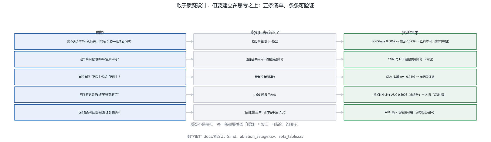
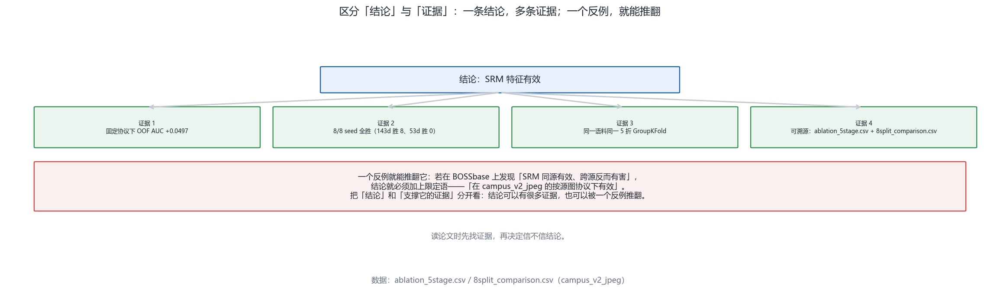

# 第 12 章 · 批判性思维（复盘指南）

<!-- lang-switch -->
> [🌐 English version](https://yukinoshita-lin.github.io/nsf5-steganography/en/content/ch12.html)


> **本章导航** ·　先看问题，再读正文
> 
> **核心问题　做完了项目，怎么保证自己没有被实验和叙事骗到？**
> 
> **读完你能回答**
> 
> - 复述源图泄漏事故的全过程（事故 → 定位 → 修复 → 结论被推翻），并说出「以实验为准」到底指什么；
> 
> - 用五条质疑清单审一个结论，每条都能落回「质疑 → 验证 → 结论」的闭环；
> 
> - 把一个「空想」改写成合格方案：**可执行、可证伪、有对照**；
> 
> - 把「结论」与「证据」分开看，知道一个反例就足以推翻结论；
> 
> - 在报告里写出「已知局限」与「未解决的问题」，并复述实验日志的五个要素。
> 
> *本章不教新算法。它教的是：怎样让已经做出来的东西，经得起别人重跑一遍。*

**开场问题：一个结论要怎样才敢说出口？**前十一章你学会了“怎么把东西藏进去”和“怎么把它查出来”，第 10 章你还亲手做了一个综合实践。但做完不等于做对——**一个实验最容易骗到的人，是做实验的自己**。本章是一份复盘指南，八个要点，全部拿本项目真实发生过的事故当教材：一次源图泄漏让 AUC 虚高了 0.14，一条“深度学习当然更强”的叙事被一个 0.5007 打脸，一次“我觉得有用”被改写成有对照、有推翻条件的消融实验。读完本章，你应当能把“我读懂了”升级成“我敢让别人重跑一遍”。

| **小节** | **回答的问题** | **你的产出** |
| --- | --- | --- |
| 12.1 以实验为准 | 实验是怎么骗人的？ | 能讲清源图泄漏事故的全过程 |
| 12.2 质疑设计 | 拿到一个结论该问什么？ | 会用五条质疑清单 |
| 12.3 给出方案 | 怎么把质疑变成方案？ | 能写出可执行/可证伪/有对照的方案 |
| 12.4 结论与证据 | 结论和证据怎么分开？ | 知道一个反例就能推翻结论 |
| 12.5 承认不知道 | “我不知道”为什么是能力？ | 能写“已知局限”与“未解决问题” |
| 12.6 警惕叙事 | 哪些“当然”是陷阱？ | 能举出项目里的三个反例 |
| 12.7 复现第一课 | 复现不出来先怀疑谁？ | 记住环境→理解→书的排查顺序 |
| 12.8 实验日志 | 结论凭什么可追溯？ | 能写出日志五要素 |

## 12.1 一切以实验结果为准：实验是怎么骗人的

这一节的核心不是“实验很重要”，而是“**实验是怎么骗人的**”。先看一个真实发生的数字冲突：同一个 143 维模型，在 BOSSbase 语料上是 **AUC 0.8062**，在自建的校园语料上却是 **0.8939**。两个数字差得很远，但这不是矛盾——**语料属性不同**。BOSSbase 是领域标准基准、难度高；校园语料是自建语料、含真实 JPEG 干净图、比 BOSSbase 容易。把两个语料的数字放在一起比，比出来的不是“模型变强了”，而是“你换了考卷”。

更严重的一类骗局，发生在**实验设计本身**。项目里真实发生过一次事故：校园语料的 `clean_jpeg` 行错用了独立的 photo_id——414 行副本各占一个编号，于是“按源图划分”的纪律被悄悄破坏：同一张源图的干净版与含密版，被分到了训练集和测试集的两侧。模型只要认出“这是哪张源图”，就能顺带猜出标签。结果是 **143d 的 AUC 从 0.7555 被抬到 0.8946**、弱档检出率从 **44.2% 虚高到 85.3%**。这不是模型变强了，是**实验设计出错了**。

| **环节** | **发生了什么** | **关键动作** |
| --- | --- | --- |
| 事故 | clean_jpeg 414 行副本各占一个 photo_id | 同源副本跨了训练/测试两侧 |
| 定位 | 「按源图划分」不变量校验失败 | 按源图重采样、重算置信区间 |
| 修复 | 生成器与训练器都在训练前拒绝破坏不变量的语料 | 把不变量写成可执行校验 |
| 推翻 | 143d AUC 0.8946 → 0.7555；弱档检出 85.3% → 44.2% | 旧结论作废，重跑后重新写文档 |


图 12-1 源图泄漏事故与结论被推翻。这张图回答的是：一次实验设计错误是如何让 AUC 虚高 0.14、并最终推翻旧结论的。左：事故→定位→修复→推翻四个环节；右：旧口径与修正后的并排对照

> **动手做｜** 打开 StegoLab 的 `tools/run_ch12.py` 跑一遍。它用一个**合成语料**现场演示泄漏机制：标签只由“源图身份”决定，特征里带着源图指纹。随机按图划分时 AUC 约 **0.74**，按源图分组后回落到约 **0.52**——虚高约 **+0.22**。你会在自己的终端里，亲眼看到“划分方式”如何凭空造出 0.2 的分数。这不是模型变强，是设计出错。

所以，**结论必须带上限定词**：语料、协议、置信区间、是否可溯源。没有这些限定词的数字，不能作为结论引用。项目里把这条纪律做成了一个可执行的检查：权威结果表 `docs/RESULTS.md` 由脚本 `experiments/build_results_table.py` 生成，每个数字都必须能追到「脚本 + CSV」，追不到的一律进第 7 节并标注原因。


图 12-2 可引用数字的四道关卡。这张图回答的是：什么样的数字才敢被引用——语料、协议、置信区间、可溯源缺一不可。上半：四道关卡与各自的追问；下半：从图中数字一直追到脚本与 CSV 的溯源链

> **避坑提醒｜** 最危险的不是“没有数字”，而是“**数字很漂亮但没有限定词**”。“AUC 0.89”这句话单独看毫无意义——它没说在哪个语料、什么划分、误差多大、能不能溯源。答辩时若被追问一句“这个 0.89 是在什么协议下测的”，答不上来，前面所有工作都会被扣分。

## 12.2 敢于质疑设计，但要建立在思考之上

质疑不是抬杠。抬杠停在“我觉得不对”，质疑必须落回“**我实际去验证了，结果是……**”。项目里现成的质疑对象很多，下面这张清单把每一条都配上了真实的验证动作与结果——你看到的不是观点，而是“质疑 → 验证 → 结论”的完整闭环。



图 12-3 质疑清单与验证闭环。这张图回答的是：拿到一个结论时该问哪五个问题，以及每个问题的验证动作与实测结果。五条清单：数据来源、对照组公平性、相关还是因果、有没有更简单的解释、指标是否回答了想问的问题

| **质疑** | **验证动作** | **项目里的实测结果** |
| --- | --- | --- |
| 这个结论是在什么数据上得到的？换一批还成立吗？ | 换语料复跑同一模型 | BOSSbase 0.8062 vs 校园 0.8939 —— 语料不同，数字不可比 |
| 这个实验的对照组设置公平吗？ | 查是否共用同一份按源图划分 | CNN 与 LGB 基线共用划分，才可比 |
| 有没有把“相关”说成“因果”？ | 看有没有做消融 | SRM 消融 Δ = +0.0497 —— 有因果证据，不是相关 |
| 有没有更简单的解释被忽略了？ | 先查训练是否收敛 | 裸 CNN 训练集 AUC 0.5005（未收敛）—— 不是“CNN 弱” |
| 这个指标能回答我想问的问题吗？ | 看弱档检出率，而不是只看 AUC | AUC 高 ≠ 弱密度可用（弱档检出会明显下降） |

> **想一想｜** “裸 CNN 在 BOSSbase 上只有 0.5007”常被引用为“深度学习不如手工特征”的证据。但请你先问那个更简单的问题：**这个模型训练收敛了吗？**查一下就知道——它的训练集 AUC 只有 0.5005，与随机猜测无异。一个没收敛的模型输掉比赛，说明的是“这次训练失败了”，不是“这条路走不通”。把“相关”说成“因果”，往往就差这一问。

## 12.3 质疑之后，要敢于并善于给出自己的方案

只会质疑的人停在原地；会做研究的人要往前走一步——**给出自己的方案**。这里要分清“空想”和“方案”：

空想是：“我觉得这个算法不好。”方案是：“如果把 X 换成 Y，在 Z 数据上应该会有 W 的变化，因为……，我设计了如下实验来验证。”差别不在于语气，而在于**可执行、可证伪、有对照**这三条硬指标。

| **“善于”的含义** | **具体要求** | **反例（不合格）** |
| --- | --- | --- |
| 可执行 | 能在有限时间、有限算力内做完 | “重新训练一个十亿参数的模型” |
| 可证伪 | 能提前写出“什么结果会推翻我的假设” | “如果效果不好就再调调” |
| 有对照 | 说清改了什么、和谁比、在什么协议下比 | “我改了一下，感觉更好了” |

项目里有一个从“质疑”走到“方案”的完整范例：起点是一句质疑——“SRM 特征到底有没有用？”终点不是一句感觉，而是一个**消融实验**：把 143 维里的 SRM 组去掉（退回 53 维），在校园语料上按源图 GroupKFold(5) 跑 8 个 seed。结果 **OOF AUC 从 0.9010 掉到 0.8513**（Δ = −0.0497），而且 8/8 个 seed 全胜。这比说“我觉得 SRM 有用”强一百倍：它有对照、有协议、有推翻条件。


图 12-4 从空想到方案。这张图回答的是：怎么把一句“我觉得”改写成可执行、可证伪、有对照的方案，以及 SRM 消融这个真实范例。上半：空想与方案并排对照 + 三条硬指标；下半：消融实验的实测回答与推翻条件

> **动手做｜** 给自己的选题写一个“方案卡”，必须填满四栏：**假设**（一句话）、**对照**（和谁比、什么协议）、**推翻条件**（什么结果会让你认输）、**成本**（要跑多久、要不要 GPU）。填不满四栏的，都还只是空想。项目里 SRM 消融这张卡是这么填的：假设“SRM 组提升 OOF AUC”；对照“143d vs 去掉 SRM 的 53d，同一份 5 折 GroupKFold”；推翻条件“若去掉 SRM 后 AUC 不降（Δ≤0）则假设被推翻”；成本“8 seed × 5 折，分钟级”。

## 12.4 区分“结论”与“证据”

读论文和写报告时，最容易混为一谈的两样东西，是**结论**和**支撑它的证据**。结论是一句话：“SRM 特征有效。”证据是另一句话：“在固定协议下，加入 SRM 后 OOF AUC +0.0497，且 8/8 seed 全胜。”一个结论可以有很多条证据，也可以**被一个反例推翻**。这一节的任务，是教你把这两样东西永远分开看。



图 12-5 结论与证据分离。这张图回答的是：一条结论下面挂着哪些证据，以及一个反例为什么足以推翻它。上半：结论“SRM 特征有效”与四条证据；下半：反例如何迫使结论加上限定语

举例：如果将来在 BOSSbase 上发现“SRM 同源有效、**跨源反而有害**”，那么“SRM 特征有效”这句话就必须加上限定语——“在校园语料的按源图协议下有效”。这不是打脸，这是科学：**结论的适用范围，由证据的边界决定**。所以读任何一篇论文，先找证据（在什么数据、什么协议、多少 seed），再决定信不信结论。

> **新手提示｜** 一个可操作的训练：读到任何结论句，就地在旁边列出“它至少需要哪几条证据才成立”。列不出来的，说明你还没读懂它；列出来发现证据不够的，说明作者说得太满。附录 K 的每一张表都在做这件事——**结论放正文，证据放附录，两者一一对应**。

## 12.5 承认“我不知道”是一种能力

项目里最难能可贵的部分之一，是那份**更正记录**。它展示了：承认自己错过、承认数字不可信、承认有些问题还没解决，并不丢人，反而让整个项目更可信。第 12.1 节那场源图泄漏事故，最后没有从文档里“删掉重写”，而是原样保留在审计记录里——因为**一个被诚实记录的失败，比十个含糊的成功更有价值**。

“不知道”不是终点，是下一个实验的起点。具体到写作，就是两条硬要求：在实验报告里，**必须有一节写“已知局限”与“未解决的问题”**；在答辩里，**承认局限比假装完美更能赢得信任**。项目第 11 章列出的三条已知局限（彩色图只用 R 通道、哈希键控而非 MAC、像素域不抗 JPEG），每一条都写清了“当时为什么可接受”与“升级的正确姿势”——这就是标准的写法。

> **避坑提醒｜** “已知局限”不是自我批评的清单，而是**边界的说明书**。写清“我在什么条件下不保证成立”，恰恰是在为“我在什么条件下保证成立”背书。反过来，一个声称“哪里都能用”的工具，恰恰是最可疑的——它要么没测过边界，要么没敢写。

## 12.6 警惕“看起来合理的叙事”

很多错误的结论，不是因为数据造假，而是因为**叙事太顺了**。“深度学习当然比手工特征强”、“更多特征当然更好”、“训练集上更好，测试集当然也更好”——这三句话听起来都理所当然，但在项目里，它们各自都有一个现成的反例。批判性思维的一部分，就是对“听起来理所当然”保持警觉。


图 12-6 看起来合理的叙事与反例。这张图回答的是：三条“理所当然”的叙事分别被项目里的哪个反例打破。上：叙事；中：项目反例；右：教训——强不强取决于预处理与收敛、加特征要先证明有用、划分错了分数就是假的

| **听起来理所当然** | **项目里的反例** | **教训** |
| --- | --- | --- |
| “深度学习当然比手工特征强” | 裸 CNN 0.5007（训练 AUC 0.5005，未收敛）；固定 SRM + 小 CNN 0.9541；手工 LGB-143d 0.8062 | 强不强，取决于预处理与是否收敛 |
| “更多特征当然更好” | 11d 0.8708 → 31d 0.8665 → 51d 0.8516 → 53d 0.8513 → 143d 0.9010（前四步不升反降） | 加特征先要证明它有用（消融） |
| “训练集更好，测试集当然也更好” | 源图泄漏：训练/测试共享源图指纹，AUC 0.8946 是虚高，修正后 0.7555 | 划分错了，分数就是假的 |

> **想一想｜** 第二行那张曲线值得盯着看一会儿：从 11 维一路加到 53 维，AUC 不是上升而是**下降**的（0.8708 → 0.8513），直到加上 SRM 那一组才跳到 0.9010。如果当初只凭“更多特征更好”的直觉行事，你会在前四步里越走越差却浑然不觉。**直觉负责提出假设，实验负责裁决**——把这两件事分开，就是本章的全部要义。

## 12.7 把“复现”当作批判性思维的第一课

复现不只是“跑通代码”，而是**用自己的数据、自己的协议重新验证**。项目配套的 StegoLab 就是为这件事准备的：手册里每一个关键数字，都有一条对应的复现路径——配图有 `figure_manifest.json` 登记来源与 SHA-256，实验有 `figures/chXX_results.csv` 落盘。

如果复现不出来，请严格按这个顺序排查：**先怀疑环境、再怀疑理解、最后才是怀疑书**。环境（版本、字体、依赖、随机种子）→ 理解（口径、协议、单位是否一致）→ 书（手册是否写错）。这个顺序不是客气，是概率：绝大多数“复现不出来”，前两个原因就占完了。一个能诚实说“我复现不出来，原因可能是……”的人，比一个只说“我读懂了”的人可靠得多。


图 12-7 复现与实验日志。这张图回答的是：复现不出来时按什么顺序怀疑，以及一份合格的实验日志要记哪五个要素。上半：复现三问（环境→理解→书）；中部：日志五要素；下半：更正记录为什么是最好的教材

## 12.8 实验日志是批判性思维的载体

批判性思维不是一种态度，而是一种**可以被检查的记录习惯**。每次实验，记下五样东西：**环境、命令、参数、原始输出、日期**。不做“挑好看的数”这种加工；结论要能追溯回具体的实验记录。项目里这一点已经做得很扎实：`experiments/data/` 下的 CSV 是原始落盘，`docs/RESULTS.md` 是逐行溯源，附录 K 又把手册引用的数字与它们一一对上——**任何一句话都能往下剥一层，直到脚本与 CSV**。

```text
# 一份合格实验记录的骨架（项目真实做法）
环境:  python 3.10 / numpy 1.26 / matplotlib 3.8 / 字体 Microsoft YaHei
命令:  python tools/run_ch12.py --out figures/ch12_results.csv
参数:  seed=20261005, n_src=120, k=5, d=32, ridge_lam=0.1
输出:  figures/ch12_results.csv（逐行 case/detail/value/ok/note）
日期:  2026-10-05
# 结论只允许引用「输出」里的数字，且必须带上语料/协议/CI/溯源四项限定词。
```

> **回到项目看代码｜** 本章的可运行实验在 `F:\StegoLab\chapters\ch12_critical.py`（配图 + 体检逻辑），入口 `tools/run_ch12.py`。它会现场做五件事：① 限定词体检（逐行检查权威结果表的四限定词是否齐备）；② 泄漏复算（合成语料上随机划分 vs 按源图分组的 AUC 差）；③ 消融复核（0.9010 vs 0.8513、8/8 全胜）；④ 叙事反例核对（裸 CNN 0.5007 与固定 SRM 0.9541）；⑤ 可证伪性检查。结果落在 `figures/ch12_results.csv`，本章所有数字都可与它逐项对账。

## 12.9 章末练习：给一个结论做体检

本章的练习不是“算一个数”，而是“**审一句话**”。下面三条结论，请各写一份不超过 200 字的体检报告，指出它缺了什么限定词、可能被怎样误读、以及你会怎么补做实验来支撑或推翻它。

| **结论（待体检）** | **提示：先问自己什么** |
| --- | --- |
| “我们的模型 AUC 达到 0.89，效果很好。” | 语料？协议？置信区间？可溯源？——0.8939 是校园语料、按源图 holdout 的结果，换个语料还成立吗？ |
| “加入 SRM 特征后效果更好。” | 对照是谁？协议是什么？增益多大？几个 seed？有没有推翻条件？ |
| “检测器在测试集上准确率 95%，可以部署了。” | 测试集是怎么划分的？有没有源图泄漏？真实干净照片上的误报率是多少（OOD）？ |

> **动手做｜** 把上面三条结论分别改写成“带限定词的版本”，再和附录 K 的真实数字对一遍。改写完成的标志是：**任何一句话被追问“在什么数据、什么协议下”时，你都能立刻答出来，并指出它落在哪个 CSV 的哪一行。** 做到这一点，你就把第 12 章学完了。

**本章小结。**批判性思维不是让你怀疑一切，而是让你**知道每一句话的适用范围**。以实验为准，因为实验会骗人；敢于质疑，但要落回验证；质疑之后要给出方案，方案要可执行、可证伪、有对照；把结论和证据分开看；承认“我不知道”；警惕“听起来理所当然”；把复现当作第一课；用实验日志把一切钉在纸上。—— 做完了项目再读这一章，你会发现它不是额外负担，而是让你前面十一周的成果**真正站得住**的那块地基。
